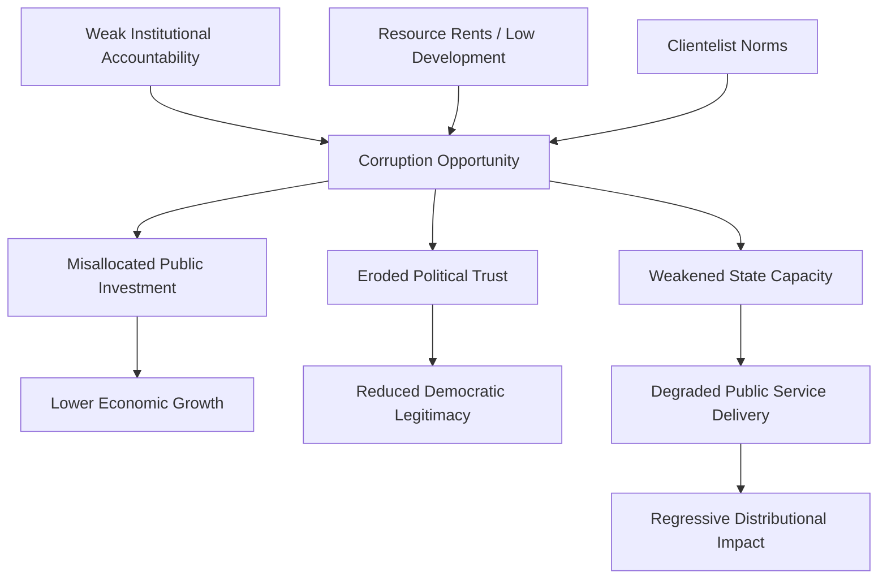

## Causes and Consequences of Political Corruption

### Definition and Scope

This topic examines the explanatory factors (causes) that make corruption more or less prevalent across political systems, and the downstream effects (consequences) corruption has on economic development, democratic institutions, and public welfare. Political science approaches causation through institutional, economic, and cultural lenses, while consequence research spans macroeconomic growth effects, democratic quality, and distributive/social outcomes. As with corruption's definition and measurement, both causal and consequence claims are subject to significant methodological debate given the endogeneity and measurement challenges inherent to studying a concealed phenomenon.

### Institutional Causes

**Principal-Agent Theory**

The dominant analytical framework treats corruption as a **principal-agent problem**: the public (principal) delegates authority to officials (agents) to act on their behalf, but information asymmetries and monitoring costs allow agents to divert delegated authority toward private gain. Corruption becomes more likely when:

- Monitoring costs are high (complex bureaucratic discretion, opaque decision processes)
- Sanctions for detected corruption are weak or inconsistently enforced
- Agents face weak accountability to principals (elections, courts, free press)

**Robert Klitgaard's** widely cited formula summarizes this logic: **Corruption = Monopoly + Discretion − Accountability**, positing that corruption flourishes where officials hold monopoly power over a decision, exercise substantial discretion in how that power is applied, and face minimal accountability for their choices.

**Weak Rule of Law and Judicial Independence**

Political systems lacking independent judiciaries and consistent legal enforcement provide weaker deterrence against corrupt behavior, since officials can reasonably expect impunity. Comparative studies consistently find judicial independence correlated with lower measured corruption.

**Regime Type and Political Competition**

Findings on regime type are more contested than commonly assumed:

- Democracies with **free press and competitive elections** theoretically provide stronger accountability mechanisms (voters can punish corrupt incumbents; media can expose wrongdoing)
- However, **democratizing or hybrid regimes** (neither fully authoritarian nor fully consolidated democratic) sometimes exhibit *higher* corruption than either stable autocracies or stable mature democracies — a "sequencing" argument associated with scholars like **Michael Johnston**, who argue that partial political liberalization without corresponding institutional strengthening can create new opportunities for corrupt rent-seeking amid weakened old controls and not-yet-established new ones
- **Electoral competitiveness** can cut both ways: intense competition may increase accountability pressure, but can also increase demand for campaign financing, generating incentives for corrupt fundraising

**Bureaucratic Design**

- **Civil service meritocracy** (competitive, examination-based recruitment as opposed to patronage appointment) is associated with lower corruption, following comparative historical work (e.g., studies of Weberian bureaucratic development)
- **Salary levels**: the "efficiency wage" argument holds that underpaid public officials face stronger incentives toward bribery to supplement inadequate income, though empirical support for simple salary-corruption correlations is mixed
- **Procurement and regulatory complexity**: excessive bureaucratic red tape and regulatory discretion (the "permit raj" phenomenon, notably studied in the Indian context) creates rent-extraction opportunities at each discretionary decision point

### Economic Causes

**Level of Economic Development**

Cross-national studies consistently find a strong negative correlation between GDP per capita and measured corruption, though the causal direction is genuinely disputed: does poverty generate conditions conducive to corruption (weak state capacity, low bureaucratic salaries), does corruption suppress economic development (the reverse causal claim), or do both result from a common underlying factor such as institutional quality?

**Natural Resource Dependence**

As addressed under resource curse theory, resource-rich economies — particularly those dependent on point-source resources like oil and minerals that generate concentrated rents — are associated with higher corruption, since resource rents can be captured and distributed through opaque channels without requiring broad-based taxation or corresponding public accountability.

**Trade Openness and Economic Structure**

Some studies find greater trade openness correlated with lower corruption, plausibly because import competition constrains domestic monopoly rents that might otherwise be captured corruptly, though this relationship is not universally replicated across studies.

### Cultural and Social Causes

**Clientelism and Social Norms**

In societies with strong clientelist traditions — where political support is exchanged for particularistic material benefits rather than programmatic policy commitments — corrupt exchange may be normalized as an expected feature of politics rather than a deviation from it, complicating simple legal/institutional reform efforts.

**Legal Origin and Colonial Legacy**

Comparative historical scholarship (following **La Porta et al.'s** legal origins research) has found correlations between colonial legal tradition (British common law vs. French/Spanish/Portuguese civil law origins) and contemporary corruption/governance indicators, though causal mechanisms and the robustness of these findings remain contested within comparative political economy.

**Ethnic Fractionalization**

Some studies find ethnically fractionalized societies exhibit higher corruption, theorized to result from weaker generalized social trust and stronger in-group favoritism in public resource allocation, though this finding is not universal across all specifications and datasets.

### Economic Consequences

**Growth Effects**

The dominant scholarly view (following **Paolo Mauro's** influential 1995 study) finds corruption negatively associated with economic growth and investment, operating through channels including:

- Increased transaction costs and uncertainty for investors
- Misallocation of public investment toward projects offering greater bribery opportunities rather than genuine economic value (e.g., large capital-intensive infrastructure projects favored over smaller-scale but higher-return investments)
- Distortion of public spending composition away from productivity-enhancing sectors like education and health toward sectors more susceptible to corrupt rent extraction

**The "Greasing the Wheels" Counter-Hypothesis**

A minority but persistent counter-literature (associated with economists like Nathaniel Leff and later Daniel Kaufmann/Shang-Jin Wei debates) argues that in contexts of excessive, poorly designed bureaucratic regulation, bribery can function as a "speed money" mechanism allowing economic actors to circumvent inefficient red tape — theoretically improving efficiency relative to a counterfactual of rigid bureaucratic delay without corruption. Most contemporary empirical evidence favors the "sanding the wheels" (net negative) view over the "greasing the wheels" hypothesis, though the debate is not entirely settled and likely context-dependent (varying by the quality of underlying regulation).

### Political and Social Consequences

**Erosion of Democratic Legitimacy and Trust**

Corruption scandals are consistently associated with declining political trust, reduced institutional legitimacy, and lower voter turnout in comparative democratic studies, undermining the perceived responsiveness and fairness of representative government.

**Weakened State Capacity**

Systemic corruption can hollow out state institutional capacity by diverting resources from intended public purposes, degrading the quality of public service delivery (healthcare, education, infrastructure) disproportionately affecting lower-income populations who lack alternative private-sector substitutes.

**Distributive/Inequality Effects**

Corruption tends to have regressive distributional effects, since wealthier and more politically connected actors are better positioned to pay bribes, navigate patronage networks, or benefit from state capture, while poorer citizens face the compounding burden of both petty corruption (in accessing basic services) and being least able to absorb welfare losses from misallocated public spending.

**Conflict and State Fragility**

Severe or systemic corruption, particularly grand corruption involving security-sector resources, is frequently cited as a contributing factor in state fragility and civil conflict onset, interacting with resource curse dynamics discussed in resource politics.

### Comparative Table: Causal Frameworks

| Framework | Core Causal Mechanism | Key Proponent(s) |
| --- | --- | --- |
| Principal-Agent Theory | Information asymmetry + weak monitoring | Klitgaard |
| Resource Curse | Rent concentration without accountability | Auty, Sachs & Warner |
| Sequencing/Transition Theory | Partial liberalization creates new rent opportunities | Johnston |
| Legal Origins | Colonial legal tradition shapes institutional quality | La Porta et al. |
| Modernization Theory | Economic development strengthens institutions | (various, contested) |

### Diagram: Corruption Causal-Consequence Chain

### Illustration: Klitgaard's Corruption Formula (svg_diagram)

<svg xmlns="http://www.w3.org/2000/svg" viewBox="0 0 500 220">
<rect width="500" height="220" fill="#ffffff" />
<text x="250" y="24" text-anchor="middle" font-size="15" font-weight="bold" font-family="sans-serif">Klitgaard's Corruption Formula (svg_diagram)</text>
<rect x="50" y="80" width="110" height="60" fill="#ac7c3f" rx="6" />
<text x="105" y="115" text-anchor="middle" font-size="13" fill="#ffffff" font-family="sans-serif">Monopoly</text>
<text x="180" y="120" text-anchor="middle" font-size="20" font-family="sans-serif">+</text>
<rect x="200" y="80" width="110" height="60" fill="#8a5a2c" rx="6" />
<text x="255" y="115" text-anchor="middle" font-size="13" fill="#ffffff" font-family="sans-serif">Discretion</text>
<text x="330" y="120" text-anchor="middle" font-size="20" font-family="sans-serif">−</text>
<rect x="350" y="80" width="120" height="60" fill="#3f7cac" rx="6" />
<text x="410" y="115" text-anchor="middle" font-size="13" fill="#ffffff" font-family="sans-serif">Accountability</text>
<text x="250" y="180" text-anchor="middle" font-size="14" font-weight="bold" font-family="sans-serif">= Corruption</text>
</svg>

### Example: Applying These Concepts

**Paolo Mauro's** cross-national analysis found corruption negatively associated with private investment rates and economic growth across a broad sample of countries, and further found that corruption distorts government expenditure composition — specifically, that more corrupt governments tend to spend less on education relative to other budget categories, plausibly because education spending (dispersed across many small transactions like teacher salaries) offers fewer concentrated bribery opportunities compared to large infrastructure or defense procurement contracts. This finding exemplifies how consequence research moves beyond aggregate growth effects to examine specific mechanisms — expenditure misallocation — through which corruption degrades public welfare outcomes.

### [Inference] Unresolved Debates

The direction of causality between corruption and economic development remains a substantially unresolved empirical question in the literature — cross-sectional correlational studies cannot definitively establish whether corruption causes underdevelopment, underdevelopment causes corruption, or both stem from weak institutions as a common root cause. Similarly, whether the "greasing the wheels" hypothesis holds under specific conditions (e.g., only in contexts of extremely dysfunctional regulation) rather than being a generally invalid alternative to the dominant "sanding the wheels" view, remains an area of ongoing empirical contestation rather than settled consensus.

### Related Topics

- Principal-agent theory in public administration
- Resource curse and rentier state dynamics
- Modernization theory and institutional development
- Anti-corruption reform design and civil service meritocracy
- Political trust and democratic legitimacy
- State capture and regulatory capture
- Comparative bureaucratic quality (Weberian state theory)