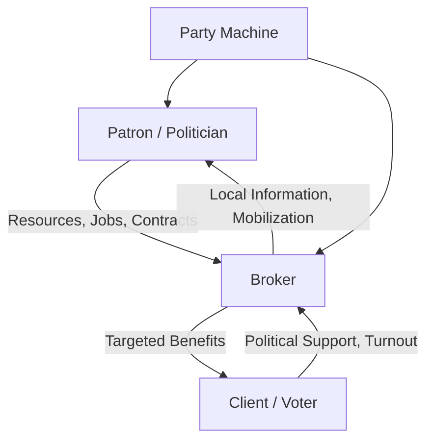

## Clientelism and Patronage Politics

### Definition and Scope

Clientelism refers to a mode of political organization in which political support (votes, loyalty, mobilization) is exchanged for particularistic material benefits (jobs, cash, goods, preferential access to services) rather than being based on programmatic policy commitments applied universally. **Patronage** typically refers more specifically to the distribution of public jobs, contracts, or resources by officeholders to reward political supporters. The two terms are closely related and often used interchangeably, though patronage is sometimes treated as one specific instrument within the broader clientelist exchange relationship. Both concepts are central to understanding how political accountability and representation function differently across democratic and hybrid political systems.

### Defining Clientelism: Core Features

Political scientists (notably **Susan Stokes**, **Herbert Kitschelt**, and **Steven Wilkinson**) identify clientelism through several defining characteristics that distinguish it from programmatic politics:

1. **Contingency**: benefits are conditioned on (or perceived to be conditioned on) political support — the exchange is reciprocal, not a unilateral gift
2. **Particularism/Targeting**: benefits are directed at specific individuals or narrowly defined groups rather than applied through universal policy criteria
3. **Iteration**: clientelist exchange typically occurs repeatedly over time, building ongoing relationships rather than one-off transactions
4. **Hierarchy**: relationships typically run through a chain of intermediaries (patrons, brokers, clients) rather than being purely direct exchanges between politicians and individual voters

**Clientelism vs. Programmatic Politics**

Kitschelt's influential framework distinguishes two ideal-typical modes of democratic linkage between politicians and voters:

- **Programmatic linkage**: politicians offer policy platforms that benefit broad categories of citizens according to universal criteria (e.g., a tax policy applying equally to all qualifying taxpayers)
- **Clientelist linkage**: politicians offer targeted, particularistic benefits to specific individuals or groups contingent on political support

Most real-world political systems exhibit some mixture of both linkage types rather than existing in pure form, but the relative balance varies substantially across countries and even across parties within the same system.

### The Broker Role

Clientelist networks typically operate through **political brokers** — local intermediaries (party activists, community leaders, local bosses) who connect national or regional politicians (patrons) to individual voters (clients). Brokers perform essential functions:

- **Information gathering**: brokers often possess local knowledge of voters' needs, loyalties, and political leanings unavailable to distant party leadership
- **Monitoring**: in systems requiring some form of vote verification or turnout monitoring, brokers can observe local voting behavior or turnout patterns (though secret ballot laws complicate direct vote monitoring in most contemporary democracies)
- **Targeting efficiency**: brokers help patrons allocate limited resources to voters most likely to be persuadable or most likely to reciprocate political support

**Susan Stokes' brokerage research** highlights a key principal-agent problem within clientelist networks themselves: national patrons must monitor and incentivize brokers, who might otherwise divert resources for their own local political ambitions rather than faithfully serving the patron's broader electoral strategy — creating a nested layer of the same monitoring/accountability challenges present in corruption more generally.

### Vote-Buying and the Secret Ballot Problem

**Vote-buying** — direct cash or in-kind payment contingent on voting for a specific candidate — represents an especially stark form of clientelist exchange. A puzzle explored extensively in clientelism scholarship: given the secret ballot in most democracies, how can politicians enforce the "contingency" of a clientelist exchange if they cannot verify how a voter actually voted?

Proposed resolutions include:

- **Turnout buying rather than vote buying**: politicians may target increasing turnout among supporters (which is at least partially observable) rather than trying to change how someone votes
- **Group-based monitoring**: rewarding or punishing entire communities/precincts based on aggregate voting patterns, creating peer-monitoring incentives within communities
- **Repeated game/relational contracting**: clientelist relationships persist over multiple electoral cycles, allowing patrons to gradually build trust and reputation-based compliance even without perfect individual-level monitoring
- **Non-electoral compliance mechanisms**: exchange relationships sustained through ongoing provision of everyday needs (employment, dispute resolution) rather than solely electoral quid pro quo, reducing dependence on strict vote verification

### Comparative Patterns: When Does Clientelism Emerge?

**Economic Development and Clientelism**

Clientelism is empirically more prevalent in lower and middle-income democracies than in wealthy, post-industrial democracies, though scholars debate whether this reflects a direct causal effect of poverty (poor voters value small material benefits more highly relative to abstract policy promises) or whether it reflects underlying institutional and historical factors correlated with both income level and clientelist practice.

**Party System Institutionalization**

Weakly institutionalized party systems — characterized by high electoral volatility, personalistic rather than programmatic parties, and weak ideological brand differentiation — are strongly associated with greater reliance on clientelist rather than programmatic linkage strategies, since clientelism does not require the sustained organizational investment needed to build credible programmatic reputations.

**Ethnic Politics and Clientelism**

**Kanchan Chandra's** research on ethnic parties in patronage democracies (notably India) argues that ethnic identity can function as an efficient "count" heuristic allowing patrons and voters to coordinate clientelist exchange along recognizable group lines, even absent detailed individual-level information — helping explain the frequent empirical overlap between ethnic politics and patronage-based political mobilization.

### Consequences of Clientelism

**For Democratic Quality**

- Clientelism is widely argued to undermine democratic accountability by substituting particularistic exchange for policy-based electoral evaluation, weakening voters' ability to hold governments accountable for broad public performance
- It can perpetuate poverty by giving politicians incentives to keep constituents materially dependent (and thus responsive to targeted benefits) rather than pursuing broad-based development that would reduce voters' reliance on patronage
- Clientelist competition can generate corruption and public resource misallocation, since patronage resources (public jobs, contracts, welfare transfers) are diverted from universal/meritocratic allocation toward politically targeted distribution

**For Political Stability and Representation**

- Clientelism can paradoxically enhance short-term political stability and provide a (imperfect) form of political inclusion and responsiveness for marginalized groups who might otherwise be entirely excluded from programmatic policy benefits, particularly where formal welfare state institutions are weak or absent
- It can serve as an entry mechanism for political machines and party organizations to mobilize otherwise low-participation populations, though this mobilization is instrumentalized rather than reflecting genuine policy preference articulation

### Comparative Table: Clientelism vs. Programmatic Linkage

| Dimension | Clientelist Linkage | Programmatic Linkage |
| --- | --- | --- |
| Benefit targeting | Individual/particularistic | Universal/categorical |
| Basis of exchange | Contingent reciprocity | Policy preference alignment |
| Key intermediary | Political brokers | Party platforms/media |
| Typical context | Weak party institutionalization | Strong party institutionalization |
| Accountability mechanism | Personal relationship/monitoring | Retrospective policy evaluation |

### Diagram: Clientelist Exchange Chain

### Illustration: Linkage Spectrum (svg_diagram)

<svg xmlns="http://www.w3.org/2000/svg" viewBox="0 0 520 220">
<rect width="520" height="220" fill="#ffffff" />
<text x="260" y="24" text-anchor="middle" font-size="15" font-weight="bold" font-family="sans-serif">Programmatic-Clientelist Linkage Spectrum (svg_diagram)</text>
<line x1="60" y1="130" x2="460" y2="130" stroke="#333333" stroke-width="3" />
<circle cx="80" cy="130" r="10" fill="#3f7cac" />
<text x="80" y="160" text-anchor="middle" font-size="11" font-family="sans-serif">Programmatic</text>
<text x="80" y="175" text-anchor="middle" font-size="9" fill="#555555" font-family="sans-serif">universal policy</text>
<circle cx="440" cy="130" r="10" fill="#ac7c3f" />
<text x="440" y="160" text-anchor="middle" font-size="11" font-family="sans-serif">Clientelist</text>
<text x="440" y="175" text-anchor="middle" font-size="9" fill="#555555" font-family="sans-serif">targeted exchange</text>
<text x="260" y="200" text-anchor="middle" font-size="10" fill="#444444" font-family="sans-serif">Most party systems occupy a mixed position along this spectrum</text>
</svg>

### Example: Applying These Concepts

The classic historical case of **urban political machines** in late 19th/early 20th-century American cities (e.g., Tammany Hall in New York) illustrates clientelist dynamics prior to widespread civil service reform. Machine bosses distributed public jobs, small cash payments, coal in winter, and dispute-resolution assistance to newly arrived immigrant communities in exchange for reliable electoral turnout and support — with **precinct captains** functioning precisely as the "brokers" described in contemporary clientelism theory, monitoring local voter needs and mobilization while providing patrons (machine bosses) crucial information and organizational reach unavailable through formal party institutions alone. Civil service reforms (like the US Pendleton Act of 1883) subsequently reduced patronage-based public employment, illustrating one institutional pathway (meritocratic bureaucratic reform) for weakening clientelist linkage over time.

### [Inference] Contemporary Relevance and Debates

Whether clientelism represents a transitional phase that naturally recedes with economic development and party institutionalization, or a durable equilibrium that can persist indefinitely under certain institutional configurations even in middle-income or wealthy democracies, remains a genuinely disputed question in comparative politics rather than settled theory. Similarly, the extent to which conditional cash transfer programs and other targeted social welfare interventions in contemporary developing democracies represent a "cleaner," less overtly clientelist alternative to traditional patronage, or simply a bureaucratized variant of the same underlying particularistic exchange logic, continues to generate active scholarly disagreement.

### Related Topics

- Political brokers and machine politics
- Ethnic politics and patronage democracy (Chandra's ethnic census theory)
- Vote-buying and secret ballot enforcement puzzles
- Party system institutionalization theory
- Civil service reform and meritocratic bureaucracy
- Conditional cash transfer programs as welfare alternatives to patronage
- Principal-agent problems within political parties