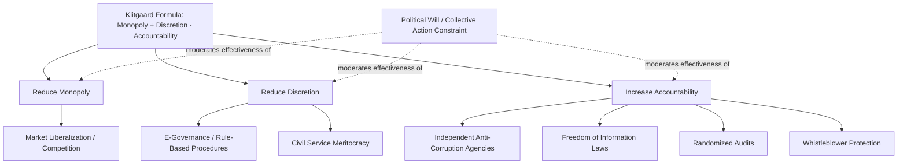

## Anti-Corruption Reform

### Definition and Scope

Anti-corruption reform encompasses the institutional, legal, and policy interventions designed to reduce the incidence and impact of corruption within political and administrative systems. This field draws on the causal frameworks discussed in corruption studies (principal-agent theory, Klitgaard's monopoly-discretion-accountability formula) to design interventions targeting specific causal mechanisms, while grappling with substantial evidence that many well-intentioned reforms fail to produce lasting reductions in corruption due to political economy obstacles, weak implementation capacity, and adaptive resistance from entrenched beneficiaries of corrupt systems.

### Institutional Design Approaches

**Independent Anti-Corruption Agencies (ACAs)**

Dedicated anti-corruption commissions, established as specialized bodies with investigative and sometimes prosecutorial authority separate from ordinary law enforcement, represent one of the most widely adopted institutional reforms globally. Notable examples include:

- **Hong Kong's Independent Commission Against Corruption (ICAC)**, established 1974, frequently cited as a comparative success story, credited with substantially reducing systemic corruption through a combination of investigation, prevention, and public education functions operating with strong political backing and prosecutorial independence
- **Singapore's Corrupt Practices Investigation Bureau (CPIB)**, established 1952, similarly cited as an effective model combining strong legal powers with high-level political commitment

Comparative research on ACAs (notably by **Patrick Meagher** and others) finds highly **mixed effectiveness** across contexts — agencies established in Hong Kong and Singapore operated within broader contexts of strong executive political will and adequate resourcing, while numerous ACAs established elsewhere (particularly in the developing world, often as donor-driven or symbolic reforms) have proven largely ineffective, sometimes becoming instruments of selective political prosecution against opposition figures rather than genuinely independent enforcement bodies.

**Judicial Independence and Rule of Law Reform**

Strengthening judicial independence — through tenure protections, transparent judicial appointment processes, and adequate court resourcing — is theorized to increase the credibility of corruption prosecution by reducing executive interference in individual cases, addressing the "accountability" term in Klitgaard's formula.

**Civil Service Reform and Meritocratic Recruitment**

Reforms replacing patronage-based public employment with competitive, examination-based civil service recruitment (following historical precedents like the UK's 1854 Northcote-Trevelyan reforms and the US 1883 Pendleton Act) aim to reduce corruption by professionalizing bureaucracy and weakening the patronage networks discussed in clientelism research, while also improving bureaucratic competence more broadly.

### Transparency-Based Interventions

**Freedom of Information and Fiscal Transparency**

Legal rights to access government information (freedom of information laws) and public disclosure of budget/procurement data are theorized to reduce corruption by lowering monitoring costs for citizens, journalists, and civil society watchdogs, directly addressing the "discretion" and "accountability" terms in Klitgaard's formula.

**Asset Declaration Requirements**

Mandatory public or confidential disclosure of officials' assets and income, sometimes combined with **illicit enrichment laws** (criminalizing unexplained wealth disproportionate to declared income), aims to create a detection mechanism for corrupt enrichment, though effectiveness depends heavily on verification capacity and enforcement willingness.

**E-Governance and Digitization**

Digitizing government services and procurement processes (reducing direct face-to-face interaction between citizens/firms and officials) is argued to reduce corruption opportunities by decreasing bureaucratic discretion and creating auditable digital trails. Notable examples include e-procurement systems and digital tax filing/payment platforms, though digitization can also relocate rather than eliminate corruption if underlying institutional incentives remain unaddressed.

### Accountability and Enforcement Mechanisms

**Randomized Audits**

Following the influential Brazilian federal anti-corruption audit program studied by **Claudio Ferraz and Frederico Finan**, randomized government program audits combined with public disclosure of results have been shown in several contexts to both directly deter corrupt diversion and, when audit results are publicized before elections, to generate electoral accountability consequences for implicated incumbents — providing some of the strongest causal (as opposed to correlational) evidence in the anti-corruption literature.

**Whistleblower Protection**

Legal protections against retaliation for individuals who report corrupt activity aim to lower the personal cost of exposing corruption, addressing the information asymmetry central to principal-agent analyses of corruption.

**International Anti-Corruption Frameworks**

- **UN Convention Against Corruption (UNCAC)**, adopted 2003, the most comprehensive international anti-corruption treaty, establishing common standards for criminalization, international cooperation, and asset recovery
- **OECD Anti-Bribery Convention** (1997), specifically targeting the supply side of international bribery by criminalizing the bribery of foreign public officials by companies from signatory states
- **Extractive Industries Transparency Initiative (EITI)**, a voluntary standard requiring disclosure of payments between resource extraction companies and governments, directly targeting resource curse-related grand corruption discussed in resource politics

### Political Economy Obstacles to Reform

**The "Political Will" Problem**

A recurring finding in anti-corruption scholarship (associated with **Michael Johnston** and others) is that technically sound reforms frequently fail due to insufficient genuine political commitment from incumbent elites who may benefit from existing corrupt arrangements — reforms are sometimes adopted symbolically (to satisfy international donors or public pressure) without corresponding implementation resources or enforcement will, a pattern termed **isomorphic mimicry** in governance reform literature (following Lant Pritchett, Michael Woolcock, and Matt Andrews).

**Collective Action Problems**

**Anna Persson, Bo Rothstein, and Jan Teorell's** influential reframing argues that systemic corruption should be understood not merely as a series of individual principal-agent failures but as a **collective action problem**: where corruption is deeply systemic, individual officials and citizens rationally expect that others will also behave corruptly, making unilateral honest behavior individually costly and collectively futile without simultaneous, coordinated behavioral change across the system — implying that piecemeal reforms targeting individual agencies may fail where corruption functions as an entrenched social equilibrium.

**Elite Capture of Reform Processes**

Anti-corruption reforms, particularly those requiring legislative or executive implementation, can be captured, diluted, or selectively enforced by the same elite actors the reforms are meant to constrain — a dynamic frequently observed where anti-corruption agencies become tools for prosecuting political opponents while shielding allies.

### Sequencing and Design Debates

Scholars debate whether anti-corruption reform should prioritize:

- **"Big bang" comprehensive reform**: simultaneous implementation of multiple mutually reinforcing reforms (transparency, enforcement, civil service reform) to overcome collective action problems through coordinated system-wide change
- **Incremental/targeted reform**: sector-specific or agency-specific interventions (e.g., reforming a single high-corruption agency like customs or tax administration) that may be more politically and administratively feasible, building credibility and momentum for broader reform over time
- **"Islands of integrity"**: establishing pockets of effective, less-corrupt institutional performance (e.g., a well-functioning central bank or specific reform-minded agency) that can serve as models and eventually catalyze broader reform, though these islands can also remain permanently isolated without broader systemic change

### Comparative Table: Anti-Corruption Reform Instruments

| Instrument | Primary Mechanism | Klitgaard Term Addressed | Example |
| --- | --- | --- | --- |
| Independent Anti-Corruption Agency | Dedicated investigation/prosecution | Accountability | Hong Kong ICAC |
| Freedom of Information Laws | Reduced monitoring costs | Discretion, Accountability | Various national FOI laws |
| Civil Service Meritocracy | Reduced patronage dependency | Monopoly, Discretion | Pendleton Act (US, 1883) |
| Randomized Audits | Direct detection + electoral signal | Accountability | Brazil's federal audit program |
| E-Governance/Digitization | Reduced discretion, auditable trails | Discretion | E-procurement systems |
| UNCAC / OECD Anti-Bribery | International cooperation, supply-side deterrence | Accountability | Cross-border enforcement |

### Diagram: Anti-Corruption Reform Logic Chain

### Illustration: Reform Sequencing Strategies (svg_diagram)

<svg xmlns="http://www.w3.org/2000/svg" viewBox="0 0 520 240">
<rect width="520" height="240" fill="#ffffff" />
<text x="260" y="24" text-anchor="middle" font-size="15" font-weight="bold" font-family="sans-serif">Reform Sequencing Approaches (svg_diagram)</text>
<rect x="40" y="60" width="140" height="70" fill="#3f7cac" rx="6" />
<text x="110" y="90" text-anchor="middle" font-size="12" fill="#ffffff" font-family="sans-serif">Big Bang</text>
<text x="110" y="108" text-anchor="middle" font-size="10" fill="#ffffff" font-family="sans-serif">Simultaneous reforms</text>
<rect x="195" y="60" width="140" height="70" fill="#ac7c3f" rx="6" />
<text x="265" y="90" text-anchor="middle" font-size="12" fill="#ffffff" font-family="sans-serif">Incremental</text>
<text x="265" y="108" text-anchor="middle" font-size="10" fill="#ffffff" font-family="sans-serif">Sector-specific</text>
<rect x="350" y="60" width="140" height="70" fill="#5a8a3f" rx="6" />
<text x="420" y="90" text-anchor="middle" font-size="12" fill="#ffffff" font-family="sans-serif">Islands of Integrity</text>
<text x="420" y="108" text-anchor="middle" font-size="10" fill="#ffffff" font-family="sans-serif">Model institutions</text>
<text x="260" y="180" text-anchor="middle" font-size="11" fill="#444444" font-family="sans-serif">Choice depends on available political will and institutional capacity</text>
</svg>

### Example: Applying These Concepts

The **Brazilian federal government's randomized municipal audit program** (analyzed by Ferraz and Finan, 2008 and subsequent work) illustrates a rare instance of rigorously evaluated anti-corruption reform. By randomly selecting municipalities for detailed federal audits of spending on federally-transferred social program funds and publicizing results before local elections, the program generated two measurable effects: **direct detection** of diverted funds through the audit process itself, and **electoral accountability**, since mayors whose municipalities were audited and found to have diverted significant funds experienced measurably reduced reelection probability compared to non-audited or "clean" audited counterparts. This provides one of the clearer causal demonstrations that combining detection mechanisms with public information disclosure can generate genuine accountability consequences — addressing both the "discretion" and "accountability" terms in Klitgaard's formula simultaneously, though the intervention's reliance on functioning local electoral competition suggests its transferability to weaker democratic contexts is not guaranteed.

### [Inference] Ongoing Debates on Reform Effectiveness

Whether formally similar anti-corruption institutions (e.g., independent anti-corruption commissions) produce genuinely comparable effects across different political contexts, or whether their effectiveness is so contingent on background political will and broader institutional quality that the specific institutional design matters less than commonly assumed, remains an actively contested question in comparative governance research rather than settled empirical consensus. Similarly, the relative merits of "big bang" versus incremental reform sequencing likely depend heavily on context-specific factors that current research has not yet definitively resolved into generalizable prescriptive guidance.

### Related Topics

- Hong Kong ICAC and Singapore CPIB as comparative case studies
- Collective action theory applied to systemic corruption
- Isomorphic mimicry and symbolic institutional reform
- UN Convention Against Corruption and international enforcement cooperation
- Extractive Industries Transparency Initiative (EITI)
- Civil service reform and Weberian bureaucratic development
- Randomized controlled trials in governance and public administration research