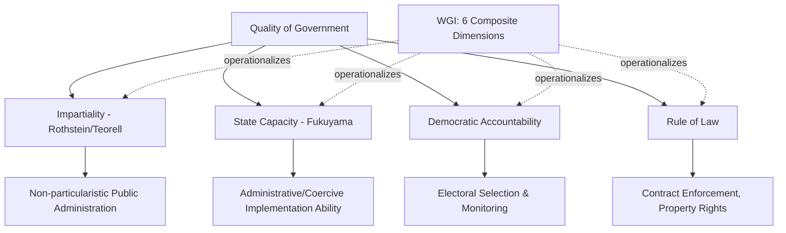

## Governance Indicators and Quality of Government

### Definition and Scope

This topic addresses how political scientists conceptualize and measure "governance" and "quality of government" as constructs broader than corruption alone — encompassing state capacity, bureaucratic impartiality, rule of law, regulatory quality, and government effectiveness. It examines the major cross-national governance measurement projects, their underlying theoretical definitions, and the methodological debates surrounding their construction and use in comparative political research.

### Defining "Quality of Government"

**The Impartiality Definition**

The **Quality of Government (QoG) Institute** at the University of Gothenburg, led by **Bo Rothstein** and **Jan Teorell**, proposes an influential minimalist definition: quality of government is the extent to which state institutions exercise their power **impartially** — that is, without regard to the particularistic characteristics (ethnicity, political affiliation, personal connections, social status) of the individuals affected by government decisions. This definition deliberately separates the *impartiality of process* from the *substantive content* of policy (e.g., whether a government is democratic or redistributive), arguing that impartiality is a distinct and prior institutional quality that can be assessed independent of a regime's specific policy choices or democratic status.

This framework directly connects to the collective action theorization of corruption discussed elsewhere: impartiality failure (particularism) is treated as the conceptual core linking corruption, clientelism, and broader governance dysfunction under a single theoretical umbrella.

**The World Bank Governance Definition**

The World Bank's Worldwide Governance Indicators project, led by **Daniel Kaufmann, Aart Kraay, and Massimo Mastruzzi**, defines governance broadly as the traditions and institutions by which authority is exercised in a country, encompassing three component dimensions:

1. The process by which governments are selected, monitored, and replaced
2. The capacity of government to formulate and implement sound policies
3. The respect of citizens and the state for institutions governing economic and social interactions

**State Capacity as a Distinct Dimension**

Some scholars (e.g., **Francis Fukuyama**) argue for analytically separating **state capacity** (a state's raw administrative and coercive ability to implement decisions, regardless of their content) from **democratic accountability** and **rule of law**, arguing that conflating these dimensions obscures important variation — for example, states can possess high administrative capacity while being either democratic or authoritarian, or can be nominally democratic while possessing very weak implementation capacity.

### Major Governance Indicator Projects

**Worldwide Governance Indicators (WGI)**

Produced by the **World Bank** since 1996, the WGI aggregates data from dozens of underlying sources (surveys, expert assessments, NGO reports) into six composite governance dimensions:

1. **Voice and Accountability**: extent of political participation, freedom of expression/association, free media
2. **Political Stability and Absence of Violence**: perceived likelihood of political instability or violence
3. **Government Effectiveness**: quality of public services, civil service competence, policy formulation credibility
4. **Regulatory Quality**: government capacity to formulate sound market-friendly policies and regulations
5. **Rule of Law**: confidence in and adherence to societal rules, quality of contract enforcement, property rights, courts, police
6. **Control of Corruption**: extent to which public power is exercised for private gain

**Quality of Government (QoG) Datasets**

The QoG Institute compiles and standardizes indicators from numerous existing sources (including WGI, International Country Risk Guide, Freedom House, Polity, and academic datasets) into unified, harmonized cross-national and historical datasets widely used in comparative political science research, without generating a single proprietary composite index in the way WGI does.

**International Country Risk Guide (ICRG)**

A longer-running commercial risk-assessment product (since 1980) providing expert-coded ratings on political, financial, and economic risk components, valued in academic research primarily for its **long historical time series** (extending back further than most alternative measures), enabling longitudinal analysis unavailable with newer indices.

**Bertelsmann Transformation Index (BTI) and Sustainable Governance Indicators (SGI)**

Produced by the German Bertelsmann Stiftung, these provide detailed qualitative and quantitative assessments of governance quality, democratic development, and market economy transformation, particularly focused on developing and transition countries (BTI) or OECD/EU member states (SGI).

**V-Dem (Varieties of Democracy)**

While primarily a democracy measurement project, V-Dem's disaggregated approach — coding hundreds of distinct institutional and procedural indicators via country expert surveys — provides granular governance-relevant sub-indices (e.g., judicial constraints on the executive, legislative constraints on the executive) frequently used in governance-focused research as an alternative to more aggregated indices like WGI.

### Methodological Debates

**Aggregation and Composite Index Construction**

WGI and similar composite indices aggregate multiple underlying data sources using statistical models (WGI specifically uses an **unobserved components model**) that weight sources according to their estimated reliability. Critics (notably **Christiane Arndt and Charles Oman**) argue this aggregation methodology:

- Obscures which specific underlying data sources drive a country's score, reducing transparency and making it difficult to identify what specific governance failure a low score reflects
- Produces confidence intervals around country scores that are frequently wide enough that small year-to-year changes, or even substantial cross-country ranking differences, may not represent statistically meaningful distinctions

**Perception vs. "Objective" Measurement**

Similar to the broader corruption measurement debate, most governance indicators (WGI, ICRG, BTI) rely substantially on expert perception or survey-based assessment rather than directly observed administrative outcomes, raising analogous concerns about reputational bias, potential circularity (experts may be influenced by a country's general reputation or by other governance indicators themselves), and limited ability to detect genuine change independent of shifting international attention or media coverage.

**Definitional Breadth and Conceptual Stretching**

Critics (notably **David Collier and Steven Levitsky**, applying broader concerns about "conceptual stretching" in comparative politics) argue that governance indicators sometimes bundle together conceptually and causally distinct phenomena (e.g., political stability, regulatory quality, and corruption control) into single indices, potentially obscuring important theoretical distinctions and making it difficult to test specific causal hypotheses about which particular governance dimension drives a given outcome (e.g., economic growth).

**Endogeneity in Cross-National Regression Use**

Because governance indicators are frequently used as both dependent and independent variables across the broader comparative politics and development economics literature (e.g., studies of "does governance cause growth" alongside studies of "does growth cause governance improvement"), causal identification challenges are pervasive, and many influential correlational findings using these indicators have faced subsequent methodological critique regarding reverse causality and omitted variable bias.

### Applications in Political Science Research

Governance indicators are extensively used to:

- Test hypotheses linking institutional quality to economic growth and foreign direct investment (following influential early work by **Daniel Kaufmann and Aart Kraay**)
- Inform international aid allocation decisions (e.g., the US **Millennium Challenge Corporation** uses governance indicator thresholds, including control of corruption and rule of law scores, as eligibility criteria for development assistance)
- Support cross-national comparative analysis of democratization, state-building, and public administration reform trajectories
- Provide benchmarking tools for international organizations and rating agencies assessing country risk and creditworthiness

### Comparative Table: Major Governance Indicator Projects

| Project | Producer | Approach | Key Strength | Key Limitation |
| --- | --- | --- | --- | --- |
| Worldwide Governance Indicators | World Bank | Aggregated composite (6 dimensions) | Broad country/year coverage | Aggregation obscures underlying sources |
| QoG Datasets | Gothenburg QoG Institute | Harmonized compilation, no proprietary index | Wide indicator variety, no forced aggregation | Users must select/weight indicators themselves |
| International Country Risk Guide | PRS Group (commercial) | Expert-coded risk ratings | Longest historical time series | Proprietary methodology, commercial cost |
| V-Dem | V-Dem Institute | Disaggregated expert-coded indicators | High granularity, historical depth | Primarily democracy-focused, not governance-specific |
| Bertelsmann Transformation Index | Bertelsmann Stiftung | Qualitative + quantitative country reports | Rich contextual detail | Limited to developing/transition countries |

### Diagram: Dimensions of Quality of Government

### Illustration: Governance Dimensions as Overlapping but Distinct Constructs (svg_diagram)

<svg xmlns="http://www.w3.org/2000/svg" viewBox="0 0 500 280">
<rect width="500" height="280" fill="#ffffff" />
<text x="250" y="24" text-anchor="middle" font-size="14" font-weight="bold" font-family="sans-serif">Overlapping Governance Constructs (svg_diagram)</text>
<circle cx="200" cy="150" r="80" fill="#3f7cac" opacity="0.5" />
<circle cx="300" cy="150" r="80" fill="#ac7c3f" opacity="0.5" />
<circle cx="250" cy="90" r="80" fill="#5a8a3f" opacity="0.5" />
<text x="160" y="190" text-anchor="middle" font-size="11" font-family="sans-serif">State Capacity</text>
<text x="340" y="190" text-anchor="middle" font-size="11" font-family="sans-serif">Rule of Law</text>
<text x="250" y="60" text-anchor="middle" font-size="11" font-family="sans-serif">Democratic Accountability</text>
<text x="250" y="260" text-anchor="middle" font-size="10" fill="#444444" font-family="sans-serif">Composite indices often blend these analytically distinct dimensions</text>
</svg>

### Example: Applying These Concepts

The **US Millennium Challenge Corporation (MCC)**, established in 2004, operationalizes governance indicators directly into foreign aid policy by requiring candidate countries to score above a designated threshold on specific WGI-derived indicators — including control of corruption, rule of law, and government effectiveness — as a precondition for large-scale development compact eligibility. This represents a direct policy application of the composite indicator methodology, but also illustrates the practical stakes of the aggregation critique discussed above: because a country's eligibility can hinge on relatively small differences in composite scores with wide underlying confidence intervals, critics have argued the MCC's threshold-based approach may produce eligibility determinations more precise-seeming than the underlying data actually supports.

### [Inference] Unresolved Measurement Questions

Whether impartiality (per the Rothstein/Teorell framework) is genuinely conceptually and empirically separable from democratic accountability and rule of law, or whether these constructs are so deeply intertwined in practice that treating impartiality as an independent causal factor risks circular reasoning, remains a live theoretical debate within quality-of-government scholarship rather than a resolved question. Similarly, whether aggregated composite indices like WGI provide net analytical value despite their transparency limitations, or whether researchers are better served using disaggregated indicator sets (as QoG and V-Dem allow), continues to generate methodological disagreement without clear scholarly consensus.

### Related Topics

- Rothstein and Teorell's impartiality theory of quality of government
- State capacity theory (Fukuyama) and its relationship to democracy
- V-Dem's disaggregated democracy and governance measurement approach
- Millennium Challenge Corporation and governance-conditional foreign aid
- Composite index construction methodology and aggregation critiques
- Collective action theory of systemic corruption
- Comparative bureaucratic quality and Weberian state development