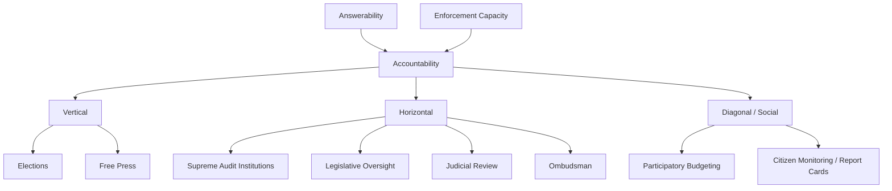

## Transparency and Accountability Mechanisms

### Definition and Scope

This topic examines the institutional mechanisms through which citizens, oversight bodies, and other actors obtain information about government performance (**transparency**) and can impose consequences on officials for their conduct (**accountability**). While related to anti-corruption reform, this topic addresses accountability and transparency as general governance concepts applicable beyond corruption control specifically — encompassing democratic responsiveness, public service delivery, and the broader principal-agent relationship between citizens and the state.

### Conceptual Foundations

**Defining Accountability**

Following **Andreas Schedler's** influential framework, accountability comprises two analytically distinct components:

1. **Answerability**: the obligation of officials to inform and explain their decisions to relevant overseers (the informational dimension)
2. **Enforcement**: the capacity of overseers to impose sanctions or consequences for poor performance or misconduct (the punitive/corrective dimension)

Transparency serves primarily the answerability component but is often insufficient alone — information disclosure without corresponding enforcement capacity ("transparency without teeth") may fail to generate genuine accountability, a distinction central to evaluating why transparency reforms sometimes fail to produce behavioral change.

**Horizontal vs. Vertical Accountability**

**Guillermo O'Donnell's** influential distinction identifies two accountability axes:

- **Vertical accountability**: accountability relationships between citizens and the state, operating primarily through elections, but also through social mobilization, media scrutiny, and civil society pressure ("societal accountability")
- **Horizontal accountability**: accountability relationships between state institutions themselves, where one state body (courts, legislatures, ombudsmen, audit institutions, anti-corruption agencies) is empowered to oversee and sanction another

O'Donnell specifically highlighted that many democracies, particularly newer or "delegative" democracies, suffer from strong vertical accountability (competitive elections) but weak horizontal accountability (ineffective checks between branches of government), producing incomplete democratic accountability despite regular elections.

**Diagonal Accountability**

Some scholars add a third category — **diagonal accountability** — capturing hybrid mechanisms where citizens or civil society actors directly engage formal state oversight institutions (e.g., citizens filing complaints with an ombudsman or anti-corruption commission), blending features of both vertical and horizontal accountability.

### Vertical Accountability Mechanisms

**Elections as Retrospective Accountability**

Democratic theory (following **V.O. Key's** classic formulation of "retrospective voting") treats elections as the primary vertical accountability mechanism: voters evaluate incumbents' past performance and can remove poorly performing or corrupt officials at the next election. This mechanism's effectiveness depends on:

- Voter access to reliable performance information (connecting directly to transparency mechanisms)
- Genuine electoral competitiveness (meaningful alternative candidates/parties)
- Clarity of responsibility (voters' ability to correctly attribute outcomes to specific officials, complicated in coalition governments or federal systems with overlapping jurisdiction)

**Free Press and Media Accountability**

A free press performs a crucial accountability function by investigating and publicizing government malfeasance, providing the informational basis necessary for voters to exercise retrospective accountability. Cross-national research consistently finds press freedom correlated with lower corruption and better governance outcomes, though causal identification (does free press cause better governance, or does better governance enable free press) remains contested.

**Civil Society and Social Accountability**

**Social accountability mechanisms** — citizen monitoring initiatives, participatory budgeting, community scorecards, social audits — represent a category of accountability tools operating through direct citizen engagement rather than formal electoral or institutional channels. Notable examples include:

- **Participatory budgeting**, pioneered in Porto Alegre, Brazil (1989), allowing citizens direct input into municipal budget allocation decisions
- **Community-based monitoring** of public service delivery (e.g., citizen report cards assessing local government performance, pioneered by the Public Affairs Centre in Bangalore, India)

### Horizontal Accountability Mechanisms

**Supreme Audit Institutions**

Independent government audit bodies (e.g., the US Government Accountability Office, the UK National Audit Office, various national "Courts of Accounts" in civil law traditions) examine public spending for legality, efficiency, and effectiveness, providing formal institutional oversight of executive branch spending decisions.

**Ombudsman Institutions**

Independent officials empowered to investigate citizen complaints against government agencies, providing an accessible complaint-resolution mechanism outside formal judicial processes, tracing institutional origins to Sweden's Justitieombudsman (established 1809).

**Legislative Oversight**

Parliamentary/congressional committees with investigative authority (subpoena power, budget review authority, confirmation hearings) provide a horizontal check on executive branch conduct, with effectiveness varying substantially based on the ruling party's control of the legislature (unified vs. divided government) and formal committee investigative powers.

**Judicial Review and Independent Courts**

Courts empowered to review the legality of executive and legislative action provide a horizontal accountability mechanism distinct from electoral or legislative oversight, with effectiveness contingent on judicial independence (tenure protection, appointment processes insulated from executive control) discussed in anti-corruption reform.

### Transparency Mechanisms

**Freedom of Information (FOI) Laws**

Legal rights enabling citizens and journalists to request government documents and data, with **Sweden's 1766 Freedom of the Press Act** (containing the world's first FOI provisions) as the historical precedent, followed by widespread contemporary adoption (over 100 countries have some form of FOI legislation as of the 2020s).

**Open Budget and Fiscal Transparency Initiatives**

The **International Budget Partnership's Open Budget Survey** measures and ranks countries on budget transparency, public participation in budget processes, and the strength of formal budget oversight institutions, providing a standardized comparative measure of fiscal transparency practice.

**Beneficial Ownership Transparency**

More recent transparency reforms target **beneficial ownership disclosure** — requiring identification of the real (as opposed to nominal/shell) individuals who ultimately own or control companies — aimed at addressing money laundering, tax evasion, and corrupt asset concealment facilitated by anonymous shell company structures, an area of significant recent international policy development (e.g., through Financial Action Task Force standards and various national beneficial ownership registries).

### Why Transparency Alone Is Often Insufficient

Political science research has identified several conditions under which transparency reforms fail to generate meaningful accountability, informing the "transparency without teeth" critique:

- **Information overload**: disclosure of large volumes of raw data without accessible synthesis or analysis may not translate into usable information for citizens or media with limited capacity to process it
- **Weak enforcement linkage**: information disclosure alone does not guarantee that oversight bodies, media, or voters will act on revealed misconduct, particularly absent competitive elections or independent enforcement institutions
- **Elite capture of information channels**: even when raw data is technically public, well-resourced actors may better exploit transparency provisions than ordinary citizens or under-resourced civil society organizations
- **"Naming and shaming" limitations**: transparency-based reputational sanctions may be insufficient deterrents where formal legal consequences remain weak or unenforced

### Comparative Table: Accountability Mechanism Types

| Mechanism | Accountability Type | Primary Function | Example Institution |
| --- | --- | --- | --- |
| Elections | Vertical | Retrospective performance evaluation | Competitive multi-party elections |
| Free press | Vertical | Information generation, exposure | Independent investigative journalism |
| Supreme audit institutions | Horizontal | Legality/efficiency review of spending | US GAO, UK National Audit Office |
| Ombudsman | Horizontal/Diagonal | Citizen complaint resolution | Swedish Justitieombudsman |
| Legislative oversight | Horizontal | Investigative/budgetary review | Congressional/parliamentary committees |
| Judicial review | Horizontal | Legality review of state action | Independent constitutional courts |
| FOI laws | Transparency (answerability) | Information access rights | National FOI/sunshine laws |
| Participatory budgeting | Diagonal/Social | Direct citizen input | Porto Alegre model |

### Diagram: Accountability Axes

### Illustration: Answerability vs. Enforcement Matrix (svg_diagram)

<svg xmlns="http://www.w3.org/2000/svg" viewBox="0 0 500 300">
<rect width="500" height="300" fill="#ffffff" />
<text x="250" y="24" text-anchor="middle" font-size="14" font-weight="bold" font-family="sans-serif">Answerability-Enforcement Matrix (svg_diagram)</text>
<line x1="90" y1="260" x2="440" y2="260" stroke="#333333" stroke-width="2" />
<line x1="90" y1="260" x2="90" y2="50" stroke="#333333" stroke-width="2" />
<text x="265" y="285" text-anchor="middle" font-size="11" font-family="sans-serif">Answerability (Information)</text>
<text x="40" y="155" text-anchor="middle" font-size="11" font-family="sans-serif" transform="rotate(-90 40 155)">Enforcement</text>
<rect x="90" y="170" width="175" height="90" fill="#e8c9a0" opacity="0.7" />
<text x="177" y="220" text-anchor="middle" font-size="10" font-family="sans-serif">Transparency w/o Teeth</text>
<rect x="265" y="50" width="175" height="120" fill="#a9cce8" opacity="0.7" />
<text x="352" y="115" text-anchor="middle" font-size="10" font-family="sans-serif">Full Accountability</text>
</svg>

### Example: Applying These Concepts

**Participatory budgeting in Porto Alegre, Brazil** (initiated 1989 under the Workers' Party municipal government) illustrates a diagonal/social accountability mechanism combining transparency and enforcement elements directly. Citizens participated in structured neighborhood assemblies to deliberate and vote on portions of the municipal capital budget, with the resulting allocations formally binding on the municipal government — meaning the mechanism provided not merely information disclosure (answerability) but direct citizen **enforcement** power over a specific budgetary decision, addressing the "transparency without teeth" critique by embedding a genuine sanctioning/decision mechanism rather than relying solely on downstream electoral consequences. The model has since been adapted (with varying fidelity and effectiveness) by hundreds of municipalities worldwide, illustrating both its perceived promise and the challenges of successfully transplanting participatory institutions across different political-administrative contexts.

### [Inference] Contemporary Debates

Whether digital transparency tools (open data portals, real-time budget dashboards, social media-enabled citizen monitoring) meaningfully strengthen accountability relative to traditional mechanisms, or whether they primarily benefit already well-resourced civil society actors and journalists while leaving ordinary citizens' practical accountability leverage largely unchanged, remains an open empirical question rather than a settled finding. Similarly, the conditions under which horizontal accountability institutions (courts, audit bodies, anti-corruption agencies) can function effectively despite executive resistance — as opposed to being gradually weakened or captured over time — continues to generate active debate within democratic backsliding and institutional resilience scholarship.

### Related Topics

- Schedler's answerability-enforcement accountability framework
- O'Donnell's horizontal vs. vertical accountability distinction
- Participatory budgeting and deliberative democracy
- Freedom of information law design and implementation
- Beneficial ownership transparency and anti-money laundering policy
- Democratic backsliding and institutional capture
- Retrospective voting theory (V.O. Key)