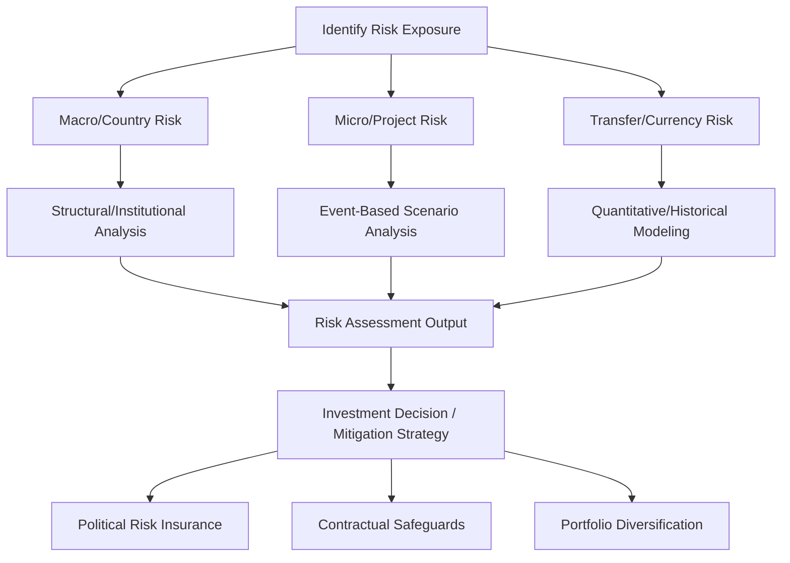

## Political Risk Analysis

### Definition and Scope

Political risk analysis is the applied practice of identifying, assessing, and forecasting the likelihood and impact of political events — regulatory change, expropriation, civil unrest, war, sanctions, contract repudiation, currency controls — on business operations, investments, and government decision-making. It sits at the applied intersection of political science, international relations, and finance/business strategy, translating theoretical understanding of political institutions and behavior into decision-relevant risk assessments for corporations, investors, insurers, and government agencies.

### Historical Development

Political risk analysis emerged as a distinct professional practice in the mid-20th century, driven substantially by multinational corporations' experiences with **expropriation** of foreign assets during decolonization and nationalist economic policy waves (e.g., nationalization of oil assets in Iran, Latin America, and the Middle East throughout the 1950s–70s). This practical business need drove the development of the political risk consulting industry and specialized insurance products (e.g., the establishment of the **Overseas Private Investment Corporation**, now the **US International Development Finance Corporation**, providing political risk insurance for American investors abroad).

Academic contributions from comparative politics and international relations (institutionalist theory, conflict studies, regime type research) have progressively been incorporated into more systematic political risk methodologies, moving the field from purely qualitative country-expert judgment toward more structured, sometimes quantitative, risk assessment frameworks.

### Categories of Political Risk

**Macro/Country-Level Risk**

Risks affecting all firms and investors operating within a given country, regardless of sector or specific business activity:

- **Regime change and instability**: coups, revolutions, sudden leadership transitions
- **War and civil conflict**: interstate war, civil war, insurgency affecting broad economic activity
- **Sovereign default and macroeconomic crisis**: currency crises, sovereign debt default, hyperinflation
- **Sweeping policy shifts**: nationalization waves, capital controls, broad regulatory overhauls

**Micro/Firm-Level (Project) Risk**

Risks specific to a particular firm, sector, or investment project rather than affecting the entire economy:

- **Expropriation and contract repudiation**: government seizure of specific assets or unilateral cancellation of specific contracts
- **Sector-specific regulatory risk**: targeted regulatory changes affecting particular industries (e.g., mining, telecommunications, banking)
- **Discriminatory treatment**: policies disadvantaging foreign firms relative to domestic competitors, or specific firms relative to sector peers

**Cross-Border/Transfer Risk**

Risks related to a firm's ability to move capital, profits, or assets across borders:

- **Currency inconvertibility and transfer restrictions**: government-imposed limits on converting local currency or repatriating profits
- **Trade and investment sanctions**: government-imposed restrictions on cross-border commercial activity, either targeting the host country broadly or specific sectors/entities

### Analytical Frameworks and Methodologies

**Structural/Institutional Analysis**

Drawing directly on comparative political science, this approach assesses risk based on underlying institutional characteristics: regime type, checks and balances, judicial independence, civil-military relations, and party system institutionalization — treating these structural features as slower-moving but more fundamental risk determinants than short-term political events.

**Event-Based/Scenario Analysis**

Focuses on assessing the probability and impact of specific anticipated political events (elections, court rulings, policy votes, leadership transitions) using structured scenario planning, expert elicitation, and sometimes formal probabilistic forecasting methods.

**Quantitative Risk Modeling**

Some political risk providers employ statistical/econometric models using historical data on conflict onset, regime transitions, and economic crises to generate probabilistic risk scores, drawing methodologically on academic conflict forecasting research (e.g., approaches informed by the **Political Instability Task Force**, a US government-funded academic research initiative studying the correlates of state failure and instability).

**Expert Judgment and the Delphi Method**

Given the inherent difficulty of quantifying complex political dynamics, many political risk assessments rely substantially on structured expert elicitation — sometimes using formal techniques like the **Delphi method** (iterative, anonymized expert forecasting rounds designed to converge toward consensus estimates while minimizing groupthink and status-based bias in group discussion).

### Commercial and Institutional Political Risk Products

**Commercial Risk Rating Services**

- **International Country Risk Guide (ICRG)**, produced by the PRS Group since 1980, providing composite political, financial, and economic risk ratings widely used in both academic research and commercial risk assessment
- **Economist Intelligence Unit (EIU)** country risk and forecasting products
- **Control Risks**, **Eurasia Group**, and **Verisk Maplecroft** as prominent specialized political risk consultancies providing bespoke analysis and standardized risk indices to corporate and government clients

**Political Risk Insurance**

- **Multilateral Investment Guarantee Agency (MIGA)**, a World Bank Group institution, provides political risk insurance to encourage foreign direct investment into developing countries by insuring against risks including expropriation, currency inconvertibility, breach of contract, and war/civil disturbance
- **US International Development Finance Corporation (DFC)** and various national export credit agencies provide similar political risk insurance products for their national investors operating abroad
- Private political risk insurance markets (e.g., Lloyd's of London syndicates) provide commercial coverage for firms seeking to hedge against specific identified political risks

### Applications in Corporate and Government Decision-Making

**Corporate Investment Decisions**

Multinational corporations use political risk analysis to inform market entry decisions, capital allocation across countries, supply chain diversification strategies (particularly salient following recent geopolitical disruptions), and to structure risk mitigation provisions in international contracts (e.g., stabilization clauses, international arbitration provisions).

**Sovereign Debt and Credit Rating**

Credit rating agencies (Moody's, S&P, Fitch) incorporate political risk assessment as a component of sovereign credit ratings, since political instability, policy unpredictability, and governance quality directly affect a government's capacity and willingness to service debt obligations.

**Government and Intelligence Applications**

Government agencies employ political risk and instability forecasting for foreign policy planning, humanitarian response preparedness, and national security assessment — with academic-government collaboration exemplified by initiatives like the Political Instability Task Force's contribution to broader US government early-warning capacity for state fragility and conflict.

### Methodological Challenges

**Forecasting Difficulty and Black Swan Events**

Political risk analysis faces the fundamental challenge that major political disruptions (sudden regime collapse, unexpected election outcomes, rapid escalation of conflict) are frequently difficult to forecast even with sophisticated methodologies, given the complex, non-linear, and sometimes contingent nature of political events — a limitation political risk analysts generally acknowledge rather than claim to have overcome.

**Distinguishing Signal from Noise**

Given the volume of political information and commentary available, a persistent methodological challenge involves distinguishing genuinely predictive indicators from routine political noise or media-driven attention that may not correspond to materially different underlying risk levels.

**Client-Specific Risk Tolerance and Framing**

Effective political risk analysis must translate general country/political assessments into risk framings relevant to a specific client's particular exposure (sector, asset type, time horizon, risk tolerance), since the same underlying political development may represent a severe risk for one type of investment and a negligible concern for another.

### Comparative Table: Political Risk Categories and Mitigation Tools

| Risk Category | Example Manifestation | Common Mitigation Tool |
| --- | --- | --- |
| Macro/Country | Coup, civil war, sovereign default | Diversification, political risk insurance |
| Micro/Project | Expropriation, contract repudiation | Stabilization clauses, international arbitration |
| Transfer/Currency | Capital controls, currency inconvertibility | MIGA/DFC insurance, currency hedging |
| Regulatory/Sectoral | Targeted nationalization, discriminatory rules | Joint ventures with local partners, lobbying/engagement |

### Diagram: Political Risk Analysis Workflow

### Illustration: Risk Category Scope (svg_diagram)

<svg xmlns="http://www.w3.org/2000/svg" viewBox="0 0 500 260">
<rect width="500" height="260" fill="#ffffff" />
<text x="250" y="24" text-anchor="middle" font-size="14" font-weight="bold" font-family="sans-serif">Political Risk Scope Levels (svg_diagram)</text>
<rect x="60" y="60" width="380" height="160" fill="#f4f1e8" stroke="#7a6a4a" stroke-width="2" rx="6" />
<rect x="90" y="90" width="320" height="100" fill="#e8c9a0" stroke="#8a5a2c" stroke-width="2" rx="6" />
<rect x="140" y="120" width="220" height="40" fill="#ac7c3f" stroke="#5a3a1e" stroke-width="2" rx="6" />
<text x="250" y="80" text-anchor="middle" font-size="11" font-family="sans-serif">Macro / Country-Level Risk</text>
<text x="250" y="110" text-anchor="middle" font-size="11" font-family="sans-serif">Transfer / Currency Risk</text>
<text x="250" y="145" text-anchor="middle" font-size="11" fill="#ffffff" font-family="sans-serif">Micro / Project Risk</text>
<text x="250" y="240" text-anchor="middle" font-size="10" fill="#444444" font-family="sans-serif">Risk categories nest from broad country conditions to specific project exposure</text>
</svg>

### Example: Applying These Concepts

Consider a multinational mining firm evaluating a new extraction project in a country with a history of resource nationalism. A comprehensive political risk assessment would address multiple layers simultaneously: **structural analysis** of the country's institutional checks on executive power (relevant to assessing expropriation risk over the project's multi-decade lifespan), **event-based analysis** of an upcoming election where a candidate has campaigned on renegotiating foreign mining contracts, and **transfer risk analysis** regarding the country's history of currency controls affecting profit repatriation. Based on this assessment, the firm might pursue several concrete mitigation strategies simultaneously: purchasing MIGA political risk insurance covering expropriation and currency inconvertibility, negotiating a stabilization clause in its mining contract (freezing certain regulatory terms for a defined period), and structuring the investment through a joint venture with politically influential local partners to reduce the perceived political cost of adverse government action against the project.

### [Inference] Limitations and Debates

The fundamental predictive limitations of political risk analysis — particularly regarding sudden, high-impact events (coups, rapid regime collapse, unexpected war onset) — mean that even sophisticated methodologies combining structural, event-based, and quantitative approaches are unlikely to eliminate significant forecasting uncertainty, a limitation the field generally treats as an inherent feature of political complexity rather than a solvable methodological problem. Whether increasing use of machine learning and large-scale event data (e.g., automated news monitoring and coding systems) will substantially improve forecasting accuracy relative to traditional expert judgment-based approaches, or will primarily improve efficiency without fundamentally altering forecasting accuracy limits, remains an open question actively being tested by both academic and commercial political risk research rather than a settled matter.

### Related Topics

- Political Instability Task Force and academic conflict forecasting
- Sovereign credit ratings and political risk components
- Political risk insurance (MIGA, DFC, private markets)
- Stabilization clauses and international investment arbitration
- Expropriation and nationalization case studies
- Delphi method and structured expert elicitation
- Machine learning applications in political event forecasting