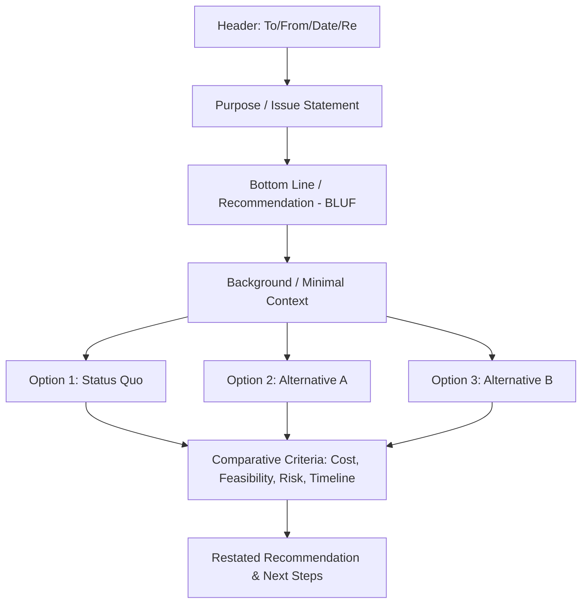

## Writing Policy Memos and Briefs

### Definition and Scope

Policy memos and briefs are the primary applied writing genres through which political scientists, policy analysts, and government staff communicate analysis and recommendations to decision-makers. Unlike academic writing, which prioritizes theoretical contribution and methodological transparency for a specialist audience, policy writing prioritizes **actionability, brevity, and decision-relevance** for a typically time-constrained, non-specialist audience (elected officials, agency heads, executives) who need to make or inform a specific decision. This topic covers the distinct sub-genres, structural conventions, and rhetorical strategies of effective policy writing.

### Distinguishing Policy Writing Sub-Genres

**Policy Memo**

A relatively short (typically 1–3 pages), internally-oriented document addressed to a specific decision-maker or small audience, focused on a defined question or decision the reader must make. Memos are typically the most tightly scoped and action-oriented of the genres discussed here.

**Policy Brief**

A somewhat longer (typically 2–6 pages), often externally-facing document intended for broader distribution (legislators generally, the public, other stakeholders) that summarizes an issue, presents evidence, and advocates a position or set of options, without necessarily being addressed to a single named decision-maker with a specific pending decision.

**Issue/Background Paper**

A longer, more comprehensive document providing detailed context on a policy area, often serving as foundational research for subsequent memos or briefs, or as a standing reference document for staff working on an issue area over time.

**Talking Points**

The most condensed policy writing genre — brief, often bulleted statements designed for a specific spoken context (press briefing, legislative testimony, meeting), prioritizing memorability and message discipline over comprehensive argumentation.

### Core Structural Principles

**The Inverted Pyramid**

Following journalistic convention, effective policy writing front-loads the most decision-relevant information — the core recommendation or key finding appears in the opening lines, with supporting detail, context, and caveats following in decreasing order of importance. This structure accommodates time-constrained readers who may only read the first paragraph or two, ensuring the essential message is not lost even if the reader does not finish the document.

**The BLUF Principle (Bottom Line Up Front)**

A related convention, particularly common in government and military policy writing, requires stating the core conclusion or recommendation in the first sentence or paragraph, explicitly rejecting the academic convention of building an argument progressively toward a conclusion. This reflects the practical reality that policy audiences often need to extract actionable content rapidly.

**Standard Memo Structure**

While formats vary by institution, a common structural template includes:

1. **Header**: To/From/Date/Re (subject line) — establishing audience, authorship, and topic immediately
2. **Purpose/Issue statement**: a concise statement of the question being addressed or decision required
3. **Bottom line/Recommendation**: the core recommendation or key finding, stated early and directly
4. **Background/Context**: essential context needed to understand the issue (kept minimal — only what the specific reader needs, not comprehensive background)
5. **Analysis/Options**: the substantive analysis, often structured around a small number of clearly delineated options with associated trade-offs
6. **Recommendation/Next Steps**: a restated, specific recommendation with concrete next steps or a decision requested of the reader

### Option-Based Analysis Structure

A hallmark convention of policy memo writing (as opposed to academic argumentation) is structuring analysis around a limited set of discrete **options**, typically 2–4, each evaluated against consistent criteria:

- **Status quo/baseline option**: continuing current policy, serving as the comparative baseline
- **Alternative options**: distinct policy paths, each described with its mechanism, expected outcomes, and trade-offs
- Each option is typically assessed against a consistent set of criteria (cost, feasibility, political viability, timeline, risk) to enable direct comparison, rather than treated as isolated arguments

This structure reflects policy writing's core function: helping a decision-maker choose among a bounded set of concrete alternatives, rather than establishing a single "correct" answer through open-ended argumentation.

### Audience Analysis and Tailoring

Effective policy writing requires explicit consideration of:

- **Reader's existing knowledge**: avoiding both condescension (over-explaining basics a specialist reader already knows) and unexplained jargon (assuming specialist knowledge a generalist reader lacks)
- **Reader's decision authority and constraints**: tailoring recommendations to what the specific reader can actually decide or influence, rather than offering generic policy prescriptions detached from the reader's actual authority
- **Reader's political and institutional context**: framing recommendations in terms relevant to the reader's own incentives, constituency, and institutional position (e.g., a memo to a legislator should address electoral and constituency implications differently than a memo to a career civil servant)
- **Time constraints**: assuming a busy reader who may allocate only a few minutes to the document, requiring ruthless prioritization of content

### Evidentiary and Rhetorical Conventions

**Evidence Presentation**

Policy writing typically favors concise, visually accessible evidence presentation (short bulleted statistics, simple charts, brief illustrative examples) over the extended methodological discussion and literature review conventions of academic writing. Sourcing is typically lighter-weight (brief citations or footnotes rather than extensive academic referencing), reflecting the genre's applied, time-sensitive purpose rather than a scholarly contribution to a research literature.

**Balancing Advocacy and Objectivity**

Policy memos and briefs occupy a spectrum between purely **analytical** documents (presenting balanced options without an explicit recommendation, common in non-partisan government analytic offices like the US Congressional Budget Office) and explicitly **advocacy-oriented** documents (recommending a specific position, common in think tank or advocacy organization policy briefs). Effective writers calibrate their rhetorical stance to institutional norms and audience expectations — a nonpartisan legislative research memo and an advocacy group's policy brief on the same topic will differ substantially in tone and framing even while drawing on similar underlying evidence.

**Handling Uncertainty and Caveats**

Unlike academic writing, which often extensively hedges claims and discusses limitations, policy writing must balance intellectual honesty about uncertainty against the genre's requirement for clear, actionable guidance — typically achieved by acknowledging significant uncertainties briefly and directly (often in a dedicated "risks/caveats" section) rather than diffusing hedging language throughout the analysis in a way that would obscure the core recommendation.

### Common Pitfalls in Policy Writing

- **Burying the recommendation**: presenting extensive background and analysis before finally stating a recommendation near the document's end, risking the core message being missed by time-constrained readers
- **False balance/option-padding**: including a clearly inferior or strawman option merely to create the appearance of a genuine 2–3 option comparison, undermining analytical credibility
- **Excessive jargon or acronym density**: assuming reader familiarity with specialized or institutional terminology without adequate explanation
- **Insufficient specificity in recommendations**: offering vague directional guidance ("the government should consider strengthening oversight") rather than concrete, actionable specifics (what mechanism, what timeline, what resources required)
- **Neglecting political/implementation feasibility**: presenting technically sound policy analysis that ignores realistic political or bureaucratic implementation constraints, reducing practical value to the decision-maker

### Comparative Table: Policy Writing Genres

| Genre | Typical Length | Primary Audience | Core Function |
| --- | --- | --- | --- |
| Policy Memo | 1–3 pages | Specific named decision-maker | Inform a defined pending decision |
| Policy Brief | 2–6 pages | Broader stakeholder audience | Summarize issue, advocate position/options |
| Issue/Background Paper | 5+ pages | Staff, ongoing reference use | Comprehensive context for sustained issue work |
| Talking Points | Bulleted, under 1 page | Spoken delivery context | Message discipline for verbal communication |

### Diagram: Standard Policy Memo Structure

### Illustration: Inverted Pyramid Structure (svg_diagram)

<svg xmlns="http://www.w3.org/2000/svg" viewBox="0 0 460 260">
<rect width="460" height="260" fill="#ffffff" />
<text x="230" y="24" text-anchor="middle" font-size="14" font-weight="bold" font-family="sans-serif">Inverted Pyramid Structure (svg_diagram)</text>
<polygon points="230,50 380,110 80,110" fill="#3f7cac" />
<text x="230" y="85" text-anchor="middle" font-size="11" fill="#ffffff" font-family="sans-serif">Bottom Line / Recommendation</text>
<polygon points="80,110 380,110 350,160 110,160" fill="#6a9ac4" />
<text x="230" y="140" text-anchor="middle" font-size="11" fill="#ffffff" font-family="sans-serif">Key Supporting Analysis</text>
<polygon points="110,160 350,160 320,210 140,210" fill="#a9cce8" />
<text x="230" y="190" text-anchor="middle" font-size="11" font-family="sans-serif">Background / Context</text>
<polygon points="140,210 320,210 300,240 160,240" fill="#dbe9f6" />
<text x="230" y="228" text-anchor="middle" font-size="10" font-family="sans-serif">Caveats / Detail</text>
</svg>

### Example: Applying These Concepts

Consider a memo addressing whether a municipal government should implement a participatory budgeting program (referencing the transparency/accountability concepts discussed earlier). An effective memo would open with a direct BLUF recommendation ("We recommend piloting participatory budgeting in two districts over the next fiscal year, based on cost-effectiveness relative to alternatives and demonstrated results in comparable municipalities"), followed by concise framing of the specific decision at hand, then present perhaps three options (full citywide rollout, limited pilot in select districts, status quo) evaluated against consistent criteria (implementation cost, administrative burden, political risk, expected citizen engagement impact), before closing with specific next steps (a proposed pilot district selection process and timeline) — rather than an academic-style extended literature review of participatory budgeting's theoretical accountability benefits before eventually arriving at a recommendation.

### [Inference] Contemporary Considerations

The increasing volume of information competing for policymakers' attention has likely intensified the practical importance of BLUF-style, front-loaded writing conventions relative to historical policy writing norms, though rigorous comparative research directly measuring this shift's magnitude across institutional contexts is limited. Similarly, whether the growing use of AI-assisted drafting tools in policy writing environments will primarily improve efficiency in producing well-structured policy documents, or will introduce new risks around generic, insufficiently context-specific analysis, remains an open practical question rather than a matter with an established evidence base.

### Related Topics

- BLUF (Bottom Line Up Front) writing convention in government and military contexts
- Congressional Budget Office and nonpartisan analytic writing norms
- Think tank policy briefs and advocacy writing conventions
- Options analysis and multi-criteria decision frameworks
- Political risk analysis (as an input to policy recommendation writing)
- Testimony and talking points preparation for legislative hearings
- Plain language writing principles in government communication