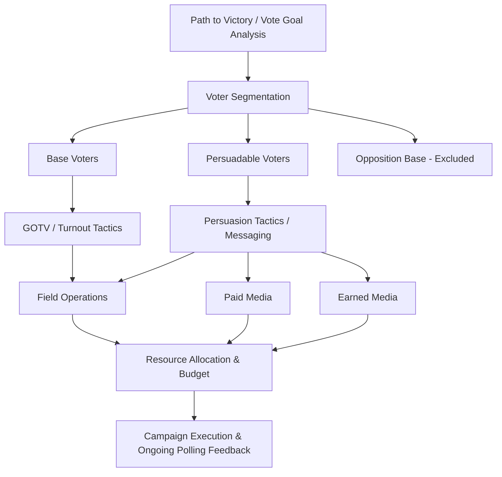

## Political Campaign Strategy and Management

### Definition and Scope

Political campaign strategy and management is the applied practice of planning, organizing, and executing efforts to win elective office or ballot measures. It draws on political science research in voting behavior, public opinion, and political communication, translating theoretical understanding of electoral dynamics into operational plans covering messaging, voter targeting, resource allocation, field organization, and campaign administration. This field bridges academic electoral studies and the practitioner discipline of campaign consulting.

### Core Strategic Framework

**The Campaign Plan**

Professional campaigns are typically organized around a written **campaign plan** establishing the strategic foundation for all subsequent tactical decisions. Core components include:

- **Path to victory**: a numerical analysis of the votes needed to win, broken down by geographic/demographic segments, establishing concrete vote targets rather than vague aspirational goals
- **Core message**: a central, consistently repeated rationale for the candidacy or measure, distinct from the full range of policy positions a candidate may hold
- **Target audience identification**: specification of persuadable and mobilizable voter segments the campaign will prioritize reaching, as distinct from base voters (already supportive, requiring turnout rather than persuasion) and unwinnable voters (opposition base, generally not worth resource investment)
- **Budget and resource allocation plan**: projected fundraising and spending across major campaign functions (staff, media, field, data/analytics)

**The Path to Victory / Vote Goal Analysis**

A foundational strategic exercise involves calculating the specific vote total needed to win (accounting for expected turnout) and disaggregating this target across geographic and demographic segments based on historical voting patterns, registration data, and modeled partisan/ideological lean — enabling the campaign to allocate resources (advertising, canvassing, mailers) toward the segments offering the most efficient path to the needed vote total, rather than spreading effort evenly or focusing on the most visible/newsworthy areas.

### Voter Targeting and Segmentation

**Base, Persuasion, and Turnout Framework**

Campaigns conventionally segment the electorate into three strategic categories requiring distinct tactical approaches:

1. **Base voters**: reliable supporters who need to be mobilized to actually vote (turnout-focused tactics: reminders, logistical assistance, enthusiasm-building)
2. **Persuadable/swing voters**: voters without strong existing partisan commitment, requiring message-based persuasion tactics (issue-focused advertising, direct contact emphasizing relevant concerns)
3. **Opposition base**: voters strongly aligned with the opponent, generally excluded from resource allocation since persuasion or mobilization efforts are expected to yield minimal return

**Microtargeting and Voter File Analytics**

Contemporary campaigns extensively use **voter file data** (publicly available voter registration and turnout history records, often augmented with commercial consumer data) combined with statistical modeling to generate individual-level **support and turnout scores** — probabilistic estimates of a given voter's likelihood of supporting the candidate and likelihood of voting, enabling highly targeted resource allocation at the individual voter level rather than only broad demographic or geographic targeting.

**Get Out The Vote (GOTV) Operations**

Concentrated late-campaign efforts to maximize turnout among identified likely supporters, typically intensifying in the final days/weeks before an election through direct voter contact (phone calls, door-knocking, text messaging) reminding and assisting supporters with voting logistics (polling locations, early voting/mail ballot procedures).

### Campaign Communication Strategy

**Message Development and Discipline**

Effective campaigns typically develop a small number of core, consistently repeated messages rather than attempting to communicate a candidate's full range of policy positions with equal emphasis, reflecting research on the limited attention voters typically devote to political information and the value of message repetition in building recognition and resonance.

**Paid Media**

- **Television and digital advertising**: historically dominant paid communication channels, though relative emphasis has shifted substantially toward digital/social media platforms in contemporary campaigns, enabling more precise audience targeting than broadcast television
- **Direct mail**: targeted physical mail pieces, often used for more granular geographic/demographic targeting than broadcast advertising allows

**Earned Media**

Coverage generated through press relations, debates, and newsworthy campaign events rather than paid advertising placement, requiring distinct communications skills (media relations, rapid response to news events, debate preparation) from paid advertising strategy.

**Field Organization**

Direct voter contact through canvassing (door-to-door), phone banking, and volunteer-based community organizing, generally considered to have a stronger per-contact persuasive/mobilizing effect than mass media according to substantial academic field experiment research (notably the tradition of randomized field experiments in political science pioneered by **Alan Gerber and Donald Green**), though field operations are typically more labor- and resource-intensive per voter contacted than broadcast media.

### The Role of Field Experiments in Campaign Science

A distinctive feature of contemporary campaign strategy is its increasing incorporation of **randomized controlled field experiments** — conducted both by academic researchers and increasingly by campaigns and consultants themselves — testing the causal effect of specific tactics (a particular mailer design, a canvassing script, a digital ad variant) on actual voter turnout or opinion change. This experimental tradition, substantially developed through Gerber and Green's academic research program beginning in the late 1990s, has generated an evidence base regarding the relative effectiveness of different voter contact methods that increasingly informs professional campaign tactical decisions, representing a notable convergence between academic political science methodology and applied campaign practice.

### Campaign Finance and Fundraising

**Fundraising Strategy**

Campaigns typically pursue multiple parallel fundraising channels: large-dollar donor cultivation (requiring direct candidate relationship-building and often significant staff time), small-dollar digital fundraising (leveraging email/text solicitation and online donation platforms, capable of generating substantial cumulative revenue from broad small-donation bases), and, in permitted contexts, coordination with party committees and allied outside spending groups (subject to jurisdiction-specific legal coordination restrictions).

**Legal and Regulatory Compliance**

Campaign finance operates within jurisdiction-specific legal frameworks governing contribution limits, disclosure requirements, and (in the US context) distinctions between candidate campaigns and independent expenditure groups (e.g., the post-*Citizens United v. FEC* (2010) landscape of Super PACs in US federal elections), requiring dedicated campaign finance compliance staff/counsel to avoid legal violations that can generate significant reputational and legal risk.

### Campaign Organizational Structure

A typical professional campaign organization includes distinct functional divisions:

- **Campaign manager**: overall strategic and operational leadership
- **Political/strategy director**: coalition-building, endorsements, strategic positioning
- **Communications director**: press relations, message development, spokesperson coordination
- **Field director**: volunteer recruitment, canvassing/phone bank operations
- **Finance director**: fundraising strategy and donor relations
- **Data/analytics director**: voter file management, targeting models, polling analysis

### Comparative Table: Voter Contact Methods

| Method | Relative Persuasion/Mobilization Effect | Typical Cost Per Contact | Targeting Precision |
| --- | --- | --- | --- |
| Door-to-door canvassing | Highest (per academic field experiments) | High (labor-intensive) | High (individual-level) |
| Phone calls | Moderate-high | Moderate | High (individual-level) |
| Direct mail | Moderate | Moderate | Moderate-high (household-level) |
| Digital/social advertising | Variable, context-dependent | Low-moderate | High (algorithmic targeting) |
| Broadcast television | Lower per-contact, high reach | Low per-impression, high aggregate cost | Low (broad demographic only) |

### Diagram: Campaign Strategy Development Process

### Illustration: Voter Segmentation Model (svg_diagram)

<svg xmlns="http://www.w3.org/2000/svg" viewBox="0 0 500 240">
<rect width="500" height="240" fill="#ffffff" />
<text x="250" y="24" text-anchor="middle" font-size="14" font-weight="bold" font-family="sans-serif">Voter Segmentation (svg_diagram)</text>
<rect x="40" y="60" width="130" height="130" fill="#3f7cac" rx="6" />
<text x="105" y="120" text-anchor="middle" font-size="11" fill="#ffffff" font-family="sans-serif">Base Voters</text>
<text x="105" y="140" text-anchor="middle" font-size="9" fill="#ffffff" font-family="sans-serif">GOTV focus</text>
<rect x="185" y="60" width="130" height="130" fill="#ac7c3f" rx="6" />
<text x="250" y="120" text-anchor="middle" font-size="11" fill="#ffffff" font-family="sans-serif">Persuadable</text>
<text x="250" y="140" text-anchor="middle" font-size="9" fill="#ffffff" font-family="sans-serif">Message focus</text>
<rect x="330" y="60" width="130" height="130" fill="#999999" rx="6" />
<text x="395" y="120" text-anchor="middle" font-size="11" fill="#ffffff" font-family="sans-serif">Opposition Base</text>
<text x="395" y="140" text-anchor="middle" font-size="9" fill="#ffffff" font-family="sans-serif">Generally excluded</text>
<text x="250" y="220" text-anchor="middle" font-size="10" fill="#444444" font-family="sans-serif">Resource allocation follows segmentation strategy</text>
</svg>

### Example: Applying These Concepts

A competitive state legislative campaign illustrates the integration of these concepts. After conducting a **path to victory analysis** establishing a specific vote target across the district's precincts, the campaign might identify a subset of precincts with high concentrations of persuadable voters (based on voter file modeling combining registration data, past turnout history, and modeled ideological lean) and allocate disproportionate canvassing and direct mail resources toward these precincts rather than spreading effort evenly across the entire district. Simultaneously, the campaign would run a parallel, lower-intensity GOTV program targeting identified base-voter precincts, focused on turnout logistics rather than persuasive messaging — reflecting the base/persuasion/turnout segmentation framework and its differentiated tactical implications discussed above, with field experiment research informing the relative resource allocation between canvassing, phone contact, and direct mail given the campaign's specific budget constraints.

### [Inference] Contemporary Trends and Debates

The relative effectiveness of digital/social media advertising compared to traditional field and broadcast tactics continues to be an active area of ongoing academic and practitioner research, with findings varying substantially by context, race competitiveness, and specific tactical execution rather than converging on settled general conclusions. Similarly, the increasing sophistication of microtargeting and voter file analytics raises unresolved questions — both empirical (how much additional predictive value do increasingly granular individual-level models provide relative to simpler demographic/geographic targeting) and normative (privacy and manipulation concerns regarding highly personalized political messaging) — that remain subjects of active debate rather than settled practice.

### Related Topics

- Gerber and Green's field experiment research program in campaign science
- Voter file data and microtargeting methodology
- Campaign finance regulation and Citizens United v. FEC
- Public opinion polling methodology in campaign contexts
- Political communication and framing effects
- GOTV (Get Out The Vote) operational design
- Digital advertising and social media strategy in elections