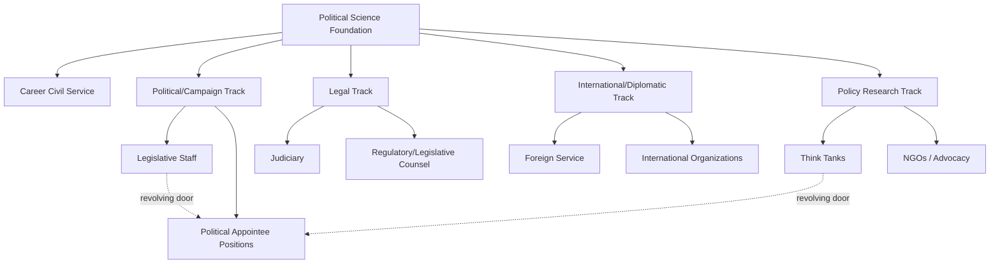

## Careers in Government and Public Service

### Definition and Scope

This topic surveys the range of professional career pathways available to political science graduates and practitioners within government and the broader public service ecosystem — encompassing civil service bureaucracy, elected/political staff roles, the judiciary, international organizations, and adjacent public-interest sectors (think tanks, NGOs, public affairs). It addresses entry pathways, credentialing requirements, career progression structures, and the distinct institutional logics governing career versus political appointments, providing practical orientation for applying political science training to professional public service pathways.

### Civil Service (Career Bureaucracy) Pathways

**The Merit-Based Civil Service System**

Most modern democracies operate a **career civil service** — a professional, generally non-partisan bureaucracy recruited through competitive, merit-based processes and protected from arbitrary political dismissal, following historical reforms such as the UK's 1854 Northcote-Trevelyan reforms and the US 1883 Pendleton Act (both referenced in the anti-corruption reform context as replacing patronage-based public employment).

**Entry Pathways**

- **Competitive examinations**: many civil service systems, particularly in continental Europe and much of Asia, use formal competitive examinations as the primary entry gateway (e.g., France's *concours* system, China's civil service examination, Japan's National Public Service Examination)
- **Direct application/merit hiring**: many Anglo-American systems (US, UK, Canada, Australia) rely more heavily on direct application processes with credential and interview-based assessment rather than centralized standardized examinations, though specific agencies may use structured assessment processes
- **Fast-track/graduate entry schemes**: many governments maintain specialized accelerated entry programs for high-performing graduates (e.g., the UK's Civil Service Fast Stream, the US Presidential Management Fellows program), providing structured rotational early-career development explicitly designed to cultivate future senior civil service leadership

**Career Progression**

Career civil servants typically progress through a structured hierarchy of grades/ranks, with promotion generally based on a combination of tenure, performance evaluation, and competitive selection for more senior positions, distinct from the more externally-recruited, tenure-independent progression common in political appointee positions discussed below.

### Political Appointee and Staff Pathways

**Distinguishing Career vs. Political Positions**

A fundamental structural distinction in most democratic governments separates:

- **Career civil servants**: professional, merit-recruited officials who typically remain in government service across changes in political leadership, providing institutional continuity and technical/administrative expertise
- **Political appointees**: individuals selected by incoming elected officials or their senior appointees to fill leadership and policy-coordination positions, typically serving at the pleasure of the appointing official and departing when political leadership changes (e.g., the several thousand politically appointed positions that turn over with each new US presidential administration)

**Legislative Staff Careers**

Legislative bodies (national parliaments/congresses, sub-national legislatures) employ substantial professional staff supporting individual legislators (personal office staff) and legislative committees (committee staff, often providing specialized substantive policy expertise), along with non-partisan institutional support agencies (e.g., the US Congressional Research Service, Congressional Budget Office, Government Accountability Office) that provide analysis without political appointee-style turnover.

**Campaign-to-Government Pipeline**

A common career pathway, particularly in political staff roles, involves alternating between campaign work (discussed in political campaign strategy) and government/legislative staff positions, since campaign experience is often directly relevant credentialing for political appointee and legislative staff hiring, reflecting overlapping skill sets in political communication, strategy, and policy analysis.

### Judicial and Legal Public Service Pathways

Judicial careers (judgeships, prosecutorial positions, public defender roles) typically require specific legal credentialing (law degree, bar admission) beyond general political science training, though political science background is common among law school entrants and can inform judicial and legal policy career specialization (constitutional law, administrative law, international law).

### International and Multilateral Organization Careers

**International Organizations**

Positions within multilateral bodies (United Nations agencies, World Bank, International Monetary Fund, regional organizations like the European Union or African Union) typically require specialized recruitment processes, often with distinct entry-level programs (e.g., the UN's Young Professionals Programme), and frequently favor candidates with advanced degrees (master's or doctoral level), relevant language skills, and often prior field or policy experience.

**Diplomatic Service**

National foreign services (e.g., the US Foreign Service, UK Diplomatic Service) typically recruit through competitive, often multi-stage examination and assessment processes (e.g., the US Foreign Service Officer Test and subsequent Oral Assessment), with career progression through a structured rank system combining rotational overseas and domestic assignments.

### Adjacent Public-Interest Sector Pathways

**Think Tanks and Policy Research Organizations**

Research and policy analyst positions at think tanks (ranging from broadly non-partisan institutions to explicitly ideologically-aligned advocacy-oriented organizations) provide policy-relevant career pathways often overlapping substantially with academic political science training, frequently serving as a pipeline into and out of government political appointee positions (the "revolving door" between think tanks and government policy positions).

**Non-Governmental Organizations (NGOs) and Advocacy**

Domestic and international NGOs (human rights organizations, election monitoring bodies, development organizations, advocacy groups) offer public-service-adjacent career pathways often directly engaging political science subject matter (governance, elections, human rights, development), though generally outside formal government employment structures.

**Public Affairs, Lobbying, and Government Relations**

Private-sector government relations and public affairs positions (representing corporate, trade association, or advocacy organization interests to government) constitute another common career pathway drawing on political science training in institutional analysis and legislative/regulatory processes, situated at the intersection of the public and private sectors.

### Credentialing and Educational Pathways

**Undergraduate Political Science as Foundation**

An undergraduate political science degree provides foundational preparation for the above pathways but is frequently supplemented by additional professional credentialing depending on the specific career direction pursued.

**Master of Public Administration (MPA) and Master of Public Policy (MPP)**

These professional graduate degrees provide specialized preparation for civil service, non-profit management, and policy analysis careers, typically combining coursework in quantitative policy analysis, public management, budgeting, and applied fieldwork/capstone projects, distinct from the more theoretically-oriented coursework of a standard political science MA/PhD track.

**Law Degrees (JD or equivalent)**

As noted, legal credentialing is required for judicial and many legislative/regulatory counsel positions, and is common (though not required) preparation for many senior political appointee and legislative staff positions given the substantial legal/regulatory content of policy work.

**Doctoral Study**

While primarily oriented toward academic careers, political science PhD training can also support specialized government analytical positions (e.g., research positions at agencies like the Congressional Research Service, or senior policy analyst roles requiring advanced methodological expertise), though this represents a less common pathway than professional MPA/MPP or JD credentialing for most government career tracks.

### Comparative Table: Public Service Career Pathways

| Pathway | Typical Entry Credential | Career Stability | Primary Skill Emphasis |
| --- | --- | --- | --- |
| Career Civil Service | Competitive exam or merit hiring, often BA/MPA | High (tenure-protected) | Technical/administrative expertise |
| Political Appointee | Political/campaign experience, policy expertise | Low (turns over with administration) | Policy coordination, political judgment |
| Legislative Staff | BA/MPA/JD, often campaign experience | Moderate (tied to individual legislator/majority) | Policy analysis, constituent/political relations |
| Diplomatic Service | Competitive foreign service exam | High (career rank progression) | Negotiation, area/language expertise |
| International Organizations | Advanced degree, often multilingual | Moderate-high | Multilateral policy, technical specialization |
| Think Tank/NGO | BA/MA/MPP, subject expertise | Variable (project/funding dependent) | Research, advocacy, public communication |

### Diagram: Public Service Career Pathway Map

### Illustration: Career vs. Political Appointment Stability (svg_diagram)

<svg xmlns="http://www.w3.org/2000/svg" viewBox="0 0 500 240">
<rect width="500" height="240" fill="#ffffff" />
<text x="250" y="24" text-anchor="middle" font-size="14" font-weight="bold" font-family="sans-serif">Career vs. Political Appointment Continuity (svg_diagram)</text>
<line x1="60" y1="180" x2="440" y2="180" stroke="#333333" stroke-width="2" />
<rect x="80" y="60" width="150" height="120" fill="#3f7cac" opacity="0.85" rx="4" />
<text x="155" y="125" text-anchor="middle" font-size="11" fill="#ffffff" font-family="sans-serif">Career Civil Service</text>
<text x="155" y="145" text-anchor="middle" font-size="9" fill="#ffffff" font-family="sans-serif">Persists across administrations</text>
<rect x="270" y="130" width="150" height="50" fill="#ac7c3f" opacity="0.85" rx="4" />
<text x="345" y="160" text-anchor="middle" font-size="11" fill="#ffffff" font-family="sans-serif">Political Appointees</text>
<text x="250" y="215" text-anchor="middle" font-size="10" fill="#444444" font-family="sans-serif">Political appointee tenure typically tracks the appointing administration</text>
</svg>

### Example: Applying These Concepts

Consider a political science graduate interested in foreign policy work. One realistic pathway involves pursuing a Master of Public Policy or Master of International Affairs degree, then applying to the **US Foreign Service Officer Test**, entering the career Foreign Service upon successful completion of the exam and subsequent Oral Assessment, and progressing through structured overseas and domestic rotational assignments over a multi-decade career — representing the **career civil service pathway** applied specifically to foreign affairs. An alternative pathway for the same underlying interest might involve working on political campaigns focused on foreign policy issues, then transitioning to legislative staff work on a congressional foreign affairs committee, and subsequently securing a **political appointee** position at the State Department during a favorable administration — illustrating the **campaign-to-political appointee pipeline**, which offers different risk/stability trade-offs (higher potential for rapid policy influence and seniority, but with career continuity contingent on electoral and administration turnover) compared to the career Foreign Service track.

### [Inference] Contemporary Considerations

Whether increasing political polarization in some democracies is measurably affecting career civil servants' job satisfaction, retention, or perceived institutional legitimacy — a concern raised in some contemporary public administration scholarship — remains an area of ongoing empirical investigation rather than a matter with definitive, generalizable findings across different national contexts. Similarly, the extent to which "revolving door" movement between government, think tanks, and private-sector public affairs roles raises genuine conflict-of-interest or regulatory capture concerns, versus reflecting beneficial cross-sector knowledge transfer, continues to generate normative debate within public administration and political ethics scholarship rather than being a settled empirical or policy question.

### Related Topics

- Civil service reform and merit-based recruitment systems
- MPA/MPP curriculum design and professional policy education
- US Foreign Service Officer Test and diplomatic career pathways
- Revolving door dynamics between government and private/think tank sectors
- Political appointee vs. career civil servant institutional dynamics
- Legislative staff roles and non-partisan analytic agencies (CBO, CRS, GAO)
- International organization recruitment (UN Young Professionals Programme)