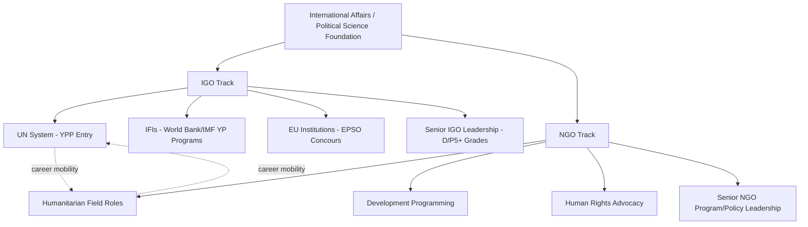

## Careers in International Organizations and NGOs

### Definition and Scope

This topic examines professional career pathways within intergovernmental organizations (IGOs), international financial institutions, and non-governmental organizations (NGOs) operating across humanitarian, development, human rights, and advocacy domains. These career paths draw on political science and international relations training but typically require distinct credentialing, recruitment processes, and career progression logics compared to domestic government service, reflecting the multilateral, often internationally competitive, and frequently field-based nature of this professional ecosystem.

### Institutional Landscape

**Intergovernmental Organizations (IGOs)**

Formal multilateral bodies established by treaty among member states, including:

- **United Nations system**: the UN Secretariat and specialized/affiliated agencies (UNICEF, UNHCR, WHO, UNDP, WFP, UNESCO, and others), each with distinct mandates, recruitment processes, and organizational cultures despite shared UN system affiliation
- **International Financial Institutions (IFIs)**: the World Bank Group, International Monetary Fund, and regional development banks (Asian Development Bank, African Development Bank, Inter-American Development Bank), generally requiring stronger quantitative/economics credentialing than other IGO tracks
- **Regional Organizations**: the European Union institutions (European Commission, European Parliament, European External Action Service), African Union, Organization of American States, ASEAN, and similar regional bodies
- **Other multilateral bodies**: the International Committee of the Red Cross (ICRC, technically an NGO with distinct treaty-recognized status), NATO, OECD, and specialized bodies (International Criminal Court, International Court of Justice)

**Non-Governmental Organizations (NGOs)**

A diverse category spanning:

- **Humanitarian relief organizations**: providing emergency assistance in conflict/disaster contexts (e.g., Médecins Sans Frontières, International Rescue Committee, Norwegian Refugee Council)
- **Development organizations**: supporting longer-term economic and social development programming (e.g., Oxfam, CARE, Save the Children)
- **Human rights organizations**: monitoring, documentation, and advocacy work (e.g., Human Rights Watch, Amnesty International)
- **Election monitoring and governance organizations**: supporting democratic governance and election observation (e.g., Carter Center, International Foundation for Electoral Systems, National Democratic Institute)
- **Think tanks and research organizations** with international programming (overlapping with the domestic think tank pathway discussed in government/public service careers, but with distinct international affairs specialization)

### Entry Pathways: Intergovernmental Organizations

**Young Professionals and Graduate Entry Programs**

Most major IGOs maintain structured entry-level competitive recruitment programs specifically targeting early-career candidates:

- **UN Young Professionals Programme (YPP)**: a competitive, examination-based entry pathway for candidates typically under 32, targeting underrepresented member states through national competitive recruitment examinations
- **World Bank Young Professionals Program**: a highly competitive program (typically requiring an advanced degree and prior relevant experience) providing rotational early-career development toward longer-term World Bank career tracks
- **EU Concours (EPSO)**: the European Personnel Selection Office's competitive examination process for EU institution positions, involving multi-stage computer-based testing, assessment centers, and (for higher grades) interviews

**Credentialing Requirements**

IGO positions typically require, at minimum, a master's degree (in international relations, economics, public policy, law, or a relevant technical field depending on the specific role), with many mid-career and senior positions favoring or requiring doctoral-level credentials, particularly in economics-focused institutions like the IMF and World Bank. Multilingual proficiency (particularly in UN/EU official languages) is frequently a formal or de facto requirement, and prior field experience (often through NGO work, national government service, or internships/consultancies within the target organization) substantially strengthens candidacy for competitive positions.

**Internship and Consultancy Pathways**

Given intense competition for permanent IGO positions, internships (often unpaid or minimally stipended, raising documented equity/accessibility concerns discussed further below) and short-term consultancy contracts frequently serve as informal but consequential entry pathways, providing institutional experience and professional networks that substantially improve subsequent competitive applications for permanent positions.

### Entry Pathways: NGOs

**Field-Based Entry**

Unlike many IGO tracks emphasizing formal competitive examinations, NGO entry — particularly for humanitarian and development organizations — often emphasizes direct field experience, frequently beginning with:

- Overseas volunteer programs (e.g., the US Peace Corps, UK Voluntary Service Overseas, various national equivalents) as a common early-career credentialing pathway
- Entry-level field positions in program implementation, monitoring and evaluation, or logistics/operations support
- Domestic advocacy, communications, or research positions at NGO headquarters offices, providing an alternative entry pathway less dependent on international field deployment

**Specialized Technical Entry**

Certain NGO roles require specific technical/professional credentialing beyond general political science or international affairs training — medical/public health credentials for health-focused humanitarian roles, legal credentials for human rights documentation and advocacy work, or specialized skills (logistics, security management, monitoring and evaluation methodology) for operational roles.

### Career Progression Structures

**IGO Career Tracks**

IGO careers typically progress through formal grade structures (e.g., the UN's Professional category grades P-1 through P-5, followed by Director-level D-1/D-2 and senior leadership positions), with promotion generally requiring a combination of tenure, performance evaluation, and competitive selection for higher-graded vacant positions — broadly analogous to career civil service progression discussed in domestic government careers, but operating within a distinctly multilateral institutional and often rotational (multi-country assignment) career structure.

**NGO Career Progression**

NGO career progression is generally less formally structured than IGO grade systems, often involving movement between field and headquarters positions, between different organizations (reflecting the sector's comparatively higher inter-organizational mobility), and frequently alternating between direct programmatic/field roles and more senior program management, policy, or advocacy positions as careers progress.

**The IGO-NGO-Government Revolving Door**

Career mobility between IGOs, NGOs, academic policy research, and national government international affairs positions is common and often professionally advantageous, with experience in one sector frequently serving as valuable credentialing for subsequent positions in another — reflecting a less rigid sectoral boundary than exists in many purely domestic public service career tracks.

### Distinctive Professional Considerations

**Field Security and Duty of Care**

Humanitarian and development field positions, particularly in conflict-affected or fragile state contexts, carry documented security risks, requiring organizations to maintain dedicated security management functions and requiring individual practitioners to develop risk assessment and personal security awareness beyond typical domestic public service career considerations.

**Compensation and Benefits Structures**

IGO compensation is often governed by standardized international civil service compensation frameworks (e.g., the UN's "Noblemaire principle" benchmarking international civil service pay against the highest-paying national civil service), sometimes supplemented by hardship allowances for difficult duty stations, while NGO compensation — particularly at smaller or less-resourced organizations — is frequently lower than comparable IGO or private-sector positions, reflecting persistent sector-wide funding constraints.

**Accessibility and Equity Concerns**

The frequent reliance on unpaid or low-paid internships as an informal prerequisite for competitive IGO and NGO positions has generated documented equity concerns, since this pathway structurally advantages candidates with independent financial means to sustain unpaid work periods, potentially skewing sector demographics away from candidates from lower-income backgrounds or countries — a concern increasingly acknowledged within the sector's own internal reform discussions regarding recruitment equity.

### Comparative Table: IGO vs. NGO Career Pathways

| Dimension | Intergovernmental Organizations | Non-Governmental Organizations |
| --- | --- | --- |
| Entry pathway | Competitive examination/structured YP programs | Field experience, volunteer programs, specialized skills |
| Typical credential | Master's/PhD, often economics or law-heavy | Bachelor's/Master's, varies by role |
| Career structure | Formal grade progression (e.g., UN P/D grades) | Less formalized, higher inter-organizational mobility |
| Compensation | Standardized international civil service scales | Variable, often lower, sector-dependent |
| Geographic mobility | Frequently rotational across duty stations | Often field-headquarters rotation |

### Diagram: International Career Pathway Map

### Illustration: IGO Grade Progression Structure (svg_diagram)

<svg xmlns="http://www.w3.org/2000/svg" viewBox="0 0 480 250">
<rect width="480" height="250" fill="#ffffff" />
<text x="240" y="24" text-anchor="middle" font-size="14" font-weight="bold" font-family="sans-serif">UN-Style Grade Progression (svg_diagram)</text>
<rect x="60" y="190" width="360" height="30" fill="#a9cce8" />
<text x="240" y="210" text-anchor="middle" font-size="11" font-family="sans-serif">P-1 / P-2 (Entry Level, YPP)</text>
<rect x="80" y="155" width="320" height="30" fill="#7cb0d8" />
<text x="240" y="175" text-anchor="middle" font-size="11" font-family="sans-serif">P-3 / P-4 (Mid-Career)</text>
<rect x="100" y="120" width="280" height="30" fill="#4a8ac4" />
<text x="240" y="140" text-anchor="middle" font-size="11" fill="#ffffff" font-family="sans-serif">P-5 (Senior Professional)</text>
<rect x="130" y="85" width="220" height="30" fill="#2c5f8a" />
<text x="240" y="105" text-anchor="middle" font-size="11" fill="#ffffff" font-family="sans-serif">D-1 / D-2 (Director)</text>
<rect x="160" y="50" width="160" height="30" fill="#1e3f5a" />
<text x="240" y="70" text-anchor="middle" font-size="11" fill="#ffffff" font-family="sans-serif">Senior Leadership</text>
</svg>

### Example: Applying These Concepts

Consider a political science graduate with a master's degree in international development pursuing a humanitarian career. A realistic pathway might begin with an entry-level field position at an established NGO (e.g., a monitoring and evaluation role with the International Rescue Committee in a specific country program), providing direct field experience and organizational credentialing. After several years of field-based program experience across one or more postings, the candidate might apply to the **UN Young Professionals Programme** in the relevant occupational stream (e.g., humanitarian affairs or social affairs), leveraging demonstrated field experience alongside academic credentials to strengthen a competitive application — illustrating the common **NGO-to-IGO career mobility pattern** in which field-based NGO experience serves as valuable practical credentialing for subsequent competitive entry into formal IGO career tracks, rather than the two sectors representing entirely separate, non-overlapping professional pipelines.

### [Inference] Contemporary Considerations

Whether increasing "localization" efforts within the international humanitarian and development sector — shifting programmatic leadership and funding toward national/local organizations in program countries rather than international NGO/IGO staff — will substantially reshape traditional international career pathways over the coming years, or will proceed more slowly and unevenly than current sector rhetoric suggests, remains an actively debated and empirically unresolved question within the sector rather than a settled trend. Similarly, ongoing sector-wide discussions regarding unpaid internship reform and recruitment equity have not yet produced clearly established new industry-standard practices, meaning current accessibility concerns regarding entry pathways remain a live practical consideration for prospective candidates rather than a fully resolved structural issue.

### Related Topics

- UN Young Professionals Programme and World Bank YP Program application processes
- EU Concours (EPSO) examination structure
- Humanitarian field security and duty-of-care practices
- NGO-IGO-government career mobility patterns
- Localization debates in international humanitarian and development sectors
- Peace Corps and national volunteer service programs as entry credentialing
- International civil service compensation frameworks (Noblemaire principle)