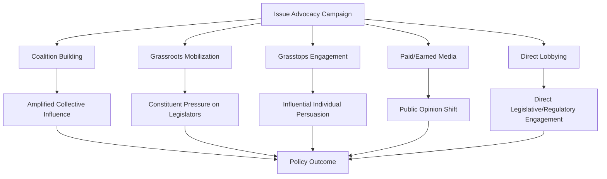

## Political Consulting and Advocacy

### Definition and Scope

Political consulting and advocacy encompasses the professional services industry that provides strategic, communications, and organizational expertise to candidates, causes, and organizations seeking to influence electoral outcomes or public policy. This field overlaps substantially with campaign strategy (covered separately) but extends beyond individual campaigns to encompass **issue advocacy**, **lobbying**, **public affairs**, and the broader consulting infrastructure supporting political and policy influence work on an ongoing, often non-electoral basis.

### The Political Consulting Industry Structure

**Types of Political Consultants**

The professional consulting ecosystem comprises specialized practice areas, often provided by distinct firms or individual practitioners:

- **General/strategic consultants**: overall campaign or advocacy strategy, message development, and senior client advising
- **Media consultants**: paid advertising creative development and media buying strategy
- **Pollsters**: public opinion research design, survey methodology, and data interpretation
- **Digital consultants**: online advertising, social media strategy, and digital fundraising
- **Direct mail consultants**: targeted mail communication design and list targeting
- **Field/GOTV consultants**: canvassing and voter contact operation design
- **Fundraising consultants**: donor cultivation strategy and fundraising event/solicitation planning

**Firm Structures**

Political consulting firms range from full-service agencies providing integrated strategic, creative, and data services under one roof, to boutique specialist firms focused on a single practice area (e.g., digital advertising only), with campaigns and advocacy organizations often assembling a coalition of specialized vendors rather than relying on a single full-service provider.

### Issue Advocacy vs. Electoral Campaigning

**Distinguishing Advocacy from Campaigning**

While overlapping substantially in technique (message development, paid media, coalition-building, grassroots mobilization), issue advocacy differs from electoral campaigning in its typically **non-electoral, ongoing** character:

- **Electoral campaigns** operate within a defined, time-limited cycle culminating in a specific election date, with success measured by vote outcomes
- **Issue advocacy** operates on an ongoing basis (potentially indefinitely), targeting policy outcomes (legislation, regulation, public opinion shifts) rather than electoral victories, with success measured by policy change, public opinion movement, or legislative/regulatory outcomes

**Advocacy Campaign Components**

Effective issue advocacy campaigns typically integrate several coordinated components:

- **Coalition-building**: assembling aligned organizations and stakeholders to amplify collective influence and demonstrate broad-based support
- **Grassroots/grasstops mobilization**: grassroots refers to mobilizing broad public constituent pressure (petition drives, constituent contact campaigns to legislators); grasstops refers to mobilizing influential, well-connected individuals (community leaders, prominent local figures) whose engagement carries disproportionate persuasive weight with targeted decision-makers
- **Paid media and public communication**: advertising and earned media strategies to shift public opinion or generate pressure on targeted policymakers
- **Direct lobbying**: formal engagement with legislators and regulatory officials (discussed further below)

### Lobbying: Definition and Regulatory Framework

**Defining Lobbying**

Lobbying refers to direct advocacy efforts to influence legislative or regulatory decisions, typically through direct communication with elected officials, legislative staff, or regulatory agency personnel. Lobbying is legally distinct from broader issue advocacy or grassroots mobilization in most jurisdictions' regulatory frameworks, which generally define and regulate lobbying more narrowly around direct communication with covered officials.

**Regulatory Frameworks (US Context)**

In the United States, federal lobbying is governed primarily by the **Lobbying Disclosure Act (1995)**, requiring registration and periodic disclosure of lobbying activity, clients, and (within specified ranges) compensation for individuals meeting defined lobbying activity thresholds. Many jurisdictions maintain additional **revolving door restrictions** — "cooling off" periods restricting former government officials from immediately lobbying their former agency or former colleagues after leaving government service, intended to limit the appearance or reality of improper influence trading.

**Comparative Regulatory Approaches**

Lobbying regulation varies substantially across democracies — some jurisdictions (e.g., the US, Canada, and increasingly the EU through its Transparency Register) maintain formal registration and disclosure regimes, while others have historically maintained more informal or less comprehensive regulatory frameworks, reflecting varying normative and legal traditions regarding the appropriate balance between facilitating legitimate interest representation and preventing improper influence.

### Public Affairs and Corporate Government Relations

**In-House vs. Contract Lobbying**

Organizations seeking to influence government policy typically employ some combination of:

- **In-house government relations staff**: employees dedicated to government relations for a single organization (corporation, trade association, advocacy group)
- **Contract/outside lobbying firms**: specialized lobbying firms retained by multiple clients, providing access to established relationships and issue expertise that individual organizations may lack internally

**Trade Associations and Coalition Advocacy**

Many advocacy efforts, particularly in commercial/industry contexts, operate through **trade associations** representing collective industry interests, allowing individual firms to pool resources for shared advocacy priorities while pursuing firm-specific interests through separate, sometimes simultaneous, individual lobbying efforts.

### Political Action Committees and Independent Expenditure Groups

**PACs and Campaign Finance Vehicles**

In the US context, **Political Action Committees (PACs)** allow organizations to pool contributions for distribution to preferred candidates, subject to specific contribution limits distinct from direct corporate/union campaign contributions (which are prohibited in most contexts for federal elections).

**Super PACs and Independent Expenditure Groups**

Following the US Supreme Court's *Citizens United v. FEC* (2010) and related *SpeechNow.org v. FEC* decisions, **independent expenditure-only committees ("Super PACs")** may raise and spend unlimited funds on political advocacy, provided they do not coordinate directly with candidate campaigns — a legal distinction ("independent expenditure") that has generated substantial ongoing debate regarding the practical enforceability and effectiveness of coordination restrictions given the sophisticated strategic alignment often observed between campaigns and nominally independent supportive groups.

**501(c)(4) Social Welfare Organizations**

US tax-exempt social welfare organizations (named for their governing tax code section) can engage in substantial issue advocacy and, within limits, election-related spending, while — unlike PACs — not being required to publicly disclose their donors, a feature that has generated significant policy debate regarding political spending transparency (sometimes termed "dark money" in political commentary).

### Ethical and Regulatory Debates

**Concerns Regarding Influence and Access**

Persistent debates in political consulting and advocacy scholarship and policy discussion address:

- Whether well-resourced interests (corporations, wealthy individuals) achieve disproportionate policy influence relative to less-resourced constituencies through superior access to lobbying and advocacy infrastructure
- Whether disclosure and transparency requirements meaningfully constrain improper influence, or whether sophisticated actors can structure their advocacy activity to minimize formal disclosure obligations while still achieving substantial influence
- The appropriate scope of revolving door restrictions balancing legitimate professional mobility against conflict-of-interest concerns

**The "Grassroots vs. Astroturf" Distinction**

A persistent definitional and normative concern in advocacy practice distinguishes genuine grassroots mobilization (organic public engagement reflecting authentic constituent concern) from **"astroturfing"** — advocacy campaigns designed to simulate grassroots public support while actually being centrally organized and funded by a narrow set of interests, raising questions about the authenticity and transparency of purportedly citizen-driven advocacy efforts.

### Comparative Table: Advocacy and Consulting Instruments

| Instrument | Primary Function | Key Regulatory Framework (US) | Disclosure Requirement |
| --- | --- | --- | --- |
| Direct lobbying | Direct communication with officials | Lobbying Disclosure Act (1995) | Registration + activity disclosure |
| PAC contributions | Candidate campaign support | Federal Election Campaign Act | Donor disclosure required |
| Super PAC spending | Independent electoral expenditure | Citizens United v. FEC (2010) | Donor disclosure required |
| 501(c)(4) advocacy | Issue advocacy, limited election spending | IRS tax code | No donor disclosure required |
| Grassroots mobilization | Constituent pressure generation | Generally unregulated as "lobbying" | Minimal/variable |

### Diagram: Advocacy Campaign Component Integration

### Illustration: Political Spending Vehicle Transparency Spectrum (svg_diagram)

<svg xmlns="http://www.w3.org/2000/svg" viewBox="0 0 500 240">
<rect width="500" height="240" fill="#ffffff" />
<text x="250" y="24" text-anchor="middle" font-size="14" font-weight="bold" font-family="sans-serif">Political Spending Transparency Spectrum (svg_diagram)</text>
<line x1="60" y1="160" x2="440" y2="160" stroke="#333333" stroke-width="3" />
<circle cx="100" cy="160" r="9" fill="#3f7cac" />
<text x="100" y="130" text-anchor="middle" font-size="10" font-family="sans-serif">Candidate Campaign</text>
<circle cx="220" cy="160" r="9" fill="#6a9ac4" />
<text x="220" y="130" text-anchor="middle" font-size="10" font-family="sans-serif">PAC</text>
<circle cx="330" cy="160" r="9" fill="#ac7c3f" />
<text x="330" y="130" text-anchor="middle" font-size="10" font-family="sans-serif">Super PAC</text>
<circle cx="420" cy="160" r="9" fill="#8a3f3f" />
<text x="420" y="130" text-anchor="middle" font-size="10" font-family="sans-serif">501(c)(4)</text>
<text x="60" y="195" font-size="10" fill="#444444" font-family="sans-serif">Higher donor disclosure</text>
<text x="330" y="195" font-size="10" fill="#444444" font-family="sans-serif">Lower/no donor disclosure</text>
</svg>

### Example: Applying These Concepts

Consider a national trade association seeking to influence pending environmental regulation. A comprehensive advocacy strategy might integrate several instruments simultaneously: **in-house government relations staff** maintaining ongoing relationships with relevant congressional committee members and regulatory agency officials, supplemented by **retained outside lobbying firms** with specific expertise navigating the particular regulatory agency's rulemaking process; a **coalition** built with allied industry associations and, where possible, sympathetic labor or community organizations to broaden the campaign's apparent base of support; **grasstops engagement** mobilizing prominent local business leaders in key congressional districts to contact their representatives directly; and a **501(c)(4) affiliate organization** running paid public advertising shaping broader public opinion on the issue without disclosing the specific corporate donors funding that advertising — illustrating how contemporary advocacy campaigns typically integrate direct lobbying, coalition-based grassroots/grasstops mobilization, and campaign finance-adjacent spending vehicles as a coordinated strategic package rather than relying on any single advocacy instrument in isolation.

### [Inference] Ongoing Debates

Whether current disclosure regimes (lobbying registration, PAC donor disclosure) provide meaningful transparency given the substantial and growing role of non-disclosing vehicles like 501(c)(4) organizations in contemporary political spending, or whether this represents a significant and likely persistent gap in the overall political finance transparency framework, remains a genuinely contested question in campaign finance policy debate rather than a settled empirical or legal matter. Similarly, the practical distinguishability of "independent" Super PAC activity from de facto coordination with candidate campaigns continues to generate both legal dispute and scholarly disagreement regarding the effectiveness of existing coordination restrictions, rather than representing a resolved regulatory question.

### Related Topics

- Citizens United v. FEC and independent expenditure jurisprudence
- Lobbying Disclosure Act and federal lobbying registration requirements
- 501(c)(4) organizations and "dark money" campaign finance debates
- Revolving door restrictions and post-government employment regulation
- Coalition-building strategy in issue advocacy campaigns
- Astroturfing and authenticity concerns in grassroots mobilization
- Comparative lobbying regulation (US, EU Transparency Register)