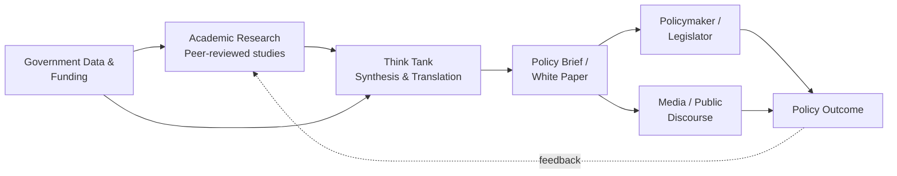

## Political Science in Think Tanks and Academia

### Overview

Political science knowledge is professionalized and institutionalized through two overlapping but distinct career and knowledge-production ecosystems: **academia** (universities, research institutes attached to higher education) and **think tanks** (independent or quasi-independent policy research organizations). Both convert theoretical and empirical political science into different outputs—academia primarily produces peer-reviewed knowledge for disciplinary advancement, while think tanks primarily produce policy-relevant analysis for public debate and decision-makers. Understanding both tracks is essential for political science students considering career paths, for evaluating the credibility and biases of political analysis, and for understanding how political knowledge shapes real-world governance.

### The Academic Track

#### Structure of the Discipline

Academic political science operates through a hierarchical, credentialing-based system:

- **Undergraduate (BA)**: Foundational coursework in political theory, comparative politics, international relations (IR), American/domestic politics, and methodology (quantitative and qualitative).
- **Graduate (MA)**: Often a terminal professional degree or a stepping stone to the PhD; emphasizes applied methods and specialization.
- **Doctoral (PhD)**: The primary credential for a research/teaching career. Structured around coursework, comprehensive/qualifying exams, a dissertation (original research contribution), and often a defense.
- **Postdoctoral positions**: Temporary research appointments bridging the PhD and a tenure-track job, increasingly common given labor market pressures.
- **Faculty ranks**: Assistant Professor (tenure-track, untenured) → Associate Professor (usually post-tenure) → Full Professor. Parallel tracks include Lecturer, Instructor, and adjunct/contingent faculty (non-tenure-track, often teaching-focused and less job-secure).

#### The Tenure System

**Tenure** is a permanent employment status granted after a probationary period (typically 5–7 years as Assistant Professor), evaluated through a **tenure review** based on research output, teaching, and service. It is designed to protect academic freedom by insulating scholars from dismissal for controversial or unpopular findings.

**Key Points**

- Tenure decisions weigh research (often most heavily at research universities), teaching effectiveness, and service (committee work, peer review, professional engagement).
- The "**publish or perish**" dynamic describes the pressure to produce a steady stream of peer-reviewed output to meet tenure and promotion benchmarks.
- [Inference] The relative weight given to teaching versus research varies substantially by institution type (research university vs. liberal arts college vs. teaching-focused state school), and these institutional differences shape scholarly incentives and output style.

#### Subfields and Specialization

Political science departments typically organize faculty and curricula around four to five major subfields:

1. **American/Domestic Politics** – institutions, elections, public opinion, Congress, the presidency, courts.
2. **Comparative Politics** – cross-national analysis of political systems, regimes, institutions, and behavior.
3. **International Relations (IR)** – interstate relations, conflict, cooperation, international political economy, security studies.
4. **Political Theory/Philosophy** – normative and historical analysis of political concepts (justice, power, legitimacy, rights).
5. **Methodology** (sometimes a distinct subfield) – quantitative (statistics, formal/game theory, causal inference), qualitative (case studies, process tracing, ethnography), and increasingly computational (text-as-data, machine learning applications).

#### Research and Publication Ecosystem

- **Peer review**: The gatekeeping process by which submitted manuscripts are evaluated anonymously by disciplinary experts before publication. Serves as the discipline's primary quality-control mechanism.
- **Journal hierarchy**: A reputational ranking exists, with "top-3" generalist journals (commonly cited as the *American Political Science Review*, *American Journal of Political Science*, and *Journal of Politics*) carrying outsized weight in hiring and tenure decisions, alongside prestigious subfield journals (e.g., *International Organization* for IR, *World Politics* for comparative).
- **University presses**: Book publication (monographs) remains central to tenure cases in many subfields, particularly comparative politics and political theory, though this varies by field and is shifting toward article-based evaluation in some departments.
- **Conferences**: Major professional meetings—principally the **American Political Science Association (APSA)** annual meeting, plus regional associations (MPSA, ISA for IR)—serve as venues for presenting working papers, networking, and job market interviews.

#### Academic Job Market

[Inference] The academic job market in political science, like much of the humanities and social sciences, has been characterized in recent decades by a structural oversupply of PhDs relative to available tenure-track positions, leading to increased reliance on contingent (adjunct/visiting) faculty labor. This dynamic is widely discussed within the discipline, though exact figures fluctuate by year and subfield.

The typical placement pipeline: PhD → (often) postdoc or visiting position → tenure-track Assistant Professor search (conducted mostly in fall/winter for the following academic year) → tenure review.

### The Think Tank Track

#### Definition and Function

A **think tank** is a research organization—typically nonprofit—that produces policy analysis, commentary, and recommendations intended to influence public debate, legislation, and government decision-making. Unlike academic scholarship, think tank output is generally optimized for accessibility, timeliness, and direct policy relevance rather than peer-reviewed methodological rigor.

**Key Points**

- Think tanks occupy an intermediary space between academia (knowledge production) and government/media (knowledge application and dissemination).
- Output formats include policy briefs, white papers, op-eds, congressional testimony, media commentary, and (less often) book-length studies.
- Staff often hold PhDs or advanced degrees but face different incentive structures than academics: influence and visibility often matter more than peer-reviewed publication count.

#### Typology of Think Tanks

Think tanks are commonly classified along an ideological and structural spectrum:

- **Ideological/advocacy tanks**: Openly aligned with a political orientation and explicit in advancing a policy agenda (e.g., organizations on the political right or left that combine research with advocacy).
- **Academic/university-affiliated tanks**: Emulate scholarly norms, often housed within or closely tied to universities, emphasizing rigor and nonpartisan framing (e.g., Brookings Institution's traditional self-positioning, though its own ideological character is debated).
- **Contract/consulting research organizations**: Conduct research primarily for government agencies or private clients under contract (e.g., RAND Corporation).
- **State-sponsored/quasi-governmental tanks**: Funded or closely tied to a specific government, sometimes with an explicit mandate to support state foreign policy or domestic agenda.
- **Legacy/party-adjacent tanks**: Closely aligned with a specific political party's platform and staffed heavily by former or future administration officials.

[Unverified] Precise ideological classifications of specific institutions are frequently contested, since think tanks often dispute or resist being labeled, and classification schemes vary by the source doing the classifying (e.g., media ratings vs. academic indices).

#### Funding Models

Think tank funding is a central determinant of both institutional survival and (per critics) potential influence on output:

- **Foundation grants**: Philanthropic foundations funding specific research agendas.
- **Corporate donations**: Business and industry funding, which critics argue can shape research questions or conclusions in fields like trade, regulation, or energy policy.
- **Government contracts**: Especially common for federally focused research organizations (e.g., defense-related think tanks).
- **Individual donors**: Wealthy individuals or family foundations, sometimes tied to specific ideological commitments.
- **Endowments**: Older, more established think tanks (e.g., Brookings, Carnegie) maintain larger endowments providing some funding independence.

**Key Points**

- Funding transparency varies significantly across organizations and jurisdictions; some think tanks voluntarily disclose donors, others do not, and disclosure requirements differ by country.
- [Inference] Critics of the think tank model argue that funding sources can create at least perceived, if not actual, conflicts of interest, particularly when research outputs align closely with funder interests—though empirically demonstrating direct causal influence on specific findings is methodologically difficult.

#### Career Pathways in Think Tanks

Typical entry points and progression:

1. **Research Assistant/Associate** – entry-level, often requiring only a BA/MA, supporting senior scholars with data collection and drafting.
2. **Policy Analyst/Fellow** – mid-level, usually requiring an MA or PhD, producing independent analysis under an organization's name.
3. **Senior Fellow/Senior Scholar** – senior researchers, often with a PhD and significant subject-matter expertise or prior government experience.
4. **Center/Program Director** – manages a specific issue area (e.g., "Center for East Asia Policy").
5. **President/CEO** – organizational leadership, often combining research background with fundraising and public relations skills.

A distinctive feature of the think tank ecosystem is the **revolving door**: the frequent movement of personnel between think tanks, government positions (especially in the executive branch and Congress), and sometimes academia or media. This allows think tanks to function as a "government-in-waiting" or talent pipeline, particularly for the party out of power.

### Comparative Analysis: Academia vs. Think Tanks

| Dimension | Academia | Think Tanks |
| --- | --- | --- |
| **Primary audience** | Disciplinary peers, students | Policymakers, media, public |
| **Core output** | Peer-reviewed journal articles, monographs | Policy briefs, op-eds, testimony |
| **Timeline** | Long (months to years per project) | Short (days to months) |
| **Quality control** | Blind peer review | Internal editorial review, less standardized |
| **Incentive structure** | Publication count, citations, tenure | Media visibility, policy impact, fundraising |
| **Methodological rigor** | High emphasis on causal identification, replication | Emphasis on accessibility and actionability, [Inference] often lower emphasis on methodological transparency compared to peer-reviewed work |
| **Funding** | University salary, grants (NSF, NEH, foundations) | Donor/foundation/contract funding |
| **Career security** | Tenure (once achieved) offers strong protection | [Inference] Generally more precarious; funding-contingent positions are common |
| **Ideological framing** | Formally expected to be nonpartisan, though scholarly debates exist about implicit biases | Often explicit or semi-explicit ideological positioning |

### The Policy-Research Interface

#### Knowledge Translation

A recurring theme in the study of applied political science is the **research-policy gap**—the observed difficulty in translating rigorous academic findings into usable policy guidance. Scholars have identified several bridging mechanisms:

- **Policy briefs**: Condensed, jargon-free summaries of research findings targeted at non-specialist policymakers.
- **Congressional/parliamentary testimony**: Direct expert input into legislative processes.
- **Media engagement**: Op-eds, interviews, and social media used to shape public discourse.
- **Consulting and advisory roles**: Academics serving on government advisory boards, commissions, or as expert witnesses.
- **Boundary organizations**: Institutions (many think tanks fall into this category) explicitly designed to sit at the interface of research and policy, translating between the two communities' distinct norms and incentives.

#### The Model of Academic-Think Tank Collaboration

### Illustrative Example

**Example**

A political scientist studies the causal effect of a specific electoral reform (e.g., ranked-choice voting) on voter turnout using a quasi-experimental design comparing jurisdictions that adopted the reform to similar jurisdictions that did not.

- **Academic pathway**: The study undergoes years of refinement, is submitted to a peer-reviewed journal, faces revise-and-resubmit cycles, and is eventually published—read primarily by other political scientists and cited in subsequent scholarship.
- **Think tank pathway**: A policy analyst at a think tank reads the published study (or collaborates directly with the author), extracts the key findings, strips out technical methodology, and produces a two-page brief titled "What Ranked-Choice Voting Means for Turnout," distributed to state legislators considering similar reforms and pitched to journalists for op-ed placement.

This illustrates the complementary but distinct functions: the academic establishes the causal claim with methodological rigor; the think tank translates and disseminates it for actionable use.

### Debates and Critiques

**Key Points**

- **Academic critique of think tanks**: Some scholars argue think tank output sacrifices methodological rigor for speed and political palatability, potentially amplifying cherry-picked or oversimplified findings.
- **Think tank critique of academia**: Practitioners often argue academic work is too slow, too jargon-laden, and too disconnected from policymakers' actual decision timelines and constraints to be useful.
- **Politicization concerns**: Both sectors face scrutiny—academia over concerns of ideological homogeneity within faculties (a debate with contested empirical evidence and significant disagreement across the political spectrum about its extent and consequences), and think tanks over donor-driven agenda-setting.
- **Hybrid models**: A growing number of "engaged scholarship" or "public political science" movements attempt to bridge the divide, encouraging academics to write for public audiences (e.g., via platforms like *The Monkey Cage* at the *Washington Post*, or the LSE and Brookings blogs) without abandoning academic posts.

### Skills Relevant to Both Tracks

- **Research design and methodology** (quantitative, qualitative, mixed methods)
- **Statistical/data analysis software** (R, Stata, Python) — increasingly a baseline expectation in both sectors
- **Writing for distinct audiences** (technical academic prose vs. accessible policy writing)
- **Grant writing and fundraising** (increasingly required in academia given declining public funding; central to think tank sustainability)
- **Public communication** (media literacy, testimony delivery, public speaking)
- **Networking and institutional navigation** (conference presence, professional associations)

### Related Topics

- Peer review systems and academic publishing incentives
- The revolving door between government, academia, and think tanks
- Policy analysis methodology and program evaluation
- Public political science and academic communication (blogs, op-eds, social media)
- Nonprofit governance and think tank funding transparency
- Comparative higher education systems and political science departments globally
- The role of expertise and technocracy in democratic governance
- Congressional testimony and the expert-witness process
- Research-practice/knowledge-translation gap in public policy
- Career pathways: government, NGOs, international organizations as adjacent tracks