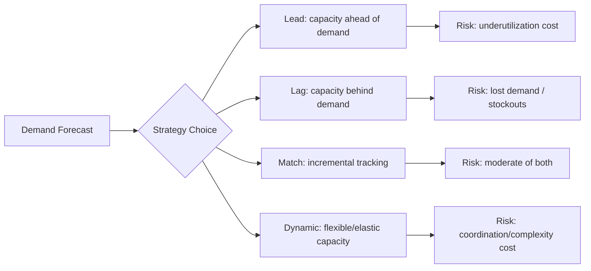
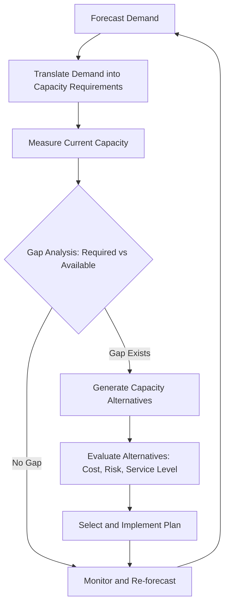

## Definition and Scope of Capacity Planning

### Overview

Capacity planning is the discipline of determining the production capacity a system, organization, or process needs to meet current and future demand at an acceptable level of service, cost, and risk. It sits at the intersection of operations management, systems engineering, and strategic planning, and applies equally to manufacturing lines, service operations, software infrastructure, and workforce management.

**Key Points**

- Capacity: the maximum sustainable output rate of a system over a specified time period, under normal operating conditions
- Demand: the rate at which the system is asked to produce output or perform work
- Capacity planning: the process of matching capacity to demand across time horizons, while balancing cost, service level, and risk
- The core tension is always between the cost of excess capacity (idle resources) and the cost of insufficient capacity (lost sales, degraded service, stockouts, missed SLAs)

### Formal Definition

Capacity is typically defined as:

$$C = \text{maximum output rate achievable under normal operating conditions}$$

This is distinct from *theoretical capacity* (output rate under ideal, uninterrupted conditions) and *effective capacity* (output rate after accounting for planned losses such as maintenance, changeovers, and staffing constraints). The relationship is commonly expressed through the **utilization** and **efficiency** metrics:

$$\text{Utilization} = \frac{\text{Actual Output}}{\text{Design Capacity}}$$

$$\text{Efficiency} = \frac{\text{Actual Output}}{\text{Effective Capacity}}$$

Capacity planning, then, is the forward-looking process of deciding what design capacity and effective capacity a system should have, when it should have it, and how it should scale, in order to satisfy forecasted demand within acceptable tolerances for cost and service quality.

### Scope of Capacity Planning

The scope spans multiple dimensions, and different bodies of literature (operations management, computer systems, healthcare operations, workforce planning) emphasize different subsets. A comprehensive treatment covers the following axes.

#### 1. Time Horizon

| Horizon | Typical Span | Focus | Example Decisions |
| --- | --- | --- | --- |
| Long-range (strategic) | 1–5+ years | Facility size, major equipment, technology platform | Build a new plant, adopt a new cloud architecture |
| Medium-range (tactical) | 3 months – 2 years | Workforce levels, subcontracting, inventory buffers | Hire seasonal staff, lease additional servers |
| Short-range (operational) | Days – 3 months | Scheduling, overtime, shift assignment | Reassign shifts, autoscale compute for a sale event |

[Inference] The exact boundaries between these horizons vary by industry and textbook; some sources compress "medium" and "short" range into a single "aggregate planning" band.

#### 2. Level of Analysis

- **Resource-level**: capacity of an individual machine, server, or worker
- **Process/station-level**: capacity of a workstation or pipeline stage, often bounded by its bottleneck resource
- **System-level**: capacity of the entire production/service system, generally bounded by the slowest station (see Theory of Constraints)
- **Network-level**: capacity across multiple interconnected facilities, data centers, or supply chain nodes

#### 3. Domain Applications

Capacity planning scope extends across several concrete domains:

- **Manufacturing**: machine-hours, production-line throughput, raw material flow
- **Services**: staff-hours, appointment slots, call-center seats (constrained additionally by the inability to inventory service output)
- **Information systems / IT infrastructure**: CPU, memory, storage, network bandwidth, database connections, request throughput
- **Healthcare**: bed capacity, staffed nursing hours, operating room time
- **Workforce/HR**: headcount planning, skill-mix planning, labor hour budgeting
- **Supply chain/logistics**: warehouse throughput, transportation fleet capacity, port/terminal capacity

#### 4. Strategic vs. Tactical Scope

Capacity planning decisions are often categorized by strategic posture:

- **Lead strategy**: capacity is added in anticipation of demand growth, accepting the risk of underutilization to avoid stockouts or lost sales
- **Lag strategy**: capacity is added only after demand has materialized and been sustained, minimizing excess capacity cost but risking lost sales during the lag
- **Match (tracking) strategy**: capacity is added incrementally in smaller steps that track demand growth closely
- **Adjustment/dynamic strategy**: capacity is adjusted continuously using flexible resources (temp labor, cloud autoscaling, overtime)

### Boundaries: What Capacity Planning Is and Is Not

**Key Points**

- Capacity planning is *not* demand forecasting itself, though it consumes forecast output as a primary input
- Capacity planning is *not* scheduling, though short-range capacity decisions overlap heavily with scheduling
- Capacity planning is *not* inventory management, though inventory can act as a buffer that decouples capacity from demand variability in make-to-stock systems
- Capacity planning *does* include: measuring current capacity, forecasting required capacity, evaluating alternatives, and selecting/implementing a capacity strategy

### The Generic Capacity Planning Process

Each stage draws on distinct analytical tools covered elsewhere in this syllabus: forecasting methods (moving average, exponential smoothing, regression), queuing theory for service capacity, learning curves for labor-based capacity ramp-up, and break-even/cost-volume analysis for evaluating capacity investment alternatives.

### Worked Example

A call center currently handles 500 calls/hour at effective capacity with 25 agents (20 calls/hour/agent effective, after accounting for breaks and after-call work). Forecasted demand for next quarter rises to 650 calls/hour at peak.

$$\text{Required Agents} = \frac{650}{20} = 32.5 \Rightarrow 33 \text{ agents}$$

**Key Points**

- The capacity gap is $33 - 25 = 8$ additional agents
- Scope decision: is this a short-range (overtime/temp staff) or medium-range (new hires) capacity decision? That classification determines which planning tools and lead times apply
- [Inference] In practice, a service-level target (e.g., 80% of calls answered within 20 seconds) rather than a flat call/hour figure would typically drive the staffing model, via queuing theory (e.g., Erlang C); the linear division shown here is a simplified illustration of the capacity-requirement translation step, not a full staffing model

### Illustration: Capacity vs. Demand Over Time (svg_diagram)

<svg xmlns="http://www.w3.org/2000/svg" viewBox="0 0 640 300">
<rect x="0" y="0" width="640" height="300" fill="#ffffff" />
<text x="320" y="20" font-size="14" text-anchor="middle" fill="#111" font-family="sans-serif">Capacity vs. Demand Over Time (svg_diagram)</text>
<line x1="50" y1="260" x2="600" y2="260" stroke="#333" stroke-width="1.5" />
<line x1="50" y1="40" x2="50" y2="260" stroke="#333" stroke-width="1.5" />
<text x="320" y="285" font-size="12" text-anchor="middle" fill="#333" font-family="sans-serif">Time</text>
<text x="20" y="150" font-size="12" text-anchor="middle" fill="#333" font-family="sans-serif" transform="rotate(-90 20 150)">Units</text>
<polyline points="50,220 150,215 250,210 350,205 450,200 550,195" fill="none" stroke="#1f77b4" stroke-width="2" />
<text x="555" y="195" font-size="11" fill="#1f77b4" font-family="sans-serif">Capacity (lead)</text>
<polyline points="50,230 150,215 250,190 350,155 450,110 550,60" fill="none" stroke="#d62728" stroke-width="2" />
<text x="555" y="60" font-size="11" fill="#d62728" font-family="sans-serif">Demand (growing)</text>
<polyline points="50,235 150,225 250,205 350,175 450,135 550,90" fill="none" stroke="#2ca02c" stroke-width="2" stroke-dasharray="6,4" />
<text x="450" y="150" font-size="11" fill="#2ca02c" font-family="sans-serif">Capacity (match, stepped)</text>
</svg>

### Common Pitfalls in Scoping a Capacity Plan

- Treating capacity as a single scalar number rather than a distribution (capacity varies with product mix, staff skill mix, and downtime variability)
- Ignoring the bottleneck: system capacity is bounded by its most constrained resource, not the average of all resources
- Confusing design capacity with effective or actual capacity when setting targets
- Failing to align the planning horizon with the lead time of the capacity lever being used (e.g., using a short-range lever like overtime to solve a long-range structural gap)
- Omitting variability: demand and processing-time variability both erode achievable utilization, a relationship formalized later via queuing theory (e.g., the VUT equation)

**Next Steps**

- Demand forecasting methods as an input to capacity requirements
- Measuring and defining capacity: design, effective, and actual capacity
- The Theory of Constraints and bottleneck identification
- Queuing theory fundamentals for service capacity
- Capacity strategies: lead, lag, match, and adjustment approaches in depth
- Break-even and cost-volume analysis for capacity investment decisions