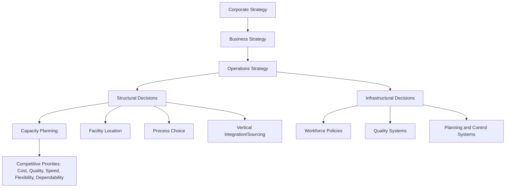
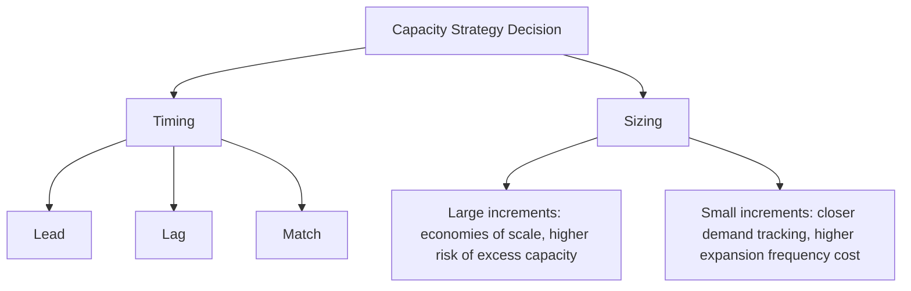

## Capacity Planning Within Operations Strategy

### Overview

Operations strategy defines how an organization configures and deploys its production and service resources to support competitive priorities. Capacity planning is one of the core structural decision categories within operations strategy, alongside facility location, process choice, vertical integration, and technology selection. Capacity decisions are structural because they are costly to reverse, have long lead times, and directly shape the range of competitive priorities a firm can credibly pursue.

**Key Points**

- Operations strategy translates business/corporate strategy into decisions about processes and resources
- Capacity decisions are classified as "structural" (long-term, hard to reverse) versus "infrastructural" (systems, policies, easier to adjust)
- Capacity strategy must be internally consistent with the other structural decisions (facilities, sourcing, technology) and with competitive priorities (cost, quality, speed, flexibility, dependability)

### Position of Capacity Planning in the Strategy Hierarchy

Capacity decisions sit high in this hierarchy because they constrain what infrastructural decisions can later achieve: a facility with insufficient capacity cannot be "fixed" through scheduling policy alone.

### Linking Capacity Strategy to Competitive Priorities

| Competitive Priority | Capacity Strategy Implication |
| --- | --- |
| Cost leadership | Favor high utilization, larger capacity increments to capture economies of scale, lag strategy to avoid idle capacity |
| Quality | Capacity sized to avoid overload-driven defects; buffer capacity to allow inspection/rework without breaching throughput commitments |
| Speed/delivery | Lead or match strategy with capacity cushions to absorb demand spikes without lead-time inflation |
| Flexibility | Smaller, modular capacity increments; flexible/cross-trained labor; general-purpose equipment over specialized high-volume equipment |
| Dependability | Capacity buffers and redundancy to protect committed service levels against variability |

[Inference] These are general strategic tendencies documented in operations management literature; specific firms may blend priorities, and the "right" capacity posture is contingent on competitive context, not a fixed rule.

### The Capacity Cushion Decision

A central strategic variable is the **capacity cushion** (or capacity safety margin):

$$\text{Capacity Cushion} = 1 - \frac{\text{Average Demand Rate}}{\text{Design Capacity}}$$

- A **large cushion** supports flexibility, high service levels, and demand volatility absorption, at the cost of lower asset utilization and higher unit cost
- A **small (or negative) cushion** supports cost efficiency and high utilization, at the cost of reduced responsiveness and higher risk of stockouts/service failures during demand spikes

Strategic capacity planning therefore requires explicitly deciding, as a matter of policy, what cushion the organization is willing to carry, rather than treating it as an incidental byproduct of individual capacity decisions.

### Capacity Timing and Sizing Strategy

Two structural sub-decisions recur throughout operations strategy treatments of capacity:

1. **Timing strategy**: whether capacity is added ahead of demand (lead), after demand is confirmed (lag), or incrementally alongside demand growth (match) — see the prior chapter item for definitions
2. **Sizing strategy**: whether to add capacity in large discrete increments (to exploit economies of scale, accepting temporary excess capacity) or small frequent increments (to track demand closely, accepting higher per-unit expansion cost)

### Economies and Diseconomies of Scale in Strategic Capacity Sizing

Large-increment capacity strategies are often justified by economies of scale, but these are bounded:

$$\text{Average Unit Cost} = \frac{\text{Fixed Cost}}{\text{Volume}} + \text{Variable Cost per Unit}$$

As volume increases, fixed cost per unit falls — but beyond some threshold, **diseconomies of scale** emerge from coordination complexity, management overhead, and organizational friction, producing a U-shaped long-run average cost curve. Strategic capacity planning must therefore identify the **minimum efficient scale** and avoid over-sizing capacity purely to chase economies of scale without regard to this inflection point.

[Inference] The precise location of the minimum efficient scale is industry- and technology-specific and is not derivable from the cost formula alone; it typically requires empirical or engineering estimation.

### Focused Factories and Capacity Specialization

Operations strategy literature (notably Skinner's "focused factory" concept) argues that capacity concentrated around a narrow set of competitive priorities and product/process combinations outperforms capacity spread across conflicting priorities. Implications for capacity planning:

- Segmenting capacity by product line, customer type, or priority (e.g., separate lines for high-volume standard products vs. low-volume custom products) can outperform a single "one-size-fits-all" capacity pool
- Shared, unfocused capacity often forces a compromise cushion size and utilization target that serves no single priority well

### Capacity Strategy Under Uncertainty

Strategic capacity decisions are made under demand and technology uncertainty, which introduces option-like reasoning:

- **Real options framing** [Inference — a widely used but not universally adopted analytical lens]: capacity investments can be structured as options (e.g., building a facility shell now but delaying equipment installation) to preserve flexibility to scale up or down as uncertainty resolves
- Modular, scalable capacity (e.g., standardized production cells, cloud-based infrastructure in IT contexts) reduces the cost of being wrong about demand forecasts
- Strategic capacity planning increasingly incorporates scenario planning and decision-tree analysis (covered later in this syllabus) rather than single-point demand forecasts

### Worked Example: Strategic Trade-off

A firm competing on cost leadership in a stable, high-volume market chooses a lag strategy with a small capacity cushion (e.g., 10%) and large capacity increments to capture scale economies. A competitor in the same market competing on responsiveness chooses a lead strategy with a larger cushion (e.g., 25%) and smaller, modular increments.

- The cost leader achieves lower unit costs but risks lost sales and slower response during demand surges
- The responsiveness-focused competitor sustains higher unit costs but can capture volume during demand spikes and support shorter lead times

**Key Points**

- Neither strategy is "correct" in the abstract; correctness is defined relative to the chosen competitive priorities
- Misalignment — e.g., pursuing cost leadership while carrying a large capacity cushion — typically signals a strategic inconsistency rather than a viable hybrid position

### Common Pitfalls

- Treating capacity planning as a purely operational/tactical exercise disconnected from competitive strategy
- Sizing capacity cushions without an explicit link to stated competitive priorities
- Chasing economies of scale past the minimum efficient scale, incurring diseconomies of scale
- Failing to revisit capacity strategy when competitive priorities shift (e.g., a firm shifting from cost to responsiveness without adjusting its cushion and timing strategy)

**Next Steps**

- Capacity cushion sizing and utilization economics in depth
- Economies and diseconomies of scale, and estimating minimum efficient scale
- Focused factory and capacity segmentation strategies
- Real options and scenario-based approaches to capacity investment under uncertainty
- Aggregate planning as the tactical bridge between capacity strategy and scheduling