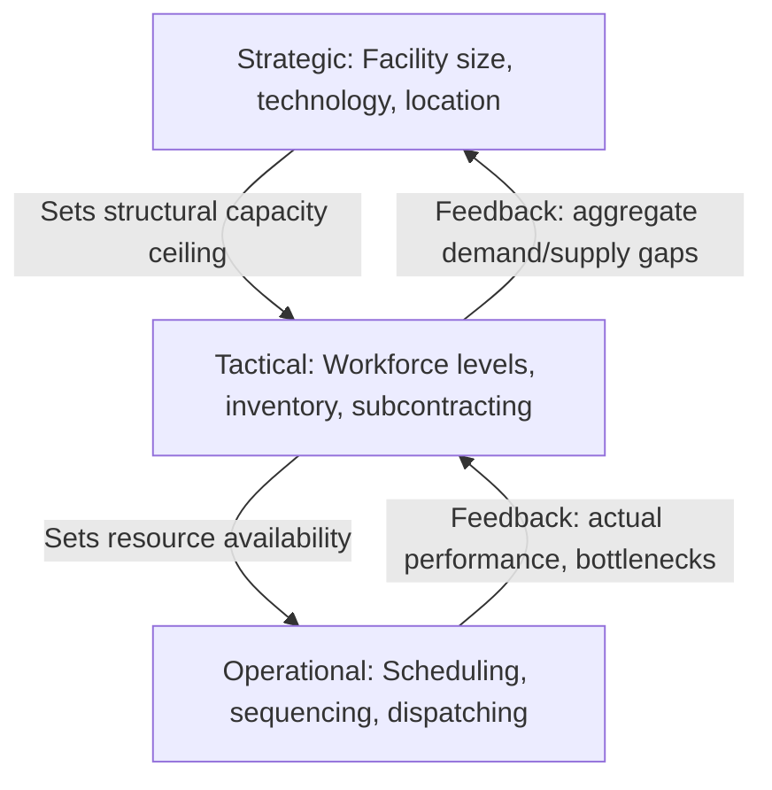
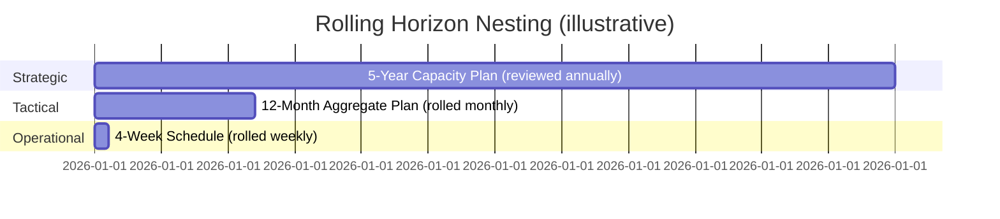

## Strategic, Tactical, and Operational Planning Horizons

### Overview

Planning horizons segment capacity and operations decisions by the time span over which they take effect and the degree to which they can be reversed. The three-tier hierarchy — strategic, tactical, and operational — provides the organizing structure for nearly all capacity planning methodology: each tier consumes decisions from the tier above as fixed constraints and produces decisions that constrain the tier below.

**Key Points**

- Strategic horizon: long-range, structural, low-frequency decisions (years)
- Tactical horizon: medium-range, resource-allocation decisions within a fixed structure (months to ~1–2 years)
- Operational horizon: short-range, execution-level decisions (days to weeks)
- Decisions at each tier are progressively more frequent, more granular, and less costly to reverse

### The Three Tiers Defined

#### Strategic Planning Horizon

- **Span**: typically 1–5+ years, sometimes longer for capital-intensive industries (utilities, semiconductor fabs, healthcare facilities)
- **Nature**: irreversible or costly-to-reverse commitments — facility construction, major equipment purchases, technology platform selection, entry into new markets
- **Capacity question answered**: "How much capacity should exist, of what type, located where, by when?"
- **Inputs**: long-range demand forecasts, competitive strategy, technology roadmaps, capital budgets
- **Owner**: executive/corporate leadership, often with board-level approval for major capital expenditure

#### Tactical Planning Horizon

- **Span**: typically 3 months to 1–2 years, often organized in quarterly or monthly buckets
- **Nature**: allocation and deployment decisions within an existing, fixed structural capacity — this tier cannot create new facilities but can flex workforce size, inventory levels, subcontracting, and shift patterns
- **Capacity question answered**: "Given the capacity we have, how do we allocate labor, inventory, and subcontracted resources period-by-period to meet forecasted demand at acceptable cost?"
- **Primary technique**: aggregate planning (covered in a later chapter), which produces a rough-cut plan for workforce levels, production/service rates, and inventory or backlog policy
- **Owner**: operations/plant management, workforce planning teams, capacity/demand planning functions

#### Operational Planning Horizon

- **Span**: typically days to a few months, often daily or weekly buckets
- **Nature**: execution-level scheduling and sequencing within tactical resource levels already committed
- **Capacity question answered**: "Given today's staff, equipment, and materials, what gets produced/served, in what sequence, on which resource, right now?"
- **Primary techniques**: master production scheduling, shift scheduling, dispatching rules, real-time load balancing (in IT contexts: autoscaling within pre-provisioned limits)
- **Owner**: shift supervisors, schedulers, dispatch systems, automated control systems

### Hierarchical Relationship

The hierarchy is not strictly one-directional: operational-level data (e.g., persistent overtime, chronic bottlenecks) feeds back upward and can trigger re-evaluation at the tactical or even strategic tier — a signal that the fixed structural capacity is misaligned with actual demand.

### Comparison Table

| Dimension | Strategic | Tactical | Operational |
| --- | --- | --- | --- |
| Time span | 1–5+ years | 3 months – 2 years | Days – 3 months |
| Reversibility | Low (high sunk cost) | Moderate | High |
| Decision granularity | Aggregate (total capacity, facility count) | Semi-aggregate (workforce, inventory by period) | Fine-grained (individual jobs, shifts, tasks) |
| Typical unit of analysis | Facility, product family, market | Department, product line, month | Machine, worker, order, hour |
| Forecast accuracy required | Low (directional trends sufficient) | Moderate | High (near-term precision needed) |
| Example capacity decision | Build a second plant | Hire 15 temporary workers for Q4 | Assign Worker A to Line 2, 2nd shift, Tuesday |
| IT/software analogue | Choose cloud region, reserve multi-year compute commitments | Set autoscaling group min/max capacity for the quarter | Real-time autoscaling trigger, load balancer routing |

### Why the Horizon Distinction Matters for Capacity Planning

**Key Points**

- **Lead time matching**: a capacity lever must be selected whose lead time fits the horizon of the gap it is meant to close. Overtime (operational lever) cannot close a strategic-scale capacity gap; building a new facility (strategic lever) is far too slow to respond to a short-term demand spike
- **Forecast horizon matching**: forecast accuracy degrades with horizon length, so strategic decisions must be robust to wide forecast uncertainty (favoring flexible, scalable designs), while operational decisions can rely on near-term, high-confidence data
- **Cost of misalignment**: using a short-horizon lever to patch a long-horizon problem (e.g., chronic overtime instead of hiring or expanding capacity) tends to raise unit costs and cause burnout/quality erosion; using a long-horizon lever for a short-term blip (e.g., building new capacity for a one-time demand spike) creates costly excess capacity afterward

### Worked Example

A hospital observes emergency department visit volume exceeding staffed capacity on weekday evenings.

- **Operational response**: reshuffle today's on-call schedule, call in available per-diem nurses for tonight's shift
- **Tactical response**: if the pattern persists over several months, adjust the quarterly staffing plan to add a dedicated weekday-evening shift block
- **Strategic response**: if volume growth is structural and forecast to continue for years, evaluate adding ED bays, additional triage capacity, or a new facility wing

[Inference] Real organizations often blur these boundaries in practice — for instance, "temporary" tactical fixes (contract staffing) frequently persist far longer than intended when strategic capacity decisions lag behind demand growth; this is a documented risk pattern rather than a strict rule.

### Rolling Horizon and Plan Nesting

Operations planning systems typically implement these tiers as a **rolling horizon**, where:

- The strategic plan is revisited annually (or on major market/technology shifts) and sets the outer capacity envelope
- The tactical plan (e.g., a rolling 12-month aggregate plan) is re-run monthly or quarterly, always nested within current strategic capacity limits
- The operational schedule is re-run daily or weekly, always nested within the current tactical resource allocation

### Common Pitfalls

- Applying an operational-tier tool (e.g., detailed job scheduling heuristics) to a strategic-tier question (facility sizing), producing spurious precision on top of highly uncertain long-range forecasts
- Allowing tactical decisions (e.g., hiring freezes, inventory policy) to be made without visibility into the strategic capacity ceiling they must operate within
- Neglecting feedback loops — treating each tier as a one-time, top-down handoff rather than an iterative process informed by execution-level performance data
- Using the same forecast accuracy assumptions across all three horizons, ignoring that error compounds with horizon length

**Next Steps**

- Aggregate planning as the primary tactical-tier capacity technique
- Demand forecasting methods and their appropriate horizon-matched accuracy expectations
- Master production scheduling as the operational-tier bridge from tactical plans to execution
- Capacity cushions and safety stock as buffers absorbing cross-horizon forecast error
- Rolling horizon planning systems and re-planning frequency trade-offs