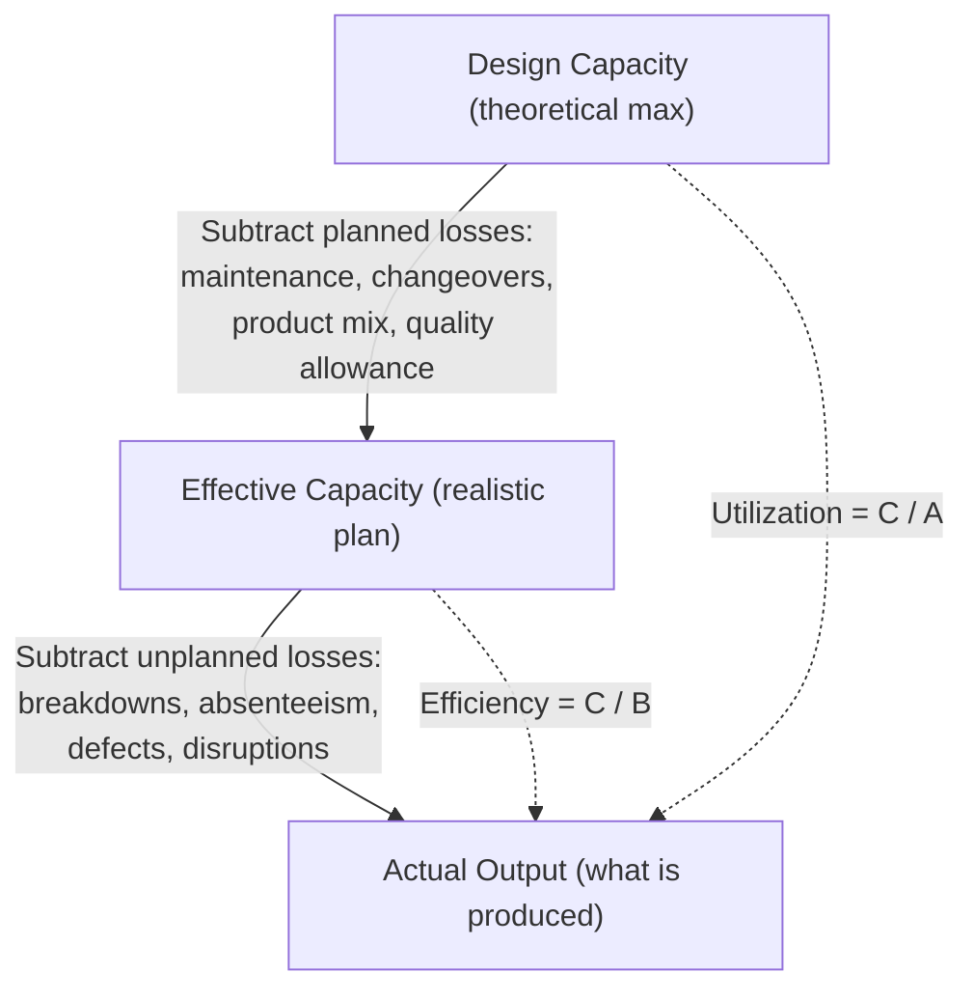

## Design Capacity, Effective Capacity, and Actual Output

### Overview

These three measures form a nested hierarchy that quantifies how much of a system's theoretical potential is actually realized. Each layer subtracts a different category of loss — planned losses (moving from design to effective capacity) and unplanned/operational losses (moving from effective capacity to actual output) — and the gaps between the layers are precisely what efficiency and utilization metrics are designed to expose.

**Key Points**

- Design capacity: the maximum possible output under ideal conditions, with no losses of any kind
- Effective capacity: the maximum output realistically achievable given planned/known constraints (maintenance, changeovers, product mix, quality standards, staffing policy)
- Actual output: what the system actually produces, after also accounting for unplanned losses (breakdowns, absenteeism, defects, disruptions)
- $\text{Design Capacity} \geq \text{Effective Capacity} \geq \text{Actual Output}$

### Formal Definitions

#### Design Capacity

Design capacity is the theoretical maximum output rate a system can achieve under ideal operating conditions — continuous operation, no downtime, optimal product mix, no quality losses. It is typically an engineering specification (e.g., a machine rated at 100 units/hour, a call center rated for 1,000 calls/day at nameplate staffing).

$$\text{Design Capacity} = \text{Ideal Output Rate} \times \text{Available Time}$$

#### Effective Capacity

Effective capacity subtracts *planned* losses that are known in advance and built into the operating plan: scheduled maintenance, planned changeovers/setups, expected absenteeism, quality/rework allowances, and product-mix effects.

$$\text{Effective Capacity} = \text{Design Capacity} \times \text{Capacity Reduction Factor (planned losses)}$$

#### Actual Output

Actual output is what the system actually produces after also subtracting *unplanned* losses: unscheduled downtime, equipment breakdowns, material shortages, unplanned absenteeism, quality defects/scrap beyond planned allowances, and other disruptions.

$$\text{Actual Output} = \text{Effective Capacity} \times \text{Performance Factor (unplanned losses)}$$

### The Two Core Metrics

$$\text{Utilization} = \frac{\text{Actual Output}}{\text{Design Capacity}} \times 100\%$$

$$\text{Efficiency} = \frac{\text{Actual Output}}{\text{Effective Capacity}} \times 100\%$$

- **Utilization** measures how much of the *theoretical maximum* is being realized — it is depressed by both planned and unplanned losses, so a low utilization figure alone does not indicate an operational problem; it may simply reflect a deliberately conservative effective capacity plan
- **Efficiency** measures how well the system performs *relative to its own realistic plan* — it isolates unplanned losses and is the more diagnostic metric for day-to-day operational performance, since it strips out planned losses that were already anticipated

[Inference] Terminology varies somewhat across sources — some texts use "capacity utilization" and "capacity efficiency" interchangeably or invert which ratio each term maps to. The definitions above follow the common operations management convention where utilization is measured against design capacity and efficiency against effective capacity.

### Visualizing the Nested Hierarchy

### Worked Example

A production line is rated (design capacity) at 200 units/hour, running 24 hours/day.

$$\text{Design Capacity (daily)} = 200 \times 24 = 4{,}800 \text{ units/day}$$

Planned losses: 2 hours/day for scheduled maintenance and changeovers.

$$\text{Effective Capacity (daily)} = 200 \times (24 - 2) = 4{,}400 \text{ units/day}$$

Last week, unplanned equipment failures and absenteeism reduced actual output to 3,740 units/day on average.

$$\text{Utilization} = \frac{3{,}740}{4{,}800} = 77.9\%$$

$$\text{Efficiency} = \frac{3{,}740}{4{,}400} = 85.0\%$$

**Key Points**

- The 22.1% utilization gap combines both the planned 2-hour maintenance loss and the unplanned disruptions
- The 15.0% efficiency gap isolates only the unplanned losses — this is the number a plant manager should scrutinize for corrective action, since the planned maintenance loss was already expected and accepted
- Reporting only utilization (77.9%) without efficiency would obscure whether the shortfall stems from an aggressive design spec, a conservative maintenance schedule, or genuine unplanned operational failure

### Software/IT Systems Analogue

The same hierarchy applies directly to computing infrastructure capacity planning:

| Manufacturing Concept | IT Systems Equivalent |
| --- | --- |
| Design capacity | Vendor-rated maximum throughput (e.g., benchmark max requests/sec, theoretical max IOPS) |
| Planned losses | Scheduled maintenance windows, planned failover/redundancy overhead, reserved headroom for patching |
| Effective capacity | Provisioned capacity target after accounting for redundancy/failover reservation and maintenance windows |
| Unplanned losses | Unplanned outages, degraded nodes, traffic spikes exceeding autoscaling reaction time, noisy-neighbor effects |
| Actual output | Observed sustained throughput under real production load |
| Utilization | Observed throughput ÷ vendor-rated max |
| Efficiency | Observed throughput ÷ provisioned effective capacity |

[Inference] This mapping is an applied analogy rather than a standardized cross-domain terminology; IT capacity planning literature does not universally use "design/effective/actual" phrasing, though the underlying concept of nested capacity loss layers is standard practice (commonly discussed via concepts like headroom, SLO burn rate, and provisioned vs. observed capacity).

### Why the Distinction Matters for Planning Decisions

**Key Points**

- Using **design capacity** as the basis for demand-matching decisions systematically overstates what a system can deliver, leading to chronic understaffing/under-provisioning relative to actual need
- Using **effective capacity** as the planning baseline is the standard practice for tactical and operational decisions, since it reflects realistically achievable output
- Tracking the **efficiency trend** over time (rather than a single snapshot) reveals whether unplanned losses are worsening (equipment aging, morale decline, process drift) — a signal for maintenance investment, retraining, or process redesign
- A persistent, large gap between effective capacity and actual output, even after operational fixes, may indicate the effective capacity estimate itself was set unrealistically high and should be revised

### Common Pitfalls

- Quoting "capacity" without specifying which of the three layers is meant — this is one of the most common sources of miscommunication in capacity discussions between engineering (which often thinks in design capacity) and operations/finance (which plans in effective capacity)
- Setting service-level or demand commitments against design capacity rather than effective capacity, creating structurally unachievable targets
- Treating a low efficiency figure as automatically indicating poor management, without first checking whether the *effective capacity* baseline itself was set unrealistically (e.g., ignoring genuine planned maintenance needs)
- Failing to update effective capacity estimates as equipment ages or as product mix shifts, causing efficiency metrics to drift for reasons unrelated to actual operational performance

**Next Steps**

- Overall Equipment Effectiveness (OEE) as an extended framework combining availability, performance, and quality losses
- Bottleneck identification and the Theory of Constraints, which determines system-level effective capacity
- Capacity requirements planning (CRP) and how effective capacity feeds tactical resource planning
- Statistical variability in processing times and its effect on achievable utilization (queuing theory)
- Capacity measurement in service systems, where output units are harder to standardize than in manufacturing