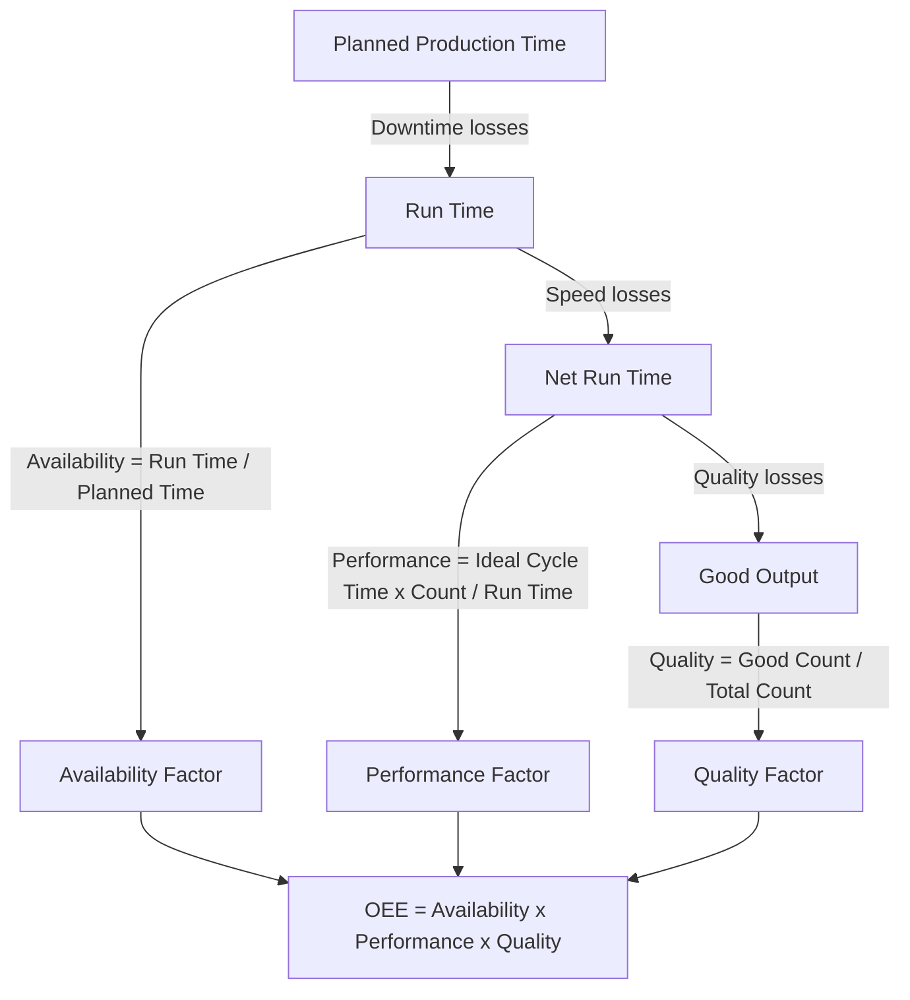

## Capacity Utilization and Efficiency Metrics

### Overview

Capacity utilization and efficiency metrics quantify how well a system converts its available capacity into actual output. While the previous chapter item established the definitional relationship between design capacity, effective capacity, and actual output, this item focuses on the broader family of metrics built on that foundation — how they are calculated, interpreted, benchmarked, and combined into composite indices used for operational decision-making.

**Key Points**

- Utilization and efficiency are ratio metrics, not absolute measures — they are only meaningful relative to a clearly defined denominator (design vs. effective capacity)
- Metrics serve two distinct purposes: diagnostic (identifying performance gaps) and predictive (feeding into future capacity requirement forecasts)
- No single metric fully captures capacity performance; composite frameworks (e.g., OEE) combine multiple loss categories

### Core Metric Definitions

$$\text{Utilization} = \frac{\text{Actual Output}}{\text{Design Capacity}} \times 100\%$$

$$\text{Efficiency} = \frac{\text{Actual Output}}{\text{Effective Capacity}} \times 100\%$$

$$\text{Capacity Cushion} = \left(1 - \frac{\text{Average Demand}}{\text{Design Capacity}}\right) \times 100\%$$

$$\text{Rated Capacity} = \text{Design Capacity} \times \text{Utilization} \times \text{Efficiency}$$

The last formula — rated capacity — is used when an organization already knows the historical utilization and efficiency of a given resource and wants to estimate the realistic output a *new, similar* resource will deliver, rather than relying on its design specification alone.

### Extended Metric Family

| Metric | Formula | Purpose |
| --- | --- | --- |
| Utilization | Actual Output ÷ Design Capacity | Overall realization of theoretical maximum |
| Efficiency | Actual Output ÷ Effective Capacity | Performance against the realistic operating plan |
| Capacity Cushion | 1 − (Demand ÷ Design Capacity) | Strategic safety margin against demand variability |
| Throughput Rate | Units completed ÷ Time period | Raw production/service speed |
| Cycle Time | Time period ÷ Units completed | Inverse of throughput; time per unit |
| Bottleneck Utilization | Bottleneck actual output ÷ Bottleneck effective capacity | System capacity is bounded by this resource |
| Overall Equipment Effectiveness (OEE) | Availability × Performance × Quality | Composite loss-adjusted effectiveness index |

### Overall Equipment Effectiveness (OEE) — A Composite Framework

OEE decomposes total capacity loss into three multiplicative factors, widely used in manufacturing (originating from Total Productive Maintenance practice):

$$\text{OEE} = \text{Availability} \times \text{Performance} \times \text{Quality}$$

- **Availability** $= \dfrac{\text{Run Time}}{\text{Planned Production Time}}$ — captures downtime losses (breakdowns, changeovers)
- **Performance** $= \dfrac{\text{Ideal Cycle Time} \times \text{Total Count}}{\text{Run Time}}$ — captures speed losses (running slower than rated speed, minor stops)
- **Quality** $= \dfrac{\text{Good Count}}{\text{Total Count}}$ — captures yield losses (defects, rework, scrap)

[Inference] World-class OEE benchmarks (commonly cited around 85%, decomposed as roughly 90% availability × 95% performance × 99% quality) are industry rules of thumb rather than universal standards; acceptable OEE targets vary substantially by industry, equipment type, and process maturity.

### Worked Example: Full OEE Calculation

A packaging line is scheduled for an 8-hour shift (480 minutes), with 30 minutes of planned breaks (leaving 450 minutes planned production time). Unplanned downtime totals 45 minutes. Ideal cycle time is 1.0 second/unit. During run time, the line produced 19,000 total units, of which 500 were defective.

**Availability:**

$$\text{Run Time} = 450 - 45 = 405 \text{ min}$$

$$\text{Availability} = \frac{405}{450} = 90.0\%$$

**Performance:**

$$\text{Ideal Time for 19{,}000 units} = \frac{19{,}000 \times 1.0}{60} = 316.7 \text{ min}$$

$$\text{Performance} = \frac{316.7}{405} = 78.2\%$$

**Quality:**

$$\text{Quality} = \frac{19{,}000 - 500}{19{,}000} = 97.4\%$$

**OEE:**

$$\text{OEE} = 0.900 \times 0.782 \times 0.974 = 68.5\%$$

**Key Points**

- The composite OEE score (68.5%) alone doesn't diagnose the problem; decomposing it shows the **performance factor (78.2%)** is the primary drag — the line is running well below its ideal cycle time even while running, suggesting minor stoppages, speed loss, or an unrealistic ideal cycle time rating
- This decomposition is the main analytical value of OEE over a single blended utilization figure — it directs improvement effort to the correct loss category

### Service Sector Adaptations

Utilization metrics require adaptation in service contexts because service output typically cannot be inventoried:

$$\text{Service Utilization} = \frac{\text{Time Serving Customers (or Occupied Resource-Time)}}{\text{Total Available Time}}$$

- **Healthcare**: bed occupancy rate, staffed-hour utilization, OR utilization
- **Hospitality**: room occupancy rate, RevPAR (revenue per available room) as a utilization-adjacent metric combining occupancy and price
- **Call centers**: agent occupancy (time on calls + after-call work ÷ total logged-in time), distinct from service level (% of calls answered within target time)

[Inference] In service contexts, pursuing very high utilization (near 100%) is often counterproductive rather than desirable, because queuing theory shows waiting times grow non-linearly as utilization approaches 1 — this is addressed in depth in the queuing theory chapter.

### IT/Infrastructure Metric Analogues

| Manufacturing Metric | IT Systems Equivalent |
| --- | --- |
| Utilization | CPU/memory/bandwidth utilization (%) |
| Availability | Uptime / SLA availability (e.g., 99.9%) |
| Performance | Latency relative to target (p50/p95/p99 vs. SLO) |
| Quality | Error rate, request success rate |
| OEE-equivalent | Composite SLO attainment combining availability, latency, and error-rate budgets |

### Interpreting Metrics: Diagnostic Use

**Key Points**

- A **rising utilization trend with stable efficiency** typically signals healthy demand growth being absorbed by existing capacity — a leading indicator for tactical capacity expansion planning
- A **falling efficiency trend at constant utilization** signals a genuine operational problem (equipment degradation, staff turnover, quality drift) rather than a capacity sizing issue
- **Utilization near 100%** in systems with variable demand or processing times (most real systems) is a warning sign, not a success indicator — it typically precedes sharply increasing queue times/lead times, since queuing delay scales non-linearly as utilization approaches full capacity
- Metrics should always be interpreted against the *type* of capacity strategy chosen (see prior chapter item): a firm deliberately carrying a large capacity cushion should expect, and accept, lower utilization by design

### Common Pitfalls

- Comparing utilization figures across resources or facilities without confirming they use the same denominator (design vs. effective capacity)
- Treating maximum utilization as an operational goal in variable-demand service or IT systems, ignoring the queuing-delay cost of operating near saturation
- Reporting a single composite metric (e.g., OEE) without decomposing it, obscuring which loss category actually needs attention
- Using efficiency/utilization snapshots instead of trends, missing gradual degradation that only becomes visible over multiple periods
- Applying manufacturing-style utilization targets directly to service or knowledge-work contexts without adjusting for the absence of inventory buffering

**Next Steps**

- Queuing theory and the non-linear relationship between utilization and wait time
- Overall Equipment Effectiveness in depth: Six Big Losses framework and TPM programs
- Statistical process control as a complement to quality-factor tracking
- Capacity cushion strategy and its deliberate trade-off against utilization targets
- Service-sector capacity metrics: occupancy, RevPAR, and agent utilization vs. service level