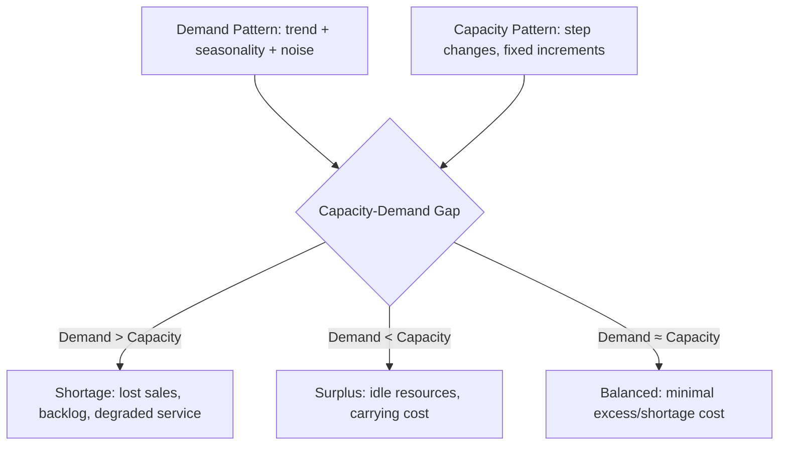
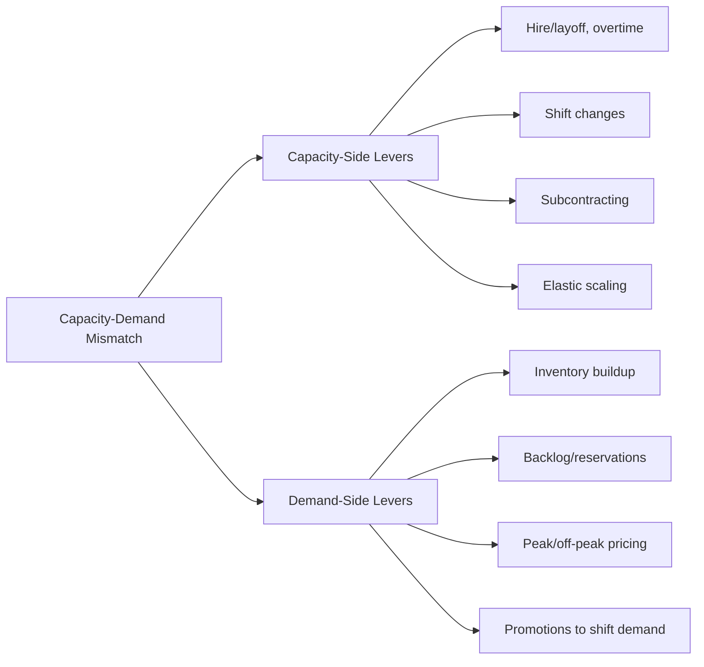

## The Capacity-Demand Balancing Problem

### Overview

The capacity-demand balancing problem is the central optimization challenge underlying all capacity planning: allocating capacity over time to match a demand pattern that is variable, uncertain, and often out of the organization's direct control, while managing the asymmetric costs of having too much capacity versus too little. Every prior topic in this chapter — capacity definitions, planning horizons, utilization metrics — exists in service of solving this one recurring problem.

**Key Points**

- The problem is fundamentally a mismatch problem: demand rarely arrives at a constant rate, while capacity is typically most economical when held constant or changed in large discrete steps
- Both directions of mismatch carry real costs: excess capacity costs money whether or not it's used; capacity shortfall costs sales, service level, or goodwill
- There is no generally "correct" balance — the optimal balance point depends on the relative cost of shortage versus the cost of surplus, which is strategy- and context-specific

### The Structure of the Problem

At its core, the balancing problem compares two time-varying quantities:

$$\text{Demand}(t) \quad \text{vs.} \quad \text{Capacity}(t)$$

Because demand typically fluctuates continuously (seasonality, trend, random variation) while capacity is usually adjusted in discrete steps (hiring batches, equipment purchases, shift additions), a perfect match is generally unattainable. Planning reduces to choosing *how* and *when* the mismatch is allowed to occur, and how it is absorbed.

### Sources of Demand-Capacity Mismatch

- **Trend**: long-run growth or decline in baseline demand, requiring periodic structural capacity revision
- **Seasonality**: predictable, recurring demand cycles (daily, weekly, annual) that capacity must either track or absorb via buffers
- **Random variation**: unpredictable short-term fluctuation around the expected demand level, which no forecast can eliminate
- **Capacity granularity**: capacity itself typically cannot be added continuously — a machine, a shift, or a facility comes in discrete units, so even a perfectly forecast demand curve cannot be matched exactly
- **Lead time asymmetry**: capacity additions (hiring, construction, equipment procurement) take time to implement, so capacity decisions must be made *ahead* of the demand they are meant to serve, using forecasts rather than realized demand

### The Cost Asymmetry at the Heart of the Problem

| Condition | Cost Type | Examples |
| --- | --- | --- |
| Capacity > Demand (surplus) | Cost of excess capacity | Idle labor/equipment, depreciation on unused assets, carrying cost, opportunity cost of capital |
| Capacity < Demand (shortage) | Cost of insufficient capacity | Lost sales, stockouts, overtime premiums, expedited subcontracting, SLA penalties, customer attrition, reputational damage |

The two costs are rarely symmetric, and this asymmetry drives the strategic capacity cushion decision introduced earlier in this chapter:

$$\text{Expected Total Cost} = P(\text{Shortage}) \times C_{\text{shortage}} + P(\text{Surplus}) \times C_{\text{surplus}}$$

[Inference] Formalized versions of this trade-off (e.g., newsvendor-style critical ratio analysis) are common in capacity and inventory planning, but the specific cost figures and probability distributions required are context-dependent and must be estimated empirically rather than assumed.

### Balancing Strategies (Levers)

Organizations resolve the mismatch using two broad categories of lever, often in combination:

#### 1. Adjust Capacity to Track Demand ("Chase" approaches)

- Hiring/layoffs, overtime/undertime, temporary/contract labor
- Shift additions or reductions, equipment leasing
- Subcontracting during peaks
- Elastic infrastructure scaling (cloud autoscaling in IT contexts)

#### 2. Adjust or Absorb Demand to Fit Capacity ("Level" approaches)

- Inventory buildup ahead of peak demand (in make-to-stock systems, where output can be stored)
- Backlogs/reservations/appointment systems (in make-to-order or service systems)
- Demand shaping via pricing (peak/off-peak pricing, promotions to shift demand into slack periods)
- Reservation and queuing systems that smooth arrival patterns

A key structural constraint: **pure demand-side leveling via inventory is only available in make-to-stock manufacturing systems.** In services and in make-to-order systems, output cannot be stored ahead of demand, so these systems rely more heavily on capacity-side levers, backlog tolerance, or demand-shaping.

### Worked Example: Chase vs. Level Strategy Trade-off

A seasonal product has demand of 1,000 units/month for 9 months and 2,500 units/month for 3 peak months (annual demand = 16,500 units; average = 1,375/month).

**Level strategy**: produce at a constant rate of 1,375 units/month year-round, building inventory of $1{,}375 - 1{,}000 = 375$ units/month in slow months to cover the peak-month shortfall of $2{,}500 - 1{,}375 = 1{,}125$ units/month.

$$\text{Peak inventory build required} = 375 \times 9 = 3{,}375 \text{ units (matches } 1{,}125 \times 3\text{)}$$

**Chase strategy**: vary production to exactly match demand each month (1,000 units in slow months, 2,500 in peak months), avoiding inventory carrying cost entirely but requiring frequent hiring/layoff or overtime cycles.

**Key Points**

- The level strategy minimizes workforce disruption cost but incurs inventory carrying cost and requires make-to-stock feasibility
- The chase strategy minimizes inventory cost but incurs the cost and disruption of frequent capacity adjustment (hiring/training/layoff cycles, overtime premiums)
- Most real plans use a **hybrid strategy**, partially leveling production and partially chasing demand, to balance both cost categories — this is the central decision produced by aggregate planning (covered in a later chapter)

### The Balancing Problem in Queuing and Service Contexts

In systems without inventory buffering, the balancing problem manifests through queuing dynamics rather than stockouts: as utilization (demand ÷ capacity) rises toward 1, wait times grow non-linearly rather than the system simply running out of stock. This reframes the balancing problem in services as choosing an acceptable wait-time/service-level target rather than an inventory policy — formalized later via queuing theory (e.g., Erlang models).

### Common Pitfalls

- Treating the balancing problem as solvable through forecasting accuracy alone — even a perfect forecast cannot eliminate the granularity and lead-time constraints on capacity adjustment
- Defaulting to a pure chase or pure level strategy without evaluating hybrid options that typically dominate both extremes on total cost
- Ignoring the asymmetry between shortage and surplus costs, and instead targeting a naive 50/50 balance
- Applying inventory-based leveling logic to service or make-to-order contexts where output genuinely cannot be stored
- Failing to distinguish which planning horizon (strategic, tactical, operational) a given imbalance belongs to, leading to a horizon-mismatched lever being applied (see prior chapter item on planning horizons)

**Next Steps**

- Aggregate planning: formal hybrid chase/level optimization techniques
- Demand forecasting methods and their role in anticipating the mismatch
- Queuing theory: balancing capacity and demand without inventory buffering
- Newsvendor-style cost trade-off models for shortage vs. surplus cost
- Demand management and pricing strategies as a capacity-side substitute