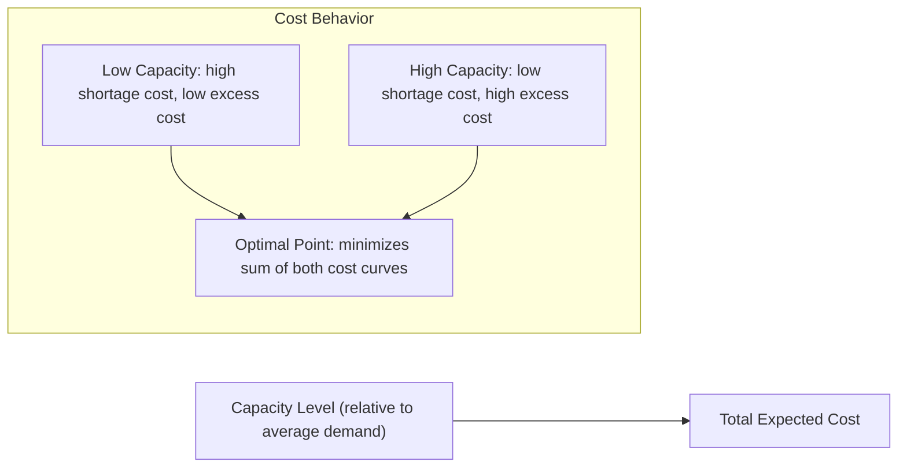

## Costs of Excess and Insufficient Capacity

### Overview

This item decomposes, in detail, the two cost categories that were introduced at a high level as the "cost asymmetry" underlying the capacity-demand balancing problem. Understanding the specific cost components on each side — not just their existence — is what allows a planner to move from qualitative trade-off reasoning to quantitative capacity sizing decisions.

**Key Points**

- Excess capacity costs are largely fixed, ongoing, and accrue whether or not the capacity is used
- Insufficient capacity costs are largely variable, event-driven, and often have compounding secondary effects (reputational, competitive) beyond the immediate lost transaction
- Some costs (e.g., quality erosion, employee burnout) sit on the insufficient-capacity side but are indirect and easy to under-estimate because they are delayed and diffuse

### Costs of Excess Capacity

Excess capacity means design or effective capacity exceeds realized demand. Its costs are primarily costs of ownership and idleness.

| Cost Category | Description | Example |
| --- | --- | --- |
| Capital cost | Depreciation, interest, and opportunity cost of capital tied up in unused assets | Idle machinery depreciating regardless of use |
| Fixed operating cost | Costs incurred to maintain capacity readiness independent of output | Facility lease, insurance, base staffing, utilities for unused floor space |
| Carrying/holding cost | Cost of maintaining inventory built to smooth capacity (level strategy) | Warehousing, obsolescence risk, spoilage |
| Opportunity cost | Capital that could have been deployed elsewhere for better return | Funds tied in excess plant capacity instead of R&D or market expansion |
| Maintenance overhead | Upkeep cost scales partly with capacity owned, not just capacity used | Preventive maintenance on idle equipment |
| Organizational cost | Complexity and coordination cost of managing unused capacity | Underutilized staff requiring management attention without proportional output |

$$\text{Total Excess Capacity Cost} \approx \text{Fixed Ownership Cost} + \text{Capital Opportunity Cost} + \text{Carrying Cost (if inventory-based)}$$

[Inference] The relative weight of these components varies enormously by industry — capital-intensive manufacturing weighs capital and depreciation cost heavily, while labor-intensive services weigh base staffing and organizational cost more heavily.

### Costs of Insufficient Capacity

Insufficient capacity means realized or forecast demand exceeds available effective capacity. Its costs are more heterogeneous and often harder to quantify because several are indirect or delayed.

| Cost Category | Description | Example |
| --- | --- | --- |
| Lost sales (immediate) | Revenue foregone on demand that cannot be served | Stockout at point of sale, dropped calls |
| Backlog/delay cost | Cost of serving demand later than requested | Contractual late-delivery penalties, expedited shipping to catch up |
| Overtime/premium labor cost | Cost of temporarily expanding effective capacity | Overtime pay, premium rates for temp/contract staff |
| Expedited/emergency sourcing | Cost of last-minute capacity substitutes | Emergency subcontracting, rush equipment rental |
| Quality erosion | Degraded quality from operating under strain | Increased defect rates when line speed is pushed beyond rated performance |
| Customer attrition | Long-run revenue loss from customers who switch to competitors after poor service | Reduced repeat-purchase rate following stockouts |
| Reputational cost | Diffuse, hard-to-quantify brand damage | Negative reviews, word-of-mouth, social media amplification |
| Employee burnout / turnover | Human cost of sustained overload | Increased absenteeism, attrition, recruiting/training cost for replacements |
| Contractual/SLA penalties | Explicit financial penalties for missed commitments | SLA credits in service contracts, liquidated damages clauses |

$$\text{Total Shortage Cost} \approx \text{Immediate Lost Margin} + \text{Premium Cost to Recover} + \text{Long-run Attrition-Adjusted Revenue Loss}$$

**Key Points**

- The immediate lost-sale cost is usually the easiest component to measure and the smallest part of the true total cost
- Customer attrition and reputational costs are frequently the largest components in competitive markets, yet are the most commonly omitted from capacity cost models because they require customer lifetime value and churn-elasticity estimates rather than simple transaction data
- [Inference] Because attrition and reputational costs are diffuse and delayed, organizations often systematically under-invest in capacity cushions relative to what a full-cost analysis would recommend — this is a commonly cited behavioral/measurement bias in capacity planning literature, not a universal empirical finding

### Visualizing the Asymmetric Cost Curve

The classic U-shaped (or asymmetric-U) total cost curve emerges from summing a monotonically decreasing shortage-cost function and a monotonically increasing excess-cost function against capacity level. The minimum of this summed curve — not the point where either cost alone is minimized — defines the cost-optimal capacity/cushion level.

### A Simplified Quantitative Framing (Newsvendor-Style Critical Ratio)

For a single capacity/inventory decision under uncertain demand, the classic critical ratio framing gives an optimal service level:

$$\text{Critical Ratio} = \frac{C_{\text{shortage}}}{C_{\text{shortage}} + C_{\text{excess}}}$$

This ratio represents the optimal probability of *not* stocking out (or not running short of capacity), given the two marginal costs. A higher shortage cost relative to excess cost pushes the critical ratio — and therefore the recommended capacity cushion — upward.

**Example**: If the cost of a unit of unmet demand is estimated at $40 (lost margin + estimated attrition-adjusted long-run loss) and the cost of a unit of excess capacity is $10 (carrying/ownership cost):

$$\text{Critical Ratio} = \frac{40}{40 + 10} = 0.80$$

This suggests targeting capacity sufficient to meet demand roughly 80% of the time (i.e., accepting a 20% chance of shortfall in a given period), rather than either minimizing cost in isolation or targeting 100% coverage.

[Inference] This is a simplified single-period framing borrowed from inventory theory; real capacity decisions typically involve multi-period dynamics, capacity granularity (lumpy additions), and correlated demand across periods, which this basic ratio does not capture on its own — it is best used as a directional input rather than a final sizing formula.

### Worked Example: Comparing Strategies by Total Cost

A cloud service currently provisions for average load, occasionally exceeding capacity during traffic spikes.

- **Option A (increase provisioned capacity by 25%)**: additional infrastructure cost estimated at $50,000/year; virtually eliminates capacity-related outages
- **Option B (keep current capacity, absorb spikes via degraded performance)**: no added infrastructure cost, but estimated $120,000/year in churn-adjusted customer loss and SLA credit payouts from periodic slowdowns

**Key Points**

- On a total-cost basis, Option A ($50,000) is cheaper than Option B ($120,000), despite Option B having zero *visible* incremental spend
- This illustrates why insufficient-capacity costs are systematically under-weighted in naive budget comparisons: Option B's cost is real but doesn't appear as a line-item capital request, making it easy to overlook in a purely budget-driven decision process

### Common Pitfalls

- Comparing only the visible, budgeted cost of adding capacity against zero, rather than against the full estimated cost of the shortage it would prevent
- Omitting attrition, reputational, and burnout costs because they are harder to measure than direct costs — leading to systematic under-provisioning
- Treating the excess-capacity cost as purely financial while ignoring organizational costs (complexity, morale effects of visible idle capacity)
- Applying a single critical-ratio calculation as a final answer rather than a directional estimate, ignoring multi-period and capacity-granularity effects
- Failing to revisit shortage/excess cost estimates as competitive intensity changes — a rise in competitive intensity typically increases the true cost of customer attrition, which should raise the optimal capacity cushion even if nothing else has changed

**Next Steps**

- Newsvendor and critical-ratio models in inventory and capacity theory, formalized in depth
- Capacity cushion sizing as a strategic decision (linking back to operations strategy)
- Customer lifetime value and churn modeling as inputs to shortage-cost estimation
- Total cost of ownership (TCO) modeling for capacity investment decisions
- Break-even and cost-volume analysis for evaluating discrete capacity expansion options