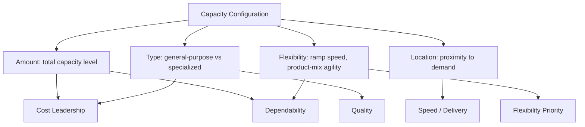

## Capacity as a Competitive Priority

### Overview

Competitive priorities are the performance dimensions a firm chooses to compete on — typically cost, quality, speed/delivery, flexibility, and dependability. Capacity is not itself a competitive priority in this list, but it functions as a critical **enabler or constraint** for every one of them: the capacity decisions an organization makes directly determine which competitive priorities it can credibly deliver on, and at what level. This item examines that enabling relationship in depth, closing the loop back to the operations-strategy positioning established earlier in this chapter.

**Key Points**

- Capacity does not compete directly with cost, quality, speed, flexibility, and dependability — it is the structural resource base that makes achieving any of them possible
- A firm's capacity configuration (amount, location, type, flexibility) implicitly caps the ceiling of what competitive priorities it can pursue
- Misalignment between chosen competitive priorities and actual capacity configuration is a common and costly strategic error

### The Enabling Relationship

Each competitive priority draws on a different combination of capacity attributes, which is why a single capacity configuration cannot simultaneously maximize all five priorities — this is the operational expression of the "focused factory" principle discussed earlier.

### How Capacity Enables Each Competitive Priority

#### Cost

- Enabled by: large-scale, high-utilization, standardized capacity that captures economies of scale
- Capacity implication: favors large discrete capacity increments, lag timing strategy, small capacity cushion, specialized (less flexible) equipment optimized for a narrow product range
- Risk if misaligned: pursuing cost leadership while carrying a large capacity cushion or highly flexible (but less efficient) general-purpose equipment erodes the cost advantage

#### Quality

- Enabled by: capacity sized to avoid overload-driven defects, with sufficient slack to support inspection, rework, and process control without breaching throughput commitments
- Capacity implication: effective capacity plans must build in allowance for quality-related planned losses (see design/effective/actual capacity distinction); running near 100% utilization tends to degrade quality through rushed work and deferred maintenance
- Risk if misaligned: aggressive utilization targets pursued without quality-loss allowances lead to defect rates that undermine the quality priority

#### Speed / Delivery

- Enabled by: capacity cushions and/or capacity located close to demand, reducing both processing delay and transportation/response lead time
- Capacity implication: favors lead or match timing strategy (capacity ahead of or tracking demand closely), geographically distributed capacity, and lower baseline utilization to leave headroom for rapid order fulfillment
- Risk if misaligned: pursuing a speed/delivery priority while running high utilization with a lag-timing capacity strategy produces exactly the queuing delays and backlogs that undermine the priority

#### Flexibility

- Enabled by: modular, general-purpose capacity, cross-trained labor, smaller capacity increments, and rapid changeover capability
- Capacity implication: favors match or dynamic/adjustment timing strategies, smaller capacity units, and investment in flexible (if less efficient) equipment over highly specialized high-volume equipment
- Risk if misaligned: committing to large, specialized, single-purpose capacity (efficient for cost leadership) directly undermines an organization's ability to pursue a flexibility priority later

#### Dependability

- Enabled by: capacity redundancy, buffer/cushion capacity, and robust maintenance practices that protect committed service levels against variability and disruption
- Capacity implication: favors deliberate excess capacity in critical/bottleneck resources, geographic or supplier diversification of capacity, and effective capacity plans with generous planned-loss allowances for maintenance
- Risk if misaligned: minimizing capacity cushion to maximize short-term cost efficiency directly threatens the ability to meet dependability commitments during demand spikes or disruptions

### Comparison Table: Capacity Configuration by Priority

| Competitive Priority | Capacity Cushion | Timing Strategy | Increment Size | Capacity Type |
| --- | --- | --- | --- | --- |
| Cost | Small | Lag | Large | Specialized |
| Quality | Moderate | Match | Moderate | Specialized with slack for QC |
| Speed/Delivery | Large | Lead | Small–Moderate | Distributed, responsive |
| Flexibility | Moderate–Large | Match/Dynamic | Small | General-purpose |
| Dependability | Large | Lead | Moderate | Redundant/buffered |

[Inference] This table synthesizes general strategic tendencies documented across operations strategy literature; actual firm configurations often blend priorities and the mapping is directional rather than prescriptive.

### Worked Example: Two Firms, Same Industry, Different Capacity-Priority Alignment

Consider two firms in contract electronics manufacturing:

- **Firm A** competes on cost leadership for high-volume, standardized orders. It invests in large, highly automated, specialized production lines, runs a lag capacity strategy, and accepts a small capacity cushion. This configuration is well-aligned: it delivers low unit cost, but would perform poorly if asked to compete on rapid custom-order turnaround.
- **Firm B** competes on flexibility and speed for low-volume, highly customized orders. It invests in modular, general-purpose equipment, cross-trains its workforce, and deliberately maintains a larger capacity cushion. This configuration sacrifices unit-cost efficiency but enables the rapid changeover and responsiveness its customers pay a premium for.

**Key Points**

- Neither configuration is superior in the abstract; each is well-aligned to its firm's chosen competitive priority
- A capacity-priority misalignment would occur if Firm A attempted to win Firm B's customer segment (custom, low-volume, fast-turnaround orders) without reconfiguring its capacity — its large, specialized, low-cushion capacity base is structurally unsuited to that priority, regardless of sales or marketing effort

### Trade-offs and the "Sand Cone" Counterpoint

**Key Points**

- The classical view (Skinner-style trade-off model) holds that competitive priorities are largely mutually exclusive and capacity must be configured to favor one dominant priority
- A competing view — sometimes called the "sand cone" or cumulative capabilities model [Inference — a specific theoretical position within operations strategy, not a consensus replacement for trade-off theory] — argues that certain capability improvements (e.g., quality) can be built as a foundation that supports rather than trades off against others (e.g., dependability, then speed, then cost), when sequenced correctly
- In capacity terms, this debate matters because it determines whether an organization should design one focused capacity configuration per priority, or invest in a capability sequence that allows a single capacity base to progressively support multiple priorities over time
- Both views agree that capacity configuration cannot be priority-agnostic; they differ on whether trade-offs are permanent structural limits or sequenceable stages

### Common Pitfalls

- Stating competitive priorities in strategy documents without verifying that the actual capacity configuration (amount, type, location, flexibility) can support them
- Assuming capacity decisions are priority-neutral operational details rather than strategic commitments that lock in which priorities are achievable
- Chasing multiple competitive priorities simultaneously with a single unfocused capacity configuration, resulting in mediocre performance on all of them (the core warning of the focused-factory concept)
- Failing to revisit capacity configuration when a firm's chosen competitive priorities shift (e.g., moving from a cost focus to a speed focus without correspondingly redesigning capacity cushion and timing strategy)

**Next Steps**

- Trade-off theory vs. cumulative capabilities (sand cone) model in operations strategy
- Focused factory and capacity segmentation strategies revisited in the context of competitive priorities
- Process choice (job shop, batch, line, continuous flow) as the capacity-type decision supporting each priority
- Capacity flexibility measurement and flexible manufacturing/service system design
- Aligning capacity investment appraisal criteria with chosen competitive priorities