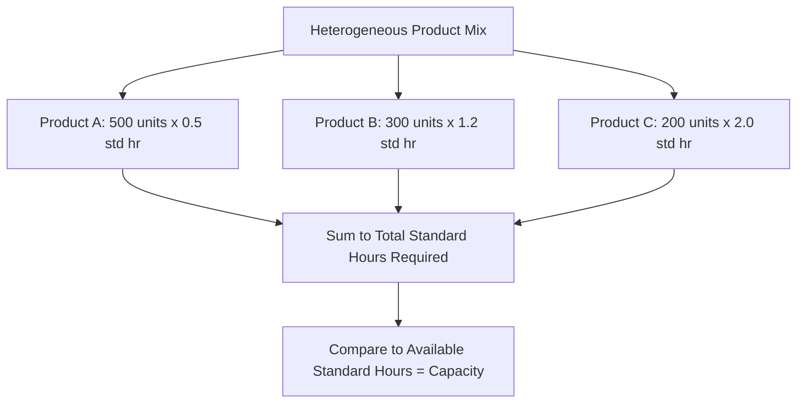

## Units and Methods of Measuring Capacity

### Overview

Before capacity can be planned, forecast, or optimized, it must be measured in a unit that is meaningful, consistent, and comparable across time periods and resources. This is deceptively difficult: most real production and service systems produce heterogeneous output, so the choice of measurement unit and method has direct consequences for the accuracy of every downstream capacity decision.

**Key Points**

- Capacity can be measured in output-based units (what comes out) or input-based units (what resources are consumed)
- Output-based measures are intuitive but break down when product/service mix is heterogeneous
- Input-based measures generalize across mixed output but require a defensible conversion or standardization method
- The choice of unit should match the planning horizon and the homogeneity of what is produced

### The Two Fundamental Measurement Approaches

#### Output-Based Measures

Capacity is expressed as a rate of finished units produced: units/hour, tons/day, patients/day, transactions/second. This works cleanly when output is homogeneous.

$$\text{Output-Based Capacity} = \frac{\text{Units Produced}}{\text{Time Period}}$$

**Best suited for**: single-product or narrow-product-range operations (a bottling line, a single-service call center)

#### Input-Based Measures

Capacity is expressed in terms of a standardized resource input consumed to produce output: machine-hours, labor-hours, bed-days, server-CPU-hours. This generalizes across a heterogeneous product/service mix because inputs can be aggregated even when outputs cannot.

$$\text{Input-Based Capacity} = \text{Available Resource-Time} \quad (\text{e.g., machine-hours/week})$$

**Best suited for**: multi-product, multi-service, or highly variable-mix operations (a job shop, a hospital, a shared cloud cluster)

### Comparison Table

| Dimension | Output-Based | Input-Based |
| --- | --- | --- |
| Intuitiveness | High — directly meaningful to stakeholders | Lower — requires translation to interpret |
| Handles mixed product/service lines | Poorly | Well |
| Common units | Units/hour, tons/day, calls/hour | Machine-hours, labor-hours, bed-days |
| Requires standardization step | No | Yes (e.g., standard time per unit) |
| Typical domain | Single-product manufacturing, homogeneous services | Job shops, hospitals, multi-product plants, shared infrastructure |

### Standardization: Converting Heterogeneous Output to a Common Unit

When output is heterogeneous, planners often construct a **standard unit of capacity** by weighting different products/services according to their relative resource consumption.

$$\text{Standard Hours Required} = \sum_i (\text{Units of Product } i \times \text{Standard Time per Unit}_i)$$

This produces a single aggregated capacity requirement figure (e.g., "total standard machine-hours needed this month") even though the underlying products are not directly comparable unit-for-unit.

### Worked Example: Standardized Capacity Requirement

A job shop produces three products in a given week:

| Product | Units Ordered | Standard Time/Unit (hr) | Standard Hours Required |
| --- | --- | --- | --- |
| A | 500 | 0.5 | 250 |
| B | 300 | 1.2 | 360 |
| C | 200 | 2.0 | 400 |
| **Total** |  |  | **1,010** |

If the shop has 5 machines available 40 hours/week each, total available capacity is:

$$5 \times 40 = 200 \text{ machine-hours/week}$$

**Key Points**

- The mismatch between 1,010 standard hours required and 200 machine-hours available (over a single week) immediately reveals a large capacity shortfall — information that would be invisible if capacity were tracked only in raw "units produced," since Products A, B, and C are not interchangeable
- This is the core justification for input-based, standardized measurement in mixed-output environments: it makes otherwise incomparable output types commensurable for planning purposes
- [Inference] Standard times themselves are typically derived from time-and-motion studies, historical averages, or engineering estimates, and carry their own estimation uncertainty that propagates into the capacity requirement figure

### Sector-Specific Measurement Conventions

| Sector | Common Capacity Unit(s) |
| --- | --- |
| Discrete manufacturing | Units/hour, machine-hours, labor-hours |
| Process/continuous manufacturing | Tons/day, barrels/day, liters/hour |
| Healthcare | Staffed beds, bed-days, OR-hours, patients/day |
| Hospitality | Available rooms, room-nights |
| Transportation/logistics | Ton-miles, container slots (TEU), vehicle-hours |
| Call centers/BPO | Agent-hours, seats, calls handled/hour |
| IT/cloud infrastructure | CPU-cores, vCPU-hours, requests/second, storage (TB), IOPS |
| Education | Seat-hours, student capacity per cohort |

[Inference] These are conventional industry units rather than universal standards; organizations frequently define proprietary composite units (e.g., a hospital's "case-mix-adjusted bed-day") suited to their specific mix.

### Measurement Method Considerations

Beyond choosing a unit, the *method* of measurement matters:

- **Time-study/engineered standards**: standard times derived from direct observation or predetermined motion-time systems — precise but resource-intensive to develop and maintain
- **Historical/statistical estimation**: standard times or capacity rates inferred from historical throughput data — cheaper to obtain but can encode past inefficiencies as if they were fixed standards
- **Vendor/nameplate rating**: manufacturer-specified maximum rates (design capacity) — useful as an upper bound but rarely achievable in sustained operation (see design vs. effective capacity)
- **Bottleneck-resource measurement**: measuring capacity only at the most constrained resource in a multi-stage process, since system throughput cannot exceed the bottleneck's rate regardless of other stations' capacity

$$\text{System Capacity} = \min(\text{Capacity}_1, \text{Capacity}_2, \ldots, \text{Capacity}_n)$$

across the $n$ stages of a process — this bottleneck principle is a direct consequence of correctly scoping *what* is being measured (a single resource vs. the end-to-end system).

### Choosing a Measurement Unit: Decision Guidance

| If... | Then prefer... |
| --- | --- |
| Single product/service, stable mix | Output-based units |
| Multiple products/services, variable mix | Input-based, standardized units |
| Reporting to non-technical stakeholders | Output-based (or output-equivalent translations) |
| Feeding aggregate/tactical planning models | Input-based standard hours |
| Comparing capacity across dissimilar facilities | Input-based, normalized units |
| Measuring a specific bottleneck resource | Resource-specific input units (e.g., that machine's hours) |

### Common Pitfalls

- Measuring capacity in raw output units when the product/service mix is heterogeneous, producing misleading period-over-period comparisons as mix shifts
- Using vendor/nameplate (design) capacity as if it were an achievable planning figure, rather than converting to effective capacity first
- Deriving standard times purely from historical averages without auditing whether those averages already embed inefficiency or idle time
- Measuring capacity at a non-bottleneck resource and concluding the system has more capacity than it actually does
- Failing to update standard times/conversion factors as processes, technology, or product designs change, causing capacity requirement calculations to drift out of alignment with reality

**Next Steps**

- Bottleneck identification and Theory of Constraints in multi-stage systems
- Time-and-motion study and predetermined motion-time systems for standard-time development
- Aggregate planning using standardized capacity units across product families
- Capacity requirements planning (CRP) in MRP-based manufacturing systems
- Measuring capacity in shared/multi-tenant IT infrastructure (vCPU allocation vs. actual utilization)