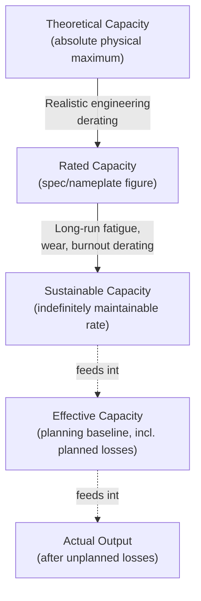

## Theoretical, Rated, and Sustainable Capacity

### Overview

This item introduces a second, complementary capacity classification scheme to the design/effective/actual hierarchy covered earlier. Where design/effective/actual capacity decomposes capacity by *loss category* (planned vs. unplanned), the theoretical/rated/sustainable framework decomposes capacity by *time horizon of achievability* — distinguishing what a system can do momentarily, what it is certified or specified to do under normal conditions, and what it can maintain indefinitely without degradation. The two frameworks overlap conceptually but are not identical, and conflating them is a common source of confusion in capacity documentation.

**Key Points**

- Theoretical capacity: the absolute physical/engineering maximum, achievable only momentarily or under ideal, unrealistic conditions
- Rated capacity: the capacity a system is specified or certified to deliver under stated normal operating conditions — a vendor or engineering benchmark figure
- Sustainable capacity: the capacity a system can maintain continuously over an extended period without degradation, breakdown, or excessive wear
- $\text{Theoretical Capacity} \geq \text{Rated Capacity} \geq \text{Sustainable Capacity}$ in essentially all practical systems

### Formal Definitions

#### Theoretical Capacity

The maximum output rate physically or mathematically possible, assuming zero downtime, zero variability, perfect material/input availability, and no degradation over time. It is a limiting, largely academic figure — useful for engineering upper-bound analysis but not a planning target.

$$\text{Theoretical Capacity} = \frac{1}{\text{Minimum Possible Cycle Time}} \times \text{Total Available Time}$$

#### Rated Capacity

The capacity a system is specified to achieve under stated, realistic-but-favorable operating conditions — typically the figure found on equipment nameplates, vendor spec sheets, or engineering design documents. Rated capacity already assumes *some* realistic constraints (e.g., standard operating temperature, standard material grade) but not the full set of planned and unplanned losses a real operation will encounter.

$$\text{Rated Capacity} = \text{Theoretical Capacity} \times \text{Design Derating Factor}$$

#### Sustainable Capacity

The output rate a system can maintain *indefinitely* — over months or years — without accelerated wear, rising failure rates, or requiring unsustainable overtime/staffing patterns. Sustainable capacity is typically meaningfully lower than rated capacity because it must account for cumulative fatigue effects (mechanical wear, workforce burnout) that only manifest over long durations, not in a single test or short observation window.

$$\text{Sustainable Capacity} = \text{Rated Capacity} \times \text{Long-Run Derating Factor}$$

### The Full Nested Hierarchy

**Key Points**

- Sustainable capacity is a *ceiling* input into effective capacity planning, not the same figure — effective capacity further subtracts specific planned losses (maintenance schedules, changeovers) that apply to a particular operating plan, whereas sustainable capacity is a general property of the resource itself
- A system can legitimately run *above* its sustainable capacity for short bursts (e.g., meeting a temporary demand spike) without immediate failure, but doing so persistently accelerates the very degradation the sustainable-capacity concept is meant to capture

### Worked Example: Distinguishing the Three Levels

A packaging machine's engineering specification states a theoretical maximum of 300 units/minute (achievable only in a lab test with a single, defect-free product run and zero interruption).

- **Theoretical capacity**: 300 units/minute
- **Rated capacity** (vendor nameplate, assuming standard production conditions and typical product variation): 240 units/minute — a 20% derate from theoretical
- **Sustainable capacity** (the rate the plant has found it can run continuously, 24/7, for years, without abnormal wear or breakdown frequency): 200 units/minute — a further ~17% derate from rated

**Key Points**

- If the plant plans production schedules using the 300 units/minute theoretical figure, every schedule will be systematically infeasible
- If the plant plans using the 240 units/minute rated figure without adjustment, it may appear to meet targets in the short term while accumulating excess wear, leading to a rising unplanned-downtime rate over subsequent months — an unplanned loss that only becomes visible in hindsight
- Using the 200 units/minute sustainable figure as the basis for the *effective capacity* planning calculation (further adjusted for scheduled maintenance, changeovers, etc.) produces the most realistic long-run planning baseline

### Human/Workforce Analogue

The same three-tier structure applies to labor-based capacity:

| Level | Manufacturing Equipment | Human Workforce |
| --- | --- | --- |
| Theoretical | Absolute physical max output rate | Maximum output in a single high-intensity burst (e.g., a sprint week) |
| Rated | Vendor-specified standard operating rate | Standard productivity rate used in workforce planning (e.g., "8 productive hours/day") |
| Sustainable | Long-run maintainable rate without excess wear | Productivity rate maintainable indefinitely without burnout, turnover, or quality decline |

[Inference] The sustainable-pace concept is well established in both operations management (as continuous, long-run maximum sustainable output) and in agile/lean workforce management (as "sustainable pace"), though the precise quantitative derating from rated to sustainable capacity is context-specific and not governed by a universal formula — it is typically estimated empirically from historical performance and attrition/failure data.

### Why the Distinction Matters for Capacity Planning

**Key Points**

- **Strategic capacity sizing** should be anchored on sustainable capacity, since strategic decisions govern long-run resource commitments — sizing a facility around rated or theoretical capacity systematically overstates what the facility can deliver over its operating life
- **Short-term operational flexing** can legitimately draw on the gap between sustainable and rated capacity (e.g., temporary overtime, running equipment slightly above its normal sustainable rate) to absorb short demand spikes, provided this is the exception rather than the routine operating mode
- **Vendor/nameplate rated capacity figures should never be used directly as planning inputs** without derating — they are marketing/specification figures optimized to look favorable, not operational planning baselines
- Monitoring the gap between planned output and sustainable capacity over time serves as an early-warning indicator: a plan that persistently requires operating above sustainable capacity signals either a genuine strategic capacity shortfall or an unsustainable operating pattern accumulating hidden risk

### Common Pitfalls

- Using theoretical or rated (nameplate) capacity as the basis for demand-matching or staffing decisions, producing chronically unachievable targets
- Confusing "rated capacity" (a vendor specification) with "effective capacity" (a planning-specific figure that also subtracts an organization's own planned losses) — the two concepts are related but not interchangeable
- Treating short-term above-sustainable-capacity operation (e.g., a seasonal push) as a viable steady-state plan, leading to accelerated equipment failure or workforce burnout
- Failing to periodically re-estimate sustainable capacity as equipment ages or as workforce composition changes, causing planning baselines to drift out of alignment with actual long-run performance
- Applying the same derating factor across dissimilar equipment or roles without validating it against that specific resource's actual failure/fatigue history

**Next Steps**

- Overall Equipment Effectiveness (OEE) and its relationship to sustainable capacity derating
- Preventive maintenance strategy and its role in protecting sustainable capacity over equipment lifecycle
- Workforce burnout, turnover, and sustainable pace in service and knowledge-work capacity planning
- Capacity requirements planning (CRP) using sustainable capacity as the long-run planning baseline
- Statistical reliability and wear modeling (e.g., bathtub curve) as a quantitative basis for long-run derating factors