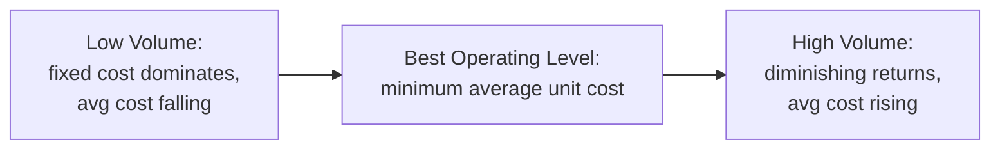
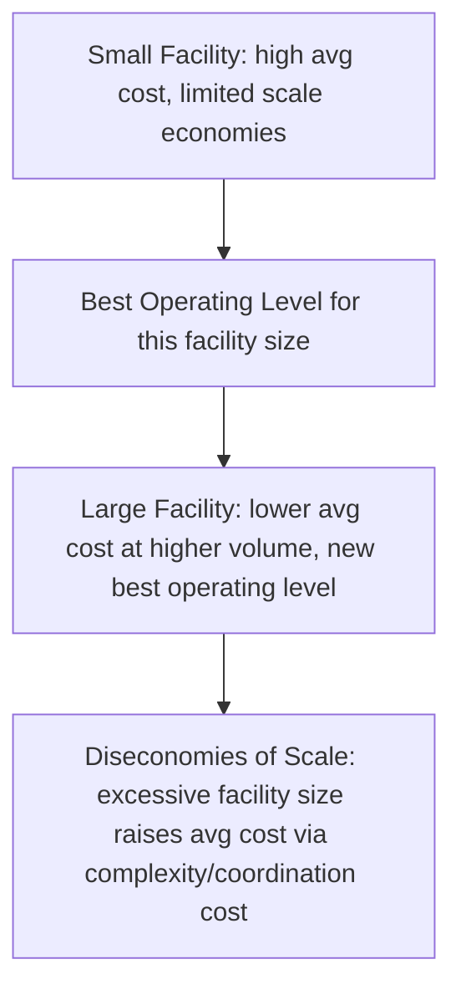

## Best Operating Level and Diminishing Returns

### Overview

The best operating level is the output volume at which average unit cost is minimized — the point of maximum production efficiency for a given facility or process design. This concept explains why utilization near 100% of design capacity is frequently *not* cost-optimal, and it formalizes the diminishing-returns dynamic that limits how far a fixed capacity base can be pushed before further output becomes progressively more expensive.

**Key Points**

- Best operating level (BOL) is a volume, not a percentage — it is typically expressed as a percentage of design capacity for comparability across facilities
- Average unit cost follows a U-shaped curve as volume increases: falling initially due to fixed-cost spreading, then rising due to diminishing returns
- Operating above the best operating level does not mean the system stops producing — it means each additional unit costs more than the last, even though total output is still rising

### The Underlying Cost Structure

Average unit cost combines fixed and variable cost components:

$$\text{Average Unit Cost}(Q) = \frac{\text{Fixed Cost}}{Q} + \text{Variable Cost per Unit}(Q)$$

At low volumes, fixed cost dominates and spreads over more units as $Q$ rises, pulling average cost down. Beyond some volume, variable cost per unit begins rising — due to overtime premiums, expedited materials, increased defect/rework rates, and congestion effects — pulling average cost back up. The **best operating level** is the volume $Q^*$ at which this trade-off is minimized.

$$Q^* = \arg\min_{Q} \left[ \frac{\text{Fixed Cost}}{Q} + \text{Variable Cost per Unit}(Q) \right]$$

### The Classic U-Shaped Average Cost Curve

Below the best operating level, capacity is **underutilized relative to its most efficient point** — fixed costs are spread over too few units. Above it, the system experiences **diminishing returns to the fixed resource base** — congestion, scheduling conflicts, increased breakdown frequency, and quality losses drive variable costs up faster than output grows.

### Why Diminishing Returns Occur Beyond the Best Operating Level

**Key Points**

- **Congestion effects**: as utilization rises, queuing and waiting time for shared resources (tooling, materials-handling, inspection stations) increase non-linearly, reducing effective throughput per unit of nominal capacity used
- **Overtime and premium labor**: sustaining output above normal capacity typically requires overtime pay or premium-rate contract labor, raising marginal cost per unit
- **Increased breakdown/maintenance frequency**: operating equipment above its sustainable capacity (see prior item) accelerates wear, increasing unplanned downtime and repair cost
- **Quality/defect escalation**: rushed operation and deferred maintenance at high utilization tend to increase scrap and rework rates, raising effective cost per good unit
- **Coordination and scheduling complexity**: at high utilization, scheduling flexibility shrinks, increasing the cost and difficulty of accommodating any variation or disruption

[Inference] The specific shape and steepness of the rising portion of the cost curve is empirical and system-specific; the general U-shaped pattern is a standard operations management model, but real-world curves may be asymmetric or have a flatter minimum region ("efficient range") rather than a single sharp point.

### Economies and Diseconomies of Scale — The Facility-Level Analogue

The same logic applies at the facility-sizing level, not just the single-process utilization level, producing a family of nested U-shaped curves:

Each facility size has its *own* U-shaped average cost curve and its own best operating level; connecting the minima of successive facility-size curves produces the long-run average cost curve used in strategic capacity sizing decisions. This is why the minimum efficient scale (introduced in the operations-strategy item) is defined as the smallest facility size at which the long-run average cost curve flattens out.

### Worked Example

A plant has fixed costs of $500,000/year. Variable cost per unit is $20 up to 40,000 units/year (the facility's best operating level), after which overtime and expedited-material costs raise variable cost to $26/unit for output beyond that point.

**At 40,000 units (best operating level):**

$$\text{Average Cost} = \frac{500{,}000}{40{,}000} + 20 = 12.50 + 20 = \$32.50/\text{unit}$$

**At 50,000 units (pushing beyond BOL):**

$$\text{Average Cost} = \frac{500{,}000}{50{,}000} + \frac{40{,}000(20) + 10{,}000(26)}{50{,}000} = 10.00 + 21.20 = \$31.20/\text{unit}$$

[Note: in this specific numerical case, the falling fixed-cost-per-unit effect still outweighs the higher marginal variable cost at 50,000 units, illustrating that the *exact* location of the true minimum requires solving the full cost function rather than assuming the stated "best operating level" label is automatically cost-minimizing — real best operating levels are identified by finding where marginal cost equals average cost, not by assumption.]

**At 60,000 units:**

$$\text{Average Cost} = \frac{500{,}000}{60{,}000} + \frac{40{,}000(20) + 20{,}000(26)}{60{,}000} = 8.33 + 22.67 = \$31.00/\text{unit}$$

**Key Points**

- This worked example illustrates an important nuance: the volume at which variable cost per unit begins rising (often loosely called the "capacity limit") is not automatically the same volume that minimizes *average* total cost — the two can diverge because falling fixed-cost-per-unit can continue to outweigh rising marginal cost for some range beyond the nominal "rated" limit
- Correctly identifying the true best operating level requires modeling the full average cost function across the relevant volume range, not simply equating it with the point where variable costs start climbing

### Best Operating Level vs. Design Capacity

**Key Points**

- The best operating level is typically **below** design capacity and often below rated capacity as well — it reflects a cost-minimization criterion, not a maximum-output criterion
- Operating at design or rated capacity is not necessarily desirable even when physically achievable, since doing so may fall well past the point of rising marginal cost
- Capacity utilization targets should reference the best operating level (or an efficient operating *range* around it) rather than 100% of design capacity, when the planning objective is cost minimization

### Common Pitfalls

- Treating "capacity" and "best operating level" as synonyms — capacity describes what a system *can* produce; best operating level describes what it *should* produce for cost efficiency
- Setting utilization targets at or near 100% of design/rated capacity without checking whether that volume lies past the point of rising marginal cost
- Assuming the best operating level is a fixed, permanent volume — it shifts as fixed/variable cost structures change (e.g., after equipment upgrades, wage changes, or automation investment)
- Confusing the single-process best operating level with the facility-level minimum efficient scale — they are related but operate at different levels of analysis
- Ignoring quality and reliability degradation costs when estimating the rising portion of the average cost curve, understating how quickly diminishing returns set in

**Next Steps**

- Minimum efficient scale and long-run average cost curves at the facility level
- Marginal cost vs. average cost analysis for precise best-operating-level identification
- Overall Equipment Effectiveness (OEE) as a diagnostic for why output degrades above sustainable capacity
- Break-even analysis and cost-volume-profit modeling for capacity investment decisions
- Queuing theory: congestion effects and non-linear delay growth near capacity limits