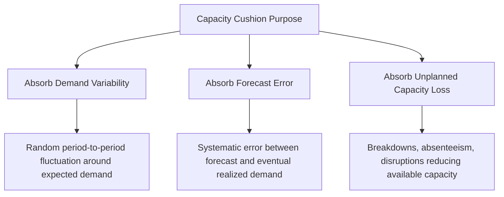
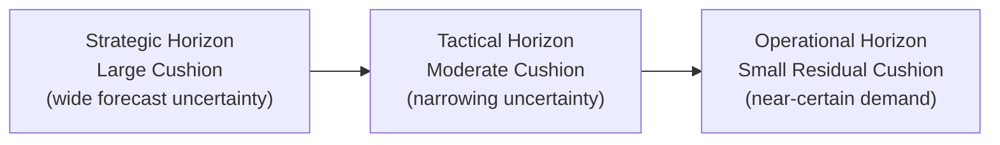

## Capacity Cushion and Its Strategic Purpose

### Overview

Capacity cushion is the deliberate gap maintained between average expected demand and available capacity. Introduced briefly in the operations-strategy chapter as a strategic variable linked to competitive priorities, this item treats it as a measurable, decision-driving quantity in its own right — how it is calculated, what factors determine its optimal size, and how it functions as insurance against the variability and uncertainty that no forecast can fully eliminate.

**Key Points**

- Capacity cushion is a deliberate policy choice, not an accidental byproduct of imprecise planning
- It functions as a buffer against demand variability, forecast error, and unplanned capacity loss simultaneously
- The "correct" cushion size is context-dependent, driven by demand variability, the cost asymmetry between shortage and excess, and the chosen competitive priority

### Formal Definition

$$\text{Capacity Cushion} = \left(1 - \frac{\text{Average Demand (or Utilization)}}{\text{Design Capacity}}\right) \times 100\%$$

Equivalently, in utilization terms:

$$\text{Capacity Cushion} = 100\% - \text{Utilization}$$

A capacity cushion of 20% means the system is designed to run, on average, at 80% of design capacity, deliberately holding 20% of capacity in reserve.

**Negative cushions** are possible and occur when average demand exceeds design capacity — a structurally unsustainable position that manifests as chronic backlog, systematic overtime, or persistent unmet demand, and signals an urgent need for capacity expansion or demand management.

### Why Cushion Is Necessary: Three Distinct Sources of Uncertainty

**Key Points**

- **Demand variability**: even a perfectly unbiased forecast has variance; a cushion sized only to the *mean* forecast leaves no room for above-average demand periods, which occur roughly half the time by definition
- **Forecast error**: forecasts systematically degrade in accuracy over longer horizons (see the planning-horizon item), so strategic-level cushions must be larger to compensate for wider long-range forecast uncertainty
- **Unplanned capacity loss**: even at constant demand, unplanned equipment failure, absenteeism, or supply disruption can reduce *available* capacity below plan — a cushion provides resilience against this without requiring immediate emergency response

### Factors Driving Optimal Cushion Size

| Factor | Effect on Optimal Cushion |
| --- | --- |
| High demand variability/volatility | Larger cushion needed |
| High cost of shortage relative to cost of excess | Larger cushion needed (see critical-ratio framing from the cost-asymmetry item) |
| Long/inflexible capacity-addition lead time | Larger cushion needed (cannot react quickly if cushion runs out) |
| Competitive priority: speed, flexibility, dependability | Larger cushion favored |
| Competitive priority: cost leadership | Smaller cushion favored |
| High cost of holding idle capacity (capital-intensive resources) | Smaller cushion favored |
| Ability to use flexible, low-lead-time capacity levers (overtime, subcontracting, elastic infrastructure) | Smaller structural cushion needed, since short-term levers can substitute for standing cushion |

[Inference] This table synthesizes qualitative directional relationships documented across operations management sources; no single universal formula converts these factors into a precise optimal cushion percentage — actual cushion sizing typically combines the critical-ratio-style cost trade-off (from the earlier cost-of-capacity item) with organization-specific risk tolerance.

### Cushion Size Across Planning Horizons

**Key Points**

- **Strategic-level cushions** tend to be larger, since long-range forecast error is greatest and capacity-addition lead times are longest at this horizon
- **Tactical-level cushions** are moderate, reflecting improved (but still imperfect) medium-range forecast accuracy and the availability of medium-lead-time levers (hiring, subcontracting)
- **Operational-level cushions** can be smaller in a well-managed system, since short-range forecasts are most accurate and flexible short-lead-time levers (overtime, rescheduling) are available to absorb residual variability
- This creates a natural "cushion cascade" — a large strategic cushion is progressively "spent down" as forecast accuracy improves and the planning horizon shortens, with only a small residual cushion needed at the point of execution

### Worked Example

A manufacturer has design capacity of 10,000 units/month. Average demand is 8,000 units/month, giving a baseline cushion of:

$$\text{Cushion} = 1 - \frac{8{,}000}{10{,}000} = 20\%$$

Historical demand data shows a standard deviation of 1,200 units/month. To ensure capacity covers demand in roughly 95% of months (a service-level-style target), the firm might set required capacity at approximately:

$$\text{Required Capacity} \approx \text{Mean Demand} + z_{0.95} \times \sigma = 8{,}000 + 1.645 \times 1{,}200 \approx 9{,}974 \text{ units/month}$$

**Key Points**

- This calculation shows the firm's current 10,000-unit design capacity provides slightly more than the cushion needed to cover demand 95% of the time under a normal-distribution assumption
- If the firm instead wanted 99% coverage ($z_{0.99} \approx 2.33$), required capacity would rise to approximately $8{,}000 + 2{,}796 = 10{,}796$ units — exceeding current design capacity and signaling a genuine expansion need if that higher service level is a strategic requirement
- [Inference] This normal-distribution, z-score approach is a standard simplified statistical framing borrowed from safety-stock/service-level theory; real demand distributions may be skewed, seasonal, or otherwise non-normal, requiring more sophisticated distributional assumptions for high-precision cushion sizing

### Cushion in Service and IT Contexts

- **Services (no inventory buffer)**: capacity cushion directly determines wait-time and service-level performance; queuing theory formalizes how thin cushions (utilization approaching 100%) cause wait times to grow non-linearly
- **IT/cloud infrastructure**: cushion appears as "headroom" — the gap between provisioned capacity and observed peak load, sized to absorb traffic spikes before autoscaling or manual intervention can react; a related but distinct concept is redundancy/failover capacity, which provides cushion specifically against component failure rather than demand variability

### Common Pitfalls

- Treating a single organization-wide cushion figure as appropriate across all planning horizons, ignoring the natural cushion cascade from strategic to operational levels
- Sizing cushion using only the mean demand forecast, ignoring demand variability entirely — this produces an expected 50% shortfall rate by construction, regardless of "cushion" language used
- Setting cushion policy without reference to the actual cost asymmetry between shortage and excess (see the earlier cost-of-capacity item), defaulting instead to arbitrary round-number targets
- Allowing cushion to erode silently over time as demand grows against a fixed capacity base, without a trigger mechanism to prompt capacity expansion review
- Assuming a large cushion is always "safer" without acknowledging its real carrying cost — cushion sizing is a genuine trade-off, not a free insurance policy

**Next Steps**

- Safety stock and service-level modeling techniques applied to capacity cushion sizing
- Critical-ratio and newsvendor-style cost trade-off models (cross-reference to the cost-of-excess/insufficient-capacity item)
- Queuing theory: quantifying how cushion (utilization) drives wait-time performance in service systems
- Demand forecasting accuracy and its degradation across planning horizons
- Capacity triggers and review mechanisms for detecting cushion erosion over time