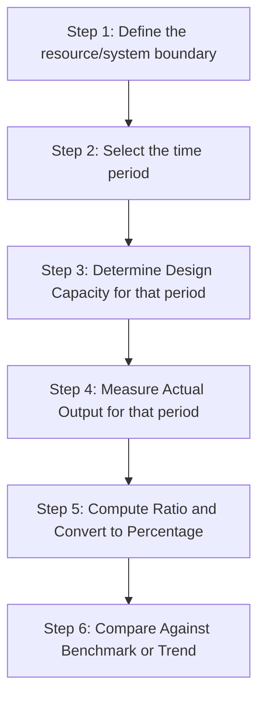
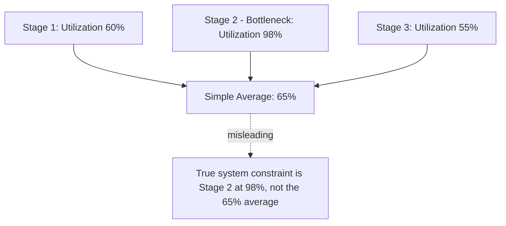

## Calculating Capacity Utilization Rate

### Overview

This item provides a focused, computational treatment of capacity utilization rate — the calculation mechanics, data requirements, common variants, and worked calculations across different measurement contexts. Where earlier chapter items established the conceptual meaning of utilization within the design/effective/actual hierarchy, this item is a practical calculation reference.

**Key Points**

- The base formula is simple; the difficulty in practice lies in correctly defining the numerator and denominator for a given context
- Utilization can be calculated at different levels of aggregation: single resource, workstation, department, or entire facility
- Time-period selection materially affects the calculated rate, especially in operations with cyclical or seasonal demand

### The Base Formula

$$\text{Capacity Utilization Rate} = \frac{\text{Actual Output}}{\text{Design Capacity}} \times 100\%$$

Where a system's output is more naturally measured in time rather than units (labor, machines, service resources), an equivalent time-based formulation is used:

$$\text{Capacity Utilization Rate} = \frac{\text{Time Resource Was Actually Used}}{\text{Total Available Time}} \times 100\%$$

Both formulations are mathematically equivalent when output rate is constant; the time-based version is preferred whenever output units are heterogeneous (see the earlier item on measurement units and methods).

### Step-by-Step Calculation Procedure

1. **Define the boundary**: a single machine, a workstation, a department, or the entire facility — utilization calculated at different boundaries can yield very different figures for the same operation
2. **Select the time period**: hour, shift, day, week, month, year — shorter periods reveal more variability; longer periods smooth over spikes and troughs
3. **Determine design capacity**: total possible output/time available in that period under ideal conditions
4. **Measure actual output**: units produced, transactions completed, or time resource was in use, for that same period
5. **Compute the ratio** and express as a percentage
6. **Compare against benchmark**: prior periods, industry benchmarks, or internal targets (best operating level, from the earlier item) rather than treating the raw number in isolation

### Worked Example 1: Simple Single-Resource Calculation

A machine is rated for 500 units/day (design capacity, based on a 10-hour operating day at 50 units/hour). It actually produced 380 units yesterday.

$$\text{Utilization} = \frac{380}{500} \times 100\% = 76\%$$

### Worked Example 2: Time-Based Calculation with Multiple Resources

A department has 8 workstations, each available 8 hours/day, 5 days/week.

$$\text{Total Available Time (weekly)} = 8 \text{ stations} \times 8 \text{ hr/day} \times 5 \text{ days} = 320 \text{ station-hours/week}$$

Actual recorded productive time across all stations last week was 224 station-hours.

$$\text{Utilization} = \frac{224}{320} \times 100\% = 70\%$$

**Key Points**

- This aggregated department-level figure of 70% can mask significant variation between individual stations — one station might run at 95% while another sits at 40%
- Calculating utilization only at the aggregate level, without decomposing to the individual-resource level, can hide localized bottlenecks or underused assets that a facility-wide average obscures

### Worked Example 3: Period-Length Sensitivity in a Seasonal Business

A retailer's fulfillment center has design capacity of 10,000 orders/day.

| Period | Actual Orders | Design Capacity | Utilization |
| --- | --- | --- | --- |
| Peak week (holiday) | 9,500/day avg | 10,000/day | 95% |
| Off-peak week | 4,000/day avg | 10,000/day | 40% |
| Annual average | 6,200/day avg | 10,000/day | 62% |

**Key Points**

- The annual average (62%) is a defensible figure for long-range strategic capacity sizing, since it reflects the full demand cycle the facility must be sized against
- The same 62% figure would be highly misleading if used to conclude the facility is "underutilized" and should be downsized — doing so would eliminate the very cushion needed to handle the 95%-utilization peak week
- This illustrates why **period selection must match the planning question being asked**: strategic sizing requires visibility into peak-period utilization, not just the annual average

### Handling Multiple Product/Service Mixes

When output is heterogeneous, utilization should be calculated using standardized units (see the earlier measurement-methods item) rather than raw output counts:

$$\text{Utilization} = \frac{\text{Standard Hours Actually Used}}{\text{Standard Hours Available (Design Capacity)}} \times 100\%$$

**Example**: A job shop has 200 available machine-hours this week (design capacity). Actual production consumed 250 standard machine-hours (calculated by summing units of each product times their standard time per unit).

$$\text{Utilization} = \frac{250}{200} \times 100\% = 125\%$$

**Key Points**

- Utilization figures **can exceed 100%** when actual output is measured against a design capacity baseline that has been temporarily exceeded through overtime, extra shifts, or subcontracted overflow — this is a valid and informative result, not a calculation error
- A sustained utilization rate above 100% is a strong signal of a structural capacity shortfall (see the sustainable-capacity item), since it indicates the system is routinely operating beyond its rated baseline

### Utilization at Different Levels: Resource vs. Bottleneck vs. System

**Key Points**

- Utilization calculated for a **non-bottleneck resource** can be high or low without directly indicating system-level performance, since non-bottleneck capacity is not what constrains total throughput
- Utilization calculated for the **bottleneck resource** is the most diagnostically important single figure in a multi-stage process, since system throughput is bounded by it directly (see the bottleneck principle from the measurement-methods item)
- **System-level utilization**, if calculated as a simple average across all resources, can obscure the bottleneck's true utilization — a facility might show 65% average utilization while its bottleneck resource runs at 98%

### Common Calculation Errors to Avoid

- Mixing time periods between numerator and denominator (e.g., weekly actual output divided by daily design capacity)
- Using rated or theoretical capacity as the denominator when effective capacity is the more appropriate baseline for the question being asked (see the theoretical/rated/sustainable item)
- Averaging utilization rates across resources with very different capacities without weighting by capacity size, which distorts the aggregate figure
- Failing to account for planned downtime consistently — including scheduled maintenance in "available time" for one period but excluding it in another, making period-over-period comparisons invalid
- Reporting a single utilization figure without specifying which capacity baseline (design, rated, effective) was used as the denominator, creating ambiguity for anyone comparing figures across reports or facilities

### Common Pitfalls

- Treating a low aggregate utilization figure as automatically indicating "excess capacity" without checking whether it reflects deliberate cushion, seasonal averaging, or genuine underuse
- Calculating utilization only at the facility-average level and missing a bottleneck resource running dangerously close to (or over) its sustainable limit
- Comparing utilization rates across facilities or time periods that use inconsistent capacity baselines (one using design capacity, another using effective capacity)
- Ignoring utilization rates that exceed 100% as "impossible" rather than correctly interpreting them as a signal of capacity being temporarily exceeded via overtime or subcontracting

**Next Steps**

- Overall Equipment Effectiveness (OEE) as an extended, loss-decomposed utilization metric
- Bottleneck identification and Theory of Constraints for correctly scoping utilization analysis
- Standard hours and standardized capacity units for multi-product utilization calculations
- Capacity requirements planning (CRP) using utilization data as a forecasting input
- Statistical control charts for monitoring utilization trends over time