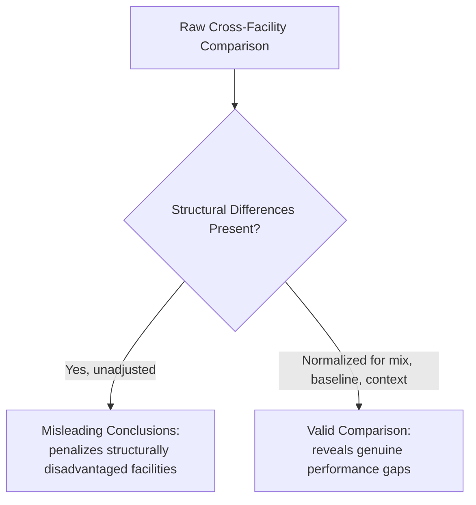
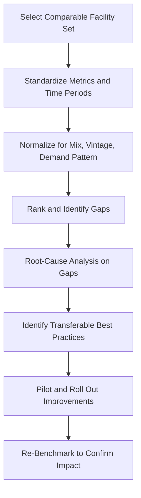

## Benchmarking Capacity Performance Across Facilities

### Overview

Benchmarking capacity performance across facilities extends single-facility utilization and efficiency analysis into a comparative discipline: identifying performance gaps between plants, sites, or business units, and using those gaps to drive targeted improvement or capacity reallocation decisions. Cross-facility benchmarking is methodologically harder than single-facility trend analysis because it requires normalizing away structural differences that have nothing to do with operational performance.

**Key Points**

- Raw utilization or output comparisons across facilities are frequently misleading unless normalized for capacity baseline, product mix, and operating context
- Benchmarking serves two purposes: diagnostic (finding underperformers) and prescriptive (transferring best practices from top performers)
- Internal cross-facility benchmarking and external industry benchmarking require different data access and carry different reliability caveats

### Why Naive Cross-Facility Comparison Fails

**Key Points**

- **Different capacity baselines**: comparing raw utilization percentages is meaningless unless all facilities calculate utilization against the same type of denominator (design vs. effective vs. rated capacity)
- **Different product/service mix**: a facility running high-complexity, low-volume products will show different utilization and cycle-time patterns than one running simple, high-volume products, even at identical operational quality
- **Different equipment vintage**: an older facility may show lower utilization or higher unplanned downtime purely due to equipment age, not management performance
- **Different demand patterns**: a facility serving a highly seasonal market will show different average utilization than one serving stable demand, independent of operational skill
- **Different labor/regulatory context**: staffing ratios, shift-length regulations, and labor cost structures vary by geography and can materially affect achievable capacity metrics

### Normalization Techniques

| Technique | Purpose |
| --- | --- |
| Standardize the capacity denominator | Ensure all facilities report utilization against the same capacity type (e.g., all effective capacity, not a mix of design and effective) |
| Standard-hours conversion | Normalize output across facilities with different product mixes into a common standardized unit (see the earlier measurement-methods item) |
| Case-mix / complexity adjustment | Weight output by relative complexity or resource intensity (common in healthcare: case-mix index) |
| Age/vintage stratification | Compare facilities within similar equipment-age cohorts rather than across the full portfolio at once |
| Demand-pattern adjustment | Compare peak-to-peak and trough-to-trough rather than raw annual averages when seasonality differs |
| Per-unit cost normalization | Compare cost-per-standard-unit rather than raw utilization, capturing efficiency effects that utilization alone misses |

### Common Benchmarking Metrics

| Metric | What It Reveals |
| --- | --- |
| Utilization rate (normalized) | Volume realized relative to capacity |
| Efficiency rate | Performance against the facility's own realistic operating plan |
| OEE | Composite availability × performance × quality effectiveness |
| Cost per standard unit | Overall cost efficiency, capturing both capacity and non-capacity cost drivers |
| Unplanned downtime rate | Reliability/maintenance performance |
| Cycle time / throughput time | Process speed and flow efficiency |
| Capacity cushion realized vs. planned | Whether facilities are running closer to or further from their intended strategic posture |

### A Structured Benchmarking Process

**Key Points**

- Benchmarking should be treated as an ongoing cycle, not a one-time report — a single comparison snapshot cannot distinguish structural difference from a genuine, correctable performance gap without follow-up root-cause analysis
- Root-cause analysis is the step most often skipped in practice; ranking facilities without investigating *why* the gap exists frequently leads to superficial fixes (e.g., simply mandating a higher utilization target) rather than addressing the underlying driver

### Worked Example: Multi-Facility Comparison

Three plants in the same company produce a similar product line but differ in size and vintage.

| Plant | Raw Utilization | Product Mix Complexity | Age | Normalized Utilization (standard hours) | Cost per Standard Unit |
| --- | --- | --- | --- | --- | --- |
| A | 82% | Low complexity | New | 80% | $14.20 |
| B | 65% | High complexity | Old | 78% | $15.90 |
| C | 91% | Low complexity | Mid-age | 88% | $13.10 |

**Key Points**

- On raw utilization alone, Plant B (65%) appears to be the weakest performer, while Plant C (91%) appears strongest
- After normalizing for product mix complexity, Plant B's true utilization (78%) is much closer to Plant A's (80%) — most of the apparent gap was driven by product complexity, not operational performance
- Plant C's superior *normalized* utilization (88%) combined with the lowest cost per standard unit ($13.10) identifies it as the genuine best-practice site worth studying for transferable improvements — a conclusion the raw utilization figures alone would have obscured
- [Inference] This example illustrates the *method* of normalization; real benchmarking requires validated, facility-specific complexity and cost-driver data rather than illustrative assumptions

### Internal vs. External Benchmarking

| Dimension | Internal (Cross-Facility, Same Company) | External (Industry Benchmarking) |
| --- | --- | --- |
| Data access | Full, granular, comparable definitions achievable | Often limited to published aggregates or paid benchmarking services |
| Comparability control | High — company can standardize metric definitions | Lower — industry data often uses inconsistent definitions across sources |
| Best-practice transfer | Direct — internal teams can visit and replicate practices | Indirect — competitor practices are rarely fully observable |
| Strategic sensitivity | Lower — internal data sharing is generally uncontroversial | Higher — external data sharing/participation may raise competitive concerns |
| Typical use | Operational improvement, resource reallocation | Strategic positioning, investment justification, board reporting |

[Inference] External industry benchmarks (e.g., published OEE or utilization averages by sector) are useful for directional context but should be treated cautiously — differing methodologies and self-reporting incentives across organizations can distort published figures relative to internally verified facility data.

### Using Benchmarking Results for Capacity Reallocation

Beyond driving local improvement, cross-facility benchmarking directly informs strategic and tactical capacity decisions:

- **Load rebalancing**: shifting production volume from an over-utilized facility toward an under-utilized one with available effective capacity, where product/process compatibility allows
- **Investment prioritization**: directing capital improvement budgets toward facilities showing a genuine (post-normalization) performance gap rather than those merely handling more complex product mixes
- **Closure/consolidation analysis**: identifying chronically low-normalized-performance facilities as candidates for consolidation, provided the gap reflects a structural or unrecoverable disadvantage rather than a fixable operational issue
- **Best-practice standardization**: codifying practices from top-normalized-performing facilities into company-wide standard operating procedures

### Common Pitfalls

- Ranking facilities on raw, unnormalized metrics and directing corrective action (or worse, closure decisions) based on misleading comparisons
- Using inconsistent metric definitions (different capacity baselines, different time periods) across facilities without realizing the comparison is invalid
- Treating a single benchmarking snapshot as conclusive without a root-cause investigation into *why* a gap exists
- Benchmarking against external industry figures of uncertain methodology as if they were precisely comparable to internal facility data
- Focusing benchmarking exclusively on the "worst" performer while neglecting to systematically extract and codify practices from the top performer, losing much of the improvement value benchmarking can offer

**Next Steps**

- Standard-hours conversion and standardized capacity units in depth (cross-reference to the measurement-methods item)
- Overall Equipment Effectiveness (OEE) as a normalized cross-facility comparison metric
- Root-cause analysis techniques (e.g., fishbone diagrams, five-whys) applied to capacity performance gaps
- Capacity reallocation and network-level capacity planning across multi-facility organizations
- Statistical process control for tracking whether benchmarking-driven improvements sustain over time