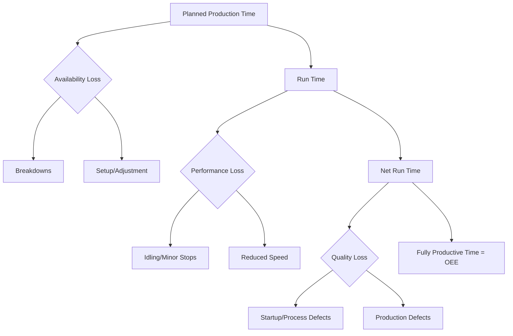

## Overall Equipment Effectiveness (OEE)

### Overview

Overall Equipment Effectiveness (OEE) is a composite metric, originating from Total Productive Maintenance (TPM) practice, that decomposes total capacity loss into three multiplicative factors: availability, performance, and quality. It has appeared in abbreviated form in earlier items in this chapter (as a diagnostic tool and as a normalization technique for benchmarking); this item treats OEE as its own complete framework — its calculation, its "Six Big Losses" taxonomy, its interpretation conventions, and its practical implementation.

**Key Points**

- OEE = Availability × Performance × Quality, each expressed as a percentage
- OEE decomposes capacity loss into distinct, actionable categories rather than producing a single undifferentiated efficiency number
- OEE is most useful as a diagnostic and trending tool, not as a standalone target to be maximized in isolation

### The Core Formula

$$\text{OEE} = \text{Availability} \times \text{Performance} \times \text{Quality}$$

Each factor isolates a distinct category of loss relative to a theoretically perfect production run (zero downtime, maximum speed, zero defects):

$$\text{Availability} = \frac{\text{Run Time}}{\text{Planned Production Time}}$$

$$\text{Performance} = \frac{\text{Ideal Cycle Time} \times \text{Total Count}}{\text{Run Time}}$$

$$\text{Quality} = \frac{\text{Good Count}}{\text{Total Count}}$$

An equivalent, often more intuitive formulation:

$$\text{OEE} = \frac{\text{Good Count} \times \text{Ideal Cycle Time}}{\text{Planned Production Time}}$$

This "fully productive time" formulation directly expresses OEE as the fraction of planned production time that was spent producing good units at ideal speed.

### The Six Big Losses

OEE's three factors decompose further into six specific loss categories, the standard TPM taxonomy for root-causing capacity loss:

| OEE Factor | Big Loss Category | Description |
| --- | --- | --- |
| Availability | Breakdowns | Unplanned equipment failure |
| Availability | Setup and adjustment | Planned changeovers, calibration |
| Performance | Idling and minor stops | Short stoppages (typically <5–10 min), not logged as breakdowns |
| Performance | Reduced speed | Running below rated/ideal cycle time |
| Quality | Startup/process defects | Defects during warm-up or process instability |
| Quality | Production defects | Defects during steady-state running |

**Key Points**

- The Six Big Losses taxonomy is the primary value-add of OEE over a simple utilization or efficiency ratio — it directs corrective action to a specific, actionable loss category rather than leaving "why is output lower than expected" unanswered
- Idling and minor stops are frequently the most under-tracked loss category in practice, since individual stoppages are often too brief to trigger formal downtime logging, yet they accumulate into a significant performance-factor drag over a shift

### Worked Example: Full OEE Calculation with Loss Attribution

An 8-hour shift (480 minutes) includes 30 minutes of scheduled breaks, leaving 450 minutes of planned production time. During the shift:

- Unplanned breakdown: 25 minutes
- Changeover/setup: 15 minutes
- Ideal cycle time: 2 seconds/unit
- Total units produced: 10,800
- Defective units: 216

**Step 1 — Availability:**

$$\text{Run Time} = 450 - 25 - 15 = 410 \text{ min}$$

$$\text{Availability} = \frac{410}{450} = 91.1\%$$

**Step 2 — Performance:**

$$\text{Ideal Time for 10{,}800 units} = \frac{10{,}800 \times 2}{60} = 360 \text{ min}$$

$$\text{Performance} = \frac{360}{410} = 87.8\%$$

**Step 3 — Quality:**

$$\text{Quality} = \frac{10{,}800 - 216}{10{,}800} = 98.0\%$$

**Step 4 — OEE:**

$$\text{OEE} = 0.911 \times 0.878 \times 0.980 = 78.4\%$$

**Key Points**

- Each factor individually looks reasonably strong (all above 87%), yet the compounded OEE (78.4%) is noticeably lower — this multiplicative compounding effect is a defining characteristic of OEE and a common source of surprise for teams new to the metric
- Improvement priority should be assigned to the *lowest* factor first when its underlying loss category is addressable at reasonable cost — here, performance (87.8%) is the weakest link, warranting investigation into minor stops or speed loss before targeting availability or quality

### Interpreting OEE Scores

| OEE Range | Common Interpretation |
| --- | --- |
| Below 65% | Typically considered poor; significant improvement opportunity |
| 65%–75% | Fair; room for improvement, but not unusual for un-optimized lines |
| 75%–85% | Good; solid performance for many industries |
| Above 85% | Often cited as "world class" |

[Inference] These benchmark bands are widely circulated rules of thumb in TPM and lean manufacturing practice, not a universal or industry-audited standard — acceptable OEE varies by equipment type, industry, and process maturity, and some high-precision or continuous-process industries routinely target figures outside this generic band.

### OEE Variants and Extensions

- **TEEP (Total Effective Equipment Performance)**: extends OEE by using total calendar time rather than planned production time as the base, capturing the loss from time never scheduled for production at all

  $$\text{TEEP} = \text{OEE} \times \text{Utilization of Calendar Time}$$
- **OOE (Overall Operations Effectiveness)**: a variant sometimes used to describe OEE calculated across a full line or process rather than a single machine
- **OLE (Overall Labor Effectiveness)**: applies the same three-factor structure (availability, performance, quality) to workforce productivity rather than equipment, useful in labor-intensive or service contexts

### Applying OEE Outside Discrete Manufacturing

**Key Points**

- OEE's three-factor structure generalizes conceptually to any capacity-constrained process, though the underlying metrics require domain-specific redefinition
- In **process industries** (chemicals, food processing), OEE is often adapted with yield-based quality measures and continuous-run availability definitions
- In **service and knowledge-work contexts**, direct OEE application is less standardized; analogous composite metrics (e.g., combining system availability, throughput relative to standard time, and first-pass-quality/error rate) can be constructed, though [Inference] OEE terminology and thresholds developed for discrete manufacturing do not transfer with the same benchmark validity to service contexts
- In **IT/infrastructure contexts**, an OEE-like decomposition maps loosely onto: availability (uptime/SLA), performance (latency relative to target), and quality (request success rate / error rate), though this is an applied analogy rather than an established OEE variant with its own dedicated literature

### Implementation Considerations

- **Data granularity**: meaningful OEE tracking requires reasonably automated, real-time data capture (downtime logging, cycle counters, defect tracking); manual, end-of-shift estimation tends to understate minor stops and speed losses specifically
- **Consistent ideal cycle time definition**: OEE's performance factor is highly sensitive to the ideal cycle time assumption — using an outdated or unrealistically optimistic ideal cycle time will understate performance and distort the composite score
- **Avoiding gaming**: because OEE is often used as a management KPI, there is a documented risk of local optimization (e.g., inflating "good count" by relaxing quality inspection, or reclassifying downtime categories) that improves the reported score without improving genuine capacity effectiveness
- **Trend over snapshot**: as with utilization and efficiency more broadly, OEE is most valuable tracked as a time series to detect degradation or confirm improvement, rather than judged as an isolated period figure

### Common Pitfalls

- Treating OEE as a single number to maximize without decomposing it into its three factors and Six Big Losses to identify the actionable root cause
- Using an unrealistic or stale ideal cycle time, which distorts the performance factor and makes cross-period comparisons unreliable
- Failing to consistently log minor stops, systematically understating true performance loss
- Applying generic "world class" OEE benchmarks (commonly ~85%) as a universal target without validating relevance to the specific equipment, process, and industry
- Incentivizing OEE scores directly without safeguards against gaming (e.g., quality-inspection loosening to inflate good-count)
- Assuming OEE terminology and thresholds transfer directly and reliably into service or IT contexts without domain-appropriate redefinition of each factor

**Next Steps**

- Total Productive Maintenance (TPM) programs and their organizational implementation alongside OEE tracking
- Statistical process control for monitoring the quality factor and detecting defect-rate drift
- Preventive and predictive maintenance strategies targeting the availability factor
- TEEP and OLE as extensions for calendar-time and labor-based effectiveness measurement
- Benchmarking capacity performance across facilities using normalized OEE (cross-reference to the prior chapter item)