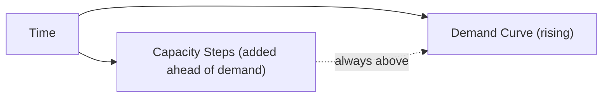
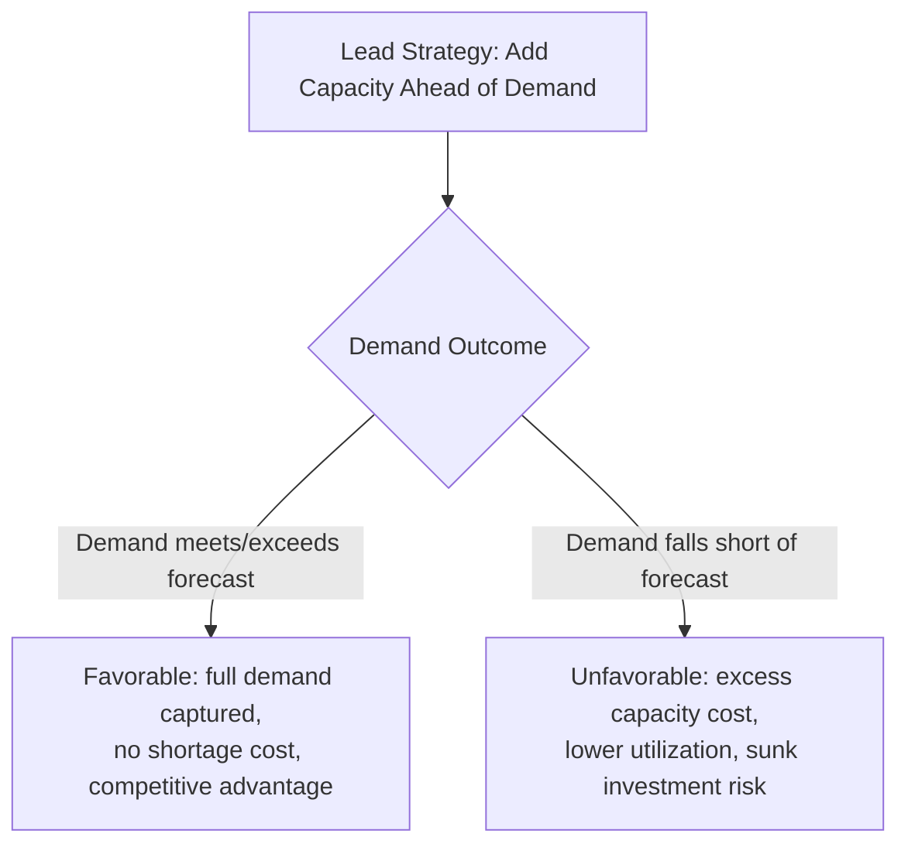

## Lead Strategy for Capacity Expansion

### Overview

Lead strategy is a capacity timing approach in which capacity is added *ahead* of anticipated demand growth, deliberately accepting a period of excess capacity in exchange for being ready to serve demand as soon as — or before — it materializes. It was introduced conceptually alongside lag and match strategies earlier in this course; this item treats lead strategy as a standalone decision framework, covering its rationale, mechanics, risk profile, and implementation considerations in depth.

**Key Points**

- Lead strategy trades higher near-term excess-capacity cost for reduced risk of lost sales and stronger competitive positioning
- It is most appropriate when the cost of a stockout/shortage is high relative to the cost of holding idle capacity, or when capacity lead times are long relative to the speed of demand change
- Lead strategy is a proactive, forecast-driven approach — its effectiveness is directly tied to forecast quality, since capacity is committed before demand is confirmed

### Formal Characterization

Under a lead strategy, capacity additions are scheduled so that available capacity exceeds forecast demand at every point in the planning horizon, until the next planned increment:

$$\text{Capacity}(t) \geq \text{Forecast Demand}(t) \quad \text{for all } t \text{ in the horizon}$$

This produces a capacity profile that consistently sits above the demand curve, creating a capacity cushion that is largest immediately after each capacity addition and shrinks as demand grows toward the next planned increment.

### Why Firms Choose a Lead Strategy

| Driver | Explanation |
| --- | --- |
| High shortage cost relative to excess cost | When lost sales, SLA penalties, or customer attrition costs are large, the critical-ratio framing (from the earlier cost-of-capacity item) favors a larger cushion and earlier capacity commitment |
| Long capacity lead times | If new capacity takes years to bring online (e.g., a new plant, a new hospital wing), waiting for confirmed demand before acting risks arriving too late |
| Competitive/first-mover positioning | Being capacity-ready before demand fully materializes can capture market share from slower-reacting competitors, especially in growing markets |
| Strategic priorities of speed, dependability, or flexibility | As established in the competitive-priorities item, these priorities are directly enabled by generous capacity cushions and lead-timing |
| High confidence in demand forecast | Lead strategy's risk is concentrated in forecast error; firms with strong forecasting capability or clear structural demand signals face lower effective risk |

### The Risk Profile of Lead Strategy

**Key Points**

- **Upside risk (demand materializes as forecast or exceeds it)**: the firm captures full demand without stockouts, avoids emergency capacity costs (overtime, expedited subcontracting), and may gain market share from less-prepared competitors
- **Downside risk (demand falls short of forecast)**: the firm is left holding excess capacity, incurring depreciation, fixed operating cost, and opportunity cost on capital that could have been deployed elsewhere — potentially for an extended period if the shortfall persists
- Because capacity is committed *before* demand is confirmed, lead strategy inherently bears more forecast risk than lag strategy, which only commits capacity after demand has already been observed

### Worked Example

A regional hospital system forecasts steady population growth in its service area and expects emergency department visit volume to rise from 180 visits/day to 240 visits/day over the next four years. Constructing additional ED capacity (bays, staffing infrastructure) has a lead time of roughly three years from decision to operational readiness.

**Lead strategy approach**: the hospital breaks ground now, sizing the expansion for 240 visits/day capacity, to have it operational in year three — one year ahead of when demand is forecast to reach that level.

**Key Points**

- If population growth proceeds as forecast, the hospital has fully adequate capacity in place when demand arrives, avoiding the well-documented costs of ED overcrowding (diversions, patient boarding, degraded care quality) that a lag strategy would risk during the transition period
- If population growth is slower than forecast (e.g., due to an unanticipated economic downturn reducing regional in-migration), the hospital carries under-utilized bed and staffing capacity for an extended period, with associated fixed cost and opportunity cost
- [Inference] In capacity contexts with severe shortage consequences (healthcare capacity shortfalls affecting patient outcomes, safety-critical infrastructure), the asymmetry between shortage cost and excess cost strongly favors lead strategy even under considerable forecast uncertainty — this reflects the same critical-ratio logic introduced earlier, applied to a domain where shortage cost is exceptionally high

### Lead Strategy and Capacity Increment Size

Lead strategy is often paired with **large capacity increments** to capture economies of scale (see the best-operating-level and operations-strategy items), since:

- Large increments create a bigger cushion immediately after each addition, extending the period before the next capacity decision is needed
- Large increments are often more capital-efficient per unit of capacity added, particularly when minimum efficient scale (from the operations-strategy item) is significant

However, this pairing is not automatic — a firm may choose a lead-timing posture with *smaller, more frequent* increments if capacity granularity is fine (e.g., adding server capacity, adding small modular production cells), reducing the magnitude of excess capacity carried at any one time while still staying ahead of demand.

### Lead Strategy in IT/Infrastructure Contexts

In cloud and infrastructure capacity planning, a lead-strategy analogue is **pre-provisioning ahead of an anticipated traffic event** (e.g., a known product launch, a seasonal sales peak, an expected viral marketing campaign):

- Capacity (compute, database throughput, CDN bandwidth) is reserved or provisioned before the traffic event, rather than relying solely on reactive autoscaling
- This mitigates the risk that autoscaling reaction time is too slow relative to a sudden, sharp demand spike
- The "excess capacity cost" analogue is the cost of reserved/idle infrastructure capacity in the days or weeks before the anticipated event

[Inference] This mapping is a direct conceptual analogy between traditional operations capacity strategy and modern cloud capacity planning practice; it is not itself a standardized term used uniformly across cloud infrastructure literature.

### When Lead Strategy Is Poorly Suited

**Key Points**

- Volatile or highly uncertain markets where demand forecasts carry wide error bands — lead strategy's downside (prolonged excess capacity) is magnified when forecast confidence is low
- Cost-sensitive competitive contexts where carrying excess capacity directly undermines a cost-leadership competitive priority (see the competitive-priorities item)
- Capital-constrained organizations that cannot absorb the carrying cost or opportunity cost of early capacity commitment
- Rapidly evolving technology environments where committing to capacity ahead of demand risks stranding investment in a platform or technology that becomes obsolete before the anticipated demand materializes

### Common Pitfalls

- Adopting a lead strategy without an explicit, quantified assessment of the shortage-vs-excess cost asymmetry that is supposed to justify it (see the cost-of-capacity item)
- Treating lead strategy as a default "safe" choice without accounting for its genuine downside risk when forecasts are unreliable
- Sizing lead-strategy capacity increments purely for economies of scale without checking whether the resulting excess-capacity period is financially sustainable
- Failing to revisit and potentially reverse a lead-strategy commitment (e.g., delaying a subsequent planned increment) when early demand signals suggest the original forecast is proving inaccurate
- Applying lead strategy uniformly across all product lines or markets within a firm, rather than reserving it for the specific segments where the shortage-cost asymmetry genuinely justifies it

**Next Steps**

- Lag strategy for capacity expansion, as the direct counterpart risk-reward profile
- Match/tracking strategy as a middle-ground alternative to lead and lag
- Demand forecasting methods and their role in determining lead-strategy risk exposure
- Real options framing for capacity investment timing under uncertainty
- Capacity cushion sizing and the critical-ratio cost trade-off model, applied specifically to lead-strategy decisions