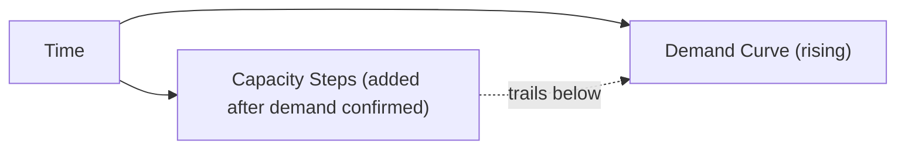
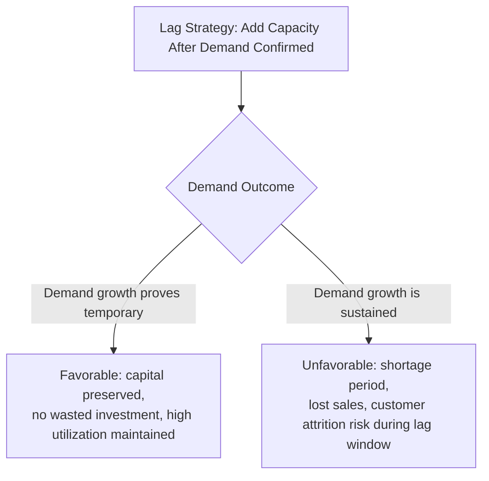

## Lag Strategy for Capacity Expansion

### Overview

Lag strategy is a capacity timing approach in which capacity is added only *after* demand has grown and been sustained, rather than in anticipation of it. It is the direct counterpart to lead strategy: where lead strategy accepts excess-capacity risk to avoid shortage risk, lag strategy accepts shortage risk to avoid excess-capacity cost. This item treats lag strategy as a standalone decision framework, mirroring the structure used for lead strategy.

**Key Points**

- Lag strategy trades higher risk of lost sales and service degradation for minimized excess-capacity carrying cost and higher realized utilization
- It is most appropriate when the cost of holding idle capacity is high relative to the cost of a temporary shortage, or when capacity can be added quickly enough to catch up to demand without excessive damage
- Lag strategy is inherently reactive/confirmatory — capacity decisions are triggered by observed, realized demand rather than forecasts, which reduces forecast-error risk but introduces a structural response-lag risk instead

### Formal Characterization

Under a lag strategy, capacity additions are timed so that capacity trails behind the demand curve, only catching up after demand has already risen and been sustained for some confirmation period:

$$\text{Capacity}(t) < \text{Demand}(t) \quad \text{for a period following each demand increase, until the next capacity addition}$$

This produces a capacity profile that consistently sits below or just at the demand curve, with the gap between them representing unmet demand, backlog, or degraded service during the lag interval.

### Why Firms Choose a Lag Strategy

| Driver | Explanation |
| --- | --- |
| High cost of excess capacity relative to shortage cost | When capital costs, depreciation, or fixed operating costs of idle capacity are large relative to the cost of a temporary shortage, the critical-ratio framing (from the cost-of-capacity item) favors a smaller, later cushion |
| Short capacity lead times | If new capacity can be brought online quickly (e.g., leasing additional space, hiring readily available labor, elastic cloud infrastructure), the "catch-up" period after confirming demand is short and shortage exposure is limited |
| High forecast uncertainty | Waiting for confirmed, realized demand avoids the risk of committing capital based on a forecast that later proves wrong — lag strategy shifts risk from forecast error to response lag |
| Cost-leadership competitive priority | As established in the competitive-priorities item, cost leadership is directly enabled by high utilization and a small capacity cushion, both hallmarks of lag strategy |
| Capital constraints | Organizations unable or unwilling to commit capital ahead of confirmed revenue often default to lag strategy by financial necessity rather than pure strategic choice |

### The Risk Profile of Lag Strategy

**Key Points**

- **Upside risk (demand growth is temporary or overstated)**: the firm avoids committing capital to capacity that would have gone underused, preserving high utilization and capital efficiency
- **Downside risk (demand growth is sustained and confirmed)**: the firm experiences a period of genuine capacity shortfall — lost sales, backlog, overtime premiums, or service degradation — until new capacity comes online, and may permanently lose customers who defect to better-prepared competitors during that window
- Because capacity is only added after demand is confirmed, lag strategy trades forecast-error risk for a structural exposure window during every demand upswing — even a perfectly accurate eventual response still means some period of shortfall is built into the strategy by design

### Worked Example

A regional retail chain observes rising foot traffic and sales in a growing suburb, currently served by a single store operating near capacity.

**Lag strategy approach**: rather than committing to a second store based on early growth signals, the chain waits until sales have exceeded the existing store's effective capacity for two consecutive quarters, confirming the growth is structural rather than a temporary spike (e.g., a one-off local event), before beginning construction of a second location.

**Key Points**

- If the initial traffic increase had been a temporary anomaly (e.g., a nearby competitor's temporary closure), the lag strategy correctly avoided an unnecessary capital commitment that a lead strategy would have locked in prematurely
- Because the growth proves sustained, the chain experiences roughly two-plus quarters of an over-capacity existing store — long checkout lines, stockouts on popular items, parking constraints — some fraction of which likely translates into permanently lost customers who begin shopping elsewhere during the confirmation-and-construction lag
- [Inference] The optimal length of the "confirmation period" before committing to a lag-strategy capacity response is a genuine trade-off in itself — a longer confirmation period reduces the risk of a false-positive capacity commitment but extends the shortage-exposure window if growth turns out to be real; there is no universal correct confirmation length, and it should be calibrated to the specific cost asymmetry involved

### Lag Strategy and Capacity Increment Size

Lag strategy pairs naturally with **flexible, faster-to-deploy capacity levers** rather than large discrete increments, since the entire premise is minimizing the time between demand confirmation and capacity availability:

- Overtime, temporary/contract labor, and subcontracting are common lag-strategy tools precisely because they can be deployed quickly once a shortage is confirmed
- When larger structural capacity additions are eventually required (e.g., a new facility), lag strategy still implies waiting for stronger demand confirmation before committing, even if the resulting capacity increment itself is large

### Lag Strategy in IT/Infrastructure Contexts

The most direct lag-strategy analogue in modern infrastructure planning is **reactive autoscaling**: infrastructure capacity is added automatically (or manually provisioned) only once observed load crosses a defined threshold, rather than being pre-provisioned ahead of anticipated demand.

- This minimizes idle/reserved infrastructure cost during normal operation
- It introduces a real risk window during sudden, sharp demand spikes if autoscaling reaction time is slower than the rate of demand growth — a direct parallel to the retail example's checkout-line degradation during the confirmation-and-build lag
- Many production systems use a **hybrid** approach: lag-style reactive autoscaling for routine variability, combined with lead-style pre-provisioning for known, anticipated demand events (product launches, marketing campaigns)

[Inference] This hybrid framing is a natural extension of lead/lag strategy logic into infrastructure practice, though it is typically discussed in cloud engineering literature using its own terminology (e.g., "predictive vs. reactive autoscaling") rather than the "lead/lag" vocabulary from classical operations management.

### When Lag Strategy Is Poorly Suited

**Key Points**

- Markets or contexts where the shortage cost is severe or safety-critical (see the lead-strategy item's healthcare example) — lag strategy's built-in shortage window is unacceptable when the consequences of a stockout are extreme
- Highly competitive markets where customers switch readily to competitors during any period of degraded service, making the "temporary" shortage cost effectively permanent through attrition
- Situations with long capacity-addition lead times — lag strategy's viability depends on being able to catch up to demand reasonably quickly once confirmed; pairing lag timing with a slow-to-build capacity type undermines the strategy's core rationale
- Contexts where reputational or first-mover effects are significant, since a lag-strategy firm is structurally positioned to react to demand growth after competitors who used lead or match strategies have already captured early adopters

### Common Pitfalls

- Adopting lag strategy purely as a default (often due to capital constraints or planning inertia) rather than as a deliberate choice justified by the cost asymmetry and capacity lead-time considerations
- Underestimating the permanence of "temporary" lost sales during the confirmation-and-build lag — some fraction of shortage-driven customer loss is rarely fully recovered
- Setting an arbitrarily long demand-confirmation period that maximizes protection against false positives while ignoring the compounding cost of an extended shortage window
- Pairing a lag-timing posture with a slow-to-deploy capacity type, effectively creating the worst of both strategies: exposure to demand confirmation risk *and* a long response lag
- Failing to distinguish which product lines or market segments genuinely warrant a lag posture (cost-sensitive, stable-demand segments) from those that warrant lead or match posture instead, applying a single company-wide timing strategy indiscriminately

**Next Steps**

- Lead strategy for capacity expansion, as the direct counterpart risk-reward profile
- Match/tracking strategy as a middle-ground alternative to lead and lag
- Demand confirmation methods and statistical trend-detection techniques for distinguishing sustained growth from noise
- Reactive vs. predictive autoscaling architectures in cloud infrastructure capacity planning
- Customer attrition and reputational cost modeling as inputs to the lag-strategy shortage-cost estimate