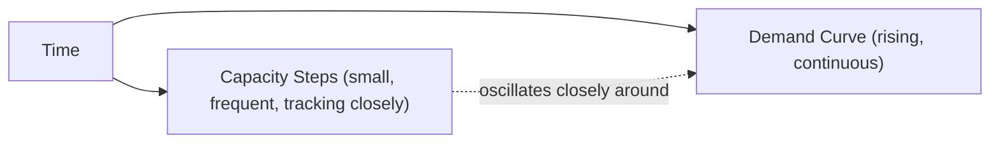
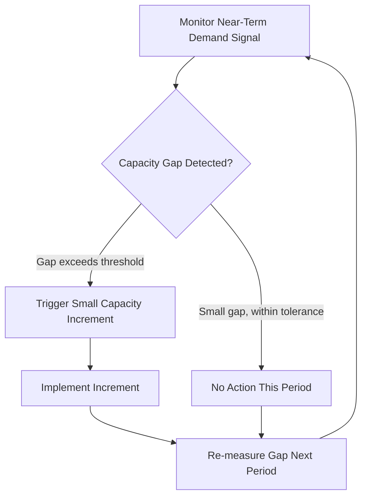

## Match Strategy and Incremental Adjustment

### Overview

Match strategy (also called tracking strategy) is a capacity timing approach that adds capacity in small, frequent increments designed to track demand growth as closely as possible, rather than committing far ahead of demand (lead) or waiting for demand to be fully confirmed (lag). It occupies the middle ground between the two extremes covered in the previous items, and is often the most commonly observed strategy in mature, moderately-growing markets precisely because it minimizes the magnitude of error in either direction.

**Key Points**

- Match strategy adds capacity incrementally, adjusting the plan in small steps as demand signals develop rather than in one large commitment
- It minimizes the maximum size of either the excess-capacity gap or the shortage gap at any point in time, compared to lead or lag strategies
- It requires closer, more continuous monitoring and more frequent decision-making than either lead or lag strategy, since capacity plans are revised on a rolling basis

### Formal Characterization

Under a match strategy, capacity additions are sized and timed to keep the capacity curve as close as possible to the demand curve throughout the planning horizon, rather than consistently above (lead) or consistently below (lag) it:

$$\text{Capacity}(t) \approx \text{Demand}(t) \quad \text{with small, frequent step adjustments}$$

Because capacity is added in discrete increments while demand grows more continuously, match strategy still produces a stepped capacity curve — but the steps are deliberately kept small, so the curve oscillates closely around the demand curve rather than diverging significantly in either direction for long.

### Comparing the Three Timing Strategies

| Dimension | Lead | Match | Lag |
| --- | --- | --- | --- |
| Capacity relative to demand | Ahead | Tracking closely | Behind |
| Typical increment size | Large | Small | Variable (often flexible/short-lead levers) |
| Forecast dependency | High (commits ahead of confirmed demand) | Moderate (relies on near-term signals, revised frequently) | Low (reacts to confirmed demand) |
| Risk concentration | Excess capacity if demand underperforms | Moderate exposure to both excess and shortage, but bounded | Shortage during the demand-confirmation-and-build lag |
| Planning/monitoring intensity | Lower (fewer, larger decisions) | Higher (frequent review and adjustment) | Lower (event-triggered decisions) |
| Best suited when | Shortage cost >> excess cost; long lead times | Cost asymmetry is moderate; incremental capacity is available | Excess cost >> shortage cost; short lead times |

### Why Firms Choose a Match Strategy

**Key Points**

- **Moderate cost asymmetry**: when neither shortage cost nor excess-capacity cost dominates strongly, minimizing the maximum exposure to either (rather than optimizing for one extreme) tends to produce the lowest expected total cost
- **Divisible capacity**: match strategy is only practical when capacity can genuinely be added in small increments — modular equipment, flexible staffing, scalable cloud infrastructure — rather than being constrained to large discrete jumps (e.g., a single large facility)
- **Moderate forecast confidence**: match strategy performs best with demand signals that are reasonably reliable in the near term (supporting small, frequent correct adjustments) even if long-range forecasts carry more uncertainty
- **Organizational capability for continuous planning**: match strategy requires a planning process capable of frequent review and rapid incremental decision-making, which is itself an operational capability investment

### The Incremental Adjustment Mechanism

**Key Points**

- Match strategy is implemented as a rolling, threshold-triggered process rather than a single upfront plan — this distinguishes it operationally from both lead strategy (a large upfront commitment) and lag strategy (a single reactive commitment after sustained confirmation)
- The threshold for triggering an increment is itself a policy choice: a tight threshold produces closer tracking but more frequent (and potentially more costly per-transaction) adjustment activity; a loose threshold reduces adjustment frequency but allows larger temporary gaps to accumulate

### Worked Example

A regional cloud hosting provider serves a steadily growing customer base. Rather than provisioning a large block of new server capacity years in advance (lead) or waiting until existing servers are fully saturated before ordering more (lag), the provider reviews utilization weekly and adds new server racks in small batches whenever aggregate utilization crosses 75%.

| Week | Utilization Before Action | Action Taken |
| --- | --- | --- |
| 1 | 68% | None |
| 2 | 71% | None |
| 3 | 76% | Add one rack (small increment) |
| 4 | 70% (post-addition) | None |
| 5 | 74% | None |
| 6 | 77% | Add one rack |

**Key Points**

- Each increment is small enough that utilization never drifts far above the 75% trigger threshold (limiting shortage-risk exposure) nor far below it for long after an addition (limiting excess-capacity exposure)
- This tracking pattern requires weekly monitoring and a standing process for ordering and provisioning capacity in small batches — an operational overhead that a lead or lag strategy, with far less frequent decision points, would not require
- [Inference] The specific 75% trigger threshold is illustrative; a real threshold would be calibrated using the cost-asymmetry and queuing-delay considerations discussed in earlier items (capacity cushion, cost of excess/insufficient capacity), since utilization approaching very high levels risks non-linear latency growth even before a hard capacity shortfall occurs

### Hybrid Approaches

**Key Points**

- Pure lead, lag, and match strategies represent conceptual extremes; most real organizations use **hybrid strategies** that blend elements — for example, using a lead posture for a small number of strategically critical, long-lead-time resources while using match or lag posture for more flexible, short-lead-time resources
- A common hybrid pattern: use match/incremental adjustment for baseline capacity tracking, combined with a lead-style reserve cushion sized specifically to absorb known, anticipated demand spikes (e.g., seasonal peaks, planned marketing campaigns) — this mirrors the hybrid predictive/reactive autoscaling pattern noted in the lag-strategy item
- Aggregate planning (a later chapter topic) formalizes exactly this kind of hybrid chase/level decision-making at the tactical planning horizon, using match-style incremental logic as one input among several

### Match Strategy and Capacity Divisibility

Match strategy's feasibility depends heavily on how finely capacity can be subdivided:

| Capacity Type | Divisibility | Match-Strategy Suitability |
| --- | --- | --- |
| Cloud compute instances | Very fine (individual instances/containers) | High — well-suited to match strategy |
| Modular production cells | Fine (add/remove individual cells) | High |
| Cross-trained flexible labor | Fine (add/remove individual workers, adjust hours) | High |
| Large manufacturing lines | Coarse (a full line is the smallest unit) | Low — better suited to lead or lag strategy with large increments |
| Major facilities (hospitals, plants) | Very coarse | Low — structurally incompatible with fine-grained matching |

**Key Points**

- Match strategy is not universally applicable — its core premise (small, frequent adjustment) requires that the underlying capacity resource actually be divisible at a fine grain
- Organizations with coarse, lumpy capacity resources are structurally pushed toward lead or lag strategies by the nature of their capacity type, regardless of what an idealized cost analysis might otherwise recommend

### Common Pitfalls

- Attempting a match strategy with coarse, indivisible capacity resources, resulting in either large disruptive "increments" that behave more like lead/lag jumps, or an inability to adjust finely enough to actually track demand
- Setting adjustment triggers reactively without a defined threshold policy, causing either excessive adjustment activity (high transaction/administrative cost) or delayed response that resembles an unplanned lag strategy
- Underestimating the organizational and monitoring overhead match strategy requires compared to the simpler decision cadence of lead or lag strategies
- Treating match strategy as risk-free simply because it avoids the *large* errors of lead/lag — it still carries residual exposure to both excess and shortage cost during the interval between adjustments
- Failing to combine match strategy with a lead-style reserve cushion for known, anticipated demand spikes, leaving the system exposed exactly when incremental tracking is least able to respond quickly enough

**Next Steps**

- Lead and lag strategies revisited as boundary cases of the match-strategy spectrum
- Aggregate planning: formal hybrid chase/level techniques building on match-strategy logic
- Elastic/autoscaling infrastructure architectures as a technical enabler of fine-grained match strategy
- Capacity cushion sizing combined with incremental adjustment thresholds
- Demand signal monitoring and trend-detection methods to drive adjustment-trigger policies