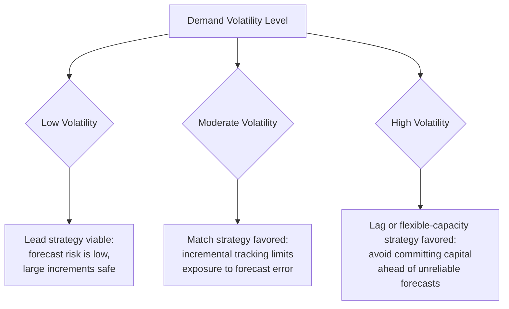
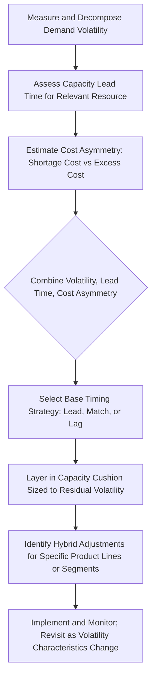

## Selecting a Capacity Strategy Under Demand Volatility

### Overview

This item synthesizes the lead, lag, and match strategies covered in the previous three items into a decision framework specifically organized around demand volatility as the primary selection variable. Volatility — the magnitude and unpredictability of demand fluctuation — interacts with cost asymmetry, capacity lead time, and capacity divisibility to determine which timing strategy minimizes expected total cost in a given context.

**Key Points**

- Demand volatility changes the *relative risk* of each strategy, not just its magnitude — high volatility disproportionately penalizes strategies that commit capacity far in advance of confirmed demand
- No single strategy dominates across all volatility levels; the correct choice is a function of volatility interacting with cost asymmetry and capacity lead time simultaneously
- Volatility should be measured and characterized explicitly (not just informally assessed) before a strategy is selected, since intuition about "how volatile" a market is frequently diverges from what historical data show

### Characterizing Demand Volatility

Before selecting a strategy, volatility itself should be quantified. Common measures:

$$\text{Coefficient of Variation (CV)} = \frac{\sigma_{\text{demand}}}{\mu_{\text{demand}}}$$

- **Low volatility** (CV roughly below 0.10–0.15): demand is stable and predictable period-to-period
- **Moderate volatility** (CV roughly 0.15–0.35): meaningful fluctuation, but forecastable trend/seasonality patterns are usually still identifiable
- **High volatility** (CV above 0.35): demand is erratic, with weak or unreliable forecastable structure

[Inference] These CV bands are illustrative reference points rather than fixed industry-standard thresholds; appropriate bands vary by industry and by the specific decision the volatility measure is informing.

Volatility should also be decomposed by source, since different sources call for different responses:

| Volatility Source | Characteristic | Best Addressed By |
| --- | --- | --- |
| Trend | Gradual, directional, low-frequency | Strategic capacity planning (any of lead/lag/match, chosen on other grounds) |
| Seasonality | Predictable, cyclical, known period | Capacity cushion sizing, temporary/flexible levers timed to the known cycle |
| Random/irregular variation | Unpredictable, no exploitable pattern | Capacity cushion sized statistically (see the earlier cushion item); match strategy or flexible levers |
| Structural shift | Step-change in the underlying demand level | Requires forecast/strategy re-evaluation, not just cushion adjustment |

### How Volatility Interacts With Each Strategy

**Key Points**

- **Low volatility favors lead strategy**, because the primary risk of lead strategy (forecast error causing prolonged excess capacity) is small when demand is stable and predictable — the firm can safely commit capacity ahead of demand with high confidence it will be needed
- **Moderate volatility favors match strategy**, because incremental, frequently-revised capacity tracking limits the maximum exposure to forecast error in either direction, without requiring the extreme reactive posture of lag strategy
- **High volatility favors lag strategy or flexible/elastic capacity levers**, because committing capacity ahead of highly unreliable demand signals (lead strategy) risks large, costly excess capacity if the forecast proves wrong, while match strategy's frequent-adjustment premise breaks down when the underlying signal itself is too noisy to track meaningfully

### The Volatility–Lead-Time Interaction

Volatility does not act alone — it interacts critically with capacity lead time (how long it takes to bring new capacity online):

$$\text{Effective Risk} \approx f(\text{Volatility}, \text{Capacity Lead Time}, \text{Cost Asymmetry})$$

| Volatility | Short Capacity Lead Time | Long Capacity Lead Time |
| --- | --- | --- |
| Low | Match or lag strategy both viable (low urgency either way) | Lead strategy strongly favored (long lead time makes waiting for confirmation risky even though demand itself is stable) |
| High | Lag strategy strongly favored (fast response absorbs volatility without needing to forecast it) | Highest-risk combination — no timing strategy fully resolves the tension; favors flexible/elastic capacity investment specifically to reduce effective lead time, or portfolio/real-options approaches |

**Key Points**

- The most difficult planning environment is **high volatility combined with long capacity lead time** — this combination undermines lead strategy (forecast risk too high), lag strategy (response too slow relative to volatility), and match strategy (increments can't be added fast enough to track erratic demand)
- In this difficult combination, the most effective response is often not a pure timing-strategy choice at all, but an investment in **reducing effective lead time** itself (e.g., modular/flexible capacity design, strategic partnerships/subcontracting arrangements that can be activated quickly) so that a shorter-lead-time strategy becomes feasible

### A Structured Selection Process

### Worked Example

A consumer electronics firm evaluates capacity strategy for two different product lines:

**Product Line A (mature, stable accessory line)**: CV of demand ≈ 0.08 (low volatility), capacity lead time for manufacturing equipment ≈ 18 months (long).

- Given low volatility and long lead time, the interaction table above points to **lead strategy** — the long lead time makes waiting for confirmation risky, but low volatility means the forecast underlying an early commitment is reliable.

**Product Line B (new, trend-driven gadget category)**: CV of demand ≈ 0.55 (high volatility), capacity lead time using flexible contract manufacturers ≈ 6 weeks (short).

- Given high volatility and short lead time, the interaction table points to **lag strategy** — fast-responding contract manufacturing capacity can be added quickly once demand is confirmed, avoiding the large excess-capacity risk that committing ahead of this erratic demand pattern would create under a lead approach.

**Key Points**

- The same firm rationally applies *different* timing strategies to different product lines, because volatility and lead time — the two variables driving the recommendation — differ meaningfully between them
- This illustrates why a single, company-wide capacity timing policy is often suboptimal; the selection framework should be applied at the level of the specific resource/product-line combination, not uniformly across the whole organization

### Statistical and Scenario-Based Refinements

**Key Points**

- Beyond the qualitative decision framework above, organizations facing high-stakes capacity decisions under volatility increasingly use **scenario planning** and **decision-tree analysis**, modeling several discrete demand scenarios (e.g., low/base/high growth) and evaluating each candidate strategy's expected cost across the full scenario set rather than against a single point forecast
- **Real options** framing (introduced in the operations-strategy chapter) is particularly relevant under high volatility: structuring capacity investment to preserve the *option* to expand or delay (e.g., securing land/permits without building, or signing flexible supply contracts) can outperform a binary lead-vs-lag commitment when volatility is severe
- [Inference] These more sophisticated techniques do not eliminate the fundamental volatility trade-off described above; they provide a more rigorous quantitative basis for navigating it, particularly valuable when the cost of a wrong strategic choice is large enough to justify the additional analytical investment

### Common Pitfalls

- Selecting a single capacity timing strategy for an entire organization or product portfolio without recognizing that volatility and lead time differ meaningfully across resources or product lines
- Underestimating actual demand volatility due to reliance on smoothed historical averages, leading to an inappropriately aggressive lead strategy
- Treating capacity lead time as fixed and unchangeable, missing opportunities to invest in flexibility (modular design, contract manufacturing relationships) that would shift the optimal strategy toward match or lag
- Applying the same timing strategy indefinitely without re-measuring volatility as market conditions mature or shift — a product line's volatility profile typically declines as it matures, which should prompt a strategy re-evaluation over time
- Relying on a purely qualitative "gut feel" assessment of volatility rather than calculating it from actual historical demand data, especially for high-stakes, long-lead-time capacity commitments

**Next Steps**

- Real options and scenario-based capacity investment analysis in depth
- Demand forecasting methods and volatility measurement techniques (coefficient of variation, seasonal decomposition)
- Aggregate planning as the tactical mechanism implementing a chosen timing strategy period-by-period
- Flexible and modular capacity design as a lead-time-reduction strategy
- Portfolio-level capacity strategy across multiple product lines with differing volatility profiles