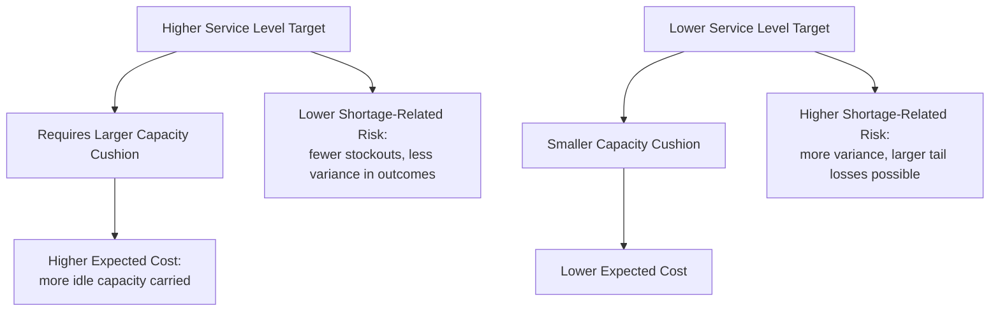
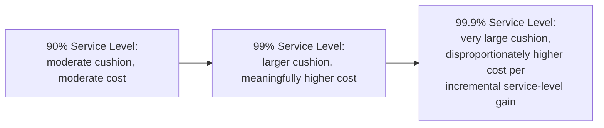
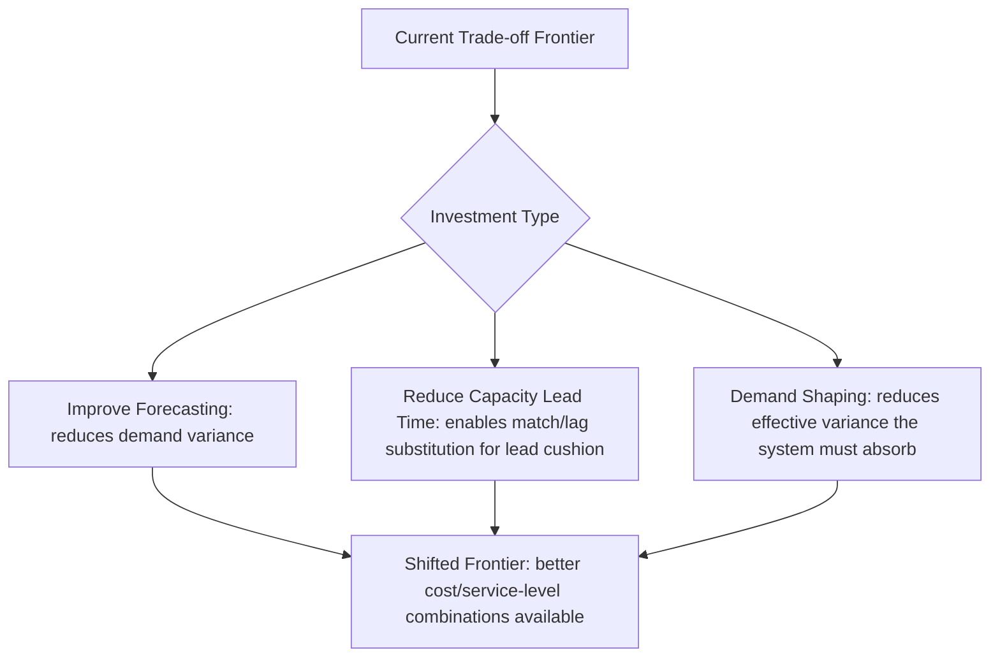

## Risk, Cost, and Service-Level Trade-offs

### Overview

This item synthesizes the cost, risk, and service-level threads that have run through this chapter into a single, unified trade-off framework. Every capacity decision covered so far — cushion sizing, timing strategy selection, utilization targets — is ultimately an instance of the same underlying three-way trade-off: more service-level protection costs more and carries different risk exposure than less, and the "correct" balance point is a decision, not a discoverable constant.

**Key Points**

- Risk, cost, and service level are mutually constraining: improving one generally requires accepting a worse position on at least one of the other two
- The trade-off is not a fixed curve — it can be *shifted* favorably through investment in flexibility, better forecasting, or faster capacity response, rather than only traded along a fixed frontier
- Framing capacity decisions explicitly in these three dimensions, rather than optimizing any one in isolation, is what distinguishes mature capacity planning from ad hoc capacity management

### The Three Dimensions Defined

- **Cost**: the total expected cost of a capacity plan, combining capital/fixed cost of capacity held, carrying cost of excess capacity, and expected shortage-related costs (overtime, expediting, lost sales)
- **Risk**: the variance/uncertainty around that expected cost — how much the actual outcome could deviate from the expected case if demand, supply, or operations behave differently than assumed
- **Service level**: the probability or degree to which the system meets its demand commitments — fill rate, on-time delivery rate, wait-time targets, SLA attainment

$$\text{A capacity plan is fully characterized by its position on all three dimensions simultaneously, not by any one alone}$$

### The Trade-off Frontier

**Key Points**

- Moving along this frontier in either direction is a genuine trade-off, not a free improvement — every increment of service-level improvement has an associated cost increment, formalized earlier through the critical-ratio model
- Risk behaves somewhat differently from cost and service level: it is not simply "high" or "low" along the same axis, but reflects the *variance* of outcomes around whichever cost/service-level point is chosen — two plans with identical expected cost can carry very different risk profiles depending on how exposed they are to tail-end demand or supply scenarios

### Quantifying the Trade-off: Extending the Critical-Ratio Model

The critical-ratio framing introduced in the cost-of-capacity item generalizes directly into a service-level optimization:

$$\text{Optimal Service Level} = \frac{C_{\text{shortage}}}{C_{\text{shortage}} + C_{\text{excess}}}$$

This ratio can be converted into a specific capacity/cushion target using the same statistical approach applied in the capacity-cushion item:

$$\text{Required Capacity} = \mu_{\text{demand}} + z \times \sigma_{\text{demand}}$$

where $z$ is the standard-normal value corresponding to the target service level (e.g., $z \approx 1.645$ for 95%, $z \approx 2.33$ for 99%).

**Key Points**

- Each additional increment of $z$ (higher service level) requires proportionally more cushion, but because the normal distribution's tail thins out, the *cost* of pushing service level from very high to even higher (e.g., 99% to 99.9%) rises disproportionately relative to the service-level gain — a form of diminishing returns specific to the service-level dimension
- This nonlinearity means that near-perfect service levels are usually disproportionately expensive, and most cost-optimal capacity plans deliberately accept a non-zero, quantified probability of shortfall rather than targeting elimination of all risk

### Visualizing Diminishing Returns to Service Level

### Worked Example: Comparing Three Service-Level Targets

A distribution center has demand with mean 5,000 units/week and standard deviation 600 units/week. Each unit of capacity cushion (held but potentially unused) costs $8/week; each unit of unmet demand costs $50/week (lost margin plus estimated attrition-adjusted loss).

| Service Level | z-value | Required Capacity | Cushion (units) | Weekly Cushion Cost |
| --- | --- | --- | --- | --- |
| 90% | 1.28 | 5,768 | 768 | $6,144 |
| 95% | 1.645 | 5,987 | 987 | $7,896 |
| 99% | 2.33 | 6,398 | 1,398 | $11,184 |
| 99.9% | 3.09 | 6,854 | 1,854 | $14,832 |

**Key Points**

- Moving from 90% to 95% service level (a 5-point improvement) costs an additional $1,752/week in cushion carrying cost
- Moving from 99% to 99.9% service level (a smaller 0.9-point improvement) costs an additional $3,648/week — more than double the cost increment for a much smaller service-level gain, directly illustrating the diminishing-returns dynamic
- Using the critical-ratio formula, the cost-optimal service level here is $\frac{50}{50+8} = 86.2\%$ — notably *below* even the 90% row shown, meaning this distribution center's common instinct to target "95% or better" may actually be over-investing in service level relative to what the stated cost figures justify, unless additional risk or reputational factors not captured in the simple $50/$8 figures warrant the higher target

### The Role of Risk Beyond Expected Cost

**Key Points**

- Expected-cost optimization (as in the worked example above) treats risk as fully captured by the probability distribution assumed — but real capacity risk often includes **tail risk** that a simple normal-distribution model understates: correlated demand spikes, simultaneous supply disruptions, or structural demand shifts that violate the model's assumptions
- Risk-averse decision-makers may rationally choose a higher service level (and higher expected cost) than the pure expected-cost-minimizing critical ratio suggests, specifically to reduce exposure to catastrophic tail outcomes (e.g., a shortage during a period that also damages long-term reputation or triggers contractual penalties beyond the simple per-unit shortage cost)
- This is a legitimate extension of the trade-off framework, not an error — the critical-ratio model optimizes *expected* cost under a specific distributional assumption; explicitly incorporating risk aversion or fat-tailed uncertainty is a further refinement, not a contradiction, of the same underlying trade-off logic

### Shifting the Frontier, Not Just Moving Along It

**Key Points**

- The trade-off frontier described above is not fixed — investments in certain capabilities can shift the entire curve favorably, achieving better service level at the *same* cost, or the same service level at *lower* cost, rather than merely repositioning along the existing trade-off
- **Improved forecasting** reduces $\sigma_{\text{demand}}$, directly lowering the required cushion for any given service level
- **Reduced capacity lead time** (flexible/modular capacity, as discussed in the volatility-strategy item) allows a match or lag posture to substitute for an expensive lead-strategy cushion, achieving similar service level at lower carrying cost
- **Demand shaping** (pricing, reservation systems) reduces effective demand variance the capacity system must absorb, similarly shifting the frontier
- These frontier-shifting investments should be evaluated on their own cost-benefit basis (the investment cost vs. the value of the frontier shift they produce), separate from the ongoing cushion/service-level trade-off itself

### Common Pitfalls

- Setting service-level targets by convention or competitor benchmarking rather than deriving them from an explicit (even if approximate) cost-asymmetry calculation
- Ignoring the diminishing-returns dynamic and treating each further increment of service level as equally "worth it," leading to systematic over-investment in cushion at very high service-level targets
- Treating expected-cost optimization as the complete answer without considering tail risk or correlated-failure scenarios that a simple variance-based model does not capture
- Failing to distinguish between *moving along* the existing trade-off frontier (a cushion-sizing decision) and *shifting* the frontier itself (a capability investment decision), which conflates two fundamentally different types of decisions with different evaluation criteria
- Applying a single service-level target uniformly across all products, customers, or markets without recognizing that the underlying cost asymmetry — and therefore the optimal trade-off point — genuinely differs across them

**Next Steps**

- Newsvendor and critical-ratio models revisited with fat-tailed and correlated-risk extensions
- Demand forecasting accuracy improvement techniques and their quantified effect on required cushion
- Real options and scenario planning as tools for managing tail risk beyond expected-cost optimization
- Aggregate planning as the operational mechanism translating a chosen service-level target into period-by-period capacity decisions
- Multi-echelon and network-level risk pooling as a frontier-shifting strategy across multiple facilities or markets