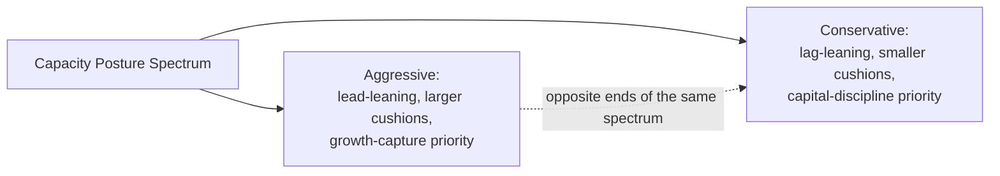
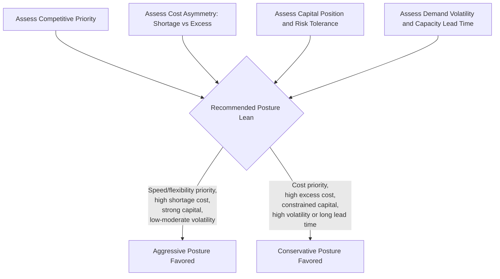

## Aggressive Versus Conservative Capacity Postures

### Overview

Capacity posture describes an organization's overall philosophical stance toward capacity investment — how willing it is to commit resources ahead of certainty, and how much risk it is prepared to absorb in pursuit of growth or cost efficiency. Where earlier items in this chapter examined *timing* strategies (lead, lag, match) as tactical mechanisms, capacity posture is the higher-level organizational disposition that tends to determine which timing strategy an organization gravitates toward by default, across product lines and over time.

**Key Points**

- Posture is a persistent organizational orientation, not a single decision — it shapes how *every* capacity decision gets made, often implicitly
- An aggressive posture favors growth capture and market positioning at the cost of higher financial risk; a conservative posture favors capital discipline and risk minimization at the cost of growth-capture risk
- Posture should be a deliberate strategic choice aligned with competitive priorities, risk tolerance, and capital structure — not an unexamined cultural default

### Defining the Two Postures

#### Aggressive Capacity Posture

- Tends toward **lead-style timing**, larger capacity cushions, and willingness to commit capital ahead of confirmed demand
- Prioritizes being ready to capture demand growth, market share, and first-mover advantage
- Accepts higher risk of excess capacity and lower near-term utilization as the cost of that readiness
- Often associated with growth-stage firms, capital-rich organizations, or firms competing on speed/dependability/flexibility priorities

#### Conservative Capacity Posture

- Tends toward **lag-style timing**, smaller capacity cushions, and a preference for confirming demand before committing capital
- Prioritizes capital discipline, high utilization, and minimizing the risk of stranded investment
- Accepts higher risk of shortage, lost sales, and slower market responsiveness as the cost of that discipline
- Often associated with mature, capital-constrained, or cost-leadership-focused organizations

### Comparison Table

| Dimension | Aggressive Posture | Conservative Posture |
| --- | --- | --- |
| Default timing tendency | Lead | Lag |
| Capacity cushion size | Larger | Smaller |
| Capital commitment timing | Ahead of confirmed demand | After confirmed demand |
| Utilization target | Lower (by design) | Higher (by design) |
| Primary risk accepted | Excess capacity / stranded investment | Shortage / lost growth opportunity |
| Typical competitive fit | Speed, flexibility, dependability | Cost leadership |
| Typical financial profile | Capital-rich, growth-stage, or strategically betting on a market | Capital-constrained, mature, margin-focused |
| Sensitivity to forecast error | Higher (commits before confirmation) | Lower (reacts after confirmation) |

### Posture as an Aggregation of Many Individual Decisions

**Key Points**

- No single decision defines an organization's posture; it emerges from the *consistent pattern* across many individual capacity decisions — cushion sizing choices, timing-strategy selections, capital-budget approval thresholds, and risk-tolerance signals from leadership
- Because posture operates at this aggregate, cultural level, it can persist as an unexamined default even after the underlying conditions that originally justified it (competitive priority, capital availability, market volatility) have changed — a firm that became conservative during a capital-constrained period may remain conservative long after capital constraints eased, simply through organizational inertia
- Recognizing posture explicitly, as a named strategic variable, is itself valuable because it makes an otherwise implicit and hard-to-examine pattern into something that can be deliberately assessed and, if warranted, changed

### When Aggressive Posture Is Well-Suited

- Growing or emerging markets where being capacity-ready ahead of competitors captures durable market share
- High cost-of-shortage contexts (from the earlier cost-of-capacity item) where the downside of underinvestment clearly outweighs the downside of overinvestment
- Organizations with strong balance sheets or access to capital that can absorb a period of excess capacity without financial distress
- Strategic contexts where signaling capacity commitment itself has value (e.g., deterring competitor entry, reassuring key customers of supply security)

### When Conservative Posture Is Well-Suited

- Mature, low-growth, or declining markets where demand upside is limited and the primary risk is overbuilding into a shrinking opportunity
- High cost-of-excess-capacity contexts (capital-intensive, hard-to-repurpose assets) where stranded investment risk is severe
- Capital-constrained organizations for which a period of excess capacity could threaten solvency or crowd out other necessary investment
- Markets with high demand volatility and long capacity lead times — the difficult combination identified in the volatility-selection item, where committing capital ahead of highly uncertain demand carries disproportionate risk

### Worked Example: Same Industry, Divergent Postures

Two competing regional airlines evaluate whether to add additional routes and aircraft ahead of an anticipated post-recession travel recovery.

- **Airline A (aggressive posture)**: orders additional aircraft and commits to new routes based on early recovery signals, betting that being operationally ready when demand fully returns will let it capture market share from slower-moving competitors, accepting the risk that if recovery stalls, it carries expensive underutilized aircraft and route infrastructure.
- **Airline B (conservative posture)**: waits for several consecutive quarters of confirmed demand recovery before committing to new aircraft orders and routes, preserving capital and avoiding the risk of stranded investment if the recovery proves uneven, accepting the risk that Airline A captures the most valuable early-recovery customers and route slots first.

**Key Points**

- Both postures are internally coherent strategic choices; the "right" one depends on each airline's specific balance-sheet strength, risk tolerance, and confidence in the recovery forecast — factors external to the capacity decision itself
- [Inference] In practice, the aggressive airline's approach only pays off if the recovery forecast proves reasonably accurate; if it does not, the aggressive posture converts directly into the excess-capacity costs described in the earlier cost-of-capacity item, illustrating that posture does not eliminate the underlying cost-risk trade-off — it simply reflects where on that trade-off an organization has chosen to sit

### Posture Misalignment Risks

**Key Points**

- **Posture-priority misalignment**: an organization stating a competitive priority of speed or dependability while operating with a conservative, lag-leaning capacity posture creates a structural contradiction — the posture cannot deliver on the stated priority (this mirrors the misalignment risk discussed in the competitive-priorities item)
- **Posture-capital misalignment**: an aggressive posture pursued without sufficient capital reserves to absorb a bad-scenario outcome exposes the organization to genuine financial distress risk, not just an accounting loss
- **Posture rigidity**: applying a single organization-wide posture uniformly across product lines or markets with very different volatility and cost-asymmetry profiles, rather than allowing posture to vary appropriately by segment (as illustrated in the volatility-selection item's two-product-line example)
- **Posture drift without re-evaluation**: maintaining a historically-set posture without periodically checking whether the market conditions, competitive priorities, or capital position that originally justified it still hold

### A Framework for Diagnosing Appropriate Posture

### Common Pitfalls

- Adopting an organization-wide posture as an unexamined cultural default rather than a deliberate strategic choice tied to competitive priorities and capital position
- Maintaining a posture set under past conditions (capital constraints, market maturity, past leadership risk tolerance) without periodically re-evaluating whether those conditions still hold
- Applying a single posture uniformly across product lines or markets with meaningfully different cost-asymmetry and volatility profiles
- Pursuing an aggressive posture without the balance-sheet strength to absorb the excess-capacity scenario if the underlying forecast proves wrong
- Confusing posture (a strategic disposition) with timing strategy (a tactical mechanism) — the two are related but not identical, and a nominally "aggressive" organization can still make match- or even lag-timed decisions for specific, well-justified resources

**Next Steps**

- Lead, lag, and match strategies revisited as the tactical expressions of a chosen posture
- Capital structure and balance-sheet capacity as a determinant of feasible posture
- Real options framing for preserving strategic flexibility within either posture
- Organizational risk tolerance assessment methods for diagnosing appropriate posture
- Portfolio-level posture variation across product lines with differing competitive priorities and volatility profiles