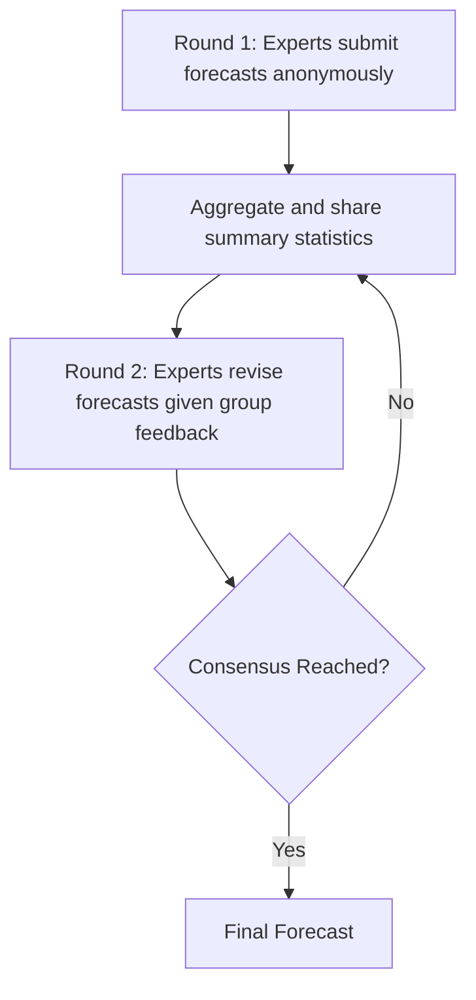
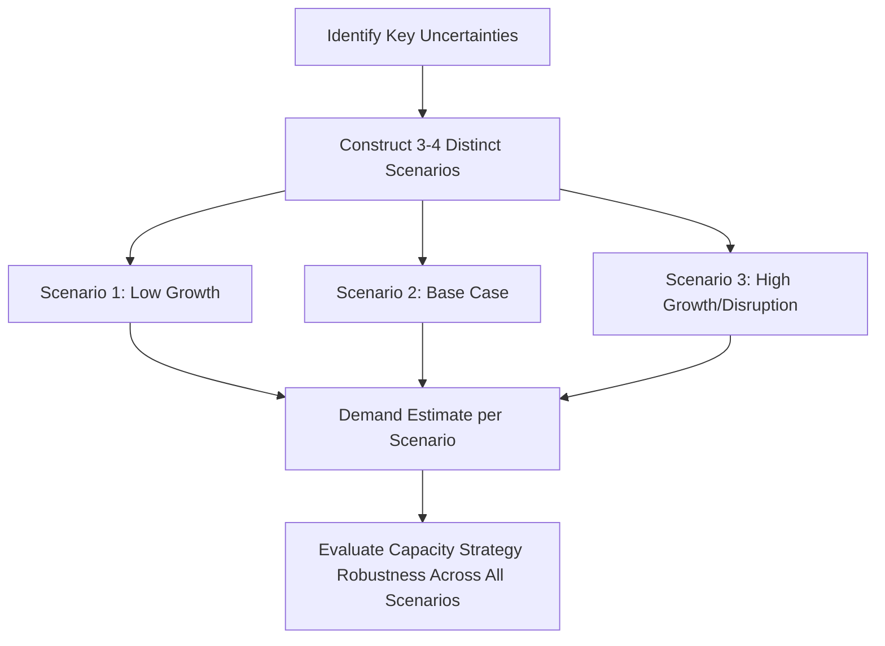

## Qualitative Forecasting Techniques

### Overview

Qualitative forecasting techniques generate demand predictions from expert judgment, structured opinion, and market intelligence rather than from statistical analysis of historical numerical data. They are the appropriate forecasting family when historical data is sparse, unreliable, or simply nonexistent — new product launches, novel markets, disruptive technology adoption, or long-range strategic horizons where past patterns provide little guidance about the future. This item shifts the syllabus's focus from capacity strategy execution toward the demand-forecasting inputs that all of the preceding capacity decisions depend upon.

**Key Points**

- Qualitative techniques substitute structured expert judgment for statistical extrapolation, and are most valuable precisely where quantitative methods (covered in the next item) are least reliable
- They are commonly used for long-range strategic forecasts, new product introductions, and situations involving significant structural change
- Qualitative and quantitative techniques are frequently combined rather than treated as mutually exclusive alternatives

### When Qualitative Techniques Are Appropriate

| Condition | Why Qualitative Methods Fit |
| --- | --- |
| No historical data exists | New products, new markets, first-of-kind capacity investments |
| Historical data is unrepresentative of the future | Major technology shift, regulatory change, structural market disruption |
| Long forecast horizon | Strategic-level decisions (see the planning-horizons item) where statistical trend extrapolation becomes unreliable far into the future |
| Need to incorporate non-quantifiable factors | Competitive intelligence, regulatory outlook, technology roadmaps that don't appear in historical sales data |
| Rapid environmental change | Situations where the underlying demand-generating process itself is shifting faster than data can be collected and analyzed |

### The Major Qualitative Techniques

#### 1. Executive/Expert Judgment (Jury of Executive Opinion)

A panel of senior managers or subject-matter experts pools individual judgment into a consensus forecast, typically through structured discussion and averaging or negotiated agreement.

- **Strength**: fast, leverages deep institutional and market knowledge
- **Weakness**: vulnerable to groupthink, hierarchy bias (senior voices dominating), and the general cognitive biases of whoever is in the room

#### 2. Delphi Method

A structured, iterative technique in which a panel of experts answers forecasting questions anonymously across multiple rounds, with aggregated (anonymized) results shared back to the panel between rounds so participants can revise their estimates in light of the group's collective input, without direct social pressure from any one voice.

- **Strength**: anonymity reduces groupthink and hierarchy bias relative to a jury of executive opinion; iterative revision tends to converge toward a more considered consensus
- **Weakness**: time-intensive (multiple rounds), quality depends heavily on panel selection, and false convergence can occur if panelists anchor too strongly on the group median rather than genuinely reconsidering their position

#### 3. Sales Force Composite

Individual salespeople or regional sales managers submit demand estimates for their own territories or accounts, which are aggregated upward into a total forecast.

- **Strength**: leverages ground-level, close-to-customer knowledge that senior management or external experts may lack
- **Weakness**: prone to systematic bias — salespeople may underestimate to keep quotas achievable, or overestimate to appear optimistic/secure resources, and aggregation does not automatically cancel out a consistent directional bias

#### 4. Market Research / Customer Surveys

Structured surveys, focus groups, or customer interviews used to gauge purchase intent, particularly for new products or significant changes to existing offerings.

- **Strength**: directly captures customer intent and preferences rather than inferring them indirectly
- **Weakness**: stated purchase intent frequently diverges from actual purchase behavior (a well-documented gap in market research), and survey design/sampling flaws can introduce significant bias

#### 5. Historical/Life-Cycle Analogy

Forecasting a new product or market's demand trajectory by analogy to the historical adoption pattern of a comparable prior product or market.

- **Strength**: grounds an otherwise speculative forecast in an observed historical pattern rather than pure opinion
- **Weakness**: the quality of the forecast depends entirely on how genuinely comparable the analogy is — a poorly chosen analog can be worse than no forecast at all if it lends false confidence to an inappropriate pattern

#### 6. Scenario Planning

Constructing multiple internally-consistent narratives about how the future market environment might unfold, then developing demand estimates conditional on each scenario, rather than producing a single point forecast.

- **Strength**: explicitly surfaces uncertainty rather than hiding it behind a single misleadingly precise number; directly supports the real-options and risk-aware capacity decisions discussed in earlier chapter items
- **Weakness**: does not itself produce a single actionable number — requires a separate decision process (e.g., decision-tree analysis) to translate multiple scenarios into a specific capacity commitment

### Comparison Table

| Technique | Speed | Cost | Bias Risk | Best Suited For |
| --- | --- | --- | --- | --- |
| Executive judgment | Fast | Low | High (groupthink, hierarchy) | Quick strategic-level estimates |
| Delphi method | Slow | Moderate | Moderate (residual anchoring) | High-stakes, long-range forecasts needing expert consensus |
| Sales force composite | Moderate | Low | Moderate–high (incentive bias) | Near-term, account-level demand estimation |
| Market research/surveys | Moderate–slow | Moderate–high | Moderate (intent-behavior gap) | New product demand estimation |
| Historical analogy | Fast | Low | Depends on analog quality | New products/markets with a comparable precedent |
| Scenario planning | Slow | Moderate–high | Low (explicitly manages uncertainty) | Strategic capacity decisions under high uncertainty |

### Worked Example: Combining Techniques for a New Product Launch

A firm planning capacity for a new product category with no direct historical sales data might combine several qualitative techniques rather than relying on just one:

1. **Historical analogy**: benchmark the expected adoption curve against a comparable prior product launch
2. **Delphi method**: convene a panel of internal experts and external industry analysts to independently estimate year-one and year-three volume, iterating anonymously toward a considered consensus
3. **Market research**: conduct customer surveys to validate or adjust the Delphi panel's estimates against direct customer purchase-intent signals
4. **Scenario planning**: given the combined estimate still carries substantial uncertainty, construct low/base/high scenarios to feed into the capacity strategy selection framework (see the volatility-selection item)

**Key Points**

- No single qualitative technique is treated as authoritative on its own; triangulating across multiple methods with different bias profiles (hierarchy bias in Delphi/executive judgment vs. intent-behavior gap in market research) produces a more robust estimate than any single method alone
- [Inference] The specific combination and weighting of techniques used in practice is judgment-dependent and varies by industry and forecast horizon; there is no universally prescribed formula for combining qualitative forecasts, though triangulation across methods with different bias profiles is a widely recommended general principle

### Common Pitfalls

- Treating a single expert or executive opinion as a forecast without any structured process to surface disagreement or check for bias
- Using sales force composite forecasts without correcting for known incentive-driven bias (quota-protective underestimation or resource-seeking overestimation)
- Relying on stated purchase intent from market research as if it directly predicted actual purchase behavior, without adjustment for the well-documented intent-behavior gap
- Selecting a historical analogy primarily because data is conveniently available, rather than because the underlying market dynamics are genuinely comparable
- Presenting scenario-planning output as if it were a single point forecast, losing the explicit uncertainty representation that is scenario planning's core value
- Applying purely qualitative techniques to situations where sufficient historical data actually exists and quantitative methods (covered next) would provide a more objective, reproducible estimate

**Next Steps**

- Quantitative forecasting techniques: time series and causal/regression methods
- Combining qualitative and quantitative forecasts into a single blended estimate
- Forecast error measurement and tracking accuracy over time
- Real options and decision-tree analysis for translating scenario-planning output into capacity commitments
- Demand sensing and its role in supplementing traditional forecasting with near-real-time signals