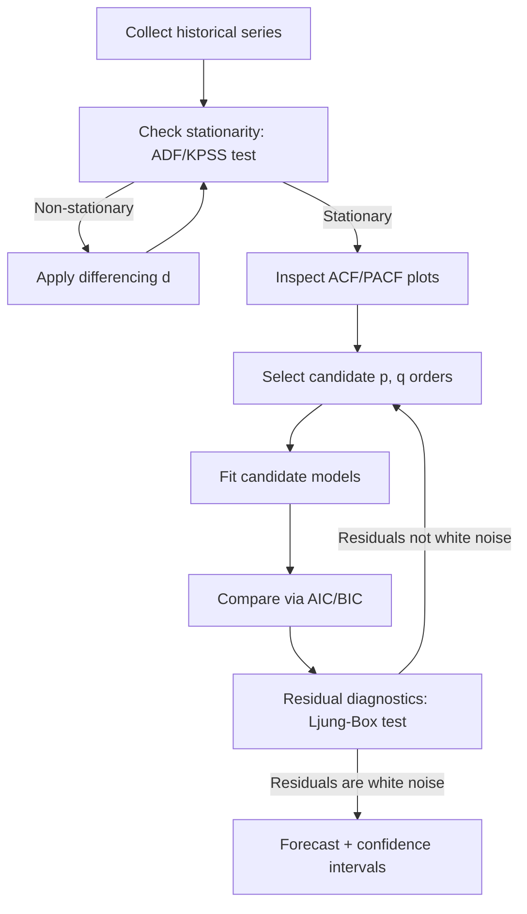
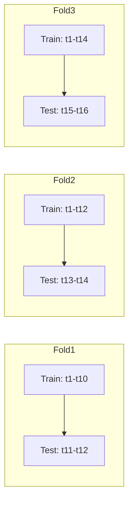

## Quantitative and Time-Series Forecasting Methods


### Overview

Quantitative forecasting methods use historical numerical data to project future demand, workload, or resource consumption. In capacity planning, these methods form the analytical backbone for deciding how much infrastructure, staffing, or throughput capacity to provision ahead of need. Unlike qualitative methods (expert judgment, market research), quantitative approaches rely on measurable patterns: trend, seasonality, cyclicality, and noise.

### Why Forecasting Matters for Capacity Planning

**Key Points**

- Under-forecasting leads to capacity shortfalls: throttling, latency, outages, or lost revenue.
- Over-forecasting leads to wasted spend on idle infrastructure or overstaffed teams.
- Lead time for capacity (hardware procurement, hiring, data center buildout) is often long, so forecasts must extend far enough ahead to be actionable.
- The forecast horizon should match the capacity decision cycle: short-term (days/weeks) for autoscaling, medium-term (months) for budget and headcount, long-term (years) for facility or data-center investment.

### Components of a Time Series

A time series is typically decomposed into four components:

$$Y_t = T_t + S_t + C_t + \epsilon_t$$

(additive form) or

$$Y_t = T_t \times S_t \times C_t \times \epsilon_t$$

(multiplicative form), where:

- $T_t$ — Trend: long-term direction (growth or decline)
- $S_t$ — Seasonality: fixed, calendar-based periodic pattern (daily, weekly, yearly)
- $C_t$ — Cyclicality: longer, non-fixed-period fluctuations (e.g., business cycles)
- $\epsilon_t$ — Residual/noise: irregular, unexplained variation

The additive model is appropriate when seasonal variation is roughly constant in absolute magnitude; the multiplicative model is appropriate when seasonal variation scales with the level of the series (common in growing systems, e.g., traffic that doubles yet still shows the same *relative* weekend dip).

### Classical Quantitative Methods

#### 1. Moving Average (MA)

Smooths short-term fluctuations by averaging the last $n$ observations:

$$\hat{Y}_{t+1} = \frac{1}{n}\sum_{i=0}^{n-1} Y_{t-i}$$

- **Example**: A 7-day moving average of daily API request volume smooths out day-of-week noise for a rough near-term capacity baseline.
- Simple, low-cost, but lags behind trend changes and gives no confidence interval.

#### 2. Weighted Moving Average

Assigns higher weights to more recent observations, so the forecast reacts faster to recent shifts than a simple MA while still smoothing noise.

$$\hat{Y}_{t+1} = \sum_{i=0}^{n-1} w_i \, Y_{t-i}, \quad \sum w_i = 1$$

#### 3. Exponential Smoothing (Simple)

Applies exponentially decreasing weights to older observations via a smoothing constant $\alpha \in (0,1)$:

$$\hat{Y}_{t+1} = \alpha Y_t + (1-\alpha)\hat{Y}_t$$

- Higher $\alpha$ → more weight on recent data, more responsive but noisier.
- Lower $\alpha$ → smoother, slower to react.
- Suitable only for data with no strong trend or seasonality.

#### 4. Holt's Linear Trend Method (Double Exponential Smoothing)

Extends simple exponential smoothing to capture trend using two equations (level and trend):

$$\ell_t = \alpha Y_t + (1-\alpha)(\ell_{t-1} + b_{t-1})$$


$$b_t = \beta(\ell_t - \ell_{t-1}) + (1-\beta)b_{t-1}$$


$$\hat{Y}_{t+h} = \ell_t + h\,b_t$$

Useful for capacity metrics with steady linear growth, such as monthly active users on a scaling product.

#### 5. Holt-Winters (Triple Exponential Smoothing)

Adds a third equation for seasonality, making it one of the most widely used classical methods for capacity forecasting because infrastructure and business metrics are frequently both trending and seasonal (e.g., e-commerce traffic trending up year-over-year with weekly and holiday seasonality).

$$\ell_t = \alpha \frac{Y_t}{s_{t-m}} + (1-\alpha)(\ell_{t-1}+b_{t-1})$$


$$b_t = \beta(\ell_t - \ell_{t-1}) + (1-\beta)b_{t-1}$$


$$s_t = \gamma \frac{Y_t}{\ell_t} + (1-\gamma)s_{t-m}$$


$$\hat{Y}_{t+h} = (\ell_t + h\,b_t)\, s_{t-m+h \bmod m}$$

where $m$ is the seasonal period (e.g., 7 for weekly seasonality on daily data).

### ARIMA Family (AutoRegressive Integrated Moving Average)

ARIMA models are the standard statistical workhorse for time-series forecasting when the series can be made stationary (constant mean/variance over time).

**ARIMA(p, d, q)** components:

- **p** — order of the autoregressive (AR) term: uses $p$ past values.
- **d** — degree of differencing needed to achieve stationarity.
- **q** — order of the moving average (MA) term: uses $q$ past forecast errors.

$$Y_t' = c + \sum_{i=1}^{p}\phi_i Y_{t-i}' + \sum_{j=1}^{q}\theta_j \epsilon_{t-j} + \epsilon_t$$

where $Y_t'$ is the differenced series.

**SARIMA (Seasonal ARIMA)** extends this with seasonal terms $(P, D, Q, m)$ to explicitly model periodic capacity patterns (e.g., weekly infra load): SARIMA(p,d,q)(P,D,Q)$_m$.

**Workflow for building an ARIMA model:**



**Key Points**

- Stationarity is required before fitting AR/MA terms; the Augmented Dickey-Fuller (ADF) test is standard for checking this.
- ACF (autocorrelation function) and PACF (partial autocorrelation function) plots guide selection of $q$ and $p$ respectively.
- AIC/BIC (information criteria) are used to compare candidate model fits while penalizing complexity.
- `auto_arima` (in Python's `pmdarima` library) automates order selection via stepwise search.

**Example (Python, statsmodels):**

```python
import pandas as pd
from statsmodels.tsa.statespace.sarimax import SARIMAX

# ts: pandas Series indexed by daily timestamp, e.g., daily peak CPU utilization
model = SARIMAX(ts, order=(1, 1, 1), seasonal_order=(1, 1, 1, 7))
fit = model.fit(disp=False)

forecast = fit.get_forecast(steps=30)
mean_forecast = forecast.predicted_mean
conf_int = forecast.conf_int(alpha=0.05)  # 95% confidence interval
```

### Regression-Based Methods

#### Linear Regression on Time

Treats time as an independent variable:

$$\hat{Y}_t = \beta_0 + \beta_1 t$$

Useful as a simple trend baseline but ignores seasonality unless extended.

#### Multiple Linear Regression with Explanatory Variables

Incorporates external drivers (marketing spend, headcount, feature launches, active user counts) as regressors:

$$\hat{Y}_t = \beta_0 + \beta_1 X_{1,t} + \beta_2 X_{2,t} + \dots + \epsilon_t$$

This is valuable in capacity planning because raw infrastructure demand often correlates with a leading business metric (e.g., signups precede storage growth by a known lag).

#### Poisson / Negative Binomial Regression

Applicable when the forecasted variable is a count (e.g., number of support tickets, number of concurrent jobs). Poisson regression assumes mean = variance; negative binomial regression relaxes this for overdispersed count data, which is common in real operational datasets.

### Modern / Machine-Learning-Based Methods

#### Facebook/Meta Prophet

An additive model designed for business time series with strong seasonality and holiday effects, robust to missing data and outliers:

$$y(t) = g(t) + s(t) + h(t) + \epsilon_t$$

where $g(t)$ is a piecewise trend, $s(t)$ is Fourier-series-based seasonality, and $h(t)$ captures holiday effects.

**Example (Python):**

```python
from prophet import Prophet

df = df.rename(columns={"date": "ds", "requests": "y"})
model = Prophet(yearly_seasonality=True, weekly_seasonality=True)
model.add_country_holidays(country_name='US')
model.fit(df)

future = model.make_future_dataframe(periods=90)
forecast = model.predict(future)
```

[Unverified] Prophet's default changepoint detection may require tuning (`changepoint_prior_scale`) for series with abrupt structural breaks, such as a sudden product launch spike; behavior can vary by dataset.

#### Gradient Boosted Trees (XGBoost, LightGBM) for Forecasting

Time series is reframed as a supervised learning problem using lag features, rolling statistics, and calendar features:

- Lag features: $Y_{t-1}, Y_{t-7}, Y_{t-30}$
- Rolling statistics: rolling mean/std over trailing windows
- Calendar features: day-of-week, month, is-holiday flags

This approach handles nonlinear interactions and multiple exogenous regressors well but requires careful feature engineering and back-testing to avoid leakage (using future information at training time).

#### Deep Learning Approaches

- **LSTM/GRU networks**: capture long-range temporal dependencies; require larger datasets and more tuning than classical methods.
- **Temporal Fusion Transformer (TFT)**: attention-based architecture supporting multi-horizon forecasting with static and time-varying covariates.
- **DeepAR (Amazon)**: autoregressive recurrent network producing probabilistic forecasts, well suited to forecasting many related series simultaneously (e.g., per-service capacity across hundreds of microservices) by learning shared patterns across the panel.

**Key Points**

- Deep learning methods generally outperform classical methods only with sufficient data volume and when many related series can be modeled jointly; for a single, short, low-volume series, classical methods (ETS, ARIMA) often perform comparably or better and are far cheaper to maintain. [Inference — performance is dataset-dependent and not guaranteed across all workloads]

### Forecast Accuracy Metrics

| Metric | Formula | Notes |
| --- | --- | --- |
| MAE | $\frac{1}{n}\sum \lvert Y_t - \hat{Y}_t \rvert$ | Same units as data; robust to outliers |
| MSE | $\frac{1}{n}\sum (Y_t - \hat{Y}_t)^2$ | Penalizes large errors heavily |
| RMSE | $\sqrt{MSE}$ | Same units as data |
| MAPE | $\frac{100\%}{n}\sum \left\lvert \frac{Y_t - \hat{Y}_t}{Y_t} \right\rvert$ | Undefined/unstable when $Y_t \approx 0$ |
| SMAPE | $\frac{100\%}{n}\sum \frac{\lvert Y_t - \hat{Y}_t \rvert}{(\lvert Y_t\rvert + \lvert \hat{Y}_t\rvert)/2}$ | Symmetric alternative to MAPE |
| MASE | $\frac{MAE}{MAE_{\text{naive}}}$ | Scale-independent; comparable across series |

For capacity planning specifically, asymmetric loss is often more meaningful than these symmetric metrics: under-provisioning (stockout, outage) is typically costlier than over-provisioning, so many practitioners weight forecast errors asymmetrically or forecast at a chosen upper quantile (e.g., the 90th or 95th percentile of predicted demand) rather than the point mean, to build in a service-level safety margin.

### Backtesting and Validation

Standard train/test random splits are invalid for time series because they violate temporal ordering. Instead:



This is known as **rolling-origin** or **walk-forward validation**: the training window expands (or slides) forward in time, and the model is re-evaluated on each successive out-of-sample block. This mimics how the model would actually be used in production, re-forecast periodically as new data arrives.

### Choosing a Method

| Situation | Recommended Method |
| --- | --- |
| Short history, simple trend | Moving average, exponential smoothing |
| Trend + fixed seasonality | Holt-Winters, SARIMA |
| Strong holiday/event effects | Prophet |
| Many related series (fleet of services) | DeepAR, global ML models |
| Rich exogenous drivers available | Regression, gradient boosted trees |
| Need interpretable confidence intervals | ARIMA/SARIMA, Holt-Winters |
| Low data volume, need robustness | Classical statistical methods over deep learning |

### Applying Forecasts to Capacity Decisions

1. Forecast the demand metric (requests/sec, active users, storage GB, ticket volume) at the desired horizon.
2. Convert demand forecast into a resource requirement using a capacity model (e.g., requests/sec ÷ throughput-per-node = nodes needed).
3. Apply a safety buffer informed by forecast uncertainty (confidence interval width) and desired service level.
4. Compare required capacity against current provisioned capacity to compute the capacity gap.
5. Feed the gap into procurement, scaling policies, or hiring plans with appropriate lead time.

**Conclusion**

Quantitative and time-series forecasting methods range from simple moving averages to deep probabilistic models, each trading off interpretability, data requirements, and accuracy. For capacity planning, the choice of method should be driven by the shape of the demand pattern (trend, seasonality, volume of related series), the forecast horizon dictated by procurement or scaling lead times, and the asymmetric cost of under- versus over-provisioning — not simply by model sophistication.

**Related Topics**

- Qualitative forecasting and expert judgment methods (Delphi method, analogous estimation)
- Demand sensing and leading-indicator selection
- Safety stock and buffer sizing under forecast uncertainty
- Queuing theory for translating demand forecasts into resource requirements
- The learning curve and its effect on unit cost/time reduction over cumulative production
- Ensemble and hierarchical forecasting (reconciling forecasts across organizational levels)
- Anomaly detection and forecast monitoring in production systems