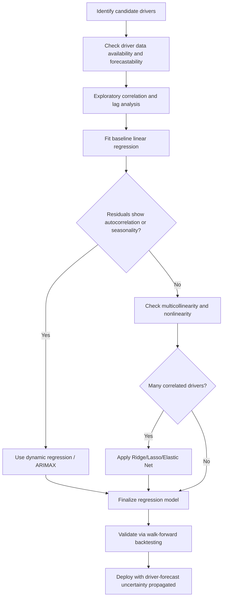

## Causal and Regression-Based Forecasting


### Overview

Causal (also called explanatory or econometric) forecasting predicts a target variable using one or more independent variables believed to *drive* or *explain* its behavior, rather than relying solely on the target's own past values as time-series methods do. In capacity planning, causal methods are used when demand for a resource is known to be driven by identifiable business or operational factors — marketing spend, headcount, pricing, feature launches, upstream pipeline volume — and those drivers are available (or forecastable) ahead of the target metric.

### Causal vs. Time-Series Forecasting

| Aspect | Time-Series (e.g., ARIMA) | Causal/Regression |
| --- | --- | --- |
| Basis | Own past values, trend, seasonality | External explanatory variables |
| Data need | Only the target series | Target + driver variable history |
| Interpretability | Limited (statistical patterns) | High (explicit driver coefficients) |
| Use case | Stable, self-similar patterns | Known structural relationships |
| Scenario planning | Difficult | Natural ("what if X increases by 10%?") |
| Risk | Misses structural shifts | Sensitive to driver forecast errors |

**Key Points**

- Causal methods are preferred when the underlying business changes fast enough that historical patterns in the target alone are unreliable, but a leading driver is known and forecastable.
- They enable **scenario-based capacity planning**: modeling "what happens to server load if signups grow 20%" is natural in a regression framework but awkward in pure time-series models.
- A causal model's forecast quality is bounded by the accuracy of the forecasted driver variables (garbage-in, garbage-out).

### Simple Linear Regression

Models the target as a linear function of a single explanatory variable:

$$\hat{Y} = \beta_0 + \beta_1 X$$

- $\beta_0$ — intercept (baseline value when $X=0$)
- $\beta_1$ — slope (expected change in $Y$ per unit change in $X$)

**Example**: Forecasting required storage capacity (GB) as a function of monthly active users (MAU):

$$\widehat{\text{Storage}} = 500 + 0.02 \times \text{MAU}$$

If MAU is forecast to reach 2,000,000 next quarter, expected storage need is $500 + 0.02(2{,}000{,}000) = 40{,}500$ GB.

Parameters are typically estimated via **ordinary least squares (OLS)**, minimizing:

$$\sum_{i=1}^{n} (Y_i - \hat{Y}_i)^2$$

### Multiple Linear Regression

Extends to multiple drivers:

$$\hat{Y} = \beta_0 + \beta_1 X_1 + \beta_2 X_2 + \dots + \beta_k X_k + \epsilon$$

**Example**: Forecasting call-center staffing needs (agent-hours) from multiple business drivers:

$$\widehat{\text{AgentHours}} = \beta_0 + \beta_1(\text{OrdersPlaced}) + \beta_2(\text{ActivePromotions}) + \beta_3(\text{NewSignups})$$

**Model diagnostics to check:**

- **$R^2$ / Adjusted $R^2$** — proportion of variance explained; adjusted version penalizes adding uninformative predictors.
- **Multicollinearity** — checked via Variance Inflation Factor (VIF); high VIF (commonly flagged above 5–10) indicates predictors are redundant, which destabilizes coefficient estimates.
- **Residual analysis** — residuals should be homoscedastic (constant variance) and approximately normally distributed; patterns in residual plots suggest a missing nonlinear term or omitted variable.
- **Durbin-Watson statistic** — tests for autocorrelation in residuals, which is common when regressing on time-ordered operational data and violates the independence assumption of OLS.

```python
import statsmodels.api as sm

X = df[["orders_placed", "active_promotions", "new_signups"]]
X = sm.add_constant(X)  # adds beta_0 intercept term
y = df["agent_hours"]

model = sm.OLS(y, X).fit()
print(model.summary())  # coefficients, p-values, R^2, VIF diagnostics available separately
```

### Leading Indicators and Lagged Regressors

Capacity-relevant drivers often affect the target with a **lag** — a delay between the driver changing and the effect appearing. Regressing on lagged variables captures this:

$$\hat{Y}_t = \beta_0 + \beta_1 X_{t-1} + \beta_2 X_{t-2} + \dots$$

**Example**: New user signups today predict storage consumption 30–60 days later as users upload content; a distributed-lag model with $X_{t-30}$ and $X_{t-60}$ terms captures this delayed effect more accurately than same-period regression.

Cross-correlation analysis is used beforehand to identify the lag at which a candidate driver has maximum correlation with the target, guiding which lagged terms to include.

### Regression with Time-Series Components (Dynamic Regression)

Pure causal regression ignores autocorrelation in the target series. **Dynamic regression** (also called ARIMAX or regression with ARIMA errors) combines explanatory variables with an ARIMA structure on the residuals:

$$Y_t = \beta_0 + \beta_1 X_{1,t} + \dots + \beta_k X_{k,t} + \eta_t$$

where $\eta_t$ follows an ARIMA$(p,d,q)$ process rather than being independent white noise. This is standard practice when a target has both explanatory drivers and residual autocorrelation/seasonality that plain OLS would miss.

```python
from statsmodels.tsa.statespace.sarimax import SARIMAX

# Exogenous regressor: marketing_spend; target: daily_signups
model = SARIMAX(
    endog=df["daily_signups"],
    exog=df[["marketing_spend", "is_promo_day"]],
    order=(1, 1, 1),
    seasonal_order=(1, 1, 1, 7)
)
fit = model.fit(disp=False)

# Forecasting requires future values of exogenous regressors
future_exog = pd.DataFrame({
    "marketing_spend": planned_spend_next_30d,
    "is_promo_day": promo_calendar_next_30d
})
forecast = fit.get_forecast(steps=30, exog=future_exog)
```

**Key Points**

- Using exogenous regressors in forecasting *requires* future values of those regressors to be known or forecastable — this is often the hardest practical constraint in causal forecasting.
- When future driver values are themselves uncertain, forecast uncertainty compounds: the model's confidence interval should reflect both residual uncertainty and driver-forecast uncertainty, though standard software output (like SARIMAX's `conf_int`) typically only reflects the former unless explicitly extended. [Unverified — exact behavior depends on library/version]

### Nonlinear and Transformed Regression

When the driver-target relationship isn't linear, common approaches include:

- **Log-log models**: $\ln(Y) = \beta_0 + \beta_1 \ln(X)$, where $\beta_1$ is interpreted as an elasticity (percent change in $Y$ per percent change in $X$). Useful for network effects where capacity demand grows faster than linearly with user count.
- **Polynomial regression**: adding $X^2, X^3$ terms to capture curvature (e.g., diminishing returns in throughput per additional server due to coordination overhead).
- **Piecewise/segmented regression**: different linear relationships before and after a **changepoint**, useful when a structural shift occurred (e.g., after a major architecture migration).

### Regularized Regression for Many Drivers

When many candidate drivers exist and some are collinear or irrelevant, regularization improves generalization:

- **Ridge regression** — adds an $L_2$ penalty: $\sum(Y_i - \hat{Y}_i)^2 + \lambda\sum\beta_j^2$; shrinks coefficients toward zero without eliminating them, mitigating multicollinearity.
- **Lasso regression** — adds an $L_1$ penalty: $\sum(Y_i - \hat{Y}_i)^2 + \lambda\sum|\beta_j|$; can shrink coefficients exactly to zero, performing automatic feature selection.
- **Elastic Net** — combines both penalties, useful when predictors are both numerous and correlated.

$\lambda$ (regularization strength) is typically chosen via cross-validation on a held-out time-ordered split.

### Causal Inference Considerations

Regression coefficients show **association**, not necessarily **causation**, unless the study design supports a causal claim. In capacity planning this distinction matters because acting on a spurious correlation (e.g., scaling infrastructure based on a metric that merely co-moves with true demand rather than driving it) wastes spend.

- **Confounding variables**: an omitted variable affecting both driver and target can create a misleading coefficient. Example: both marketing spend and server load might independently rise during a holiday season, creating an apparent link between them that vanishes once "holiday season" is included as a control.
- **Granger causality test**: a statistical test for whether one time series contains information that helps predict another beyond its own past — commonly used to screen candidate causal drivers, though it establishes predictive precedence rather than true causation. [Unverified — interpretation nuances are debated in the econometrics literature]
- **A/B testing / natural experiments**: the strongest way to establish that a driver *causes* a capacity-relevant outcome (e.g., testing whether a new onboarding flow causally increases storage consumption per user) rather than merely correlating with it.

### Model Selection Workflow



### Practical Example: End-to-End Capacity Forecast

**Scenario**: A SaaS company wants to forecast required compute nodes 90 days out.

1. **Identify driver**: API request volume correlates strongly with paying customer count (a leading indicator available from the sales pipeline forecast).
2. **Fit model**:

$$\widehat{\text{RequestsPerSec}} = \beta_0 + \beta_1(\text{PayingCustomers}) + \beta_2(\text{AvgRequestsPerCustomer}_t)$$

3. **Forecast drivers**: Sales provides a 90-day paying-customer forecast (itself possibly a time-series or funnel-based forecast).
4. **Propagate**: Feed the driver forecast into the regression to get $\widehat{\text{RequestsPerSec}}$ at day 90.
5. **Convert to capacity**:

$$\text{NodesNeeded} = \left\lceil \frac{\widehat{\text{RequestsPerSec}} \times (1 + \text{safety margin})}{\text{RequestsPerSecPerNode}} \right\rceil$$

6. **Sensitivity/scenario analysis**: Re-run with optimistic/pessimistic customer-growth scenarios to bound the capacity range, which is a natural strength of causal models over black-box time-series forecasts.

**Output**

| Scenario | Paying Customers (Day 90) | Forecast Req/sec | Nodes Needed (w/ 20% buffer) |
| --- | --- | --- | --- |
| Pessimistic | 40,000 | 8,200 | 11 |
| Base | 50,000 | 10,400 | 14 |
| Optimistic | 65,000 | 13,900 | 18 |

**Conclusion**

Causal and regression-based forecasting connects capacity requirements directly to the business drivers that generate demand, making it especially valuable for scenario planning, budget justification, and situations where historical demand patterns alone are unreliable predictors of the future. Its accuracy, however, is fundamentally gated by the availability and quality of forecasts for the driver variables themselves, and care must be taken to distinguish genuine causal drivers from spurious correlations before committing capacity investment to them.

**Related Topics**

- Quantitative and time-series forecasting methods (ARIMA, Holt-Winters, Prophet)
- Leading indicator identification and cross-correlation analysis
- Scenario planning and sensitivity analysis for capacity budgets
- Multicollinearity diagnostics and regularization (Ridge, Lasso, Elastic Net)
- Granger causality and experimental design for validating capacity drivers
- Queuing theory for converting request-rate forecasts into node counts
- Forecast uncertainty propagation and confidence interval construction