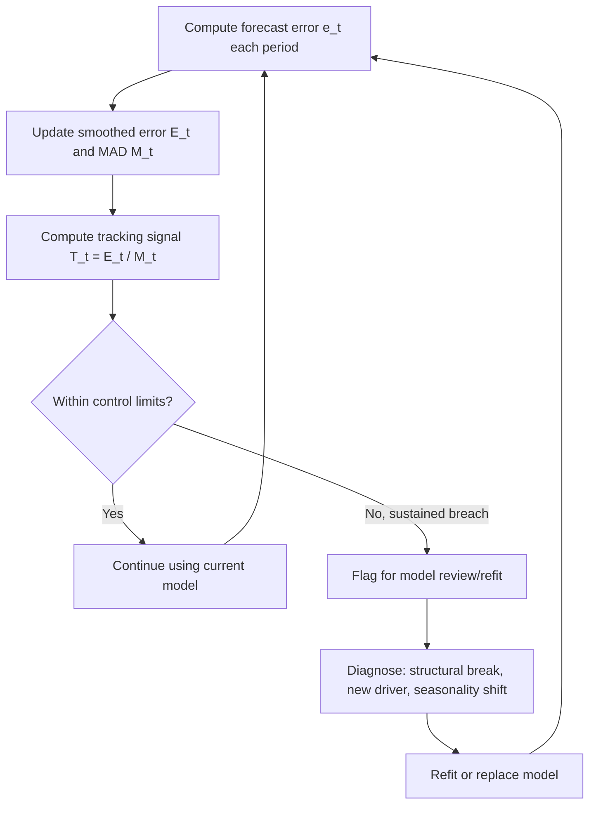

## Forecast Error Measurement and Tracking Signals


### Overview

Producing a forecast is only half the discipline; measuring how wrong it was, and detecting when a forecasting model has drifted out of alignment with reality, is what keeps a capacity planning process trustworthy over time. Forecast error measurement quantifies historical accuracy, while tracking signals provide an ongoing, statistically grounded early-warning mechanism for bias — systematic over- or under-forecasting that simple accuracy metrics can mask.

### Why Error Measurement Matters for Capacity Planning

**Key Points**

- A forecast with low average error can still have dangerous **bias** (consistently under-forecasting), which silently erodes capacity headroom over successive planning cycles.
- Error metrics inform how large a safety buffer to add on top of a point forecast.
- Comparing error across models or time periods requires scale-independent metrics when forecasting multiple series of different magnitude (e.g., comparing forecast accuracy across microservices with vastly different traffic volumes).
- Tracking signals allow automated systems to flag "this forecast model needs re-fitting or human review" without requiring a person to eyeball every chart.

### Forecast Error Definition

For a given period $t$, forecast error is:

$$e_t = Y_t - \hat{Y}_t$$

where $Y_t$ is the actual observed value and $\hat{Y}_t$ is the forecasted value. Positive $e_t$ indicates under-forecasting (actual exceeded prediction); negative $e_t$ indicates over-forecasting.

### Point Accuracy Metrics

#### Mean Error (ME) / Forecast Bias

$$\text{ME} = \frac{1}{n}\sum_{t=1}^{n} e_t$$

Because positive and negative errors cancel, ME close to zero does not imply accurate forecasts — it only indicates the *absence of systematic bias*. A forecast that is wildly wrong but symmetrically so will still show ME near zero.

#### Mean Absolute Error (MAE)

$$\text{MAE} = \frac{1}{n}\sum_{t=1}^{n} |e_t|$$

Measures average magnitude of error regardless of direction, in the same units as the original data (e.g., requests/sec, agent-hours).

#### Mean Squared Error (MSE) and RMSE

$$\text{MSE} = \frac{1}{n}\sum_{t=1}^{n} e_t^2 \qquad \text{RMSE} = \sqrt{\text{MSE}}$$

Squaring penalizes large errors disproportionately, which is often desirable in capacity planning since a single large forecast miss (e.g., missing a demand spike) is typically far costlier than many small misses.

#### Mean Absolute Percentage Error (MAPE)

$$\text{MAPE} = \frac{100\%}{n}\sum_{t=1}^{n}\left|\frac{e_t}{Y_t}\right|$$

Scale-independent and intuitive, but becomes unstable or undefined when $Y_t$ is near zero — a common issue for low-volume series (e.g., a newly launched service with near-zero initial traffic).

#### Symmetric MAPE (sMAPE)

$$\text{sMAPE} = \frac{100\%}{n}\sum_{t=1}^{n}\frac{|e_t|}{(|Y_t| + |\hat{Y}_t|)/2}$$

Addresses MAPE's asymmetric penalty (MAPE penalizes under-forecasts more heavily than over-forecasts of the same absolute size) but has its own known distortions when both $Y_t$ and $\hat{Y}_t$ are small or when $\hat Y_t$ is much larger than $Y_t$. [Unverified — several variants of the sMAPE formula exist in the literature with slightly different scaling conventions]

#### Mean Absolute Scaled Error (MASE)

$$\text{MASE} = \frac{\text{MAE}}{\text{MAE}_{\text{naive}}}$$

where $\text{MAE}_{\text{naive}}$ is the in-sample MAE of a naive (e.g., one-step-lag) forecast. MASE below 1 indicates the model beats the naive baseline; above 1 indicates it underperforms it. This metric is scale-independent and well-behaved even with zero values, making it a common choice for comparing accuracy across a large fleet of heterogeneous series (e.g., forecast accuracy across hundreds of services with different traffic scales).

### Comparison Table

| Metric | Scale-Independent | Handles Zeros | Penalizes Large Errors | Detects Bias |
| --- | --- | --- | --- | --- |
| ME | No | Yes | No | Yes |
| MAE | No | Yes | No | No |
| RMSE | No | Yes | Yes (heavily) | No |
| MAPE | Yes | No | No | No |
| sMAPE | Yes | Partial | No | No |
| MASE | Yes | Yes | No | No |

**Example**: A capacity planning team forecasting daily peak concurrent connections across 50 microservices would typically report MASE per service (for cross-service comparability) alongside RMSE in native units (for the services deemed highest-risk) rather than relying on MAPE, given how many low-traffic services in the fleet would produce unstable MAPE values.

### Tracking Signals

A **tracking signal** is a control-chart-style statistic computed each period to detect when forecast bias has drifted beyond an acceptable threshold, triggering review or model refitting before the bias compounds across several forecast cycles.

#### Cumulative Sum of Forecast Errors (Running Sum of Forecast Errors, RSFE)

$$\text{RSFE}_t = \sum_{i=1}^{t} e_i$$

A steadily growing RSFE (in either direction) indicates persistent bias rather than random noise.

#### Classic Tracking Signal (Trigg's Tracking Signal is one common variant)

$$\text{TS}_t = \frac{\text{RSFE}_t}{\text{MAD}_t}$$

where $\text{MAD}_t$ is the (typically smoothed) mean absolute deviation of errors up to period $t$. This normalizes cumulative bias by typical error magnitude, producing a unitless signal.

- A commonly cited control limit is $|\text{TS}_t| > 4$ to $6$, beyond which the model is flagged as biased and due for review, though the appropriate threshold depends on the series' volatility and the cost of false alarms versus missed drift. [Unverified — the specific threshold is a widely used heuristic rather than a universal statistical law]

#### Trigg's Smoothed Error Tracking Signal

Uses exponentially smoothed error terms rather than a raw cumulative sum, making it more responsive to recent bias shifts:

$$E_t = \alpha e_t + (1-\alpha)E_{t-1}$$


$$M_t = \alpha|e_t| + (1-\alpha)M_{t-1}$$


$$T_t = \frac{E_t}{M_t}$$

$T_t$ ranges between $-1$ and $+1$; values approaching either extreme signal sustained bias in that direction.

### Visualizing Tracking Signal Behavior



### Statistical Control Chart Approach

Analogous to statistical process control (SPC) in manufacturing, forecast errors can be plotted on a control chart with upper and lower control limits, typically set at some multiple of the standard deviation of historical errors (e.g., $\pm 2\sigma$ or $\pm 3\sigma$ around a mean of zero). A single point outside the limits, or a run of consecutive points on one side of the centerline (commonly a run of 7–8 as used in classical SPC rules), signals non-random bias requiring investigation. [Unverified — specific run-length rules vary by SPC methodology/source]

### Backtesting Framework for Error Tracking

To measure error meaningfully over time (not just once), forecasts should be evaluated using **rolling-origin backtesting**, where the model is repeatedly re-forecast from successive historical points and each forecast is compared against what actually happened:

```python
import numpy as np
import pandas as pd

def rolling_backtest(series, model_fit_fn, forecast_fn, horizon=7, min_train=90):
    errors = []
    for origin in range(min_train, len(series) - horizon):
        train = series[:origin]
        actual = series[origin:origin + horizon]
        model = model_fit_fn(train)
        forecast = forecast_fn(model, horizon)
        e = actual.values - forecast
        errors.append(e)
    return np.array(errors)

# errors: shape (num_origins, horizon) -- can compute MAE/RMSE/bias per horizon step
errors = rolling_backtest(daily_traffic, fit_sarima, forecast_sarima, horizon=14)
bias_by_horizon = errors.mean(axis=0)
mae_by_horizon = np.abs(errors).mean(axis=0)
```

**Key Points**

- Error typically grows with forecast horizon; reporting accuracy metrics *per horizon step* (day 1 vs. day 30 forecast) rather than a single aggregate number gives a much clearer picture of how far ahead a model can be trusted.
- Backtesting should hold out entire forecast windows, not individual points, to avoid leaking future information into the accuracy assessment.

### Handling Detected Bias

When a tracking signal or control chart flags sustained bias, typical remediation steps include:

1. **Diagnose the cause** — check for a structural break (e.g., product launch, architecture migration, pricing change) versus gradual drift (e.g., slow seasonal pattern shift).
2. **Re-fit model parameters** — refresh smoothing constants, ARIMA orders, or regression coefficients on recent data.
3. **Add or update explanatory variables** — if a new causal driver (e.g., a new customer segment) has emerged, a pure time-series model may need supplementing with regressors (see: Causal and regression-based forecasting).
4. **Adjust the safety buffer** — increase headroom margins temporarily while confidence in the refreshed model is being re-established.
5. **Re-baseline the tracking signal** — reset cumulative error sums after a deliberate model change so historical bias doesn't stay flagged against a now-retired model.

### Practical Governance Pattern

**Output**

| Governance Element | Typical Practice |
| --- | --- |
| Review cadence | Weekly or monthly tracking signal review per forecasted series |
| Escalation threshold | Tracking signal breach for 2+ consecutive periods |
| Ownership | Forecast/capacity planning team owns model; stakeholders own driver data quality |
| Audit trail | Log of forecast vs. actual, error metrics, and any model refits with rationale |
| Alerting | Automated alert when tracking signal or control limit is breached, rather than manual chart review |

**Conclusion**

Forecast error measurement and tracking signals close the feedback loop in capacity planning: point accuracy metrics (MAE, RMSE, MASE) answer "how wrong was the forecast on average," while tracking signals answer the more operationally urgent question of "has the forecast become systematically and persistently wrong in one direction." A mature capacity planning process treats both together, using accuracy metrics to select and compare models and tracking signals to trigger timely re-evaluation before bias erodes capacity margins.

**Related Topics**

- Quantitative and time-series forecasting methods (ARIMA, Holt-Winters, Prophet)
- Causal and regression-based forecasting
- Safety stock and buffer sizing under forecast uncertainty
- Statistical process control (SPC) charts and control limits
- Rolling-origin / walk-forward backtesting design
- Forecast reconciliation across hierarchical or grouped time series
- Anomaly detection for identifying structural breaks in demand data