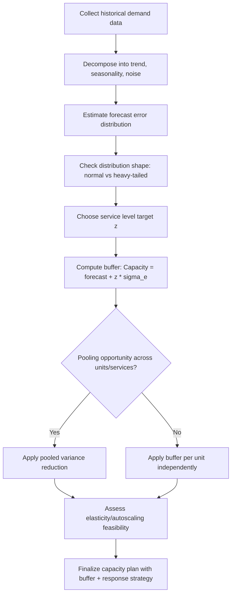

## Demand Variability and Its Capacity Implications


### Overview

Demand variability refers to the degree to which actual demand fluctuates around its expected (forecasted) value. While forecasting methods aim to predict the *center* of future demand, capacity planning must also account for the *spread* around that center, because capacity that is sized only to the average will be insufficient roughly half the time by definition. Understanding and quantifying variability is what separates a point forecast from an actionable capacity decision.

### Sources of Demand Variability

**Key Points**

- **Random/irreducible noise** — inherent stochastic fluctuation with no identifiable cause (e.g., natural variation in arrival times of user requests).
- **Seasonal variability** — predictable, calendar-driven fluctuation (daily, weekly, holiday patterns) that is technically forecastable but still creates peak-to-average gaps that capacity must cover.
- **Cyclical variability** — longer, less regular fluctuations tied to business or economic cycles.
- **Event-driven variability** — spikes from marketing campaigns, product launches, news events, or viral traffic, often with a short lead time.
- **Structural variability** — shifts in the underlying demand-generating process itself, such as a permanent change in user behavior after a UX redesign.
- **Bullwhip-style amplification** — variability that grows as it propagates upstream through a multi-stage system (see dedicated section below), relevant wherever capacity decisions at one stage depend on forecasts derived from another stage's output.

### Measuring Variability

#### Variance and Standard Deviation

$$\sigma^2 = \frac{1}{n}\sum_{t=1}^{n}(Y_t - \bar{Y})^2 \qquad \sigma = \sqrt{\sigma^2}$$

Standard deviation is in the same units as demand and is the most common building block for sizing safety buffers.

#### Coefficient of Variation (CV)

$$CV = \frac{\sigma}{\mu}$$

Normalizes variability by the mean, enabling comparison of "how erratic" demand is across series of very different scale (e.g., comparing traffic variability of a high-volume service against a low-volume one). Higher CV indicates demand that is proportionally more erratic and harder to plan for with a fixed buffer percentage.

#### Peak-to-Average Ratio (PAR)

$$PAR = \frac{Y_{\text{peak}}}{\bar{Y}}$$

Directly relevant to capacity sizing: infrastructure or staffing must often be provisioned for the peak, not the average, unless elastic/on-demand scaling is available. A high PAR (common in retail traffic around sales events, or call centers around outage incidents) implies large amounts of capacity sit idle outside peak periods unless variability is managed through mechanisms discussed below.

#### Squared Coefficient of Variation ($SCV$)

$$SCV = CV^2 = \left(\frac{\sigma}{\mu}\right)^2$$

Used directly in queuing formulas (e.g., the Kingman/VUT approximation) to translate variability into expected wait times and required capacity, connecting variability measurement directly to queuing-theory-based capacity models.

### Demand Distribution Shape

Beyond the mean and variance, the *shape* of the demand distribution affects how much buffer capacity is needed:

- **Normal distribution** — appropriate for demand driven by many small, independent additive factors (central-limit-theorem behavior); buffer sizing follows standard z-score multiples of $\sigma$.
- **Poisson distribution** — common for arrival-count processes (e.g., number of requests in a fixed time window) where events occur independently at a constant average rate; variance equals the mean.
- **Negative binomial / overdispersed distributions** — used when observed variance exceeds the mean (overdispersion), which is common in real operational data where arrivals are correlated or bursty rather than perfectly independent.
- **Heavy-tailed / power-law-like distributions** — relevant when a small number of extreme spikes (viral events, DDoS-like traffic surges) dominate tail risk; standard-deviation-based buffers can badly underestimate the capacity needed to survive these tail events.

**Key Points**

- Assuming normality when the true distribution is heavy-tailed is a common capacity planning failure mode: a "3-sigma" buffer computed under a normal assumption may cover far less of the true tail risk than intended if actual demand is heavy-tailed. [Inference — the degree of underestimation depends on the specific tail behavior of the real distribution, which must be empirically checked rather than assumed]

### Capacity Implications: Buffer Sizing

Given a forecast $\hat{Y}$ with estimated standard deviation of forecast error $\sigma_e$, a common approach sizes capacity as:

$$\text{Capacity} = \hat{Y} + z \cdot \sigma_e$$

where $z$ is a safety factor chosen from the standard normal distribution corresponding to a target service level. For example, $z = 1.65$ corresponds to roughly a 95% service level (under a normality assumption), and $z = 2.33$ to roughly 99%.

**Example**: If forecasted peak daily requests/sec is 10,000 with a forecast error standard deviation of 800, and the target service level is 95% ($z \approx 1.65$):

$$\text{Capacity} = 10{,}000 + 1.65 \times 800 = 11{,}320 \text{ req/sec}$$

**Key Points**

- The safety buffer scales with forecast error variability, not just demand variability — a highly variable but perfectly forecastable pattern (e.g., known seasonality) requires far less "safety" buffer than an equally variable but poorly forecastable pattern, because seasonality can be built into $\hat{Y}$ itself rather than absorbed into $\sigma_e$.
- As lead time to add capacity increases, forecast error typically grows (forecasts further out are less accurate), which increases $\sigma_e$ and therefore required buffer — a direct link between capacity lead time and variability-driven overprovisioning.

### The Bullwhip Effect

In multi-stage systems (e.g., a demand signal passing from customer-facing service → internal platform team → infrastructure procurement, or retail demand → distributor → manufacturer), variability tends to **amplify** at each upstream stage. This is the classic bullwhip effect from supply chain theory, directly analogous to capacity planning in layered systems.

```mermaid
flowchart LR
    A[End-customer demand<br/>low variability (svg_diagram)] --> B[Front-end service<br/>demand forecast]
    B --> C[Platform team<br/>capacity request]
    C --> D[Infrastructure procurement<br/>hardware order]
    D --> E[High variability<br/>amplified swings]
```

Causes of bullwhip amplification relevant to capacity planning:

- **Order batching** — requesting capacity in large discrete chunks (e.g., quarterly hardware orders) rather than continuously, which exaggerates the appearance of demand swings.
- **Demand signal distortion** — each layer forecasting off the layer below it rather than off true end demand, compounding forecast error at each hop.
- **Lead-time-driven overreaction** — teams padding requests to hedge against long procurement lead times, which then get padded again by the next layer.
- **Promotion/incentive-driven spikes** — artificial demand pull-forward (e.g., pre-provisioning ahead of a known campaign) that doesn't reflect organic demand shape.

**Mitigation approaches** commonly cited in operations literature:

- Sharing real end-demand data across layers instead of relying on derived/forecasted orders from the adjacent layer.
- Reducing batch sizes and order/procurement cycle times.
- Stabilizing pricing/incentive structures that cause artificial demand pull-forward.
- Centralizing capacity forecasting closer to the true demand source rather than at each intermediate layer independently.

### Pooling and Variability Reduction

A core structural lever for handling variability is **risk pooling** — combining demand across multiple independent (or weakly correlated) sources so that the aggregate is proportionally less variable than the sum of the individual variabilities, provided the pooled sources are not perfectly correlated.

For $n$ independent demand streams each with variance $\sigma^2$, the pooled variance is:

$$\sigma^2_{\text{pooled}} = \sum_{i=1}^n \sigma_i^2 \qquad CV_{\text{pooled}} = \frac{\sqrt{\sum \sigma_i^2}}{\sum \mu_i}$$

If the streams are independent and identically distributed, $CV_{\text{pooled}}$ decreases roughly with $1/\sqrt{n}$ relative to a single stream's CV, which is the statistical basis for why shared/centralized capacity (shared compute clusters, shared staffing pools, centralized inventory) requires proportionally less buffer than the sum of dedicated buffers per unit.

**Example**: Ten independent services, each needing a 30% capacity buffer individually to hit a target service level, might collectively need only an ~15–20% buffer on a shared, pooled resource pool covering all ten — the exact reduction depends on the actual correlation structure between the services' demand patterns. [Inference — pooling benefit magnitude is scenario-dependent, especially if demand across services is correlated (e.g., all spike together during a shared upstream outage), in which case pooling benefits shrink or vanish]

If demand streams are positively correlated (e.g., multiple regional services all spiking during a global event), pooling benefits are reduced accordingly; the diversification benefit of pooling depends specifically on the correlation, not just the count of streams pooled.

### Elasticity as a Response to Variability

Where infrastructure or staffing can flex quickly (cloud autoscaling, on-call/gig staffing pools), the capacity implication of variability shifts from "how much buffer to pre-provision" to "how fast can capacity respond, and what's the cost of a slower response window":

| Approach | Best suited for | Trade-off |
| --- | --- | --- |
| Fixed buffer sized to $z\sigma$ | Long procurement lead time, low elasticity | Simple, but wastes capacity in low-demand periods |
| Reactive autoscaling | Fast-provisioning cloud resources | Reduces waste, but exposed to scale-up lag during sudden spikes |
| Predictive/scheduled scaling | Known seasonal patterns (daily/weekly cycles) | Requires accurate short-term forecasts |
| Hybrid (baseline + burst) | Most production systems | Baseline sized to typical demand; burst capacity (reserved or on-demand) covers tail variability |

### Practical Workflow: From Variability to Capacity Plan



**Conclusion**

Demand variability is the reason capacity planning cannot stop at a single-point forecast: the spread, shape, and correlation structure of demand around that forecast directly determine how much buffer capacity is needed, how that buffer should be structured (dedicated vs. pooled, static vs. elastic), and how much amplification risk exists as demand signals propagate through multi-stage systems. Rigorous variability analysis — quantifying CV, distribution shape, tail risk, and cross-unit correlation — turns a raw forecast into a defensible, appropriately-sized capacity plan.

**Related Topics**

- Quantitative and time-series forecasting methods
- Forecast error measurement and tracking signals
- Queuing theory and the impact of variability on wait times ($SCV$ in the VUT equation)
- Safety stock / safety capacity formulas and service-level targets
- The bullwhip effect in supply chain and IT capacity contexts
- Autoscaling and elastic capacity architectures
- Risk pooling and resource sharing strategies