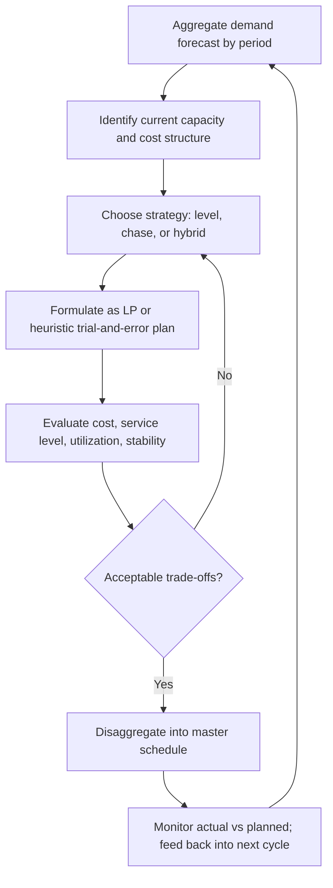

## Aggregate Planning and Its Link to Capacity


### Overview

Aggregate planning is the medium-term (typically 3–18 months) process of translating a demand forecast into an overall production, staffing, or resource plan at an aggregated level — grouping products, services, or workloads into families rather than planning each individually. It sits between long-range strategic capacity decisions (facilities, major infrastructure) and short-range scheduling (daily/weekly task assignment), and its central purpose is to balance forecasted demand against available capacity over the planning horizon at minimum cost or maximum service level.

### Position in the Planning Hierarchy

```mermaid
flowchart TD
    A[Long-range strategic capacity planning<br/>1-5+ years: facilities, major infra (svg_diagram)] --> B[Aggregate planning<br/>3-18 months: workforce, output rate, inventory/buffer levels]
    B --> C[Master scheduling<br/>weeks to months: specific products/services]
    C --> D[Short-term scheduling<br/>days: task/shift assignment]
```

**Key Points**

- Aggregate planning does not deal with individual SKUs, ticket types, or specific job roles — it deals with aggregated units such as total labor-hours, total units of output, or total compute-hours.
- It is the layer where the demand forecast (from earlier chapter items) is converted into an actionable resource commitment: how many people to hire, how much overtime to authorize, how much inventory or buffer capacity to hold.
- The output of aggregate planning constrains and informs master scheduling, so errors or overly rigid assumptions at this level propagate downward.

### Inputs to Aggregate Planning

| Input | Description |
| --- | --- |
| Demand forecast | Aggregated forecast for the planning horizon, from time-series/causal methods |
| Current capacity | Existing workforce size, machine/server capacity, current inventory or backlog |
| Cost structure | Regular-time labor cost, overtime cost, hiring/firing cost, inventory holding cost, subcontracting cost, backorder/stockout cost |
| Policy constraints | Union agreements, budget ceilings, service-level commitments, minimum staffing rules |
| Capacity flexibility | Available levers: overtime, temporary staff, subcontracting, elastic infrastructure |

### Core Strategies

Aggregate planning strategies are typically framed along a spectrum between two "pure" strategies, with most real plans being a hybrid mixed strategy.

#### 1. Level (Production-Leveling) Strategy

Maintains a constant output rate or workforce size regardless of demand fluctuation, absorbing demand variability using inventory (build up ahead of peak, draw down during peak) or backlog.

- **Advantage**: Stable workforce, lower hiring/firing costs, simpler operations.
- **Disadvantage**: Requires holding inventory (holding cost) or accepting backorders/delays during demand peaks; not viable for non-storable outputs (most services, including IT capacity, cannot be "inventoried" ahead of demand the way physical goods can — this is a key reason service and IT capacity planning leans more heavily on the chase strategy or elastic capacity than classical manufacturing).

#### 2. Chase Strategy

Matches capacity/output directly to demand each period by varying workforce size (hiring/layoffs), overtime, or subcontracting period by period.

- **Advantage**: Minimal inventory/holding cost; output tracks demand closely.
- **Disadvantage**: High hiring/firing/overtime churn costs, morale and training overhead, and operational complexity from constantly resizing capacity.

#### 3. Mixed (Hybrid) Strategy

Combines elements of both — e.g., a stable core workforce sized to average or baseline demand, supplemented by overtime, temporary staff, or elastic infrastructure to absorb peaks. This is the dominant pattern in modern capacity planning generally, and almost universally in cloud/IT capacity planning: a baseline of reserved/owned capacity plus on-demand/burst capacity for variability.

**Example**: A customer support organization maintains a core staff sized to handle average ticket volume (level component) and supplements with a flexible pool of contract agents scaled up during predictable seasonal peaks (chase component) — directly mirroring the "baseline + burst" pattern discussed in demand variability planning.

### Capacity Levers Used in Aggregate Planning

**Key Points**

- **Workforce size changes** (hiring/layoffs) — direct capacity adjustment, but with lag (recruiting/training time) and cost (severance, onboarding).
- **Overtime and undertime** — fast-response capacity lever, but has cost premiums and diminishing-returns/fatigue effects at sustained high levels.
- **Subcontracting/outsourcing** — expands capacity without direct headcount changes; introduces cost premium and potential quality/control trade-offs.
- **Inventory/backlog** — absorbs the *timing* mismatch between demand and capacity for storable outputs; not applicable to real-time services.
- **Part-time/temporary/gig labor** — flexible incremental capacity, commonly used to approximate a chase strategy without full hire/layoff cycles.
- **Elastic infrastructure (cloud autoscaling)** — the IT-capacity analogue of subcontracting/overtime: near-instant capacity expansion at a cost premium relative to reserved/owned capacity.

### Quantitative Aggregate Planning: The Transportation/LP Formulation

Aggregate planning is commonly formalized as a **linear programming (LP)** cost-minimization problem. A simplified formulation:

**Decision variables** (for each period $t$):

- $W_t$ — workforce level
- $O_t$ — overtime hours
- $I_t$ — ending inventory (or buffer capacity)
- $S_t$ — subcontracted units
- $H_t, F_t$ — units hired / fired that period

**Objective**: minimize total cost

$$\min \sum_{t=1}^{T} \left( c_r W_t + c_o O_t + c_h H_t + c_f F_t + c_i I_t + c_s S_t \right)$$

**Subject to constraints** such as:

$$I_{t-1} + \text{Production}_t - D_t = I_t \quad \text{(inventory/demand balance each period)}$$


$$W_t = W_{t-1} + H_t - F_t \quad \text{(workforce continuity)}$$


$$\text{Production}_t \le \text{capacity per worker} \times W_t + O_t \quad \text{(capacity limit)}$$

with all decision variables constrained to be non-negative.

```python
from scipy.optimize import linprog

# Simplified 2-period example: minimize regular + overtime + hiring cost
# Variables: [W1, O1, H1, W2, O2, H2]
c = [50, 75, 200, 50, 75, 200]  # cost coefficients per unit

# Example constraint: production capacity must meet demand each period (illustrative)
# A_ub @ x <= b_ub  (converted from >= demand constraints by negation)
A_ub = [
    [-10, -1, 0, 0, 0, 0],   # -(10*W1 + O1) <= -D1  =>  10*W1 + O1 >= D1
    [0, 0, 0, -10, -1, 0],   # 10*W2 + O2 >= D2
]
b_ub = [-500, -650]  # -D1, -D2 (D1=500, D2=650)

result = linprog(c, A_ub=A_ub, b_ub=b_ub, bounds=[(0, None)]*6, method="highs")
```

[Unverified] Real-world aggregate planning LP models typically include many more constraints (union rules, maximum overtime caps, minimum workforce floors) than shown in this simplified illustration; production formulations vary substantially by organization.

### Aggregate Planning in Service and IT Contexts

Classical aggregate planning theory was developed for manufacturing (where inventory buffers demand-capacity mismatches), but the same balancing logic applies directly to services and IT capacity, with inventory replaced by other buffering mechanisms:

| Manufacturing Concept | Service/IT Capacity Analogue |
| --- | --- |
| Finished goods inventory | Queue/backlog (tickets, jobs, requests waiting) |
| Production rate | Throughput (requests/sec, transactions/hour, agent-hours) |
| Workforce hiring/layoffs | Staffing/headcount planning |
| Overtime | On-call/overtime shifts, burst compute capacity |
| Subcontracting | Outsourced support, managed service providers, cloud spot/on-demand capacity |
| Backorders | SLA breaches, degraded response times, deferred processing |

**Example**: A platform engineering team doing aggregate capacity planning for the next two quarters converts a forecasted growth in request volume into: (a) a target baseline compute reservation (analogous to workforce sizing), (b) an autoscaling ceiling for burst traffic (analogous to overtime), and (c) a decision on whether to pre-negotiate additional cloud committed-use discounts (analogous to a hiring commitment) versus relying on on-demand pricing (analogous to subcontracting) for the excess.

### Yield Management as an Aggregate Planning Variant

In capacity-constrained service industries (airlines, hotels, and increasingly compute capacity sold as a service), aggregate planning extends into **yield/revenue management** — dynamically allocating fixed capacity across demand segments with different price sensitivities and lead times, rather than adjusting capacity itself. This is relevant where capacity is expensive or slow to change (e.g., data center build-out) and the primary lever becomes *demand shaping* (pricing, reservations, prioritization tiers) rather than *capacity shaping*.

### Evaluating an Aggregate Plan

**Output**

| Evaluation Criterion | What It Measures |
| --- | --- |
| Total cost | Sum of regular, overtime, hiring/firing, holding, and subcontracting costs over horizon |
| Service level achieved | Percentage of demand met on time / within SLA across the horizon |
| Capacity utilization | Average utilization relative to available capacity — very low utilization signals overprovisioning |
| Plan stability | Frequency/magnitude of workforce or capacity swings (chase strategies score worse here) |
| Robustness to forecast error | How much the plan's cost/service level degrades if actual demand deviates from forecast |

### Step-by-Step Aggregate Planning Process



**Conclusion**

Aggregate planning is the mechanism by which a demand forecast becomes a concrete, costed capacity commitment over the medium term — deciding how much of the demand-capacity gap to absorb through workforce/infrastructure changes (chase), through buffers/inventory/queues (level), or through some blend of both (hybrid). Its direct link to capacity is definitional: aggregate planning *is* the process of matching aggregate capacity to aggregate demand at minimum cost while respecting service-level and operational constraints, making it the natural bridge between the forecasting methods and variability analysis covered earlier in this chapter and the concrete capacity plans an organization ultimately executes.

**Related Topics**

- Demand variability and its capacity implications
- Chase, level, and hybrid capacity strategies in depth
- Linear programming and optimization methods for resource allocation
- Master scheduling and disaggregation techniques
- Yield/revenue management for capacity-constrained services
- Workforce planning: hiring, training lead time, and attrition modeling
- Queuing theory as a bridge between aggregate capacity and service-level outcomes