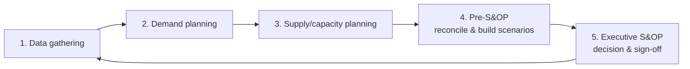
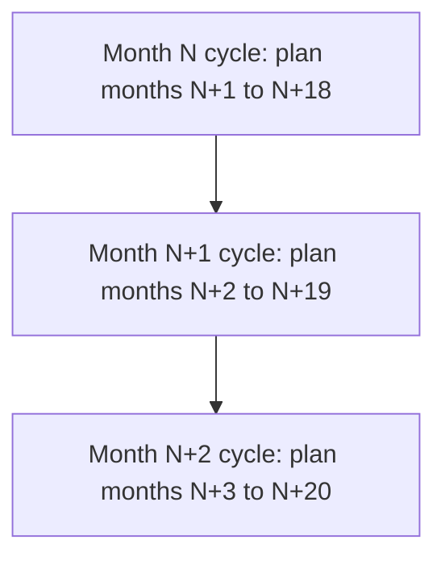
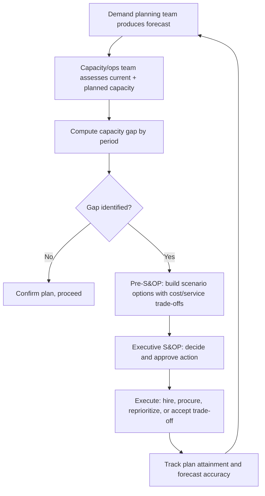

## Linking Sales and Operations Planning to Capacity

### Overview

Sales and Operations Planning (S&OP) is a cross-functional, cyclical process that reconciles demand-side plans (sales, marketing, customer commitments) with supply-side plans (operations, capacity, procurement) at a tactical-to-medium-term horizon, producing a single, agreed-upon operating plan that leadership uses to make resourcing and investment decisions. Its role in capacity planning is to be the organizational forum where forecasted demand is formally translated into approved capacity commitments — closing the loop between the forecasting and aggregate planning techniques covered earlier in this chapter and actual budget, hiring, and procurement decisions.

### Why S&OP Exists as a Distinct Process

**Key Points**

- Forecasting and aggregate planning produce numbers; S&OP produces **organizational alignment and decisions** — without a formal process, sales, finance, and operations frequently work from different, unreconciled versions of the demand outlook.
- S&OP surfaces the demand-capacity gap explicitly and forces a cross-functional decision on how to close it (add capacity, shape demand, or accept a service-level trade-off) rather than leaving each function to react independently.
- It creates a recurring cadence (typically monthly) so that capacity plans are continuously refreshed against the latest demand signal, rather than being fixed once a year and left stale.

### The Standard S&OP Cycle

The classic five-step monthly S&OP cycle, as codified in operations management practice:

1. **Data gathering** — compile actuals, prior forecast performance, market intelligence, and pipeline data.
2. **Demand planning** — sales, marketing, and demand-forecasting teams produce (or update) the unconstrained demand forecast using the quantitative and causal methods described earlier in this chapter.
3. **Supply/capacity planning** — operations/engineering/infrastructure teams assess current capacity against the demand forecast and identify gaps, using aggregate planning techniques.
4. **Pre-S&OP meeting** — cross-functional working level reconciles the demand and supply views, builds alternative scenarios for closing any gap, and prepares recommendations with cost/service-level trade-offs.
5. **Executive S&OP meeting** — leadership reviews the reconciled plan and trade-off scenarios, makes the final capacity/investment decision, and signs off on the operating plan for the horizon.

### Demand-Supply Reconciliation: The Core Activity

The central technical activity in S&OP is comparing the **unconstrained demand forecast** against **available capacity** to quantify the gap, then evaluating options to close it.

$$\text{Capacity Gap}_t = \hat{D}_t - C_t$$

where $\hat{D}_t$ is forecasted demand in period $t$ and $C_t$ is currently available (or already-planned) capacity in that period. A positive gap indicates a shortfall requiring action; a negative gap indicates surplus capacity that could be reduced or redeployed.

**Example**: A cloud infrastructure team's S&OP cycle projects that forecasted request volume will exceed current reserved compute capacity by 22% in Q3. This gap is presented at pre-S&OP with three closing options: (a) purchase additional reserved instances now at a discount but with a 6-week lead time, (b) rely on on-demand burst capacity at a cost premium with no lead time, or (c) implement a feature-level rate limit to shape demand down. Executive S&OP selects a blended option (a) + (b).

### Reconciliation Options When a Gap Exists

| Category | Example Levers |
| --- | --- |
| **Increase capacity** | Hire staff, provision infrastructure, add shifts, expand facilities, negotiate additional vendor capacity |
| **Shape demand** | Pricing changes, promotions timing shifts, rate limiting, prioritization/tiering, deferring non-critical demand |
| **Accept a service trade-off** | Consciously allow lower service level during peak (longer queue times, degraded SLA) rather than pay for full peak coverage |
| **Buffer/pool** | Draw on inventory, cross-train staff across teams, share infrastructure capacity pools across business units |

The choice among these is not a purely technical calculation — it is precisely the kind of cross-functional trade-off (cost vs. service level vs. revenue impact) that the S&OP forum exists to adjudicate with input from finance, sales, and operations together.

### Volume vs. Mix Planning

S&OP typically operates at an aggregate **volume** level (matching aggregate planning's level of granularity) while also tracking **mix** — the composition of demand across products, service tiers, or workload types — since capacity requirements can differ substantially by mix even at constant total volume.

**Example**: Total forecasted transaction volume for a payments platform might be flat quarter-over-quarter, but a shift in mix toward a transaction type requiring more compute-intensive fraud screening could still increase required capacity — a mix effect that a pure aggregate-volume forecast would miss unless mix is explicitly tracked in the S&OP data review.

### Rolling Horizon and Forecast Consistency

S&OP is run as a **rolling horizon** process — each monthly cycle typically covers a fixed window (e.g., 18–24 months) that shifts forward each cycle, so the plan is continuously extended and refreshed rather than fixed to a static annual calendar.

**Key Points**

- A rolling horizon allows capacity commitments with long lead times (data center capacity, hiring pipelines) to be locked in progressively as they move closer to the execution window, while near-term months are refined with the latest, most accurate short-horizon forecast.
- Consistency checks between successive cycles (did last month's committed plan hold, or did the forecast shift materially) feed directly into the forecast error tracking and tracking-signal disciplines covered earlier in this chapter — persistent large revisions between cycles are themselves a signal of forecasting or process problems worth escalating.

### Metrics Used to Govern the S&OP-Capacity Link

**Output**

| Metric | Purpose |
| --- | --- |
| Forecast accuracy (MAPE/MASE by cycle) | Tracks whether demand planning inputs to S&OP are improving or degrading |
| Forecast Value Add (FVA) | Measures whether the S&OP consensus forecast improves on a naive baseline, justifying the process overhead |
| Capacity utilization vs. plan | Tracks whether approved capacity additions were actually needed, informing future S&OP sizing decisions |
| Plan attainment / adherence | How closely actual operations tracked the signed-off S&OP plan |
| Gap closure lead time | Time between a capacity gap being identified and capacity being delivered, informing how far ahead S&OP must flag gaps to stay ahead of lead times |

### Common Pitfalls Linking S&OP to Capacity Decisions

- **Using an unconstrained (optimistic) sales forecast directly as the capacity target** without applying the same forecast-error and safety-buffer discipline described earlier in this chapter, resulting in systematic underprovisioning.
- **Running S&OP as a reporting exercise rather than a decision forum** — presenting the same unresolved gap month after month without executive commitment to a closing action.
- **Mismatched cadence versus lead time** — a monthly S&OP cycle is of limited use for capacity levers with lead times far longer than a month unless the rolling horizon explicitly surfaces those decisions many cycles in advance.
- **Siloed demand and supply reviews** — conducting demand planning and capacity/supply planning as separate meetings without a structured pre-S&OP reconciliation step, which reproduces the exact misalignment S&OP is meant to prevent.
- **Ignoring mix shifts** while tracking only aggregate volume, understating capacity needs when the underlying workload composition is changing.

### S&OP in IT/Digital Contexts (IBP and Beyond)

Many organizations have evolved classical manufacturing-style S&OP into **Integrated Business Planning (IBP)**, extending the same demand-supply reconciliation discipline to financial planning and, in technology organizations, to infrastructure/platform capacity planning specifically. The core mechanics remain the same — a recurring cycle reconciling a demand forecast against available capacity with executive-level gap-closing decisions — but the "supply" side extends beyond physical production capacity to compute, storage, network, and engineering capacity. [Unverified — the specific label ("S&OP" vs. "IBP" vs. an internal capacity-review name) and exact cadence vary considerably by organization and industry]

### Practical Workflow

**Conclusion**

Sales and Operations Planning is the recurring, cross-functional mechanism that turns demand forecasts and capacity assessments into committed, funded action — it is the organizational process layer that sits on top of the quantitative forecasting, variability analysis, and aggregate planning techniques covered elsewhere in this chapter. Its value to capacity planning specifically lies in forcing an explicit, regularly-refreshed reconciliation between what demand is expected to be and what capacity is available, and in providing a structured forum for deciding — with the right stakeholders and trade-off visibility — how any gap between the two should be closed.

**Related Topics**

- Quantitative and time-series forecasting methods
- Aggregate planning and its link to capacity
- Demand variability and its capacity implications
- Forecast error measurement and tracking signals (Forecast Value Add)
- Integrated Business Planning (IBP) as an extension of S&OP
- Capacity lead time management and procurement planning
- Cross-functional governance models for capacity decisions