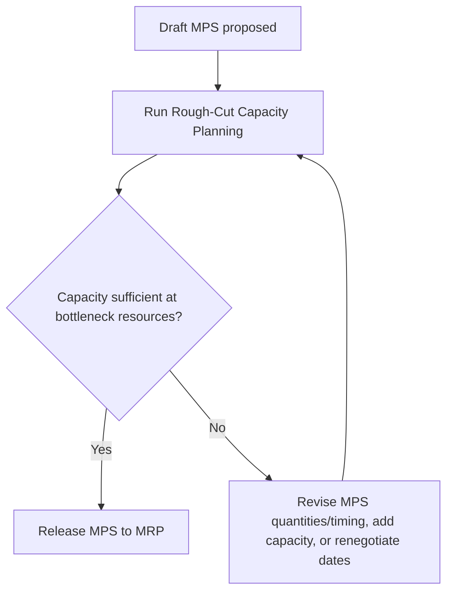
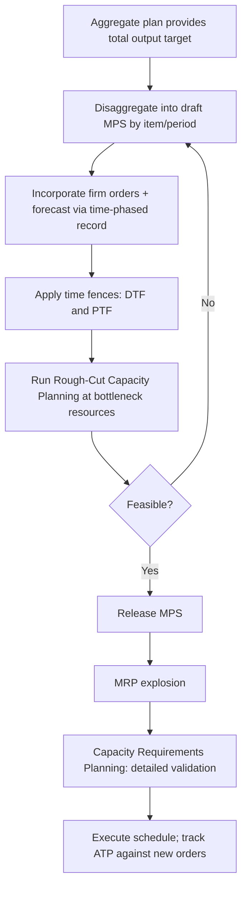

## Master Production Scheduling and Its Link to Capacity


### Overview

Master Production Scheduling (MPS) is the process of determining the specific quantities and timing of end items (products or services) to be produced over a near-to-medium-term horizon, disaggregating the higher-level aggregate plan into item-level detail. It is the critical link between strategic/aggregate capacity decisions and the detailed, executable schedules that drive material requirements planning, workforce assignment, and infrastructure allocation. MPS answers "what, exactly, and when" in contrast to aggregate planning's "how much, in total."

### Position in the Planning Hierarchy

```mermaid
flowchart TD
    A[Aggregate Plan<br/>total output/capacity by family, 3-18 months (svg_diagram)] --> B[Master Production Schedule<br/>specific items/services, weekly buckets]
    B --> C[Material Requirements Planning MRP<br/>component/resource needs]
    C --> D[Capacity Requirements Planning CRP<br/>detailed capacity validation]
    D --> E[Shop floor / operational scheduling<br/>day-to-day execution]
```

**Key Points**

- The MPS takes the aggregate plan's total output commitment (e.g., "10,000 units this month" or "500,000 compute-hours this quarter") and disaggregates it into specific end items or service types by specific time period (typically weekly buckets).
- MPS is the point at which a demand forecast, combined with actual customer orders/commitments, becomes a firm production/service commitment that downstream systems (MRP, capacity requirements planning, staffing) treat as a given input.
- Because MPS operates at finer time and item granularity than aggregate planning, it is where capacity constraints first become concretely visible at the level of "can we actually build/deliver this specific mix in this specific week."

### Inputs to the MPS

| Input | Description |
| --- | --- |
| Aggregate plan | Total output/capacity commitment by family and period |
| Firm customer orders | Confirmed demand that must be honored |
| Forecasted demand | Statistical forecast for the uncommitted portion of demand |
| Current inventory/backlog | On-hand stock or existing work-in-progress/queue |
| Available capacity | Known capacity by resource (machines, staff, compute) per period |
| Lead times | Time required to produce/deliver each item |

### The MPS Calculation Logic

The MPS is built using a time-phased record for each end item, balancing forecast, orders, inventory, and planned production:

$$\text{Projected Available Balance}_t = \text{PAB}_{t-1} + \text{MPS}_t - \max(\text{Forecast}_t, \text{Orders}_t)$$

where $\text{MPS}_t$ is the planned production quantity in period $t$, and the **Available-to-Promise (ATP)** calculation determines how much of the MPS quantity in a given period remains uncommitted and can be promised to new customer orders:

$$\text{ATP}_t = \text{MPS}_t - \sum(\text{Orders due before next MPS receipt})$$

**Example — simplified MPS record (weekly buckets):**

| Week | 1 | 2 | 3 | 4 |
| --- | --- | --- | --- | --- |
| Forecast | 100 | 100 | 100 | 100 |
| Customer Orders | 120 | 90 | 40 | 20 |
| Projected Available Balance | 30 | 40 | 100 | 150 |
| MPS (planned production) | — | 150 | 150 | 150 |
| ATP | 10 | 60 | 110 | 130 |

(Beginning inventory assumed 150; MPS quantities and ATP are illustrative to show the mechanics, not derived from a specific standard textbook example.)

### Time Fences: Protecting the Schedule While Preserving Flexibility

MPS uses **time fences** to control how much the schedule can be changed as the execution date approaches, directly balancing schedule stability (which capacity execution depends on) against responsiveness to new information.


- **Demand Time Fence (DTF)** — within this near-term window, the schedule is driven by firm orders rather than forecast, since orders are more reliable this close to delivery.
- **Planning Time Fence (PTF)** — beyond the DTF but within the PTF, changes are possible but require formal review since committed capacity/material actions may already be underway.
- Beyond the PTF, the schedule is fully open to revision as new forecast information arrives.

**Key Points**

- Time fences exist specifically because capacity (labor schedules, material orders, infrastructure provisioning) often cannot be changed instantaneously — the frozen zone protects the near-term capacity commitment from disruptive, costly last-minute changes.
- The length of each zone should be set relative to actual capacity lead times: a frozen zone shorter than the true minimum lead time to change capacity risks committing to schedule changes that cannot actually be executed.

### Rough-Cut Capacity Planning (RCCP)

Before an MPS is finalized, **Rough-Cut Capacity Planning** provides a fast, approximate check of whether the proposed master schedule is feasible against key bottleneck resources, without the full detail of formal capacity requirements planning (which happens later, after MRP).

$$\text{Capacity Required}_{r,t} = \sum_{i} \text{MPS}_{i,t} \times \text{Resource Usage}_{i,r}$$

where $\text{Resource Usage}_{i,r}$ (from a **bill of resources** or **bill of capacity**) specifies how much of critical resource $r$ (a bottleneck machine, a specialized skill, a compute cluster) each unit of end item $i$ consumes.

**Example**: A bill of resources might specify that each unit of Product A requires 0.5 hours on the CNC bottleneck machine and each unit of Product B requires 0.3 hours; RCCP multiplies the proposed MPS quantities by these factors and compares the total against known available bottleneck-machine hours per week, flagging any week where required hours exceed availability before the MPS is finalized.

**Key Points**

- RCCP deliberately checks only a small number of critical/bottleneck resources (not every resource in the system) to remain fast enough to use interactively while iterating on the draft MPS.
- If RCCP reveals infeasibility, planners either revise the MPS (shift quantities across periods), add capacity (overtime, subcontracting — the same levers from aggregate planning), or negotiate order due dates, before the schedule is released downstream.



### From MPS to Capacity Requirements Planning (CRP)

After the MPS is released and MRP explodes it into detailed component and operation requirements, **Capacity Requirements Planning** performs the full, detailed capacity feasibility check across *all* work centers (not just bottlenecks), using actual routing data (which operations, on which machines/work centers, for how long, in what sequence) rather than the simplified bill-of-resources approximation used in RCCP.

| Aspect | RCCP | CRP |
| --- | --- | --- |
| Timing | Before MPS is finalized | After MRP explosion |
| Scope | Key bottleneck resources only | All work centers/resources |
| Data source | Bill of resources (aggregate factors) | Detailed routings and time standards |
| Speed | Fast, approximate | Slower, more precise |
| Purpose | Quick feasibility screen | Detailed load validation and fine-tuning |

### Service and IT Analogue of MPS

While MPS originated in discrete manufacturing, the same disaggregation logic applies to services and IT capacity planning:

| Manufacturing MPS Concept | Service/IT Analogue |
| --- | --- |
| End item production quantity | Feature releases, service instances, batch jobs scheduled |
| Time-phased record (weekly buckets) | Sprint/release calendar, weekly deployment schedule |
| Available-to-Promise | Available capacity slots for new customer onboarding or SLA commitments |
| Bill of resources | Resource profile per workload (CPU/memory/storage per job type) |
| Rough-cut capacity planning | Capacity headroom check against known compute/cluster limits before committing to a release calendar |
| Time fences | Change-freeze windows before major releases or peak events |

**Example**: An engineering organization's "release MPS" schedules which features ship in which two-week sprint. Before finalizing the schedule, a rough-cut check compares the aggregate estimated compute/QA-environment hours the planned features require against known environment capacity for those sprints — directly analogous to RCCP checking bottleneck machine-hours against a manufacturing MPS.

### Common Pitfalls Linking MPS to Capacity

- **Overloading the MPS** — scheduling more total output than aggregate capacity supports, effectively promising customers dates the organization cannot execute against; RCCP exists specifically to catch this before it propagates downstream.
- **Ignoring time fences** — allowing late changes inside the frozen zone disrupts already-committed capacity (labor schedules, material orders already placed), often at a cost premium or via expediting.
- **Using an unconstrained forecast directly as the MPS** without validating against RCCP, effectively skipping the capacity feasibility check that MPS's link to capacity exists to provide.
- **Bill of resources drift** — if resource-usage factors used in RCCP become outdated (e.g., a process improvement changes machine-hours per unit), RCCP checks will be systematically wrong even though the arithmetic is correct.

### Practical Workflow



**Conclusion**

Master production scheduling is the mechanism that converts an aggregate capacity commitment into a concrete, item-level, time-phased schedule, and its link to capacity is enforced through rough-cut capacity planning, which validates the proposed schedule against bottleneck resource availability before it is released downstream. Time fences protect the near-term capacity commitment from disruptive changes, while available-to-promise logic lets the organization make new commitments against the schedule without exceeding what capacity actually allows — together forming the bridge between the aggregate, demand-driven capacity plans covered earlier in this chapter and the detailed capacity requirements planning and execution systems covered next.

**Related Topics**

- Aggregate planning and its link to capacity
- Rough-cut capacity planning methods and bills of resources
- Capacity requirements planning (CRP) and detailed work-center loading
- Material requirements planning (MRP) fundamentals
- Available-to-promise and order commitment logic
- Time fence policy design and schedule stability trade-offs
- Bottleneck identification and theory of constraints