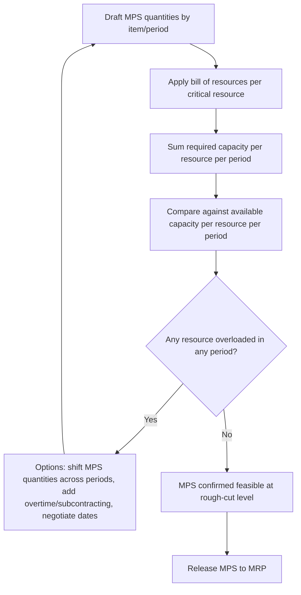

## Rough-Cut Capacity Planning (RCCP)


### Overview

Rough-Cut Capacity Planning (RCCP) is a fast, approximate feasibility check performed on a draft Master Production Schedule (MPS) to verify that critical, bottleneck resources have sufficient capacity to execute the proposed schedule — before the schedule is finalized and released to detailed downstream planning (MRP, capacity requirements planning, execution). It deliberately trades precision for speed, checking only a small set of key resources rather than the full resource network, so that it can be run interactively while an MPS is still being drafted and adjusted.

### Position in the Planning Hierarchy

```mermaid
flowchart TD
    A[Aggregate Plan] --> B[Draft Master Production Schedule]
    B --> C[Rough-Cut Capacity Planning<br/>fast check at bottleneck resources (svg_diagram)]
    C --> D{Feasible?}
    D -->|No| B
    D -->|Yes| E[Release MPS]
    E --> F[MRP explosion]
    F --> G[Capacity Requirements Planning<br/>detailed, all resources]
```

**Key Points**

- RCCP sits between MPS drafting and MPS release — it is a gate, not a scheduling technique in its own right.
- It checks only **critical/bottleneck resources** identified in advance (key machines, specialized labor skills, constrained infrastructure), not every resource in the system, which is what makes it "rough" but also what makes it fast enough to iterate on.
- It uses aggregated, approximate resource-consumption factors rather than detailed routings, in contrast to full Capacity Requirements Planning (CRP), which uses precise routing data after MRP has exploded the schedule into component-level detail.

### Core Inputs

| Input | Description |
| --- | --- |
| Draft MPS | Proposed production/service quantities by item and period |
| Bill of Resources (BOR) / Bill of Capacity | Standard resource-hours required per unit of each end item, for each critical resource |
| Available capacity per resource | Known capacity per period for each critical resource (machine-hours, labor-hours, compute-hours) |
| Planning periods | Typically weekly buckets matching the MPS time-phasing |

### The Bill of Resources (Bill of Capacity)

The bill of resources is the central data structure that makes RCCP calculations possible: for each end item, it specifies an aggregated, standard amount of time consumed at each critical resource, without needing the full routing detail (operation sequences, setup times, individual work centers) that a formal routing would contain.

**Example bill of resources** (hours consumed per unit at a bottleneck resource):

| End Item | CNC Machine (bottleneck) | Skilled Assembly Labor |
| --- | --- | --- |
| Product A | 0.50 hr | 0.75 hr |
| Product B | 0.30 hr | 0.40 hr |
| Product C | 0.80 hr | 0.20 hr |

### RCCP Calculation Logic

For each critical resource $r$ and period $t$, required capacity is the sum, across all end items $i$, of the planned MPS quantity multiplied by that item's resource-usage factor:

$$\text{Capacity Required}_{r,t} = \sum_{i} \text{MPS}_{i,t} \times \text{ResourceUsage}_{i,r}$$

This is compared against available capacity for that resource and period:

$$\text{Capacity Gap}_{r,t} = \text{Capacity Required}_{r,t} - \text{Capacity Available}_{r,t}$$

A positive gap indicates the draft MPS overloads that resource in that period and requires revision or a capacity adjustment before release.

**Example calculation** — using the bill of resources above, with a draft MPS for Week 1 of 100 units of Product A, 200 units of Product B, and 50 units of Product C, checking against a CNC machine with 180 available hours that week:

$$\text{CNC Hours Required} = (100 \times 0.50) + (200 \times 0.30) + (50 \times 0.80) = 50 + 60 + 40 = 150 \text{ hours}$$


$$\text{Capacity Gap} = 150 - 180 = -30 \text{ hours (30 hours of slack; feasible)}$$

If the draft MPS instead called for 150 units of Product A in that week, required CNC hours would rise to $75 + 60 + 40 = 175$ hours — still feasible — but adding a fourth product line consuming even a modest amount of CNC time could push the total past 180 hours, at which point RCCP would flag infeasibility and prompt a schedule revision.

```python
# Simple RCCP feasibility check across periods and resources
import pandas as pd

bor = pd.DataFrame({
    "item": ["A", "B", "C"],
    "cnc_hours_per_unit": [0.50, 0.30, 0.80],
    "labor_hours_per_unit": [0.75, 0.40, 0.20],
})

mps = pd.DataFrame({
    "item": ["A", "B", "C"],
    "week1_qty": [100, 200, 50],
    "week2_qty": [120, 180, 60],
})

merged = mps.merge(bor, on="item")
required = {
    "week1_cnc": (merged["week1_qty"] * merged["cnc_hours_per_unit"]).sum(),
    "week2_cnc": (merged["week2_qty"] * merged["cnc_hours_per_unit"]).sum(),
}

available = {"week1_cnc": 180, "week2_cnc": 180}

for period in ["week1_cnc", "week2_cnc"]:
    gap = required[period] - available[period]
    status = "OVERLOADED" if gap > 0 else "feasible"
    print(f"{period}: required={required[period]}, available={available[period]}, gap={gap} ({status})")
```

### RCCP Techniques

There are several established approaches to performing RCCP, differing in how directly they use MPS quantities versus historical/planning ratios:

- **Capacity Planning Using Overall Factors (CPOF)** — the simplest technique; applies a single historical ratio (e.g., "bottleneck hours per total production dollar" or "labor hours per aggregate unit") derived from past performance to the aggregate MPS volume. Fast but coarse, since it doesn't account for changing product mix.
- **Bill of Labor / Bill of Resources approach** — uses item-specific resource-usage factors (as shown above), giving more accurate results when product mix varies significantly across periods, since each item's actual resource consumption is reflected individually rather than averaged.
- **Resource Profile approach** — extends the bill-of-resources method by also accounting for *lead time offsets*, recognizing that resource consumption for a given order may occur in an earlier period than the order's due date (e.g., component fabrication happens a week before final assembly), producing a more time-accurate capacity load profile.

| Technique | Accuracy | Speed | Mix Sensitivity |
| --- | --- | --- | --- |
| CPOF | Lowest | Fastest | None (uses aggregate ratio) |
| Bill of Resources | Medium | Fast | Yes, per item |
| Resource Profile | Highest (of the three) | Slower than the above two | Yes, with time-phasing |

### RCCP vs. Capacity Requirements Planning (CRP)

| Aspect | RCCP | CRP |
| --- | --- | --- |
| When performed | Before MPS release, on draft schedules | After MRP explosion, on planned/released orders |
| Resources checked | Critical/bottleneck resources only | All work centers |
| Data precision | Aggregated factors (bill of resources) | Detailed routings, setup/run times, queue times |
| Speed | Fast — supports iterative what-if analysis | Slower — computationally heavier |
| Typical use | Quick feasibility screen during MPS drafting | Fine-grained load validation and scheduling detail |

**Key Points**

- RCCP and CRP are complementary, not redundant: RCCP prevents an obviously infeasible MPS from ever being released downstream, while CRP catches finer-grained overloads (at non-bottleneck work centers, or from detailed routing/setup-time effects) that RCCP's simplified approach would miss.
- Because RCCP only checks pre-identified critical resources, correctly identifying which resources are actually bottlenecks is essential; an RCCP model that omits a resource that later becomes constraining will give false confidence in schedule feasibility.

### RCCP Workflow



### Responding to an RCCP-Identified Overload

When RCCP flags a capacity gap, planners typically have the same categories of options seen in aggregate planning and demand-capacity reconciliation:

1. **Reschedule the MPS** — shift quantities to periods with available slack, if due dates allow.
2. **Add capacity** — authorize overtime, add a shift, subcontract the overloaded work, or add temporary/contract resources for that resource specifically.
3. **Reduce or renegotiate demand** — push back order due dates with the customer or reduce planned build quantities for lower-priority items.
4. **Re-run RCCP iteratively** — after any adjustment, re-run the check until all critical resources show feasible loads across the horizon.

### Service and IT Analogue

RCCP's logic transfers directly to service and IT capacity contexts wherever a proposed schedule (a release calendar, an onboarding pipeline, a batch-processing plan) needs a fast feasibility check against a small number of known constrained resources before being finalized.

**Example**: Before finalizing a quarterly release calendar, a platform team performs an RCCP-style check by multiplying each planned feature's estimated QA-environment hours (a "bill of resources" for engineering work) by the number of features scheduled per sprint, comparing the total against known QA-environment capacity — flagging any sprint where the aggregate need exceeds available environment-hours before the release calendar is committed to stakeholders.

### Limitations of RCCP

**Key Points**

- RCCP does not account for detailed sequencing, setup times, or queue/wait time between operations — it only validates aggregate hours against aggregate availability, which can miss infeasibilities that only appear when actual scheduling sequence is considered.
- It relies on the accuracy of the bill of resources; if standard resource-usage factors are outdated (e.g., after a process change or equipment upgrade), RCCP will produce a feasibility verdict that no longer reflects actual resource consumption. [Unverified — the degree of resulting error depends on how far the outdated factors diverge from current reality]
- Because it checks only pre-selected critical resources, RCCP provides no protection against overloads at resources that were not designated as bottlenecks, which is why it is followed by full CRP rather than treated as a complete capacity validation on its own.

**Conclusion**

Rough-Cut Capacity Planning provides the fast, approximate capacity feasibility check that stands between drafting a master production schedule and committing to it — using a bill of resources to translate proposed item quantities into aggregate load on a small set of critical resources, and comparing that load against known availability. Its speed makes it suitable for iterative what-if analysis during MPS development, while its intentional simplification (aggregated factors, bottleneck-only scope) means it must be followed by detailed Capacity Requirements Planning once the schedule is released and exploded through MRP, to catch the finer-grained capacity issues RCCP's rough-cut approach is not designed to detect.

**Related Topics**

- Master production scheduling and its link to capacity
- Capacity Requirements Planning (CRP) and detailed work-center loading
- Bill of resources / bill of labor construction and maintenance
- Bottleneck identification and theory of constraints
- Material Requirements Planning (MRP) fundamentals
- Aggregate planning and its link to capacity
- What-if scenario analysis in production scheduling