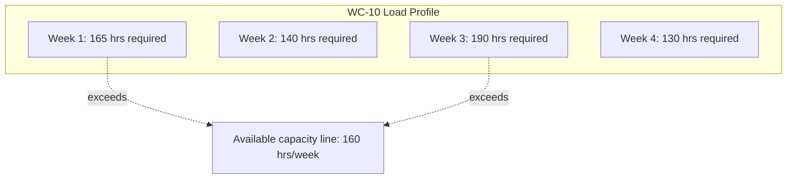
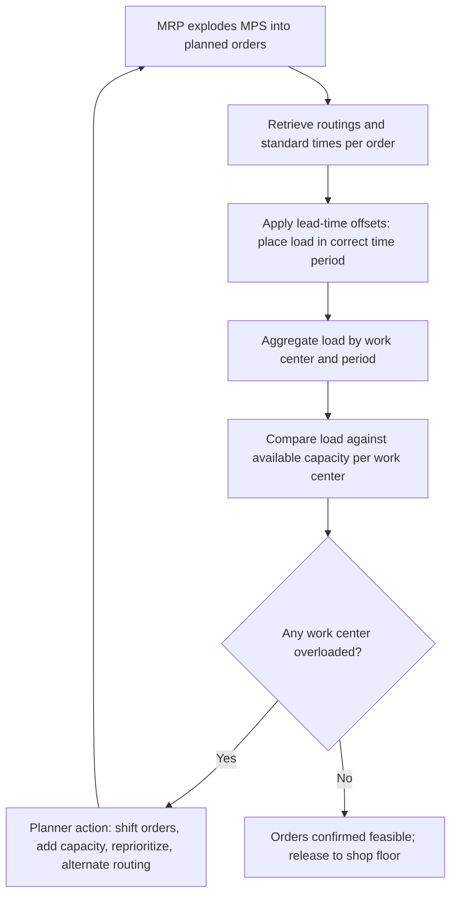

## Capacity Requirements Planning (CRP) Within MRP


### Overview

Capacity Requirements Planning (CRP) is the detailed, work-center-level process of validating that a material plan generated by Material Requirements Planning (MRP) is actually executable given available capacity, resource by resource, period by period. Where Rough-Cut Capacity Planning (RCCP) provides a fast, approximate check on a small set of bottleneck resources *before* the MPS is released, CRP provides a comprehensive check across *all* work centers *after* MRP has exploded the schedule into detailed planned orders — making it the fine-grained capacity validation step in the formal MRP/MRP II planning hierarchy.

### Position in the Planning Hierarchy

```mermaid
flowchart TD
    A[Master Production Schedule] --> B[Rough-Cut Capacity Planning<br/>fast, bottleneck-only check (svg_diagram)]
    B --> C[MRP: explode into planned orders<br/>components, quantities, due dates]
    C --> D[Capacity Requirements Planning<br/>detailed, all work centers]
    D --> E{Feasible at all work centers?}
    E -->|No| F[Adjust orders, capacity, or priorities]
    F --> C
    E -->|Yes| G[Release orders to shop floor]
```

**Key Points**

- CRP operates on **planned order releases** generated by MRP — it consumes MRP's output rather than feeding into it, making it strictly a downstream validation step in the classical MRP II architecture.
- Unlike RCCP's simplified bill-of-resources approach, CRP uses **detailed routings**: the exact sequence of operations, specific work centers, setup times, and run times for every component and sub-assembly in the exploded material plan.
- CRP produces work-center **load profiles** that planners use to identify overloaded or underloaded periods and take corrective action before orders are actually released to the shop floor.

### Core Inputs to CRP

| Input | Description |
| --- | --- |
| Planned order releases (from MRP) | Specific quantities and due dates for every component/sub-assembly at every level of the bill of materials |
| Routings | Sequence of operations for each item, including which work center performs each operation |
| Standard times | Setup time and run time (per unit) for each operation at each work center |
| Work center capacity | Available hours per work center per period, accounting for shifts, efficiency, and utilization factors |
| Lead time offsets | Time between order release and when the order arrives at each operation, used to place load in the correct period |

### The CRP Calculation: Building the Load Profile

For each work center $w$ and period $t$, CRP sums the capacity consumed by every operation from every open and planned order scheduled to pass through that work center in that period:

$$\text{Load}_{w,t} = \sum_{o} \left(\text{Setup Time}_o + \text{Quantity}_o \times \text{Run Time per Unit}_o\right)$$

for all operations $o$ routed through work center $w$ with a scheduled date falling in period $t$.

This load is placed in time using **backward scheduling** (working back from the order due date through each operation's lead time) or **forward scheduling** (working forward from order release), so that the load profile reflects *when* each operation's capacity demand actually falls, not simply when the parent order is due.

**Example — work center load profile:**

| Week | Load Hours Required | Available Hours | Utilization | Status |
| --- | --- | --- | --- | --- |
| 1 | 165 | 160 | 103% | Overloaded |
| 2 | 140 | 160 | 88% | Feasible |
| 3 | 190 | 160 | 119% | Overloaded |
| 4 | 130 | 160 | 81% | Feasible |

```python
import pandas as pd

# planned_orders: exploded orders from MRP with routing detail per operation
planned_orders = pd.DataFrame({
    "order_id": [101, 102, 103, 104],
    "work_center": ["WC-10", "WC-10", "WC-20", "WC-10"],
    "week": [1, 1, 2, 3],
    "setup_hours": [2, 1.5, 3, 2],
    "run_hours_per_unit": [0.4, 0.6, 0.3, 0.5],
    "quantity": [200, 150, 300, 250],
})

planned_orders["load_hours"] = (
    planned_orders["setup_hours"]
    + planned_orders["quantity"] * planned_orders["run_hours_per_unit"]
)

load_profile = planned_orders.groupby(["work_center", "week"])["load_hours"].sum().reset_index()

available = {"WC-10": 160, "WC-20": 160}
load_profile["available_hours"] = load_profile["work_center"].map(available)
load_profile["utilization_pct"] = (
    load_profile["load_hours"] / load_profile["available_hours"] * 100
)
load_profile["status"] = load_profile["utilization_pct"].apply(
    lambda u: "OVERLOADED" if u > 100 else "feasible"
)
print(load_profile)
```

### Load Profile Visualization Convention

CRP output is traditionally presented as a **load profile chart** (sometimes called a capacity bill or load report) comparing required load against available capacity per work center per period — conceptually a bar chart with a horizontal capacity line, historically central enough to CRP practice that it's worth describing structurally even though only text output is used here:



### Interpreting and Responding to Overloads

When CRP reveals a work center overload, the standard response categories mirror those seen in RCCP and aggregate planning, but applied at the specific work-center/period level:

| Response Category | Examples |
| --- | --- |
| **Shift load in time** | Move planned order start dates earlier/later within available slack (float) |
| **Increase capacity** | Authorize overtime, add a shift, temporarily reassign cross-trained labor to the work center |
| **Reduce load** | Subcontract specific operations, split a large order across periods, use alternate routings through a different work center |
| **Reprioritize** | Delay lower-priority orders, expedite higher-priority orders, renegotiate due dates with the demand side |

**Key Points**

- Orders with schedule **float** (slack between when an order could start and when it must finish to meet its due date) give planners flexibility to shift load away from overloaded periods without violating the order's due date — CRP reports typically flag which orders have float available.
- Where alternate routings exist (an operation can run on more than one capable work center), CRP-driven load balancing can shift load to an underutilized work center rather than only adjusting timing, an option not available for single-routing operations.

### CRP vs. RCCP: A Direct Comparison

| Aspect | RCCP | CRP |
| --- | --- | --- |
| Timing in the cycle | Before MPS release | After MRP explosion |
| Input granularity | Aggregate bill of resources | Detailed routings and standard times |
| Resource scope | Critical/bottleneck resources only | All work centers |
| Order detail | MPS end-item quantities | Exploded planned orders at every BOM level |
| Time-phasing | Approximate (period-level) | Precise (via lead-time offsets and scheduling logic) |
| Computational cost | Low | Higher — computes across the full order/routing network |
| Primary use | Fast feasibility screen during schedule drafting | Fine-grained validation before order release |

### Infinite vs. Finite Capacity Loading

CRP as classically defined performs **infinite loading** — it calculates required load against available capacity and *reports* overloads, but does not automatically resolve them by shifting orders; that remains a planner action.

**Finite capacity scheduling (FCS)**, sometimes implemented as a complementary or successor system, instead constrains the schedule so that no period ever shows load exceeding available capacity, automatically sequencing and shifting orders (typically using more sophisticated scheduling algorithms or heuristics) to respect capacity limits as a hard constraint rather than merely reporting violations.

| Aspect | Infinite Loading (classical CRP) | Finite Capacity Scheduling |
| --- | --- | --- |
| Capacity treatment | Reported as informational load vs. capacity | Enforced as a hard constraint |
| Overload handling | Planner manually adjusts after reviewing report | Algorithm automatically re-sequences to avoid overload |
| Computational complexity | Lower | Higher — often requires optimization or advanced heuristics |
| Typical system | Traditional MRP II modules | Advanced Planning and Scheduling (APS) systems |

[Unverified] The degree to which modern ERP/APS systems blend infinite-loading CRP reporting with finite-capacity scheduling automation varies considerably by vendor and implementation, so specific system behavior should be verified against the platform in use rather than assumed from this general distinction.

### Service and IT Analogue

CRP's detailed, all-resource validation logic maps directly onto detailed capacity checks in service and IT contexts, wherever a schedule has already been broken into fine-grained tasks with specific resource assignments (as opposed to the coarse, bottleneck-only check RCCP-style methods perform earlier in planning).

**Example**: After a sprint plan (analogous to an exploded MRP order set) assigns specific tasks to specific engineers and specific shared environments (analogous to work centers) with estimated hours, a detailed capacity check sums estimated hours per engineer and per shared environment per week and compares against each one's available hours — surfacing not just the previously-identified bottleneck (e.g., the QA environment) but any individually overloaded engineer or resource that a coarser, aggregate-only check would have missed.

### CRP Workflow Summary



### Common Pitfalls

- **Stale routing or standard-time data** — if setup/run times or work-center assignments in the routing master data are outdated, CRP load calculations will be systematically inaccurate even though the logic is sound.
- **Ignoring queue and move time** — some CRP implementations account only for setup and run time and omit queue time (waiting before an operation) and move time (transit between work centers), understating true lead time and load timing accuracy. [Unverified — specific inclusion of queue/move time varies by system configuration]
- **Treating CRP output as self-correcting** — because classical CRP performs infinite loading, an overload report that is reviewed but not acted upon leaves the underlying schedule infeasible; CRP identifies problems but does not resolve them without planner or system intervention.
- **Running CRP too late** — if CRP is only run immediately before order release with little schedule float remaining, there is limited room to shift orders in response to identified overloads, reducing CRP's practical value as an early-warning tool.

**Conclusion**

Capacity Requirements Planning provides the detailed, work-center-by-work-center feasibility validation that follows MRP's explosion of the master schedule into planned orders, using actual routings and standard times to build precise load profiles rather than the aggregated approximations used in rough-cut capacity planning. Its output — load versus available capacity by work center and period — gives planners the specific, actionable information needed to shift orders, add capacity, or reprioritize work before orders are committed to the shop floor, closing the loop between the coarse feasibility screening performed earlier in the planning hierarchy and the fine-grained execution reality of individual work centers and resources.

**Related Topics**

- Rough-cut capacity planning (RCCP)
- Master production scheduling and its link to capacity
- Material Requirements Planning (MRP) fundamentals and bill-of-materials explosion
- Finite capacity scheduling and Advanced Planning and Scheduling (APS) systems
- Routing and standard time data management
- Bottleneck identification and theory of constraints
- Shop floor control and order release policies