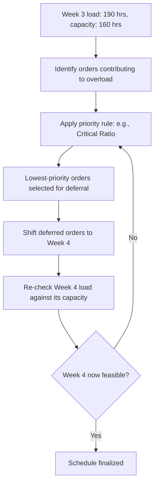

## Finite Versus Infinite Capacity Loading


### Overview

Finite and infinite capacity loading represent two fundamentally different philosophies for how a production or capacity planning system treats resource limits when scheduling work. Infinite loading calculates required load against available capacity and *reports* any overloads for a planner to resolve manually, treating capacity as a soft constraint that can be informationally violated in the plan. Finite loading treats capacity as a hard constraint, automatically sequencing and shifting work so that no period ever shows load exceeding what a resource can actually deliver. This distinction sits at the heart of how Capacity Requirements Planning (CRP) and modern Advanced Planning and Scheduling (APS) systems differ in behavior.

### Core Conceptual Difference

```mermaid
flowchart LR
    subgraph Infinite Loading
    A1[Calculate required load] --> A2[Compare to available capacity]
    A2 --> A3[Report overloads<br/>schedule unchanged (svg_diagram)]
    A3 --> A4[Planner manually resolves]
    end
    subgraph Finite Loading
    B1[Calculate required load] --> B2[Enforce capacity as hard limit]
    B2 --> B3[Automatically sequence/shift orders<br/>to fit within capacity]
    B3 --> B4[Schedule guaranteed feasible]
    end
```

**Key Points**

- Infinite loading answers the question "given this schedule, where does load exceed capacity?" — it is diagnostic, not corrective.
- Finite loading answers the question "given this capacity, what schedule fits within it?" — it is prescriptive, producing a schedule that respects capacity by construction.
- The names refer to how each approach treats capacity in the *calculation*, not to any claim about a resource literally having unlimited capacity — "infinite loading" simply means the load calculation does not cap itself at available capacity.

### Infinite Capacity Loading

#### How It Works

Infinite loading, the classical approach used in traditional Capacity Requirements Planning, sums required load per work center per period without regard to whether that load exceeds what's available, then presents the comparison to a planner as a load profile report.

$$\text{Load}_{w,t} = \sum_{o \in \text{orders routed to } w \text{ in period } t} \left(\text{Setup}_o + Q_o \times \text{RunTime}_o\right)$$


$$\text{Status}_{w,t} = \begin{cases} \text{Feasible} & \text{if } \text{Load}_{w,t} \le \text{Capacity}_{w,t} \\ \text{Overloaded} & \text{if } \text{Load}_{w,t} > \text{Capacity}_{w,t} \end{cases}$$

**Example load report (infinite loading, as covered in CRP):**

| Week | Load Required | Available Capacity | Status |
| --- | --- | --- | --- |
| 1 | 165 hrs | 160 hrs | Overloaded (+5 hrs) |
| 2 | 140 hrs | 160 hrs | Feasible |
| 3 | 190 hrs | 160 hrs | Overloaded (+30 hrs) |

The schedule itself is unchanged by this calculation — Week 3's overload of 30 hours remains in the plan until a planner intervenes.

#### Advantages of Infinite Loading

- **Computationally simple and fast** — no optimization or complex sequencing logic required, just summation and comparison.
- **Transparent** — planners can see exactly where and by how much a schedule is infeasible, supporting informed manual judgment calls that account for context an algorithm might not have (e.g., a customer relationship consideration for prioritizing one late order over another).
- **Preserves original due-date logic** — orders keep their MRP-calculated dates, so the "ideal" schedule (as if capacity were unlimited) remains visible for reference even when infeasible.

#### Disadvantages of Infinite Loading

- **Requires manual resolution** — every reported overload needs a planner decision (shift orders, add capacity, reprioritize); at scale, this can be a significant ongoing workload.
- **No guarantee of a feasible plan** — until a planner acts, the "plan" on paper is not actually executable, which is a meaningful gap if downstream systems or people begin acting on it as if it were final.
- **Slower response to change** — each new overload from schedule changes or new orders again requires manual review rather than automatic accommodation.

### Finite Capacity Loading / Scheduling (FCS)

#### How It Works

Finite capacity scheduling treats each resource's available capacity as a hard ceiling and uses scheduling logic — priority rules, heuristics, or optimization algorithms — to sequence and place orders so that required load in any period never exceeds that ceiling. When a resource would be overloaded under an as-planned schedule, FCS shifts, splits, or delays orders (respecting sequencing and precedence constraints) until the load fits.

**Common sequencing/priority rules used within finite scheduling logic:**

| Rule | Logic |
| --- | --- |
| First-Come-First-Served (FCFS) | Process orders in the sequence they arrive/are released |
| Earliest Due Date (EDD) | Prioritize the order with the closest due date |
| Shortest Processing Time (SPT) | Prioritize the order requiring the least processing time, often minimizing average flow time |
| Critical Ratio (CR) | Prioritize based on $\text{CR} = \dfrac{\text{Time remaining until due date}}{\text{Work remaining}}$; CR < 1 indicates an order is behind schedule |
| Least Slack | Prioritize orders with the least slack time (due date minus remaining processing time minus current time) |

**Example**: Using the same load data as the infinite loading example, a finite scheduler facing Week 3's 30-hour overload would automatically evaluate order priorities (e.g., via Critical Ratio) and push the lowest-priority orders contributing to that overload into Week 4's available slack, producing a schedule where every week shows load at or below capacity — at the cost of shifting some order completion dates later than originally planned.



#### Advantages of Finite Loading

- **Guarantees a feasible schedule** — by construction, no period exceeds available capacity, so the resulting plan is always executable as generated.
- **Reduces manual planner workload** — automatic sequencing handles routine capacity conflicts without requiring a person to review and resolve every overload.
- **Enables more realistic due-date commitments** — because the schedule already accounts for capacity limits, promised dates reflect what can actually be delivered rather than an idealized, capacity-blind calculation.
- **Supports rapid re-planning** — when new orders or disruptions occur, the system can re-run the finite scheduling logic to produce a new feasible schedule quickly, which is valuable in volatile demand environments.

#### Disadvantages of Finite Loading

- **Higher computational complexity** — especially for large-scale problems with many resources, orders, and constraints, finite scheduling can require significant computation, and exact optimization is often intractable, requiring heuristics with no guarantee of finding the true optimal schedule. [Unverified — the actual scale at which computational cost becomes limiting is implementation- and problem-dependent]
- **Less transparency into "ideal" state** — because the schedule already reflects capacity-driven shifts, it is harder to see how far the original, capacity-blind due dates diverged from what capacity actually allows without a separate comparison report.
- **Sensitive to priority rule choice** — different sequencing rules can produce meaningfully different schedules (e.g., SPT minimizes average flow time but can starve long jobs indefinitely — a phenomenon known as starvation), so rule selection itself becomes a planning decision with trade-offs.
- **May require more detailed and accurate data** — because the system is making automated decisions based on routings, standard times, and priorities, errors in that underlying data propagate directly into a schedule that appears feasible but may not reflect real capability.

### Side-by-Side Comparison

| Aspect | Infinite Loading | Finite Loading (FCS) |
| --- | --- | --- |
| Capacity treatment | Soft — reported, not enforced | Hard — enforced by construction |
| Output | Load-vs-capacity report; schedule unchanged | Feasible schedule with adjusted dates/sequence |
| Resolution of overloads | Manual, by planner | Automatic, via scheduling algorithm |
| Computational cost | Low | Higher, especially at scale |
| Transparency of "ideal" schedule | High (dates unchanged) | Lower (dates already adjusted) |
| Typical system context | Classical MRP II / CRP modules | Advanced Planning and Scheduling (APS) systems |
| Best suited for | Environments valuing planner judgment on trade-offs | High-volume, fast-changing environments needing rapid, repeatable re-scheduling |

### Hybrid Practice in Modern Systems

Many production planning environments do not use either approach in pure form. A common hybrid pattern:

1. Run infinite-loading CRP first as a **diagnostic** to understand the scale and location of capacity gaps across the horizon.
2. Use finite scheduling logic (rules-based or optimization-based) specifically at identified **bottleneck resources**, where automated sequencing has the highest payoff.
3. Leave non-bottleneck resources under simpler infinite-loading review, since their looser capacity constraints make manual resolution manageable and full finite scheduling unnecessary overhead.

[Unverified] The specific blend of infinite-loading reporting and finite-scheduling automation implemented varies considerably across ERP and APS vendors and by industry; the general hybrid pattern described here reflects common practice rather than a universal standard.

### Service and IT Analogue

The finite-versus-infinite distinction maps directly onto scheduling and capacity-management choices in IT and service operations:

| Manufacturing Context | Service/IT Analogue |
| --- | --- |
| Infinite loading: report overloaded work center, planner manually reschedules | A dashboard reporting an overloaded on-call rotation or overbooked shared environment, left for a human manager to rebalance |
| Finite loading: scheduler automatically shifts orders to fit capacity | A job scheduler or Kubernetes-style resource scheduler that automatically queues, delays, or reprioritizes jobs to fit available compute capacity, guaranteeing no node is over-committed |
| Priority rules (EDD, SPT, Critical Ratio) | Job/task priority queues, SLA-based prioritization, autoscaler eviction and bin-packing policies |

**Example**: A batch data-processing platform using a finite-loading-style job scheduler enforces that no compute cluster is ever assigned more concurrent jobs than its capacity allows, automatically queuing lower-priority jobs behind higher-priority ones — directly analogous to a finite capacity scheduler deferring lower-priority manufacturing orders to a later period when a work center is fully loaded.

### Choosing Between the Two Approaches

**Output**

| Consider Finite Loading When | Consider Infinite Loading When |
| --- | --- |
| Order volume is high and manual review of every overload is impractical | Order volume is manageable for planner review |
| Fast, repeatable re-scheduling is needed in response to frequent changes | Schedule changes are infrequent enough that manual resolution cadence is acceptable |
| Guaranteed feasibility of the committed schedule is a hard requirement | Visibility into the "ideal," capacity-blind schedule is more valuable than automatic enforcement |
| The organization has invested in accurate routing/standard-time data to support automated decisions | Data quality or system maturity make automated scheduling decisions less trustworthy than human judgment |

**Conclusion**

Infinite and finite capacity loading represent a fundamental trade-off between transparency-with-manual-control and automation-with-guaranteed-feasibility. Infinite loading, the classical CRP approach, surfaces capacity problems clearly but leaves resolution entirely to planners; finite capacity scheduling enforces capacity as a hard constraint and produces an always-executable schedule automatically, at the cost of computational complexity and reduced visibility into how far the ideal schedule diverged from what capacity actually permits. Most mature planning environments blend the two — using infinite-loading-style reporting for diagnostic visibility and finite scheduling logic where automated, capacity-respecting sequencing delivers the most value, particularly at true bottleneck resources.

**Related Topics**

- Capacity requirements planning (CRP) within MRP
- Rough-cut capacity planning (RCCP)
- Advanced Planning and Scheduling (APS) systems
- Priority sequencing rules: EDD, SPT, Critical Ratio, Least Slack
- Bottleneck identification and theory of constraints
- Job scheduling and resource allocation in distributed computing systems
- Order release policies and schedule stability