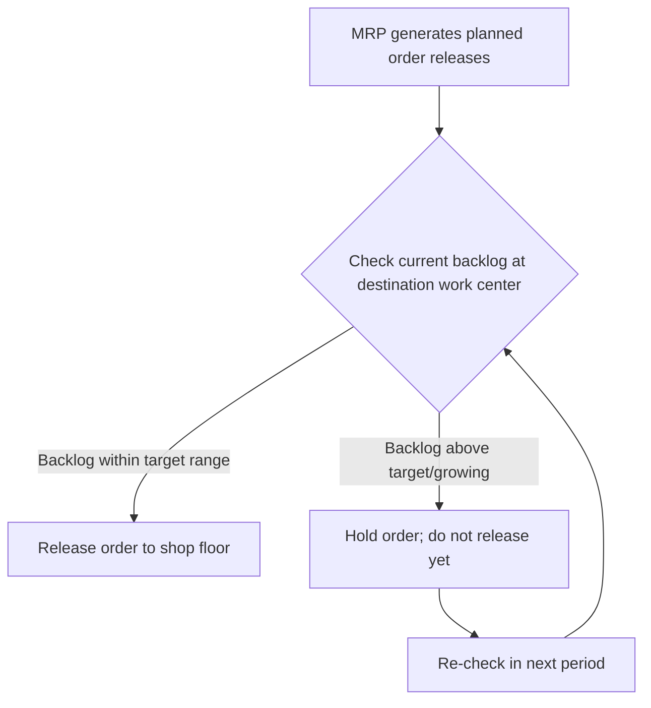
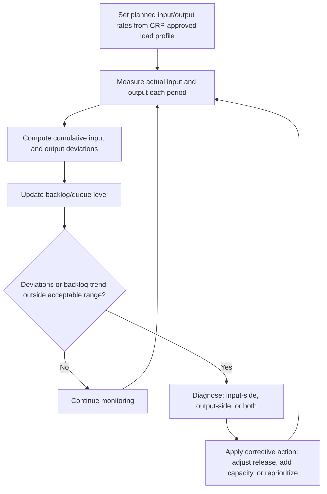

## Input-Output Control and Shop Floor Capacity


### Overview

Input-Output Control (I/O Control) is a shop floor capacity management technique that monitors and regulates the flow of work into and out of a work center to prevent excessive queues, work-in-process (WIP) buildup, and unpredictable lead times. Where Capacity Requirements Planning (CRP) validates a plan before execution, I/O control operates *during* execution, comparing actual planned input and output against actual measured input and output at each work center to detect and correct capacity problems in near-real time.

### Why Input-Output Control Exists

**Key Points**

- A perfectly valid CRP-approved plan can still fail on the shop floor if actual input to a work center exceeds what was planned (e.g., upstream work centers releasing work faster than scheduled) or if actual output falls short of planned output (e.g., unplanned downtime, quality issues, labor shortages).
- Without I/O control, the classic symptom is **queue buildup**: work piles up in front of a work center whose output rate cannot keep pace with its input rate, causing lead times to inflate well beyond planned values — even though the work center's rated capacity appeared sufficient on paper.
- I/O control directly connects to the relationship between queue time and lead time: since queue time is typically the largest component of total manufacturing lead time in many discrete environments, controlling input relative to output is often the single most effective lever for controlling lead time. [Unverified — the specific proportion of lead time attributable to queue time varies substantially by industry and process]

### The Basic I/O Control Report

An I/O control report tracks, for a single work center, four quantities per period: planned input, actual input, planned output, and actual output, along with the resulting backlog (queue).

$$\text{Backlog}_t = \text{Backlog}_{t-1} + \text{Actual Input}_t - \text{Actual Output}_t$$

**Example I/O control report (weekly, hours):**

| Week | Planned Input | Actual Input | Cumulative Input Deviation | Planned Output | Actual Output | Cumulative Output Deviation | Backlog |
| --- | --- | --- | --- | --- | --- | --- | --- |
| 1 | 160 | 165 | +5 | 160 | 150 | -10 | 40 (start) + 15 = 55 |
| 2 | 160 | 155 | +0 | 160 | 158 | -12 | 55 + (155-158) = 52 |
| 3 | 160 | 170 | +10 | 160 | 160 | -12 | 52 + 10 = 62 |
| 4 | 160 | 150 | 0 | 160 | 165 | -7 | 62 + (150-165) = 47 |

(Backlog assumed to start at 40 hours entering Week 1; figures illustrative of the mechanics.)

```mermaid
flowchart LR
    A[Upstream work centers<br/>release work (svg_diagram)] --> B[Input to Work Center]
    B --> C[Queue / Backlog]
    C --> D[Work Center processes at output rate]
    D --> E[Output to downstream work centers]
    F[I/O Control monitors:<br/>Input rate vs Output rate vs Queue level] -.watches.-> B
    F -.watches.-> D
    F -.watches.-> C
```

### Interpreting Cumulative Deviations

**Key Points**

- **Cumulative input deviation** tracks whether actual input to a work center is running ahead of or behind the plan over time — persistent positive deviation means upstream operations are releasing more work than the plan assumed, which will eventually overload the work center regardless of its own output performance.
- **Cumulative output deviation** tracks whether the work center itself is keeping pace with its planned output rate — persistent negative deviation indicates the work center has an actual capacity problem (equipment issues, staffing shortfall, efficiency loss) independent of how much work is arriving.
- **Backlog/queue trend** is the net result of both: a growing backlog signals that input is outpacing output, regardless of which side (upstream releases or the work center's own throughput) is the root cause — I/O control's diagnostic value lies precisely in separating these two possible causes.

### Diagnosing Root Cause from I/O Patterns

| Input Deviation | Output Deviation | Backlog Trend | Likely Root Cause |
| --- | --- | --- | --- |
| Positive (input too high) | Near zero | Growing | Upstream over-releasing work; order release policy issue |
| Near zero | Negative (output too low) | Growing | Work center capacity shortfall (downtime, staffing, efficiency) |
| Positive | Negative | Growing rapidly | Compound problem: both over-release and capacity shortfall |
| Negative | Near zero | Shrinking | Work center is starved; upstream releasing too little work |
| Near zero | Positive (output exceeds plan) | Shrinking | Work center outperforming plan, or working off excess backlog |

**Example**: A work center's I/O report shows input consistently tracking the plan closely while output has fallen 8% below plan for three consecutive weeks. This pattern points to an actual capacity problem at the work center itself (rather than an order-release issue), prompting investigation into equipment reliability, staffing levels, or process efficiency at that specific resource — a diagnosis that a simple backlog trend alone, without separating input and output deviations, would not have revealed as clearly.

### I/O Control as an Order Release Mechanism

One of the most direct applications of I/O control is governing **order release** — deciding when planned orders are actually released to the shop floor from the MRP-generated schedule.



**Key Points**

- Releasing all MRP-planned orders immediately and unconditionally, regardless of downstream queue conditions, is a common cause of excessive WIP and unpredictable lead times — this is essentially the shop-floor analogue of releasing water into an already-full reservoir.
- Controlled order release (sometimes implemented via **input control** as a formal WIP-limiting policy) deliberately paces the rate at which new work enters a work center or the shop floor as a whole, keeping queues — and therefore lead times — more predictable, at the cost of potentially delaying the *release* of some orders even though downstream capacity to *complete* them may eventually exist.

### Relationship to Little's Law

I/O control's core logic connects directly to **Little's Law**, a fundamental queuing relationship:

$$L = \lambda \times W$$

where $L$ is the average number of items in the system (WIP/queue), $\lambda$ is the average arrival (input) rate, and $W$ is the average time an item spends in the system (lead time).

**Key Points**

- Little's Law implies that for a given output rate, lead time is directly proportional to WIP — controlling input to limit WIP is therefore a direct, mathematically grounded lever for controlling lead time, which is precisely what I/O control operationalizes on the shop floor.
- This is the same underlying principle behind pull-based production control systems (e.g., Kanban, CONWIP — constant work-in-process), which explicitly cap WIP levels as their primary mechanism for controlling flow and lead time, functioning as an alternative or complementary approach to formal I/O control reporting.

### Setting Input and Output Targets

Planned input and output rates for an I/O control report are typically derived directly from the CRP-approved load profile — the same planned load that CRP validated as feasible becomes the "planned input" baseline that actual shop floor performance is measured against. Setting the *planned output* rate involves an additional judgment: it should reflect the work center's demonstrated or rated capacity, adjusted for realistic efficiency and utilization factors, rather than a theoretical maximum that ignores routine downtime, changeovers, and variability.

$$\text{Planned Output Rate} = \text{Rated Capacity} \times \text{Utilization Factor} \times \text{Efficiency Factor}$$

Setting this rate too optimistically (assuming near-100% utilization and efficiency) produces an I/O report that perpetually shows "output shortfall" even when the work center is performing normally, undermining the diagnostic value of the report; setting it too conservatively masks genuine emerging capacity problems.

### Corrective Actions Driven by I/O Control

When I/O control identifies a persistent problem, standard corrective actions include:

| Problem Identified | Corrective Action |
| --- | --- |
| Input consistently exceeds plan | Tighten order release control; investigate upstream over-release; adjust release policy |
| Output consistently below plan | Add capacity (overtime, additional shift, temporary labor); investigate equipment/quality issues |
| Growing backlog with balanced input/output deviations | Temporarily increase output capacity to work down backlog, or temporarily throttle input further |
| Shrinking backlog toward zero (starvation risk) | Increase input release rate to avoid work center idle time |

### Service and IT Analogue

Input-output control's logic transfers directly to service and IT operations wherever work arrives at a shared, capacity-constrained resource and queue buildup is a risk.

**Example**: A support ticket queue can be monitored with an I/O-control-style report: planned ticket intake (input) vs. actual tickets received, planned resolution rate (output) vs. actual tickets closed, and the resulting backlog of open tickets. A growing backlog with actual intake tracking close to plan but actual resolution rate below plan points to an agent capacity or efficiency issue, while a growing backlog with resolution rate on plan but intake running well above plan points to a demand surge requiring either more intake control (e.g., temporarily deprioritizing lower-severity tickets) or added resolution capacity — the same diagnostic separation of input-side versus output-side causes used on a manufacturing shop floor.

Similarly, in software systems, **backpressure** mechanisms in message queues and streaming systems (rate-limiting producers when consumer throughput can't keep pace) are a direct, automated analogue of an I/O-control-driven order release policy: rather than a human reviewing a weekly report, the system continuously throttles input to match sustainable output capacity.

### I/O Control Workflow



### Limitations of Input-Output Control

**Key Points**

- I/O control is inherently reactive at the level of a report review cycle (often weekly) — it detects problems after some deviation has already accumulated, rather than preventing them proactively, making its effectiveness dependent on how promptly reported deviations are acted upon.
- It requires reasonably accurate, timely actual-input and actual-output data collection at each monitored work center; inaccurate or delayed shop floor data reporting undermines the technique's diagnostic value in the same way stale bill-of-resources data undermines RCCP.
- I/O control manages flow and backlog effectively but does not, by itself, address the upstream question of whether the overall capacity plan (from aggregate planning through RCCP and CRP) was adequate in the first place — it is a flow-control and diagnostic tool operating within whatever capacity plan has already been established.

**Conclusion**

Input-output control closes the loop between capacity planning and shop floor execution by continuously comparing actual work center input and output against the plan, using the resulting deviations and backlog trend to diagnose whether capacity problems originate upstream (excessive order release) or at the work center itself (an actual output shortfall). Grounded in the same logic as Little's Law — that lead time is proportional to work-in-process for a given output rate — I/O control provides both an early-warning monitoring mechanism and, through controlled order release, a direct lever for keeping queues and lead times predictable, complementing the pre-execution feasibility checks performed by RCCP and CRP.

**Related Topics**

- Capacity requirements planning (CRP) within MRP
- Finite versus infinite capacity loading
- Little's Law and queuing fundamentals
- Pull-based production control: Kanban and CONWIP
- Order release policies and work-in-process limits
- Bottleneck identification and theory of constraints
- Backpressure and flow control in distributed systems