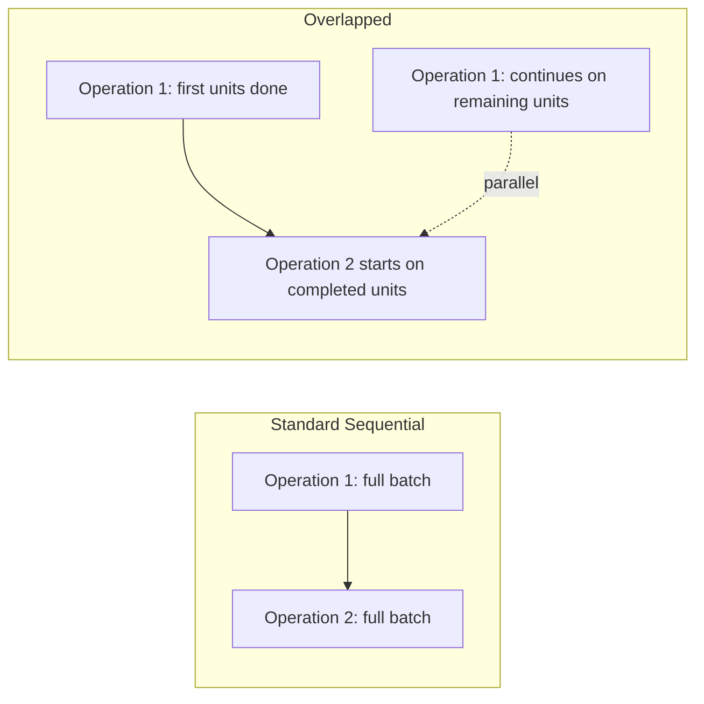
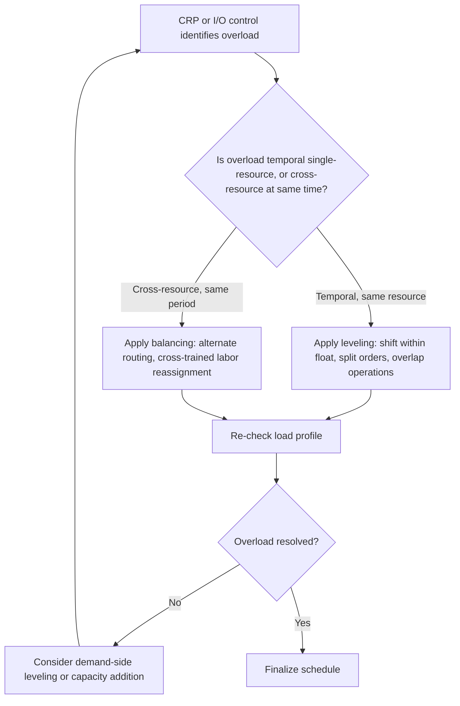

## Capacity Leveling and Load Balancing Techniques


### Overview

Capacity leveling and load balancing encompass the set of techniques used to smooth uneven demand on resources over time or redistribute work across resources, so that no single period or resource is severely overloaded while others sit idle. Where input-output control monitors and diagnoses flow problems after a plan is executing, and finite capacity scheduling enforces feasibility during scheduling, leveling and balancing techniques are the *corrective methods* actually applied — shifting, splitting, or redistributing work — to resolve the overloads that CRP, RCCP, or I/O control identify.

### Leveling vs. Balancing: A Key Distinction

**Key Points**

- **Capacity leveling** (also called load leveling) smooths load *over time* for a single resource or set of resources, shifting work earlier or later within available schedule float so that load per period stays closer to a stable, even rate rather than spiking and dipping.
- **Load balancing** redistributes work *across resources* at a given point in time, moving work from an overloaded resource to an underutilized one (typically via alternate routings or cross-trained capacity), rather than changing when the work happens.
- The two are complementary and frequently used together: leveling addresses temporal unevenness, balancing addresses unevenness across parallel resources; a mature capacity management approach applies both depending on which type of imbalance is present.

```mermaid
flowchart TD
    subgraph Leveling: same resource, across time
    A1[Week 1: 190 hrs] -.shift some load.-> A2[Week 2: 130 hrs]
    end
    subgraph Balancing: same time, across resources
    B1[Work Center A: 190 hrs] -.reroute some work.-> B2[Work Center B: 130 hrs]
    end
```

### Capacity Leveling Techniques

#### 1. Shifting Orders Within Available Float

The most direct leveling technique uses **schedule float** (slack between an order's earliest possible start and its required due date) to move orders from overloaded periods to underloaded ones without violating due dates.

$$\text{Float} = \text{Due Date} - \text{Earliest Completion Date}$$

Orders with the most float are the best candidates to shift, since moving them creates the least risk to on-time delivery.

**Example**: If a work center shows Week 3 at 190 required hours against 160 available (30-hour overload) while Week 4 shows only 130 hours against 160 available (30-hour slack), and several Week 3 orders have due dates extending into Week 5 or later, those orders can be shifted into Week 4 — eliminating both the Week 3 overload and the Week 4 underutilization simultaneously.

#### 2. Order Splitting

Rather than shifting an entire order, splitting divides a single order's quantity across two or more periods (or two or more resources), allowing partial completion in the overloaded period and the remainder elsewhere.

**Example**: A 300-unit order requiring 90 hours at a work center with only 60 hours of remaining capacity this period can be split into a 200-unit portion (60 hours, completed this period) and a 100-unit portion (30 hours, completed next period) — provided the order's due date allows staged completion or the downstream process can consume partial deliveries.

#### 3. Operation Splitting and Overlapping

Rather than splitting the order quantity, **operation splitting** assigns different portions of the same operation to run simultaneously on multiple machines (where duplicate capable equipment exists), while **operation overlapping** allows a downstream operation to begin on completed units before the entire upstream batch finishes, reducing total elapsed time without changing total resource-hours required.



#### 4. Demand-Side Leveling

Where the leveling problem originates from uneven *demand* rather than schedule flexibility alone, demand-side techniques shift when work enters the system in the first place:

- **Pricing/incentive adjustments** — off-peak pricing or promotions timed to shift demand away from peak periods.
- **Order due-date negotiation** — working with customers to accept slightly later delivery in exchange for pricing or other concessions, freeing capacity in the immediate peak period.
- **Appointment/reservation systems** — controlling the rate at which new work is accepted into the system in the first place (directly related to the order-release logic covered in input-output control).

### Load Balancing Techniques

#### 1. Alternate Routings

When more than one resource is capable of performing a given operation, **alternate routing** logic reassigns work from an overloaded resource to an underutilized capable alternative.

$$\text{Rebalanced Load}_{r_1} = \text{Load}_{r_1} - x, \qquad \text{Rebalanced Load}_{r_2} = \text{Load}_{r_2} + x$$

subject to $x$ being chosen so that neither resource's capacity is subsequently exceeded, and subject to any efficiency or setup-time differences between the primary and alternate resource (an alternate machine or a less-experienced cross-trained worker may take longer per unit, which must be accounted for rather than assuming a 1:1 hour transfer).

**Example**: If Work Center A (a specific CNC machine) is loaded at 190 hours against 160 available, while an alternate, slightly less efficient CNC machine (Work Center B) has 40 hours of available slack, load-balancing logic can reassign a portion of Work Center A's overload to Work Center B — adjusting for B's lower efficiency rate so the reassigned hours reflect B's actual processing time, not simply A's.

#### 2. Cross-Training and Flexible Labor Pools

For labor-constrained resources, load balancing is achieved by maintaining a workforce with overlapping skills across multiple work centers or task types, allowing labor to be reassigned to wherever demand is currently highest.

**Key Points**

- The value of cross-training for load balancing scales with the *breadth* of overlapping skill coverage — a workforce where every individual can only perform one task type provides no balancing flexibility, while broader cross-training (sometimes visualized as a "skills chaining" pattern) allows labor to flow to bottlenecks as they shift.
- Cross-training has a cost (training time, potential efficiency loss versus a fully specialized worker) that must be weighed against the flexibility benefit it provides — this is the labor-side analogue of the efficiency adjustment needed for alternate machine routings.

#### 3. Dynamic/Automated Load Balancing (IT Systems Context)

In IT and distributed computing systems, load balancing is typically automated and continuous rather than a periodic planning exercise, using algorithms to distribute incoming requests or jobs across available compute resources:

| Algorithm | Logic |
| --- | --- |
| Round Robin | Distributes requests sequentially across available resources in fixed rotation |
| Least Connections | Routes to the resource currently handling the fewest active connections/jobs |
| Weighted Round Robin | Like round robin, but resources with more capacity receive proportionally more requests |
| Resource-Based (adaptive) | Routes based on real-time measured load (CPU, memory, queue depth) on each resource |
| Consistent Hashing | Maps requests to resources using a hash function designed to minimize redistribution when resources are added/removed |

**Key Points**

- These algorithms operationalize the same fundamental idea as manufacturing load balancing — moving work toward underutilized capacity and away from overloaded capacity — but do so continuously and automatically at the scale of milliseconds rather than through periodic human-reviewed load reports.
- Choice of algorithm involves trade-offs directly analogous to manufacturing sequencing rules: round robin is simple but ignores actual current load (similar to a naive fixed allocation), while resource-based adaptive balancing is more responsive but requires continuous monitoring overhead (similar to the data-collection burden of detailed I/O control reporting).

### Combined Leveling and Balancing Workflow



### Constraints and Trade-offs in Leveling/Balancing

**Key Points**

- **Precedence constraints** — operations that must occur in a fixed sequence limit how freely work can be shifted or split without violating process logic (e.g., a curing/setting operation cannot be skipped or reordered).
- **Efficiency loss on alternate resources** — as noted above, reassigning work to an alternate machine or cross-trained worker often comes at a real efficiency cost that must be included in the rebalancing calculation, not ignored.
- **Diminishing returns on leveling within a fixed horizon** — leveling can only smooth load within the available float across the current planning horizon; if total required load across the horizon genuinely exceeds total available capacity, no amount of shifting or splitting resolves the shortfall, and capacity addition (or demand-side action) becomes necessary instead.
- **Setup/changeover costs from over-leveling** — aggressively splitting orders or overlapping operations to smooth load can increase the total number of setups/changeovers required, trading capacity-utilization smoothness for increased total setup time — a trade-off that should be evaluated rather than assumed to be free.

### Service and IT Analogue Beyond Compute Load Balancing

Leveling and balancing concepts extend beyond literal compute load balancers into broader service capacity management:

**Example**: A customer support organization facing an uneven daily ticket-volume pattern (heavy mornings, light afternoons) can apply **leveling** by using flexible/staggered shift start times so agent availability better matches the demand curve, and **balancing** by cross-training agents across product lines so that a surge in one product's ticket volume can be absorbed by agents normally assigned elsewhere — directly mirroring, respectively, the demand-side leveling and cross-trained-labor balancing techniques described above for manufacturing contexts.

### Practical Decision Guide

**Output**

| Situation | Recommended Technique |
| --- | --- |
| Single resource overloaded in some periods, underloaded in others, orders have float | Leveling via order shifting |
| Order too large to fit any single period's remaining capacity | Order splitting |
| Total lead time needs reduction without adding resource-hours | Operation overlapping |
| Multiple capable resources exist, one overloaded and another idle at the same time | Load balancing via alternate routing |
| Labor-constrained bottleneck shifts unpredictably across work centers | Cross-training and flexible labor pools |
| High-volume, automated request/job distribution (IT systems) | Automated load balancing algorithms |
| Total required capacity exceeds total available even after leveling/balancing | Capacity addition or demand-side management (see aggregate planning) |

**Conclusion**

Capacity leveling and load balancing provide the concrete corrective toolkit for resolving overloads once they are identified by CRP, RCCP, or input-output control: leveling smooths load over time for a given resource using schedule float, order splitting, and operation overlapping, while balancing redistributes load across resources at a given time using alternate routings, cross-trained labor, or (in IT contexts) automated load-balancing algorithms. Both techniques operate within the constraints of precedence requirements, efficiency differences across alternate resources, and the fundamental limit that no amount of shifting or redistribution can manufacture capacity that does not exist in aggregate across the planning horizon.

**Related Topics**

- Capacity requirements planning (CRP) within MRP
- Input-output control and shop floor capacity
- Finite versus infinite capacity loading
- Bottleneck identification and theory of constraints
- Cross-training and flexible workforce design
- Automated load balancing algorithms in distributed systems
- Aggregate planning and its link to capacity