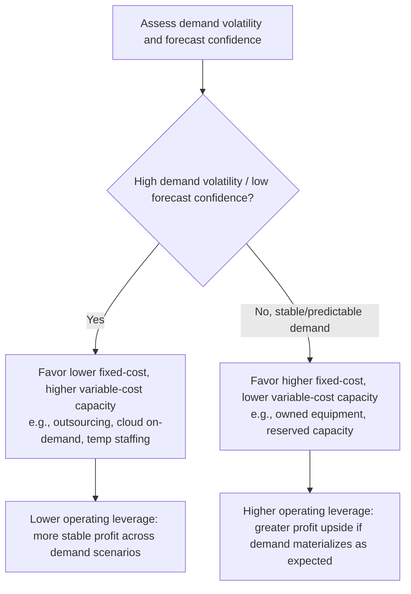

## Fixed Versus Variable Cost Structures


### Overview

The distinction between fixed and variable costs is the foundational cost concept underlying nearly every financial analysis of capacity decisions — break-even analysis, capacity investment evaluation, outsourcing decisions, and pricing all depend on correctly classifying which costs change with volume and which do not. How an organization's cost structure is weighted between fixed and variable costs fundamentally shapes its risk profile, its optimal capacity strategy, and how sensitive its profitability is to demand fluctuations.

### Core Definitions

**Fixed costs** ($F$) are costs that remain constant in total, in the short-to-medium run, regardless of the volume of output or activity produced. They must be paid whether volume is zero or at maximum capacity.

**Variable costs** ($v$ per unit) are costs that change in direct proportion to the volume of output or activity — total variable cost rises and falls with $Q$.

$$\text{Total Cost} = TC(Q) = F + vQ$$


$$\text{Average Total Cost} = ATC(Q) = \frac{F}{Q} + v$$

**Key Points**

- Fixed costs are fixed *in total*, but average (per-unit) fixed cost *decreases* as volume increases, since the same total fixed cost is spread across more units — this relationship is the mathematical basis for economies of scale.
- Variable costs are constant *per unit* (in the simplest linear model) but *total* variable cost rises with volume — the mirror image of the fixed-cost relationship.
- The fixed/variable distinction always applies over a defined time horizon and volume range; nearly all costs become variable given a long enough time horizon (e.g., a facility lease is fixed in the short run but becomes a variable decision at renewal), and even "fixed" costs typically only hold fixed within a **relevant range** of volume before requiring a step change.

### Examples by Capacity Context

| Cost Category | Typical Fixed Cost Examples | Typical Variable Cost Examples |
| --- | --- | --- |
| Manufacturing | Equipment depreciation, facility lease, base salaried staff, insurance | Raw materials, per-unit direct labor, packaging, per-unit utilities |
| IT/Cloud Infrastructure | Reserved instance commitments, platform licensing, core SRE staffing | On-demand/spot compute, per-request billing, data egress, storage consumed |
| Service/Support Operations | Base staffing salaries, office lease, core software licenses | Overtime pay, contractor/temp staffing, per-ticket outsourced support cost |
| Retail/Distribution | Store lease, base staff, fixed equipment | Inventory/cost of goods sold, per-transaction payment processing fees, hourly staff scaled to footfall |

### Semi-Variable (Mixed) Costs

Many real costs are neither purely fixed nor purely variable but contain both a fixed and a variable component — commonly called **semi-variable** or **mixed costs**.

$$TC_{\text{mixed}}(Q) = F_{\text{base}} + v \cdot Q$$

**Example**: A cloud compute contract might include a fixed base reservation fee ($10,000/month covering a committed baseline of compute) plus a per-unit charge for usage beyond that baseline — the reservation fee is fixed, the overage charge is variable, and the combined cost structure is semi-variable.

Mixed costs are typically decomposed into their fixed and variable components using methods such as:

- **High-low method** — using the highest and lowest observed activity levels and their associated costs to estimate the variable rate and fixed component algebraically.
- **Regression analysis** — statistically estimating the fixed intercept and variable slope from historical cost-versus-volume data (directly connecting to the regression techniques covered in causal forecasting).
- **Account analysis** — a more judgment-based classification of each cost account as fixed, variable, or mixed based on its underlying economic driver.

**High-low method example**: If total cost was $180,000 at 4,000 units (highest activity) and $140,000 at 2,000 units (lowest activity):

$$v = \frac{180{,}000 - 140{,}000}{4{,}000 - 2{,}000} = \frac{40{,}000}{2{,}000} = \$20 \text{ per unit}$$


$$F = 180{,}000 - (20 \times 4{,}000) = 180{,}000 - 80{,}000 = \$100{,}000$$

### Step-Fixed Costs

A special and practically important case: costs that are fixed *within a range* of volume but jump to a new fixed level once a capacity threshold is exceeded — directly relevant to capacity planning because these steps often correspond exactly to capacity investment decisions (adding a shift, a machine, a facility).

```mermaid
flowchart LR
    A[0 - 10,000 units:<br/>1 shift, Fixed Cost = 200K (svg_diagram)] --> B[10,001 - 20,000 units:<br/>2 shifts, Fixed Cost = 380K]
    B --> C[20,001 - 30,000 units:<br/>3 shifts, Fixed Cost = 560K]
```

**Key Points**

- Step-fixed cost behavior means average total cost does not decline smoothly with volume — it declines within a step, then jumps upward the moment a new capacity threshold requires an additional fixed-cost tier, before declining again within the new step.
- Recognizing where step thresholds sit relative to forecasted demand is essential: operating just above a step threshold (e.g., needing a second shift for only slightly more volume than a single shift could handle) can produce a much worse average cost outcome than either staying just below the threshold or growing well beyond it to fully utilize the new fixed-cost tier.

### Operating Leverage: The Strategic Implication of Cost Structure

The proportion of fixed versus variable costs in an organization's cost structure determines its **operating leverage** — how sensitive profit is to changes in volume.

$$\text{Degree of Operating Leverage (DOL)} = \frac{\% \text{ Change in Operating Income}}{\% \text{ Change in Sales/Volume}} = \frac{\text{Contribution Margin}}{\text{Operating Income}}$$

**Key Points**

- A **high fixed-cost, low variable-cost** structure (high operating leverage) means profit is highly sensitive to volume: small increases in volume produce large proportional profit gains once fixed costs are covered, but small decreases in volume produce large proportional profit losses — a "feast or famine" profile.
- A **low fixed-cost, high variable-cost** structure (low operating leverage) produces more stable, less volume-sensitive profit, at the cost of lower profit upside when volume is strong, since a larger share of each incremental unit's revenue is absorbed by variable cost rather than flowing through as margin.
- This directly connects to the capacity investment decision itself: choosing owned/dedicated capacity (typically high fixed cost, low variable cost) versus outsourced/on-demand capacity (typically low fixed cost, higher variable cost) is fundamentally a choice about how much operating leverage — and therefore volume risk — the organization wants to carry.

**Example comparison:**

| Structure | Fixed Cost | Variable Cost/Unit | Price/Unit | Profit at 15,000 units | Profit at 25,000 units |
| --- | --- | --- | --- | --- | --- |
| High leverage (own equipment) | $400,000 | $20 | $45 | $(25,000) | $225,000 |
| Low leverage (outsourced) | $50,000 | $32 | $45 | $145,000 | $275,000 |

At 15,000 units, the low-leverage outsourced option is far more profitable (and avoids a loss); at 25,000 units, the high-leverage owned option pulls ahead due to its lower variable cost dominating at higher volume — the same crossover-volume logic covered in break-even analysis, now framed explicitly through the fixed/variable cost lens.

### Cost Structure and Capacity Strategy Choice



**Key Points**

- This decision directly parallels the chase-versus-level aggregate planning strategies covered earlier in this curriculum: a chase strategy tends to convert what would otherwise be fixed capacity costs into variable costs (paying for capacity only as needed), while a level strategy tends to lock in more fixed capacity cost in exchange for stability and lower per-unit variable cost.
- Cloud computing's shift from capital expenditure (CapEx — owned, largely fixed-cost infrastructure) toward operating expenditure (OpEx — on-demand, largely variable-cost infrastructure) is precisely a large-scale, industry-wide instance of trading operating leverage for demand-matching flexibility, and is frequently analyzed using this exact fixed-versus-variable framework.

### Cost Structure's Role in Break-Even and Margin of Safety

Because break-even quantity is $Q_{BE} = F / (p - v)$, cost structure directly determines break-even risk:

- **Higher fixed cost** (holding contribution margin constant) → higher break-even quantity → less margin of safety at a given forecasted demand level.
- **Higher variable cost** (holding fixed cost constant) → lower contribution margin → also raises break-even quantity, but through a different mechanism (each unit contributes less toward covering fixed costs, rather than there being more fixed cost to cover).

**Key Points**

- Two capacity options can arrive at the same break-even quantity through very different cost structures (one via high fixed cost with high margin, another via low fixed cost with low margin) — but they will behave very differently above and below that shared break-even point, which is why operating leverage (not just break-even quantity alone) should be examined when comparing capacity alternatives.

### Analyzing an Organization's Cost Structure

**Output**

| Analysis Step | Purpose |
| --- | --- |
| Classify each cost line as fixed, variable, or mixed | Establishes the base data for TC(Q) modeling |
| Decompose mixed costs (high-low, regression) | Isolates the true fixed and variable components |
| Identify step-fixed thresholds relative to current/forecasted volume | Flags capacity decisions embedded in the cost structure |
| Calculate contribution margin and operating leverage (DOL) | Quantifies volume-sensitivity of profit |
| Compare cost structure across capacity alternatives | Informs the fixed-vs-flexible capacity strategy choice |
| Stress-test under demand scenarios (using variability estimates) | Reveals how cost structure choice performs under uncertainty, not just at the point forecast |

### Practical Workflow

```mermaid
flowchart TD
    A[Gather historical cost and volume data] --> B[Classify costs: fixed, variable, mixed]
    B --> C[Decompose mixed costs into F and v components]
    C --> D[Identify step-fixed thresholds]
    D --> E[Build TC(Q) model for current and alternative capacity structures]
    E --> F[Compute contribution margin and operating leverage]
    F --> G[Compare structures against demand forecast and variability]
    G --> H[Select capacity structure aligned with risk tolerance and demand confidence]
```

### Limitations and Caveats

**Key Points**

- The fixed/variable split is only valid within a defined **relevant range** of volume and time horizon; extrapolating a linear $TC(Q) = F + vQ$ model far outside the range over which it was estimated risks ignoring step-fixed thresholds or variable-cost economies/diseconomies of scale that emerge outside that range.
- Classification of a specific cost as fixed or variable can be genuinely ambiguous in practice (e.g., salaried staff who could technically be laid off are "fixed" only in the sense that the organization has chosen not to treat them as a variable lever) — this is often as much a policy or contractual question as a strictly accounting one. [Inference — the fixed/variable boundary for labor costs specifically depends on employment terms and organizational practice, which varies by context]

**Conclusion**

Fixed versus variable cost structure is the underlying framework that determines how sensitive an organization's profitability is to volume changes, how capacity investment alternatives should be compared, and where break-even and margin-of-safety thresholds fall. Understanding which costs are truly fixed, which are variable, which are mixed, and where step-fixed thresholds sit relative to demand allows capacity planners to explicitly choose an operating-leverage profile — trading the stability of lower fixed-cost/higher-variable-cost structures against the greater profit potential (and greater downside risk) of higher fixed-cost/lower-variable-cost structures — in a way that aligns with the organization's actual demand volatility and forecast confidence.

**Related Topics**

- Break-even analysis for capacity investment
- Operating leverage and its effect on profit volatility
- Make-versus-buy and outsourcing decision frameworks
- CapEx versus OpEx models in cloud infrastructure decisions
- Chase, level, and hybrid aggregate planning strategies
- Economies and diseconomies of scale
- Cost estimation methods: high-low method and regression-based cost analysis