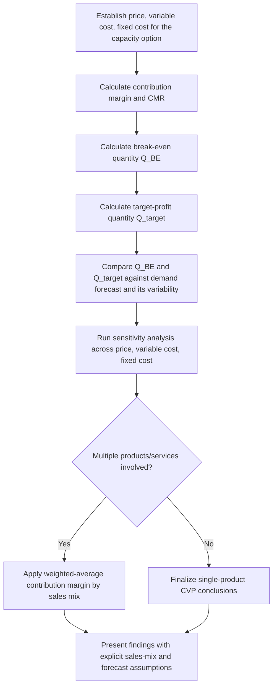

## Cost-Volume-Profit Analysis


### Overview

Cost-Volume-Profit (CVP) analysis is a broader financial modeling framework that examines how changes in costs, volume, and price interact to affect operating profit. It generalizes break-even analysis (which finds only the zero-profit point) into a comprehensive tool for answering a wide range of "what happens to profit if..." questions — how much volume is needed for a target profit, how sensitive profit is to price or cost changes, and how different capacity/cost structures perform across a range of possible volumes.

### The CVP Profit Equation

Building directly on the fixed/variable cost framework, the core CVP equation expresses operating profit as a function of volume:

$$\text{Profit}(Q) = pQ - (F + vQ) = (p - v)Q - F$$

where $(p - v)$ is the contribution margin per unit, as introduced in break-even analysis. This single equation is the basis for every standard CVP calculation.

**Key Points**

- CVP analysis treats break-even ($\text{Profit} = 0$) as one specific case rather than the whole picture — the same equation directly supports target-profit volume calculations, margin-of-safety analysis, and sensitivity testing across price, cost, and volume assumptions simultaneously.
- CVP is a short-run planning tool: it assumes costs can be cleanly split into fixed and variable components and that both price and variable cost per unit remain constant across the relevant volume range — the same relevant-range caveat that applies to the fixed/variable cost structure it builds on.

### Contribution Margin Ratio

For analysis in percentage/ratio terms (useful when comparing products or business units with different price points), the **contribution margin ratio (CMR)** expresses contribution margin as a fraction of price:

$$CMR = \frac{p - v}{p}$$

This allows the profit equation to be restated in terms of total sales revenue $S = pQ$:

$$\text{Profit} = S \times CMR - F$$

**Example**: If contribution margin ratio is 40% and total sales revenue is $800,000, with fixed costs of $250,000:

$$\text{Profit} = 800{,}000 \times 0.40 - 250{,}000 = 320{,}000 - 250{,}000 = \$70{,}000$$

### Target Profit Analysis

Extending the break-even formula, CVP analysis solves directly for the volume needed to achieve a specified target operating profit $\pi_{\text{target}}$:

$$Q_{\text{target}} = \frac{F + \pi_{\text{target}}}{p - v}$$

**Example**: Using the earlier capacity investment figures (fixed cost $500,000, price $65, variable cost $40, contribution margin $25), if the organization requires a target annual profit of $150,000 to justify the capacity investment beyond simple break-even:

$$Q_{\text{target}} = \frac{500{,}000 + 150{,}000}{25} = \frac{650{,}000}{25} = 26{,}000 \text{ units}$$

This reframes the capacity feasibility question from "will this investment merely break even" to "will this investment hit the return threshold required to justify committing capital and capacity to it" — a distinction that matters because organizations rarely invest in capacity purely to break even.

### CVP Chart: Profit-Volume Graph

While the classic break-even chart plots total cost and total revenue as separate lines, CVP analysis is often visualized instead using a **profit-volume (P/V) graph**, plotting profit directly against volume as a single line crossing zero at the break-even point.

```mermaid
flowchart TD
    A[Q = 0: Profit = -F<br/>maximum loss, equal to fixed cost (svg_diagram)] --> B[Q = Q_BE: Profit = 0<br/>break-even point]
    B --> C[Q = Q_target: Profit = target profit]
    C --> D[Q = Q_max capacity: Profit = maximum achievable at full capacity]
```

**Key Points**

- The slope of the profit line in a P/V graph is exactly the contribution margin per unit $(p-v)$ — a steeper line indicates that each additional unit of volume contributes more strongly to profit, which is the same underlying quantity that drives operating leverage.
- The vertical intercept at $Q=0$ equals $-F$: with zero volume, the organization loses exactly its fixed costs, illustrating concretely why fixed-cost commitments represent a firm's downside exposure before any volume materializes.

### Sensitivity Analysis Within CVP

CVP analysis is particularly well suited to systematically testing how profit responds to changes in each of its four key inputs — price, variable cost, fixed cost, and volume — both individually and in combination.

#### Sensitivity to Price Changes

$$\frac{\partial \text{Profit}}{\partial p} = Q$$

A one-unit change in price changes profit by exactly the volume sold — meaning price sensitivity scales directly with volume, so price changes matter more (in absolute profit terms) at higher-volume operations.

#### Sensitivity to Variable Cost Changes

$$\frac{\partial \text{Profit}}{\partial v} = -Q$$

Symmetric in magnitude to the price sensitivity (both scale with $Q$), but note that in relative terms a given percentage change in variable cost usually translates to a smaller absolute cost change than the same percentage change in price, since $v < p$ for any profitable operation — a distinction that matters when comparing "which lever matters more" in a specific numeric scenario. [Inference — the specific relative impact depends on the actual gap between price and variable cost in the scenario under analysis]

#### Sensitivity to Fixed Cost Changes

$$\frac{\partial \text{Profit}}{\partial F} = -1$$

Every dollar of fixed cost change flows directly, dollar-for-dollar, into profit regardless of volume — a property that makes fixed-cost changes especially important to scrutinize carefully in capacity decisions, since they affect profit uniformly across every possible future volume scenario.

**Example sensitivity table** (base case: F=$500,000, v=$40, p=$65, Q=25,000):

| Scenario | Profit Impact | New Profit |
| --- | --- | --- |
| Base case | — | $125,000 |
| Price +5% ($68.25) | +$81,250 | $206,250 |
| Variable cost +10% ($44) | -$100,000 | $25,000 |
| Fixed cost +$50,000 | -$50,000 | $75,000 |
| Volume -15% (21,250 units) | -$93,750 | $31,250 |

```python
def cvp_profit(price, variable_cost, fixed_cost, quantity):
    return (price - variable_cost) * quantity - fixed_cost

base = cvp_profit(65, 40, 500_000, 25_000)
price_up = cvp_profit(68.25, 40, 500_000, 25_000)
vc_up = cvp_profit(65, 44, 500_000, 25_000)
fc_up = cvp_profit(65, 40, 550_000, 25_000)
vol_down = cvp_profit(65, 40, 500_000, 21_250)

for label, val in [("base", base), ("price+5%", price_up),
                   ("vc+10%", vc_up), ("fc+50k", fc_up), ("vol-15%", vol_down)]:
    print(f"{label}: profit={val:,.0f}, change={val-base:+,.0f}")
```

### Multi-Product CVP Analysis

As with break-even analysis, when a capacity investment serves multiple products or service lines, CVP analysis requires a **weighted-average contribution margin** based on assumed sales mix, and the resulting profit and break-even figures are conditional on that mix holding.

$$\text{Profit} = \sum_i Q_i (p_i - v_i) - F$$

**Key Points**

- Sales mix shifts affect total profit even when total unit volume is unchanged, exactly as they affect break-even quantity — a mix shift toward higher-margin products raises profit at a given total volume, while a shift toward lower-margin products lowers it, so multi-product CVP results should always be presented alongside the sales-mix assumption they depend on.

### CVP Analysis and Capacity Decision-Making

CVP directly informs several distinct capacity-related decisions beyond simple feasibility screening:

| Decision Question | CVP Application |
| --- | --- |
| "Should we add this capacity at all?" | Compare $Q_{BE}$ and $Q_{\text{target}}$ against demand forecast |
| "What price do we need to justify this capacity investment?" | Solve the profit equation for $p$ given fixed $F$, $v$, target profit, and forecasted $Q$ |
| "How much can costs rise before this investment stops being worthwhile?" | Solve for the fixed or variable cost level that drives profit to a target threshold (often zero) |
| "Which capacity structure has better risk-adjusted return?" | Compare P/V graph slopes (operating leverage) across alternatives at a range of plausible volumes, not just the point forecast |
| "Is our capacity utilization generating adequate profit?" | Express $Q_{BE}$ and $Q_{\text{target}}$ as percentages of maximum capacity for direct utilization-based interpretation |

### Practical Workflow



### Limitations of CVP Analysis

**Key Points**

- **Linearity assumption** — as with break-even analysis, CVP assumes constant price and constant variable cost per unit across the relevant volume range, which can break down at very high or very low volumes due to bulk discounts, capacity constraints forcing overtime/expediting premiums, or price elasticity effects.
- **Static, single-period view** — standard CVP does not natively incorporate the time value of money or multi-year cash flow timing, making it best suited to operating-period profitability questions rather than capital investment payback questions (which require NPV/IRR-style analysis).
- **Assumes costs are cleanly separable into fixed and variable** — as covered in the fixed/variable cost structures topic, this separation is sometimes genuinely ambiguous (semi-variable costs, policy-dependent labor cost treatment), and CVP results inherit whatever imprecision exists in that underlying classification.
- **Ignores demand-side interdependencies in multi-product settings unless explicitly modeled** — CVP as typically formulated treats each product's volume independently unless a sales-mix assumption is built in, and does not capture cross-product effects (e.g., a bundled offering where one product's volume depends on another's).

**Conclusion**

Cost-volume-profit analysis generalizes simple break-even analysis into a full framework for understanding how price, variable cost, fixed cost, and volume jointly determine operating profit — supporting target-profit volume calculations, systematic sensitivity testing, and multi-product analysis, all built on the same contribution-margin logic introduced in break-even and fixed/variable cost analysis. Its core value for capacity decisions lies in moving the conversation beyond "will this investment merely survive" to "what volume, price, and cost combination is required for this capacity investment to meet its actual financial target," while its linear, single-period assumptions mean it should be paired with sensitivity analysis and, for major capital commitments, more rigorous multi-year discounted cash flow evaluation.

**Related Topics**

- Break-even analysis for capacity investment
- Fixed versus variable cost structures
- Operating leverage and profit volatility
- Net present value (NPV) and internal rate of return (IRR) for capacity investment
- Sales mix analysis and weighted contribution margin
- Sensitivity and scenario analysis in capital budgeting
- Pricing strategy and price elasticity effects on capacity utilization