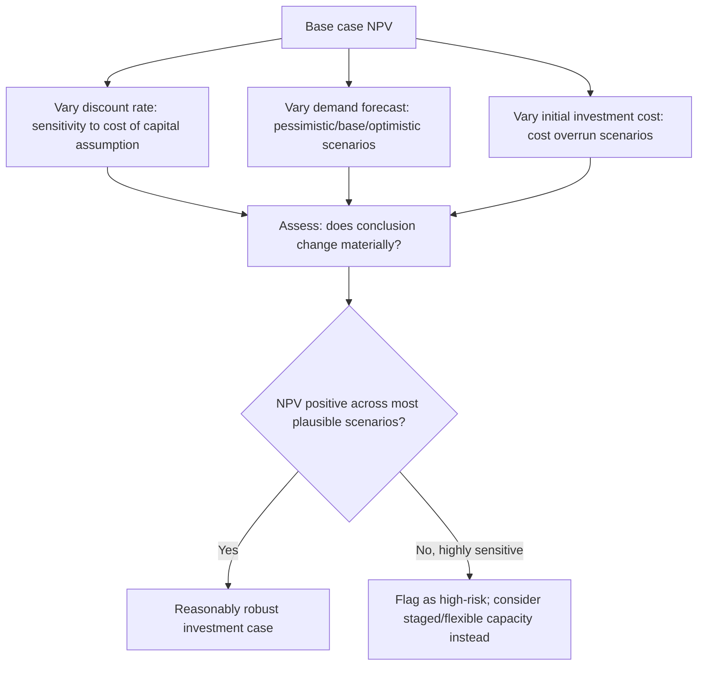
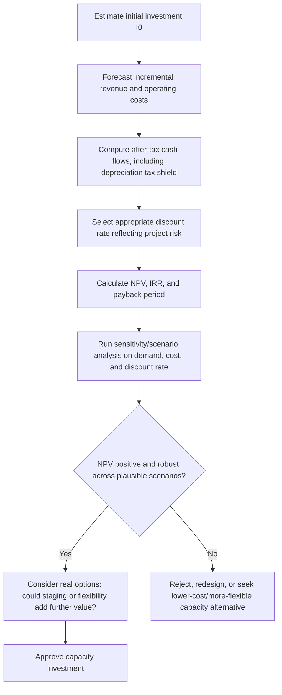

## Net Present Value and Capital Budgeting for Capacity


### Overview

Net Present Value (NPV) and the broader discipline of capital budgeting provide the rigorous financial framework for evaluating capacity investments that involve upfront capital outlay followed by cash flows realized over multiple future periods. Where break-even and CVP analysis evaluate profitability within a single operating period, capital budgeting explicitly accounts for the time value of money — the principle that a dollar received in the future is worth less than a dollar received today — making it the appropriate tool for major, multi-year capacity commitments such as new facilities, equipment purchases, or large infrastructure buildouts.

### Time Value of Money: The Foundation

The core premise is that money has an opportunity cost: a dollar today can be invested to earn a return, so future cash flows must be **discounted** back to their present-value equivalent before being compared to today's investment.

$$PV = \frac{CF_t}{(1+r)^t}$$

where $CF_t$ is the cash flow in period $t$, and $r$ is the **discount rate** — typically the organization's cost of capital, reflecting the return that could be earned on an alternative investment of similar risk.

**Key Points**

- The discount rate should reflect the risk profile of the specific capacity investment, not simply a generic corporate borrowing rate — riskier capacity bets (e.g., building capacity for an unproven new product line) warrant a higher discount rate than expanding capacity for an established, stable revenue stream.
- Higher discount rates penalize distant cash flows more heavily, which matters directly for capacity decisions with long payback horizons (e.g., a data center or factory with a 15–20 year useful life) versus shorter-lived assets.

### Net Present Value Formula

$$NPV = -I_0 + \sum_{t=1}^{n} \frac{CF_t}{(1+r)^t}$$

where $I_0$ is the initial capital investment (outflow at time 0), $CF_t$ is the net cash flow in year $t$, $r$ is the discount rate, and $n$ is the investment's evaluation horizon (often its useful life).

**Decision rule**: Accept the investment if $NPV > 0$ (the investment creates value beyond the cost of capital); reject if $NPV < 0$.

**Example**: A capacity expansion requires an initial investment of $2,000,000 and is expected to generate net cash flows of $450,000 per year for 6 years, with a discount rate of 10%:

$$NPV = -2{,}000{,}000 + \sum_{t=1}^{6} \frac{450{,}000}{(1.10)^t}$$

| Year | Cash Flow | Discount Factor | Present Value |
| --- | --- | --- | --- |
| 1 | $450,000 | 0.9091 | $409,091 |
| 2 | $450,000 | 0.8264 | $371,901 |
| 3 | $450,000 | 0.7513 | $338,092 |
| 4 | $450,000 | 0.6830 | $307,356 |
| 5 | $450,000 | 0.6209 | $279,415 |
| 6 | $450,000 | 0.5645 | $254,014 |
| **Total PV of inflows** |  |  | **$1,959,868** |

$$NPV = -2{,}000{,}000 + 1{,}959{,}868 = -\$40{,}132$$

With a slightly negative NPV, this capacity investment would technically destroy value at the assumed 10% discount rate, despite generating positive cash flow every year — illustrating precisely why NPV, not simple cash flow totals, is the correct decision criterion.

```python
def npv(rate, initial_investment, cash_flows):
    total = -initial_investment
    for t, cf in enumerate(cash_flows, start=1):
        total += cf / (1 + rate) ** t
    return total

result = npv(0.10, 2_000_000, [450_000] * 6)
print(f"NPV: ${result:,.2f}")
```

### Internal Rate of Return (IRR)

The **Internal Rate of Return** is the discount rate at which NPV equals exactly zero — representing the investment's break-even rate of return.

$$0 = -I_0 + \sum_{t=1}^{n} \frac{CF_t}{(1+\text{IRR})^t}$$

**Decision rule**: Accept the investment if $\text{IRR} >$ the organization's required rate of return (hurdle rate/cost of capital); reject if IRR is below it.

```python
import numpy_financial as npf

irr = npf.irr([-2_000_000, 450_000, 450_000, 450_000, 450_000, 450_000, 450_000])
print(f"IRR: {irr:.2%}")
```

**Key Points**

- IRR and NPV generally agree on accept/reject decisions for a single, conventional investment (one initial outflow followed by inflows), but IRR can produce misleading or multiple solutions when cash flows change sign more than once (e.g., a major mid-life capacity refurbishment cost), a known limitation that does not affect NPV.
- IRR expresses return as a percentage, which many stakeholders find more intuitive to communicate than a dollar-denominated NPV figure, but **NPV is generally the theoretically preferred criterion** when comparing mutually exclusive projects of different scale, since IRR can favor a smaller, higher-percentage-return project over a larger project that actually creates more total value. [Unverified — this is a widely taught principle in corporate finance, but the practical preference can still vary by organizational convention]

### Payback Period

The simplest (and least rigorous) capital budgeting metric: the time required for cumulative cash flows to recover the initial investment.

$$\text{Payback Period} = \text{Year before full recovery} + \frac{\text{Unrecovered amount at start of that year}}{\text{Cash flow during that year}}$$

**Example** (using the same $2,000,000 investment, $450,000/year):

$$\text{Payback Period} = \frac{2{,}000{,}000}{450{,}000} \approx 4.44 \text{ years}$$

**Key Points**

- Simple payback period ignores the time value of money entirely (treating a dollar in year 1 the same as a dollar in year 5) and ignores all cash flows occurring after the payback point — two significant limitations that make it unsuitable as a sole capital budgeting criterion, though it remains popular as a quick liquidity/risk screening metric.
- **Discounted payback period** addresses the time-value criticism by discounting cash flows before accumulating them, but still ignores cash flows beyond the payback point, so it remains a supplementary rather than primary decision metric.

### Comparing the Three Core Metrics

| Metric | Accounts for Time Value | Accounts for All Cash Flows | Output Form | Primary Use |
| --- | --- | --- | --- | --- |
| NPV | Yes | Yes | Dollar value | Primary decision criterion, especially for comparing project scale |
| IRR | Yes | Yes | Percentage rate | Intuitive communication; risk of ambiguity with non-conventional cash flows |
| Payback Period | No (simple) / Yes (discounted) | No | Time (years) | Quick liquidity/risk screen, not a full profitability measure |

### Building the Cash Flow Estimates for a Capacity Investment

Capital budgeting analysis is only as reliable as its underlying cash flow estimates. For a capacity investment, the relevant inputs typically include:

- **Initial investment ($I_0$)** — equipment/facility cost, installation, initial working capital increase.
- **Incremental revenue** — additional revenue enabled by the new capacity (directly tied to the demand forecast from earlier in this curriculum).
- **Incremental operating costs** — the variable and any new fixed costs associated with operating the added capacity (connecting directly to the fixed/variable cost structure analysis).
- **Depreciation and tax effects** — depreciation is a non-cash expense but affects taxable income; the **depreciation tax shield** ($\text{Depreciation} \times \text{Tax Rate}$) is added back as a cash flow benefit even though depreciation itself is not a cash outflow.
- **Terminal/salvage value** — expected value of the asset (or working capital recovery) at the end of the evaluation horizon.
- **Working capital changes** — additional inventory, receivables, or other working capital tied up by increased volume, which is itself a cash outflow at the time it is committed.

$$CF_t = (\text{Incremental Revenue}_t - \text{Incremental Operating Costs}_t - \text{Depreciation}_t)(1 - \text{Tax Rate}) + \text{Depreciation}_t$$

**Key Points**

- Only **incremental** cash flows relevant to the capacity decision should be included — sunk costs (money already spent regardless of the decision) must be excluded, and any cannibalization of existing revenue by the new capacity should be netted out.
- Depreciation is added back after computing after-tax income precisely because it reduced taxable income (and therefore tax paid, a real cash effect) without itself being a cash outflow — this is a common point of error in cash flow estimation for capital budgeting.

### Sensitivity and Scenario Analysis in NPV

Given the inherent uncertainty in multi-year cash flow forecasts (compounding the demand forecast uncertainty covered earlier in this curriculum), capital budgeting for capacity typically includes explicit sensitivity and scenario analysis rather than relying on a single point-estimate NPV.



**Example scenario table:**

| Scenario | Annual Cash Flow | Discount Rate | NPV |
| --- | --- | --- | --- |
| Pessimistic | $350,000 | 12% | -$561,236 |
| Base case | $450,000 | 10% | -$40,132 |
| Optimistic | $550,000 | 8% | $542,562 |

This kind of table makes explicit that the investment's attractiveness is highly sensitive to which scenario materializes — directly relevant information for capacity decisions, where committing to inflexible capacity ahead of uncertain demand carries asymmetric risk.

### Real Options: Valuing Flexibility in Capacity Decisions

Standard NPV analysis assumes a static, now-or-never investment decision, but many capacity decisions include valuable **managerial flexibility** — the option to expand, delay, abandon, or stage an investment as new information arrives. **Real options analysis** attempts to value this flexibility explicitly, recognizing that a staged or reversible capacity investment can be worth more than static NPV alone suggests, because it allows the organization to avoid unfavorable outcomes or capitalize further on favorable ones.

| Real Option Type | Capacity Planning Application |
| --- | --- |
| Option to expand | Building a facility with excess land/utility capacity to cheaply add a second phase if demand exceeds expectations |
| Option to delay | Waiting for more forecast certainty before committing to a large capacity investment, at the cost of delayed benefit |
| Option to abandon | Structuring a capacity investment (e.g., leased vs. owned equipment) so it can be exited early at lower cost if demand disappoints |
| Option to stage | Building capacity in smaller increments rather than one large commitment, preserving the ability to stop after each stage |

[Unverified] Formal real options valuation (using option-pricing techniques such as Black-Scholes-derived models or decision-tree/binomial approaches) is used to varying degrees across organizations; many practitioners incorporate flexibility qualitatively into scenario analysis and staged decision-making rather than through formal options-pricing mathematics, and the appropriate level of rigor depends on the scale and reversibility of the specific capacity decision.

### Practical Capital Budgeting Workflow for Capacity Decisions



### Common Pitfalls

- **Ignoring the time value of money** by evaluating capacity investments on simple total cash flow or payback period alone, especially for long-lived assets where the distortion from ignoring discounting compounds significantly over time.
- **Including sunk costs** in the incremental cash flow analysis, biasing the NPV calculation with costs the decision cannot actually affect.
- **Using a single point-estimate discount rate and cash flow forecast** without sensitivity analysis, presenting false precision for a decision that depends heavily on uncertain, multi-year demand forecasts.
- **Ignoring the tax shield from depreciation**, understating the after-tax cash flow benefit of capital-intensive capacity investments relative to less capital-intensive (e.g., outsourced) alternatives.
- **Treating NPV as the sole decision criterion** without considering strategic flexibility, real options value, or non-financial factors (competitive positioning, regulatory risk) that a pure discounted cash flow model does not capture.

**Conclusion**

Net present value and capital budgeting bring the rigor of time-value-adjusted, multi-year cash flow analysis to major capacity investment decisions, complementing the single-period tools of break-even and CVP analysis. NPV provides the theoretically preferred accept/reject criterion by discounting all incremental after-tax cash flows back to present value, while IRR and payback period offer useful supplementary perspectives with their own respective limitations. Because capacity investments often involve significant demand and cost uncertainty over long horizons, sound capital budgeting practice pairs the core NPV calculation with explicit sensitivity and scenario analysis, and, where meaningful managerial flexibility exists, consideration of the additional value that staged or reversible capacity commitments can provide beyond what a static NPV calculation captures.

**Related Topics**

- Break-even analysis for capacity investment
- Cost-volume-profit analysis
- Fixed versus variable cost structures
- Real options analysis and staged capacity investment
- Weighted average cost of capital (WACC) and discount rate selection
- Depreciation methods and their tax implications for capital assets
- Demand variability and its capacity implications