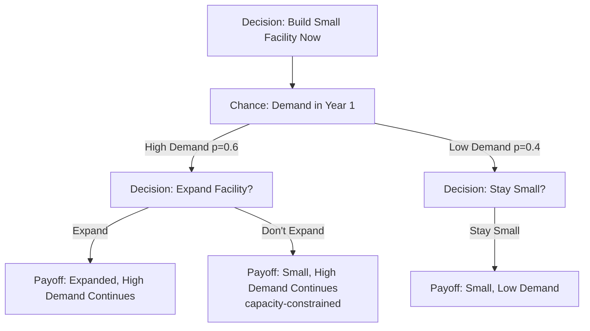
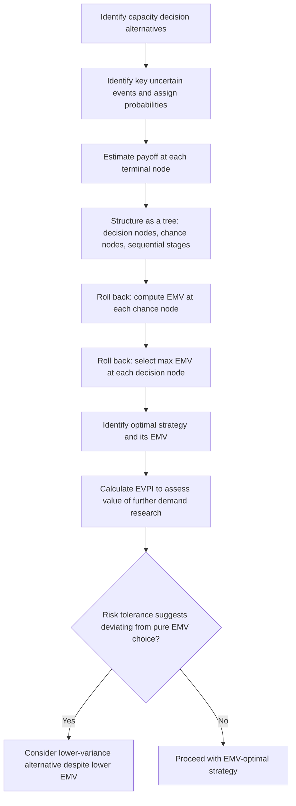

## Decision Trees Under Demand Uncertainty


### Overview

Decision tree analysis is a structured, visual method for evaluating sequential capacity decisions when future demand (or other key variables) is uncertain and can be represented as a set of discrete possible outcomes with estimated probabilities. Unlike a single-point NPV calculation, decision trees explicitly map out the branching structure of decisions and chance events over time, allowing capacity planners to calculate the expected value of different strategies and to see how earlier decisions create or foreclose options at later decision points.

### Anatomy of a Decision Tree

A decision tree is built from three basic elements:

- **Decision nodes** (conventionally drawn as squares) — points where the decision-maker chooses among available alternatives (e.g., build large capacity, build small capacity, do nothing).
- **Chance nodes** (conventionally drawn as circles) — points where an uncertain event occurs, with each branch assigned a probability (e.g., high demand materializes vs. low demand materializes).
- **Terminal/payoff nodes** — endpoints of the tree showing the financial outcome (payoff) of following that particular sequence of decisions and chance events.

```mermaid
flowchart LR
    D1[Decision Node:<br/>Build Large / Build Small / Do Nothing (svg_diagram)] --> C1[Chance: High Demand p=0.6]
    D1 --> C2[Chance: Low Demand p=0.4]
    C1 --> P1[Payoff: Build Large + High Demand]
    C2 --> P2[Payoff: Build Large + Low Demand]
```

**Key Points**

- Decision nodes represent choices fully within the organization's control; chance nodes represent outcomes the organization does not control but can estimate probabilistically — this distinction is what separates decision tree analysis from simple scenario listing.
- Probabilities assigned to chance node branches should ideally be grounded in the demand forecasting and variability analysis covered earlier in this curriculum (e.g., derived from a forecast's confidence interval or historical demand distribution) rather than arbitrary guesses, since the entire analysis's validity depends on reasonably well-calibrated probabilities.

### Expected Value Calculation

The core evaluation method is **expected monetary value (EMV)**, calculated by working backward from the terminal payoffs through each chance node (probability-weighted average) and each decision node (choosing the branch with the highest EMV) — a process called **rolling back** or **folding back** the tree.

$$EMV(\text{chance node}) = \sum_{i} p_i \times \text{Payoff}_i$$


$$EMV(\text{decision node}) = \max_j \left( EMV(\text{branch}_j) \right)$$

**Example**: A company is deciding on capacity for a new product line, choosing between building a large facility, a small facility, or doing nothing, under uncertain demand (estimated at 60% probability of high demand, 40% probability of low demand).

| Strategy | High Demand (p=0.6) Payoff | Low Demand (p=0.4) Payoff |
| --- | --- | --- |
| Build Large | $800,000 | -$200,000 |
| Build Small | $400,000 | $150,000 |
| Do Nothing | $0 | $0 |

$$EMV(\text{Build Large}) = (0.6 \times 800{,}000) + (0.4 \times -200{,}000) = 480{,}000 - 80{,}000 = \$400{,}000$$


$$EMV(\text{Build Small}) = (0.6 \times 400{,}000) + (0.4 \times 150{,}000) = 240{,}000 + 60{,}000 = \$300{,}000$$


$$EMV(\text{Do Nothing}) = \$0$$

Based on EMV alone, **Build Large** is the preferred strategy ($400,000 expected value), despite its larger downside in the low-demand scenario, because its upside in the high-demand scenario more than compensates on a probability-weighted basis.

```python
def emv(payoffs, probabilities):
    return sum(p * v for p, v in zip(probabilities, payoffs))

probs = [0.6, 0.4]  # high demand, low demand
build_large = emv([800_000, -200_000], probs)
build_small = emv([400_000, 150_000], probs)
do_nothing = emv([0, 0], probs)

strategies = {"Build Large": build_large, "Build Small": build_small, "Do Nothing": do_nothing}
best = max(strategies, key=strategies.get)
print(strategies, "-> Best:", best)
```

### Sequential (Multi-Stage) Decision Trees

Decision trees become especially valuable for capacity planning when decisions unfold in **stages**, where an initial decision affects what options are available later, and uncertainty is resolved incrementally rather than all at once — directly modeling the kind of staged capacity investment introduced under real options in capital budgeting.



**Example — staged capacity decision**: A company initially builds a small facility ($300,000 investment). After one year, demand uncertainty resolves: if demand is high (60% probability), the company can then decide whether to expand ($500,000 additional investment, yielding $1,200,000 in subsequent payoff) or remain small (yielding only $600,000 due to capacity constraints limiting sales); if demand is low (40% probability), the company stays small regardless (yielding $350,000).

Rolling back from the terminal nodes:

$$EMV(\text{Expand} \mid \text{High Demand}) = 1{,}200{,}000 - 500{,}000 = 700{,}000$$


$$EMV(\text{Don't Expand} \mid \text{High Demand}) = 600{,}000$$

Since $700{,}000 > 600{,}000$, the decision node under "High Demand" resolves to **Expand**, so the value flowing back into the high-demand branch is $700,000.

$$EMV(\text{Small Facility Strategy}) = -300{,}000 + (0.6 \times 700{,}000) + (0.4 \times 350{,}000) = -300{,}000 + 420{,}000 + 140{,}000 = \$260{,}000$$

This staged EMV can then be directly compared against the EMV of an alternative strategy (e.g., building the large facility immediately, without the staged option) to determine which overall approach — staged/flexible versus committed upfront — has the higher expected value, making the value of staging explicit rather than merely qualitative.

**Key Points**

- The critical modeling insight in sequential decision trees is that the decision at each later node should be made optimally *given* the information available at that point — the expand/don't-expand choice under high demand is evaluated on its own merits, not by assuming the same choice would be made regardless of which demand scenario occurred.
- This "rolling back" logic is exactly how the value of managerial flexibility (introduced conceptually as real options in capital budgeting) can be made concrete and quantified: the difference between a staged strategy's EMV and an equivalent all-at-once strategy's EMV represents the value the flexibility to observe and react to demand information actually provides.

### Incorporating Risk: Expected Value vs. Risk-Adjusted Preferences

**Key Points**

- EMV analysis treats the decision-maker as risk-neutral, selecting the strategy with the highest probability-weighted average payoff regardless of variance in outcomes — but many real capacity decisions carry payoffs large enough relative to the organization's size that risk aversion matters, and a lower-EMV, lower-variance strategy may be genuinely preferable.
- **Utility theory** extensions to decision tree analysis replace raw monetary payoffs with a utility function reflecting the decision-maker's risk tolerance, so that a risk-averse organization might rationally choose "Build Small" over the higher-EMV "Build Large" option in the earlier example if the potential $200,000 loss under low demand poses an unacceptable risk to the organization's financial position. [Unverified — the specific utility function and risk tolerance are organization-specific judgments rather than objectively derivable quantities]
- A simpler, commonly used complement to EMV is to examine the **range of possible outcomes** (best case, worst case) alongside the expected value, giving decision-makers visibility into downside risk that a single EMV number obscures.

### Expected Value of Perfect Information (EVPI)

A related and practically useful decision-tree-based calculation estimates the maximum amount a decision-maker should be willing to pay to eliminate demand uncertainty entirely (e.g., through additional market research or a pilot program) before committing to a capacity decision.

$$EVPI = EV_{\text{with perfect information}} - EV_{\text{best strategy under uncertainty}}$$

where $EV_{\text{with perfect information}}$ is calculated by assuming the decision-maker could choose the best strategy *after* knowing which demand scenario will occur, then probability-weighting across scenarios:

$$EV_{\text{with perfect information}} = \sum_i p_i \times \max_j(\text{Payoff}_{i,j})$$

**Example** (using the single-stage table above): with perfect information, the decision-maker would choose Build Large under high demand ($800,000) and Build Small under low demand ($150,000, since it beats Build Large's -$200,000 and Do Nothing's $0):

$$EV_{\text{perfect information}} = (0.6 \times 800{,}000) + (0.4 \times 150{,}000) = 480{,}000 + 60{,}000 = 540{,}000$$


$$EVPI = 540{,}000 - 400{,}000 = \$140{,}000$$

This means the organization should be willing to spend up to $140,000 on additional demand research or a pilot program that could reliably resolve the high/low demand uncertainty before committing to a facility size — a direct, quantified link back to the value of investing in better demand forecasting, which is the subject of the earlier chapter on demand forecasting for capacity decisions.

### Decision Tree Workflow



### Practical Considerations and Limitations

**Key Points**

- **Probability estimation quality drives the entire analysis** — decision trees make uncertainty explicit and structured, but they do not eliminate the underlying difficulty of estimating demand probabilities accurately; poorly calibrated probabilities produce a precise-looking but potentially misleading EMV calculation.
- **Tree complexity grows quickly** with additional decision stages and chance outcomes, and very large trees can become difficult to construct, validate, and communicate — in practice, most applied capacity decision trees are simplified to a small number of key uncertain variables and decision points rather than attempting to model every possible contingency.
- **Discrete scenario representation** — decision trees typically represent uncertainty as a small number of discrete outcomes (e.g., high/low demand) rather than a continuous probability distribution, which is a simplification that should be checked against the actual shape of demand uncertainty (see demand variability and distribution shape) when the uncertainty is not well approximated by a few discrete states.
- **Time value of money should still be incorporated** for multi-year sequential trees — payoffs occurring at different points in time should generally be discounted to present value before being used in the EMV rollback, combining decision tree logic with the NPV techniques covered in capital budgeting.

**Conclusion**

Decision trees provide a structured, visual method for evaluating capacity decisions under demand uncertainty, making explicit both the range of possible future outcomes and the sequential nature of many real capacity commitments — where an initial decision can preserve or foreclose valuable future options. By rolling back expected monetary values from terminal payoffs through chance and decision nodes, decision tree analysis identifies the EMV-optimal strategy, while extensions such as expected value of perfect information quantify how much additional demand research is worth, and risk-adjusted variants acknowledge that the highest-EMV choice is not always the right choice for an organization with genuine risk-aversion concerns. Used alongside NPV-based capital budgeting and the demand forecasting techniques covered earlier in this curriculum, decision trees turn abstract "what if demand is different than expected" concerns into a concrete, quantified basis for capacity strategy selection.

**Related Topics**

- Net present value and capital budgeting for capacity
- Demand variability and its capacity implications
- Real options analysis and staged capacity investment
- Expected value of perfect information and the value of market research
- Monte Carlo simulation for capacity risk analysis
- Utility theory and risk-adjusted decision-making
- Scenario planning for capacity investment